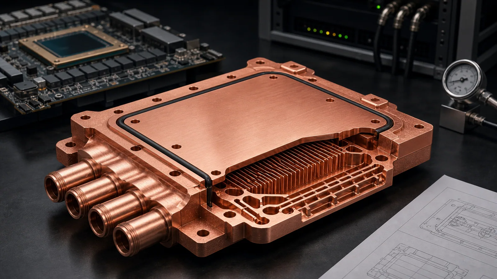

> AI accelerator cold plates are worth reviewing for copper additive manufacturing when heat density, coolant routing, package height, or manifold integration cannot be solved cleanly by CNC machining, skiving, brazing, or assembly. Send CAD, drawings, quantity, material preference, thermal requirement, coolant condition, pressure limits, critical surfaces, and inspection needs. A quote depends on the part and the information provided.

### Why AI Accelerator Cold Plates Need a Different RFQ

AI accelerator cooling is not only a copper plate problem. It is a package, pressure, flow, flatness, serviceability, and verification problem. A cold plate that looks simple from the outside may contain the highest risk inside the flow path.

For copper 3D printing, the best candidates usually have at least one hard constraint:

- High local heat flux that needs dense internal features close to the heat source.
- Multiple hot spots that require non-uniform flow distribution.
- Restricted inlet and outlet positions inside a server or tray envelope.
- A thin package where stacked parts, plugs, or brazed covers create risk.
- A need to consolidate manifold, plate, and local heat-transfer features.
- Prototype geometry that may change after thermal and pressure testing.

If the cold plate is a flat part with open milled channels and a simple cover, conventional manufacturing may be the stronger first route. Copper AM becomes more relevant when internal geometry is the main value.

### Start With the Heat-Flux Map, Not Only the STEP File

A STEP file shows shape. It does not explain why a cold plate must exist. For AI accelerator and GPU cooling hardware, the RFQ becomes much clearer when the thermal problem is stated early.

| RFQ input | Why it matters |
| --- | --- |
| Heat source size and location | Defines whether channels must be local, distributed, or staged |
| Heat load or target temperature rise | Controls channel density and contact-area review |
| Coolant type and temperature | Changes compatibility, cleaning, corrosion, and sealing assumptions |
| Flow rate or pump limit | Prevents channel geometry that the system cannot drive |
| Allowable pressure drop | Separates high-performance geometry from unrealistic geometry |
| Working and proof pressure | Drives wall thickness, leak test, and inspection scope |
| Mounting pattern and clamp load | Controls flatness, deformation, and contact pressure review |
| Interface flatness and roughness | Defines post-machining and acceptance route |
| Quantity and project stage | Prototype review, pilot batch, and repeat production need different assumptions |

If the heat-load values are not fixed, send the best available estimate and say which values are still open. A useful first quote can be based on stated assumptions, but hidden thermal and pressure requirements usually slow the quote.

### Where Copper AM Can Add Value

Copper additive manufacturing is not a universal replacement for machined cold plates. It should be reviewed where it changes the design boundary.

Strong AM candidates often include:

- Three-dimensional manifolds that distribute coolant across several heat zones.
- Local microchannel, pin-fin, or lattice features under the highest heat-flux area.
- Integrated inlet and outlet routing that would otherwise require plugs, welds, or brazed joints.
- Channel transitions that cannot be reached by straight tools.
- Compact geometry where package height matters more than simple machining cost.
- A need to test several internal layouts before committing to a production route.

Weak candidates often include:

- Large flat copper plates with simple open channels.
- Parts where the only reason for printing is a cosmetic outside shape.
- Designs with very narrow blind channels and no cleaning path.
- Drawings that require strict internal surface finish but give no finishing access.
- Parts where pressure drop is critical but the allowable pressure drop is not stated.

The practical question is not "can it print?" The practical question is whether it can be printed, cleaned, machined, sealed, tested, and accepted.

### Channel Geometry Must Leave a Cleaning Path

AI accelerator cold plates often push designers toward dense internal surfaces. Dense channels can improve thermal area, but they also add powder-removal, cleaning, and pressure-drop risk.

Before requesting a quote, review:

- Minimum channel width and height.
- Longest enclosed channel path.
- Smallest bend radius.
- Dead-end branches or trapped volumes.
- Manifold entry and exit zones.
- Port size and access for flushing.
- Whether CT, flow, or sectioned coupon verification is expected.

Internal roughness is not automatically a failure. In some cold plates, roughness may support heat transfer. In other designs, it may increase pressure drop or trap particles. The RFQ should say what matters more: thermal transfer, pressure drop, cleanliness, or inspection confidence.

For more channel-specific detail, see the [3D printed copper microchannel heat exchanger guide](/posts/EngineeringGuide/3d-printed-copper-microchannel-heat-exchangers/).

### Interface Quality Still Depends on Machining

The internal geometry may be additive, but the cold plate still succeeds or fails at the interfaces. Define these features clearly:

- Heat-transfer face flatness and surface finish.
- Sealing lands and O-ring grooves.
- Threaded ports, tube interfaces, or quick-connect regions.
- Bolt holes and mounting datums.
- Datum surfaces for inspection.
- Areas that require polishing, plating, or protected handling.

Do not specify a high finish everywhere unless every surface truly matters. Most quotes become stronger when they separate critical contact and sealing surfaces from non-critical external surfaces.

### Material Review: Pure Copper or CuCrZr

Material choice should follow the operating condition. Pure copper may be reviewed when thermal conductivity dominates and mechanical load is controlled. CuCrZr may be reviewed when strength, thread stability, clamp load, or service temperature matters.

Include:

- Required conductivity, if fixed.
- Service temperature and thermal cycling expectation.
- Clamping load or mounting condition.
- Coolant chemistry and corrosion concern.
- Need for heat treatment, stress relief, or material certificate.
- Post-machining and cleaning requirements.

Use the [materials overview](/materials/) if the alloy is open.

### Inspection Should Match the Failure Mode

Do not ask for maximum inspection by default. Ask for inspection that matches the real risk.

| Risk | Practical inspection or test |
| --- | --- |
| Leak path | Pressure hold, proof pressure, helium leak test when required |
| Hidden blockage | Flow test, pressure drop check, CT when justified |
| Interface contact issue | Flatness, roughness, CMM, contact face inspection |
| Powder or particle concern | Flush record, cleanliness requirement, drying and packaging |
| Material concern | Conductivity, density, heat treatment record, material certificate |
| Thermal uncertainty | Thermal test plan, instrumented prototype, or customer-side validation |

Prototype work may start with geometry, pressure, leak, and flow checks. Qualification hardware may need deeper documentation.

### Practical RFQ Email

For an AI accelerator copper cold plate quote, send STEP or native CAD, drawing if available, quantity, material preference, heat source map, coolant, flow rate or pressure drop limit, working pressure, critical surfaces, and inspection requirements.

Send files to [info@szcomo.com](mailto:info@szcomo.com). If only the geometry and quantity are ready, send them with the requirements you know. We will review the part, ask focused questions when needed, and quote according to the project information provided.
