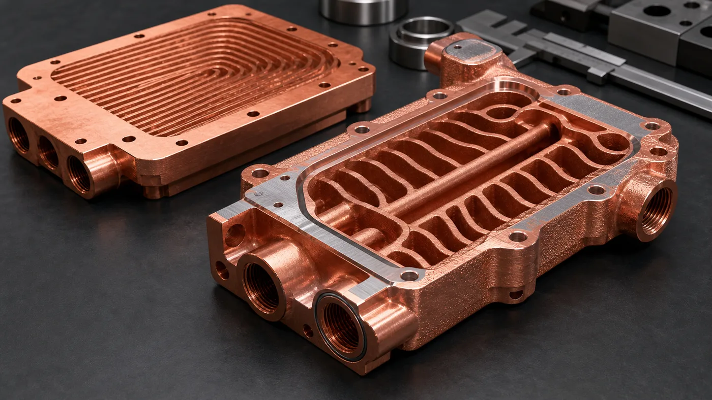
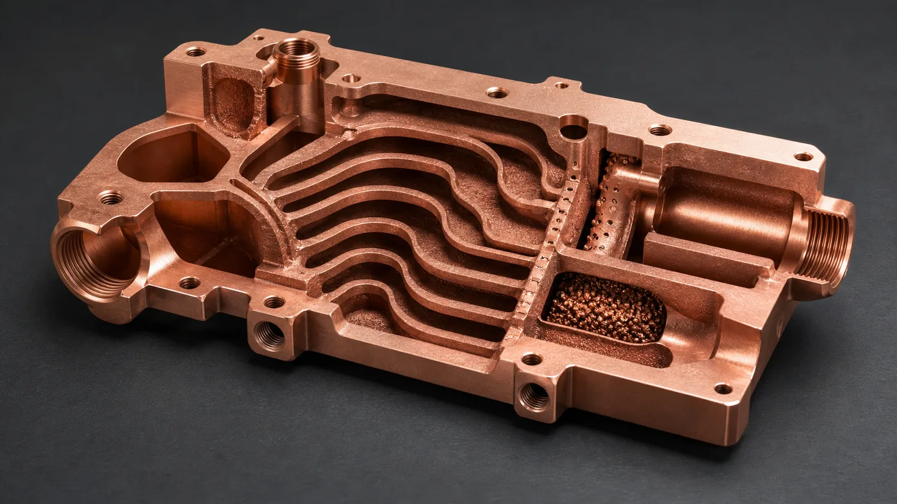
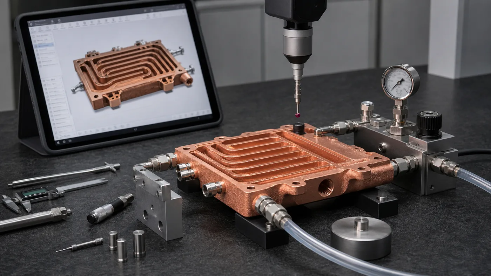

> 3D printed copper heat exchangers are valuable when the thermal problem depends on internal geometry that machining, skiving, brazing, or stacked plates cannot provide cleanly. The benefit is not "more copper." The benefit is controlled coolant routing, integrated manifolds, fewer joints, and local heat-transfer area. The limit is equally real: the part must still be printable, depowdered, cleaned, machined, leak tested, pressure tested, and accepted.

Most copper heat exchanger RFQs start with the same assumption: copper conducts heat well, so a printed copper core should solve the temperature problem.

That assumption is only half useful.

Copper's thermal conductivity helps, but heat exchanger performance is usually constrained by where the coolant can travel, how evenly it reaches the hot region, how much pressure drop the pump can tolerate, and whether internal passages can be verified after manufacturing. A compact heat exchanger may have a 70 mm x 110 mm heat-source area, a package height below 20 mm, a working pressure of 4-8 bar, and only two usable port locations because the surrounding assembly blocks every other route.

In that situation, copper additive manufacturing can change the design. It can put channels, manifolds, turbulence features, and mounting logic inside one body instead of forcing the flow path to follow a drill, cutter, braze sheet, or plug sequence.

It also changes the risk ledger. Internal surfaces are no longer visible. Powder removal becomes part of the design. CNC finishing remains necessary on sealing faces and datums. Flow and leak testing become quote items, not afterthoughts.

_Figure 1. 3D printed copper heat exchangers are strongest when internal geometry, manifold integration, and reduced assembly interfaces solve a real packaging or thermal constraint._

## What 3D Printing Can Improve in a Copper Heat Exchanger

The useful design benefits are specific. They are not universal.

| Design benefit | Why copper AM helps | What still has to be controlled |
| --- | --- | --- |
| Internal routing freedom | Curved and branched channels can follow the heat-source map instead of the cutting tool | Pressure drop, trapped powder, and branch balance |
| Integrated manifolds | Inlet and outlet distribution can be built into the core | Port machining, cleaning access, leak testing |
| Higher local surface area | Pin, rib, fin, or lattice-like features can increase wetted area in selected zones | Minimum feature size, roughness, flow restriction |
| Fewer joints | A monolithic body can reduce brazed seams, plugs, covers, or alignment steps | Proof pressure and sealing-face inspection |
| Package compression | Channel paths can fit around keep-out zones and fasteners | Machining allowance may add 0.5-1.0 mm back to critical faces |

The best candidate is usually not the most complex model. It is the design where one hard constraint makes conventional manufacturing awkward: a port that cannot move, a hot spot that needs local coverage, a height limit that rejects a stacked core, or a leak-risk target that makes brazing less attractive.

For simple rectangular channels in a flat plate, conventional CNC machining, gun drilling, skiving, folded fins, or brazing may still be the better route. A printed copper heat exchanger should earn its cost by solving geometry, assembly, or verification problems that the conventional route cannot solve cleanly.

## The Manufacturing Limit Starts With Copper LPBF Itself

Copper is attractive for heat exchangers because it combines high thermal conductivity with useful electrical conductivity. Industrial suppliers describe copper AM materials for thermal and electrical applications, including heat exchangers, heat sinks, coils, high-frequency electronics, and power components. [EOS lists copper materials](https://www.eos.info/en/3d-printing-materials/metals/copper) such as Cu, CuCP, and CuCrZr for applications requiring good conductivity, and [Eplus3D positions printed Pure Cu and CuCrZr](https://www.eplus3d.com/products/3d-printing-materials-copper/) for heat exchangers and electronics.

That does not mean copper LPBF behaves like stainless steel.

The physical difficulty is well documented. Copper reflects common infrared laser energy and conducts heat away quickly. A [2026 NIST publication on highly reflective metals](https://www.nist.gov/publications/ultra-high-speed-printing-regime-laser-powder-bed-fusion-highly-reflective-metals) notes that copper and aluminum LPBF often involve energy losses and may require high-powered lasers or low scan speeds, while parameter optimization remains necessary. A [Materials paper on laser powder bed fusion of copper powders](https://www.mdpi.com/1996-1944/13/16/3493) also connects the difficulty to very high near-infrared reflectivity and high thermal conductivity.

For an RFQ, this matters because the heat exchanger is not judged by the outside shape only. The review must include:

- Powder and machine capability for pure copper, CuCrZr, CuCr1Zr, or another copper alloy.
- Minimum channel size and the longest enclosed flow path.
- Local wall thickness around ports, bolt holes, and high-pressure regions.
- Build orientation, support strategy, and distortion risk.
- Machining stock on sealing lands, datums, threads, and contact faces.
- Verification route for internal passages and pressure integrity.

If the design uses 0.6 mm passages because a CFD study liked the surface area, the supplier still has to ask whether those passages can be printed, depowdered, flushed, dried, inspected, and used at the required flow rate.

## Internal Channels Are a Benefit Only When They Can Be Cleaned

The channel network is where most heat exchanger value lives. It is also where many printed copper designs fail first review.

A thermal model may reward narrow hydraulic diameters, many branches, sharp turns, and abrupt cross-section changes. Manufacturing rewards something else: access, continuity, realistic wall thickness, and a path for loose powder to leave the part.

In early review, we look for several practical numbers:

- Minimum internal passage width and height.
- Longest closed channel path from port to port.
- Smallest bend radius or sudden area change.
- Number of branches fed by each manifold.
- Dead-end pockets, blind volumes, or isolated cavities.
- Port diameter available for flushing and test setup.
- Working pressure, proof pressure, and allowable pressure drop.

For many compact copper heat exchangers, moving a selected passage from 0.8 mm to 1.2-1.6 mm can lower theoretical surface area but make the part more realistic. A few branches may be removed. A cleaning port may be added. One aggressive bend may become a smoother transition. This is not a downgrade. It is the price of turning a thermal concept into hardware.

_Figure 2. Internal channels must be designed as thermal features and manufacturing features. A passage that cannot be cleared, flushed, or verified is not ready for a production quote._

### Pressure Drop Is Not a Final Test Detail

Pressure drop should be a design gate at the RFQ stage.

A compact heat exchanger can look excellent in simulation and still be unusable if the pump cannot drive it. We have seen early concepts that reduced a hot spot by 6-9 C in CFD but exceeded the available pump budget by more than 40%. The design did not need a larger copper block. It needed fewer low-value branches, smoother manifold transitions, and a realistic channel size.

Useful RFQ inputs include coolant type, nominal flow rate, maximum pressure drop, working pressure, proof pressure, and whether flow distribution must be measured. Without those values, a supplier can only review printability and rough geometry. They cannot judge whether the heat exchanger will function in the system.

## Material Choice: Pure Copper, CuCrZr, or CuCr1Zr

Pure copper is usually reviewed when maximum conductivity dominates the design. It can be attractive for heat spreaders, compact thermal hardware, and electrical-thermal components where mechanical load is modest and finishing requirements are controlled.

CuCrZr or CuCr1Zr may be a better fit when the heat exchanger needs higher strength, better thread stability, improved handling around thin walls, or heat-treatment response. [3D Systems' CuCr1Zr data sheet](https://www.3dsystems.com/sites/default/files/2023-07/3d-systems-certified-cucr1zra-material-datasheet-usen-2023-07-14-a-web_0.pdf) describes the alloy as a high-strength copper alloy whose conductivity can exceed 90% IACS with appropriate heat treatment, and lists heat management and cooling systems among typical applications. If the heat exchanger drawing specifies CuCr1Zr or an approved equivalent, use [CuCr1Zr Copper Alloy 3D Printing for Industrial Components](/posts/EngineeringGuide/cucr1zr-copper-alloy-3d-printing-industrial-components/) to define the data sheet, heat-treatment state, coupons, and substitution policy.

The trade-off is not a generic "best material" decision. It is a service decision:

| Requirement | Material direction to review |
| --- | --- |
| Maximum thermal conductivity, modest mechanical load | Pure copper or commercially pure copper route |
| Threads, clamps, thin walls, thermal cycling, higher strength need | CuCrZr or CuCr1Zr route |
| High heat flux plus structural duty | Copper alloy route with heat treatment and test plan |
| Unknown service condition | Start with CAD review, then choose material after pressure, flow, and acceptance criteria are clear |

The RFQ should state whether conductivity, strength, pressure integrity, temperature cycling, or corrosion compatibility is the leading requirement. If the material is written only as "copper," the supplier has to guess whether the design needs conductivity first or robustness first.

## Case Pattern: A Better Core After a Less Aggressive Redesign

A representative project involved a compact copper heat exchanger for a high-power electronics module. The initial envelope was about 120 mm x 85 mm x 18 mm. The target flow was 1.8-2.4 L/min with pressure drop below 70 kPa. Working pressure was 6 bar, proof pressure was 9 bar, and the heat-transfer face needed final machining to about +/-0.05 mm flatness relative to the mounting datum.

The first model had a dense internal branch network and several 0.9 mm passages close to the heat-source region. It looked efficient in CFD. It also created three problems during manufacturing review:

- Two branch groups had no clean powder exit path.
- A sharp manifold turn created a likely pressure-drop penalty.
- The sealing land had too little machining stock after print distortion allowance.

We did not solve the issue by simply printing the file.

The revised design increased selected passages to 1.3-1.5 mm, removed one branch group that contributed little to heat removal, widened the outlet transition, and added a short inspection/flush access feature that could be machined closed after cleaning. The estimated wetted area dropped by roughly 7%. The predicted pressure drop became more realistic, and the design had a better route for flushing and leak testing.

The hidden cost was qualification hardware. A pressure and flow fixture added time before first article release, but it removed guesswork from the next batch. For one prototype, that feels inefficient. For a production-intent heat exchanger, it is usually cheaper than discovering blockage or leakage after assembly.

## Manufacturing Limits That Should Be Visible in the Quote

A good quote separates the printed body from the finished heat exchanger. Those are not the same deliverable.

Typical line items include:

- LPBF build of the copper or copper alloy body.
- Stress relief or heat treatment when required by material route.
- Support removal and external surface cleaning.
- CNC machining of sealing faces, flat interfaces, datums, threads, and ports.
- Deburring and edge conditioning around flow ports.
- Internal flushing, filtered cleaning, drying, and packaging.
- Leak test, pressure hold, proof pressure, or flow test.
- CT inspection or sectioned coupon review when internal risk justifies it.
- Dimensional inspection for flatness, hole position, port geometry, and assembly datums.

This is where cost changes quickly. A heat exchanger with a simple leak test and two machined faces is a different project from one requiring CT inspection, helium leak testing, particle cleanliness records, CMM report, thermal cycling, and serial traceability.

Do not hide acceptance criteria to obtain a lower first price. If the part needs proof pressure, leak rate, filtered flushing, or flatness inspection, those requirements belong in the first RFQ.

_Figure 3. The finished heat exchanger is the printed copper body plus machining, cleaning, pressure or leak testing, flow verification, and inspection._

## Design Benefits vs Manufacturing Limits

Use this comparison before deciding whether copper AM is the right route.

| Question | Strong signal for copper AM | Warning signal |
| --- | --- | --- |
| Does the flow path need three-dimensional routing? | Coolant must curve around keep-outs, hot spots, fasteners, or ports | Straight drilled or milled channels already work |
| Is assembly risk a problem? | Brazed joints, plugs, or stacked plates create leak or alignment concern | Existing brazed construction is qualified and low risk |
| Is package height constrained? | Integrated manifolds reduce stack height or part count | Extra machining allowance cancels the packaging benefit |
| Can the channels be cleaned? | Ports and branches allow flushing, drying, and verification | Blind pockets or long narrow passages trap powder |
| Are acceptance tests defined? | Flow, pressure, leak, flatness, and cleanliness are stated | Requirements appear only after quote or first article |

The strongest projects usually have at least two green signals and no unresolved red signal. One unresolved cleaning risk can outweigh a beautiful thermal model.

## RFQ Inputs That Make the Review Faster

For a 3D printed copper heat exchanger quote, send:

- STEP or native CAD with internal channels included.
- Drawing or section views showing flow paths and critical faces.
- Heat load, heat-source area, and target temperature if known.
- Coolant type, operating temperature, and compatibility constraints.
- Nominal flow rate and maximum pressure drop.
- Working pressure, proof pressure, and leak acceptance method.
- Material preference: pure copper, CuCrZr, CuCr1Zr, or open to review.
- Flatness, roughness, and datum requirements for thermal and sealing faces.
- Port type, thread, fitting, tube, or manifold interface.
- Quantity, development stage, and expected inspection level.
- Cleaning, drying, particle, CT, leak, flow, pressure, or packaging expectations.

If some values are unknown, state the current assumptions. A basic review can start from CAD and quantity, but a serious heat exchanger quote needs operating and acceptance context.

Related reading: [3D Printed Copper Microchannel Heat Exchangers](/posts/EngineeringGuide/3d-printed-copper-microchannel-heat-exchangers/), [How Copper Additive Manufacturing Improves Liquid Cooling Plate Design](/posts/EngineeringGuide/how-copper-additive-manufacturing-improves-liquid-cooling-plate-design/), and [Copper AM Cleaning and Powder Removal for Internal Channels](/posts/EngineeringGuide/copper-am-cleaning-powder-removal-internal-channels/). When material choice or finishing controls the quote, also review [Pure Copper vs CuCrZr for 3D Printed Heat Transfer Parts](/posts/EngineeringGuide/pure-copper-vs-cucrzr-3d-printed-heat-transfer-parts/), [CuCr1Zr Copper Alloy 3D Printing for Industrial Components](/posts/EngineeringGuide/cucr1zr-copper-alloy-3d-printing-industrial-components/), [Copper 3D Printing Surface Finish Options](/posts/EngineeringGuide/copper-3d-printing-surface-finish-as-built-machined-polished-options/), and [Post-Processing Methods for 3D Printed Copper Parts](/posts/EngineeringGuide/post-processing-methods-for-3d-printed-copper-parts/).

## FAQ

Are 3D printed copper heat exchangers always better than machined or brazed heat exchangers?

No. They are better when internal geometry, manifold integration, package height, or reduced assembly interfaces create measurable value. If a flat machined and brazed design already meets thermal, pressure, and cost targets, conventional manufacturing may be the better route.

What is the biggest design risk in a printed copper heat exchanger?

The biggest risk is treating internal channels only as thermal features. They also control powder removal, pressure drop, flow balance, cleaning, inspection, and leak-test planning. A channel network that cannot be cleared and verified is not ready for production review.

Should the heat exchanger use pure copper or CuCrZr?

Pure copper is usually reviewed when maximum conductivity is the main driver. CuCrZr or CuCr1Zr may be reviewed when strength, thread stability, heat treatment response, or mechanical robustness matters more. The correct route depends on pressure, wall thickness, thermal cycling, and finishing requirements.

Can CT inspection replace flow and leak testing?

No. CT can be useful for first-article internal geometry risk, blocked passages, or process qualification, but functional tests still matter. Flow testing, pressure testing, and leak testing prove behavior under service-like conditions.

What is a realistic first step before requesting price?

Send the CAD, quantity, material preference if known, heat load or service condition, coolant, flow target, pressure limits, critical surfaces, and acceptance expectations to [info@szcomo.com](mailto:info@szcomo.com). If requirements are still open, state the assumptions so the review can separate fixed requirements from design choices.

## Verdict

Choose 3D printed copper heat exchangers when the thermal problem depends on internal flow geometry, local hot-spot coverage, integrated manifolds, fewer leak interfaces, or a package that conventional tools cannot reach.

Avoid forcing copper AM when the design is flat, accessible, and already works as a machined or brazed core. Also pause the RFQ if the pressure-drop target, cleaning route, leak method, or critical machined surfaces are undefined.

The practical recommendation is simple: use copper additive manufacturing for the geometry it uniquely enables, then budget for the finishing and verification that make the heat exchanger usable. Send CAD, drawings, quantity, material preference, flow and pressure targets, critical surfaces, and inspection requirements to [info@szcomo.com](mailto:info@szcomo.com).
