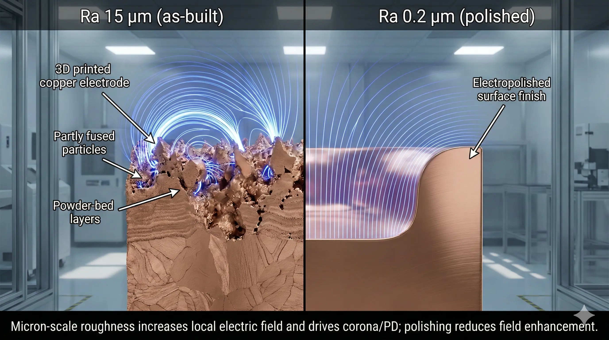

> 3D printed copper high-voltage electrodes are feasible only when the AM geometry solves a real packaging, cooling, or assembly problem and every field-critical surface can be controlled after printing. The hard part is not printing copper. The hard part is keeping roughness, edges, pores, conductivity, cleanliness, and test methods from turning a compact electrode into a partial-discharge problem.

### Quick answer for engineers

Use copper AM for high-voltage electrodes when the design needs integrated cooling, compact current delivery, complex fluid paths, or assembly reduction that conventional machining cannot provide cleanly. Do not use it just to replace a simple CNC electrode.

The feasibility check should be made in this order:

1. **Field geometry:** can peak electric field be moved away from sharp AM surfaces?
2. **Surface access:** can every field-critical face be machined, polished, plated, or otherwise finished?
3. **Edge radius:** are exposed transitions large enough to avoid local field concentration?
4. **Conductivity:** does the selected copper alloy and heat treatment meet the thermal/electrical model?
5. **Inspection:** are CT, pressure, leak, surface, conductivity, withstand, and PD tests defined before quotation?

If any of those answers is unclear, the RFQ is not ready for a serious supplier comparison.

### Why high-voltage electrodes are different from normal copper AM parts

A copper heat sink can often tolerate surface roughness, local discoloration, and cosmetic variation if thermal performance is acceptable. A high-voltage electrode is less forgiving. Small surface features can become electric-field amplifiers. A down-skin ridge, powder remnant, machining burr, trapped pore near the surface, or tight corner can initiate corona or partial discharge long before the bulk copper is mechanically stressed.

That is why "high density" and "good conductivity" are not enough. High-voltage performance is governed by the local electric field at the actual surface that the gas, oil, vacuum, or dielectric sees. AM helps when it lets the engineer place cooling and conductor geometry where conventional manufacturing cannot. AM hurts when it creates surfaces that cannot be reached and finished.

### The first RFQ question: what problem is AM solving?

Before discussing voltage level, ask why the electrode should be printed.

Good AM reasons include:

- internal cooling channels near the active face,
- integrated manifolds that remove brazed joints,
- compact current paths in a dense fixture,
- reduced part count in a plasma, RF, accelerator, or test system,
- geometry that would require several machined pieces and risky assembly,
- prototype iterations where cooling, field shape, and packaging are still being tuned.

Weak AM reasons include:

- "we want to try 3D printed copper" without a geometry problem,
- a simple round electrode, plate, busbar, or rod,
- field-critical surfaces hidden inside blind cavities,
- no budget for post-machining or polishing,
- no clear acceptance test for withstand voltage or partial discharge.

If the part is simple, CNC copper is usually the safer starting point. If the part needs cooling, compact routing, and assembly reduction, AM may justify the surface-control work.

### What usually fails first

For AM copper high-voltage electrodes, failures usually come from one of five places.

| Failure driver | Why it matters | What to define before RFQ |
| --- | --- | --- |
| As-built roughness | Micron-scale peaks increase local field stress. | Which faces must be machined, polished, plated, or left non-critical. |
| Sharp transitions | Small radii can dominate corona inception. | Minimum radius on all exposed high-field edges. |
| Inaccessible down-skin faces | Rough internal or angled surfaces may be impossible to correct. | Whether the surface is field-critical and reachable after printing. |
| Near-surface porosity | Defects can create weak points after machining or polishing. | CT, sectioning, coupon, or density acceptance where risk justifies it. |
| Conductivity variation | Resistive heating changes temperature, outgassing, and local stress. | Alloy, heat treatment, conductivity target, and measurement method. |

The supplier cannot quote these decisions responsibly if the drawing only says "3D printed copper electrode."

### Surface finish is not cosmetic here

For many copper AM projects, roughness is discussed as a pressure-drop, sealing, or appearance issue. For high voltage, it is a field issue.

The practical rule is simple: do not allow an as-built AM surface to become the controlling high-field surface unless the voltage level, medium, spacing, and test margin make that risk acceptable. Most serious electrode projects need a finishing stack such as:

1. build orientation chosen to protect field-critical faces;
2. stress relief or heat treatment as required by the alloy route;
3. CNC skim of field faces and datum surfaces;
4. edge-radius control on exposed transitions;
5. chemical polishing, electropolishing, or mechanical polishing where geometry allows;
6. cleaning compatible with the operating medium;
7. optional plating or coating if the application requires stable surface chemistry;
8. final measurement and electrical test.

The important point is access. A polishing process cannot fix a blind high-field corner that chemistry cannot reach and inspection cannot verify.

### Conductivity and alloy selection

High-voltage electrode buyers often default to "copper" as if all copper routes behave like wrought OFHC stock. That is unsafe. In AM, the alloy and process route matter.

Pure copper may be attractive for conductivity and thermal performance, but processability, density, and strength must be qualified. CuCrZr and similar copper alloys may offer a more practical balance when strength, heat treatment response, and repeatability matter. Conductivity should be treated as a measured requirement, not assumed from the material name.

For an RFQ, state the functional target:

- current and duty cycle;
- allowable temperature rise;
- cooling flow and pressure drop;
- thermal contact requirement;
- operating medium;
- whether conductivity must be measured on coupons or the part route.

If the design assumes near-wrought conductivity, say so. If the true requirement is thermal stability under load, say that instead. The supplier can then recommend whether material, heat treatment, and test scope are aligned.

### Go/no-go framework

#### Good fit: AM solves cooling or packaging

AM is a serious candidate when internal cooling, compact fluid routing, or assembly reduction creates measurable value. The design should expose field-critical surfaces for finishing and avoid hidden sharp features near peak field.

#### Conditional fit: AM geometry is useful but high-field surfaces are difficult

This is common. The part may still be possible, but the quote needs explicit assumptions for machining access, radius control, polishing, CT, leak testing, withstand testing, and partial-discharge measurement. Expect iteration.

#### Poor fit: simple electrode or unfinishable high-field geometry

If the part is a simple electrode, or if the highest-field surface is an inaccessible as-built surface, AM is probably the wrong route. Redesign the field geometry or use a conventional copper route.

### What should be on the drawing

A useful high-voltage copper AM drawing should include more than nominal geometry.

| Drawing item | Why it matters |
| --- | --- |
| Field-critical surfaces | Tells the supplier which faces cannot remain as-built. |
| Minimum edge radii | Prevents hidden sharp transitions from being treated as cosmetic. |
| Surface finish targets | Converts "smooth" into measurable acceptance language. |
| Datum and contact faces | Protects the surfaces that control assembly and electrical contact. |
| Internal channel requirements | Defines cleaning, CT, flow, leak, and pressure-test burden. |
| Conductivity target | Prevents material-route assumptions from being hidden. |
| Test voltage and medium | Makes air, oil, vacuum, gas, or dielectric conditions explicit. |
| PD or corona acceptance | Separates "withstand survived" from "electrically stable enough." |

If the drawing does not identify these items, supplier quotes will not be comparable.

### Example execution pattern

A compact electrode fixture needs integrated cooling and a short current path. A first AM version is printable, but the active surface includes an angled down-skin region near the high-field edge. The first electrical test shows corona earlier than expected.

The root cause is not that copper AM is impossible. The root cause is that the field-critical region was allowed to remain controlled by AM surface topology. The corrective path is usually:

- redesign the electrode so the highest-field face is machinable;
- increase edge radius near exposed transitions;
- move supports and down-skin regions away from the active field;
- machine and polish the working surface;
- clean and inspect the part after finishing;
- repeat withstand and PD checks under the real medium.

This is the "surface tax" of copper AM high-voltage work. If the AM geometry creates enough cooling or packaging value, the tax may be justified. If not, conventional manufacturing wins.

### RFQ checklist for 3D printed copper high-voltage electrodes

Send this information before asking suppliers to compare price:

- CAD and 2D drawing with field-critical faces identified;
- operating voltage, waveform, polarity, duty cycle, and medium;
- target spacing and surrounding grounded geometry if known;
- current, thermal load, coolant, flow rate, and pressure drop;
- material preference or conductivity target;
- minimum edge radius on high-field transitions;
- surface finish target for active faces;
- post-processing assumptions such as machining, polishing, plating, or cleaning;
- pressure, leak, flow, CT, dimensional, conductivity, withstand, and PD requirements;
- prototype quantity, target delivery date, and whether the part is for test, qualification, or production.

The more clearly these inputs are stated, the less the supplier must hide risk inside price or exclusions.

### Practical takeaway

3D printed copper is not automatically a high-voltage electrode solution. It becomes a solution when AM geometry creates real value and the engineering team treats surface finish, edge radius, conductivity, cleanliness, and electrical test method as first-class requirements.

For a broader quotation checklist, use the [copper AM RFQ page](/rfq/). For general supplier questions, start with the [copper 3D printing FAQ](/faq/).

### FAQ

**Can an as-built AM copper surface be used as a high-voltage surface?**

Sometimes, but it should not be assumed. The lower the voltage margin and the tighter the PD or corona requirement, the more likely the field-critical surface needs machining and polishing.

**Is density the same as high-voltage reliability?**

No. Density helps, but high-voltage failures often start at surface or near-surface features. A dense part can still have a rough edge or inaccessible down-skin face that controls breakdown behavior.

**Should the acceptance test only be a withstand test?**

Not always. Withstand testing can prove a part survived a condition, but it may not show whether the part has acceptable partial-discharge behavior, corona margin, leakage behavior, or long-term stability under the actual duty cycle.

**What is the most common RFQ mistake?**

The most common mistake is quoting the print before defining field-critical surfaces, edge radii, finish targets, and electrical acceptance. That creates a low-looking print quote and an expensive surprise later.

---

> Disclaimer: The guidance above is for engineering evaluation and supplier discussion. High-voltage hardware should be validated by qualified personnel using appropriate standards, fixtures, safety controls, and application-specific acceptance criteria.
