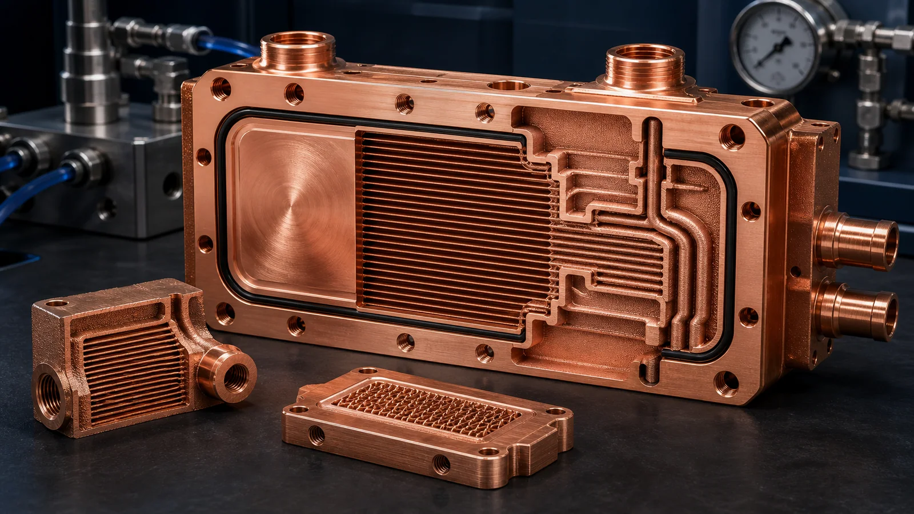

> A 3D printed copper microchannel heat exchanger is worth quoting when the internal flow path, thermal density, or package envelope cannot be solved cleanly by machining, skiving, brazing, or assembly. Send CAD, drawings, quantity, coolant condition, pressure requirement, and inspection expectations. The quote depends less on the outside shape than on whether the channels can be printed, cleaned, machined, tested, and accepted.

### When a Copper Microchannel Heat Exchanger Is a Good AM Candidate

Copper additive manufacturing is strongest when channel routing is the reason for the part. If a heat exchanger only needs straight drilled holes or an open milled channel closed by a cover plate, conventional manufacturing may be the better first route. LPBF copper becomes more relevant when the design needs:

- Internal manifolds that distribute flow across a compact thermal area.
- Non-planar or three-dimensional coolant paths around a heat source.
- Dense fin, pin, or lattice features that cannot be reached by cutting tools.
- Part consolidation that removes brazed joints, plugs, or alignment steps.
- Local heat-flux control inside a package where height, mass, and connection position are constrained.

The practical question is not only whether the geometry can be printed. The practical question is whether the flow path can be depowdered, cleaned, sealed, and verified after printing.

### Start the RFQ With the Thermal and Flow Problem

A useful RFQ does not need a full thermal report, but it should tell the supplier what the part is trying to solve. A STEP file alone can show geometry; it does not show operating risk.

Include these inputs when possible:

| RFQ input | Why it matters |
| --- | --- |
| Heat load or hot-spot location | Drives channel density and contact area review |
| Coolant type | Changes compatibility, cleaning, corrosion, and sealing assumptions |
| Flow rate or available pump range | Determines whether the channel network is realistic |
| Allowable pressure drop | Prevents a high-performance geometry that the system cannot drive |
| Working and proof pressure | Drives wall thickness, test route, and leak acceptance |
| Inlet and outlet position | Controls manifold layout and powder removal access |
| Interface surface | Drives post-machining, flatness, roughness, and datum strategy |
| Acceptance test | Defines whether CT, leak, pressure, flow, or thermal testing must be quoted |

If these values are not fixed, say which ones are still open. A supplier can review the part with assumptions, but unclear pressure, cleaning, and acceptance requirements usually add cost or trigger clarification before a quote.

### Channel Geometry Must Be Designed for Manufacturing, Not Only CFD

CFD can reward narrow passages, high surface area, and aggressive turns. Manufacturing and inspection add different constraints. The design must leave enough room for powder removal, support avoidance, post-processing, and test confidence.

For a first review, identify:

- Minimum channel width and height.
- Longest enclosed channel path.
- Smallest bend radius or abrupt flow turn.
- Manifold entry and exit regions.
- Dead legs, blind pockets, or trapped volumes.
- Cross-section changes that may collect powder.
- Whether internal surfaces need a defined roughness or are accepted as printed.

Internal roughness is not automatically bad. In some heat exchangers, surface texture can support heat transfer. In other parts, roughness can increase pressure drop, trap particles, or make cleaning harder. The RFQ should state which effect matters more.

### Powder Removal and Cleaning Are Quote-Critical

For copper microchannel heat exchangers, powder removal is often more important than the visible outside geometry. A channel network that prints successfully can still be weak for RFQ if powder cannot leave the part or if cleaning cannot be verified.

Review the design for:

- Clear inlet and outlet access to every internal branch.
- No isolated cavities or blind channel ends unless they are intentionally sealed and accepted.
- Flow paths that can be flushed, dried, and inspected.
- Ports large enough for practical cleaning and test setup.
- Orientation choices that reduce trapped powder risk.
- Whether temporary access holes or machining operations are acceptable.

If a design has very long internal channels, fine branch networks, or dead-end volumes, the RFQ should not hide that risk. State whether CT inspection, flow verification, or sectioned qualification samples are expected.

### Machined Interfaces Still Decide the Hardware Quality

LPBF copper can create internal geometry, but functional heat exchanger hardware usually still depends on machined surfaces. The quote should separate printed geometry from post-machined requirements.

Common machined features include:

- Sealing lands and O-ring grooves.
- Mounting datums and bolt holes.
- Threaded ports or tube interfaces.
- Flat heat-transfer faces.
- Electrical or grounding contact pads if the part is also conductive hardware.
- Reference datums for CMM inspection.

Do not assume that the whole part needs a high cosmetic finish. Most RFQs become clearer when they define only the surfaces that affect sealing, contact, assembly, and acceptance.

### Material Selection: Pure Copper, CuCrZr, or Review Required

Material choice should follow the operating requirement. Pure copper may be reviewed when conductivity dominates and mechanical or temperature loads are controlled. CuCrZr may be reviewed when strength, clamp stability, threaded features, or service temperature matter. Some high-temperature thermal hardware may require a more specific alloy and qualification route.

If the material is not fixed, provide the service condition:

- Coolant chemistry and service temperature.
- Thermal cycling expectation.
- Pressure and proof pressure.
- Clamping load and mounting pattern.
- Required conductivity or strength data, if any.
- Corrosion, plating, or compatibility concerns.

Use the [materials overview](/materials/) when the alloy choice is open, and see the [process selection guide](/posts/EngineeringGuide/copper-am-process-selection-lpbf-cnc-brazing/) if the part may also be a CNC or brazed candidate.

### Inspection Should Match the Failure Mode

Inspection is not a decoration. It should be connected to what could fail.

| Risk | Useful inspection or test |
| --- | --- |
| Hidden blockage | Flow test, pressure drop check, CT when required |
| Leak path | Helium leak test, pressure hold, proof pressure |
| Channel continuity | CT, sectioned coupon, flow verification |
| Interface performance | Flatness, surface finish, CMM, thermal test when required |
| Material requirement | Conductivity, density, heat-treatment record, material certificate |
| Cleanliness | Flush record, particle inspection, drying or packaging requirement |

Not every project needs every test. Prototype reviews may start with geometry, leak, and basic flow checks. Qualification parts may need a tighter inspection plan. The RFQ should state the acceptance level instead of asking for maximum inspection by default.

### Red Flags Before Requesting a Price

Before sending a copper microchannel heat exchanger RFQ, check whether any of these risks are present:

- The drawing shows the outside shape but not the internal channel intent.
- Pressure drop is critical but no allowable range is stated.
- Leak acceptance is required but the method is undefined.
- Internal channels are long, narrow, branched, or blind with no cleaning strategy.
- The heat-transfer face has no flatness, roughness, or datum definition.
- Material is specified only as "copper" without conductivity, strength, or service condition.
- The part is a simple plate where CNC or brazing may solve the problem more directly.

These are not automatic rejection points. They are the points that change quote route, cost, and schedule.

### Practical RFQ Email

For a 3D printed copper microchannel heat exchanger quote, send STEP or native CAD, a drawing if available, quantity, material preference, heat load or service condition, coolant, flow rate or pressure drop target, working pressure, critical surfaces, and inspection requirements.

Send files to [info@szcomo.com](mailto:info@szcomo.com). If only the geometry is ready, send it with the quantity and known requirements. A basic quote may be possible; complex internal channels may need focused clarification before pricing.
