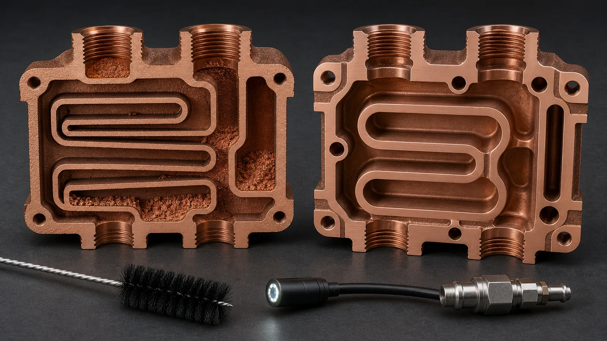
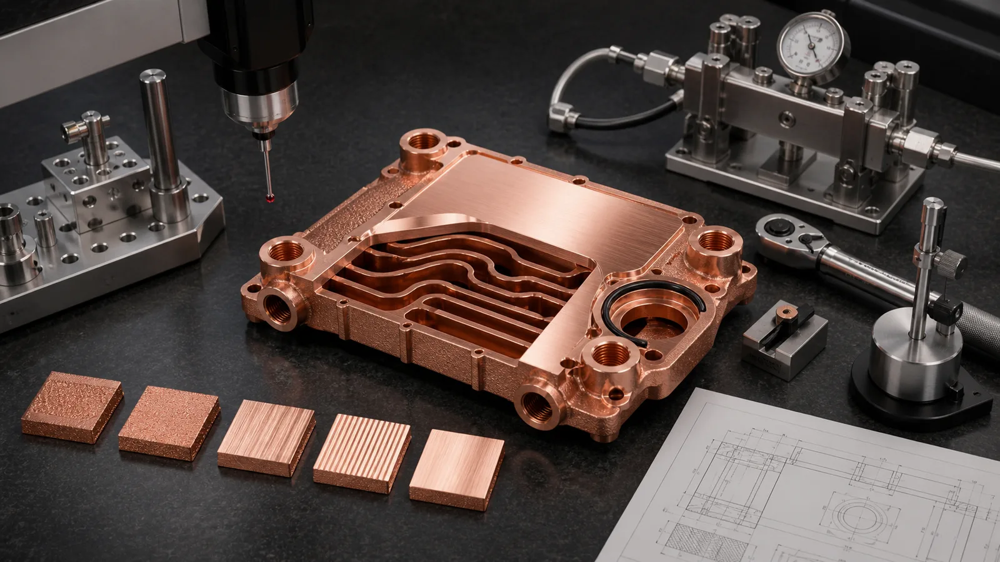

> The most expensive design mistakes in 3D printed copper parts usually happen before printing starts. Thin walls near ports, hidden powder traps, missing machining stock, unsupported fins, undefined material route, and unclear acceptance tests can turn a promising copper AM design into a slow quote, a fragile prototype, or a part that passes geometry review but fails in use.

The first mistake is thinking that a printable copper shape is the same thing as a usable copper component.

We have seen copper parts that looked convincing in CAD: compact cold plates, curved manifolds, heat sinks with dense fins, RF cavities, and high-current conductors. The model exported cleanly. The envelope was reasonable. The customer had a real reason to use additive manufacturing.

Then the review found the ledger.

A port boss had only 0.7 mm wall left after thread machining. A 1.0 mm internal channel ran 140 mm between openings with no cleaning access. A thermal face was modeled at final size even though the drawing asked for flatness near +/-0.05 mm. A pure copper callout was forced onto a part with repeated threaded assembly. The drawing had no leak test, no flow target, no conductivity requirement, and no surface finish note.

None of those issues made the part imaginary. They made the quote incomplete and the first article risky.

Copper additive manufacturing is valuable because copper can carry heat, current, RF energy, and fluid paths through compact geometry. That same value creates stricter design discipline. Copper conducts heat away from the melt zone quickly, reflects common laser energy, and often needs finished surfaces after printing. A good design should account for the route from CAD to accepted part: print, depowder, heat treat if required, machine critical faces, clean, inspect, and test.

## Mistake 1: Copying Generic Metal AM Rules Into Copper

Copper is not stainless steel with a different color.

General laser powder bed fusion rules can help at the concept stage, but copper needs a more conservative design review because the material is thermally and optically demanding. [NIST research on LPBF of highly reflective metals](https://www.nist.gov/publications/ultra-high-speed-printing-regime-laser-powder-bed-fusion-highly-reflective-metals) discusses the energy-coupling challenge for reflective metals such as copper and aluminum. In practical design terms, the process window is more sensitive to geometry, heat flow, supports, powder removal, and acceptance requirements than many buyers expect.

The mistake usually appears as a stainless-steel AM habit transferred directly into copper:

- Thin unsupported walls without a build-orientation review.
- Long overhangs that assume support scars do not matter.
- Dense lattice or fin fields that ignore cleaning and inspection.
- Internal channels designed only from CFD pressure-drop targets.
- Tight blanket tolerances applied to every surface.
- No material route decision between pure Cu, CuCrZr, and CuCr1Zr.

The correction is simple but not always convenient: design copper AM as a finished manufacturing route, not only as a geometry process. If the part carries heat, pressure, current, RF energy, or vacuum service, the CAD model should show how the part can be printed, cleaned, finished, and verified.

For the design-rule foundation, start with [Design Rules for Copper Laser Powder Bed Fusion Parts](/posts/EngineeringGuide/design-rules-copper-laser-powder-bed-fusion-parts/). For file preparation, use [How to Prepare CAD Files for Copper Metal 3D Printing](/posts/EngineeringGuide/how-to-prepare-cad-files-for-copper-metal-3d-printing/).

## Mistake 2: Making Internal Channels Too Small to Clean

Internal channels are one of the strongest reasons to use copper 3D printing. They are also where many copper AM designs fail review.

A channel may look efficient in thermal simulation, but simulation does not remove powder. A 0.8 mm passage can look attractive for heat transfer area. It can also become a trapped-powder problem if it includes sharp turns, blind pockets, a long enclosed path, or too few access openings. Even a 1.2 mm to 1.8 mm channel can be difficult if the path is long, tortuous, and sealed by the final interface geometry.

The common mistakes are:

- Designing the smallest channel that CFD allows.
- Creating dead-end pockets near manifolds.
- Placing inlet and outlet ports without a cleaning route.
- Ignoring the longest enclosed path between openings.
- Forgetting that rough internal LPBF surfaces raise pressure drop.
- Treating CT inspection as a substitute for cleanability.

A better design asks three questions before the quote:

1. Can powder leave the channel after printing?
2. Can the channel be flushed and dried?
3. Can the finished part prove flow, pressure, or cleanliness?

The best channel is not always the smallest channel. A slightly larger passage with direct access can produce a more reliable first article than a dense microchannel network that cannot be cleared. We have seen early reviews move from a 0.9 mm blind serpentine path to a 1.4 mm rounded channel with two cleaning access points. The revised design gave up some theoretical surface area, but it made flushing, pressure testing, and acceptance more realistic.

For deeper planning, see [Copper AM Cleaning and Powder Removal for Internal Channels](/posts/EngineeringGuide/copper-am-cleaning-powder-removal-internal-channels/) and [3D Printed Copper Heat Exchangers: Design Benefits and Manufacturing Limits](/posts/EngineeringGuide/3d-printed-copper-heat-exchangers-design-benefits-manufacturing-limits/).

_Figure 2. Internal-channel mistakes are usually not visible from the outside. Channel size, dead-end volume, cleaning access, and proof testing should be reviewed before the design is locked._

## Mistake 3: Forgetting Machining Stock on Critical Faces

A printed copper surface is not automatically a finished surface.

This is a frequent mistake on cold plates, heat sinks, RF parts, conductors, and tooling inserts. The model shows the final shape. The drawing asks for a finished function. But the CAD package does not leave material for machining.

Critical surfaces often need post-processing:

- Thermal contact faces.
- O-ring lands and seal grooves.
- Threaded ports.
- Electrical contact pads.
- RF mating surfaces.
- Vacuum sealing faces.
- Datum pads.
- Mounting faces.

For many copper AM parts, 0.4-1.0 mm of machining stock on functional faces is a reasonable early review range, but the final value depends on part size, orientation, distortion risk, heat treatment, and tolerance. The error is not choosing 0.6 mm instead of 0.8 mm. The error is not showing any route for finishing.

Missing stock creates a chain reaction. Adding stock later can reduce wall thickness near a channel, move a sealing land closer to a port, change support strategy, increase build height, or force a different datum scheme. That is why the printed blank and finished part should be separated early.

If the CAD model represents the finished part, tell the supplier which faces need machining allowance before printing. If the CAD model represents the printed blank, the drawing should define the final machined dimensions.

This also affects cost. A quote for a printed body is not the same as a quote for a finished accepted component. See [Cost Drivers in Copper 3D Printing Projects](/posts/EngineeringGuide/cost-drivers-in-copper-3d-printing-projects/) for the full cost ledger.

## Mistake 4: Weak Port Bosses and Threads

Ports are design features, not decoration.

In copper AM, a threaded port may need to carry pressure, torque, seal compression, repeated assembly, and cleaning access. It may also sit near an internal channel or thin wall. A port that looks clean in CAD can become a failure point after machining, especially if the thread depth, wall thickness, and sealing method are not reviewed together.

Common port mistakes include:

- Threaded ports too close to internal channels.
- Thin walls left after tapping or thread milling.
- No boss thickness around high-load fittings.
- O-ring or face-seal geometry treated as an afterthought.
- No torque or repeated assembly expectation.
- No working pressure or proof pressure in the RFQ.

A representative issue: a cooling block with G1/4 style ports may look robust from the outside, but after thread machining and channel clearance are considered, the remaining copper wall near the port can become too thin for a 6 bar working pressure and 10 bar proof pressure. The fix may require a larger boss, shifted channel, different fitting, or material review.

Pure copper can be appropriate when thermal or electrical conductivity dominates. CuCrZr or CuCr1Zr may deserve review when port strength, repeated tightening, clamp load, or pressure boundary integrity matters. For material trade-offs, see [Copper Alloy Selection for Metal 3D Printing: Pure Cu vs CuCrZr vs CuCr1Zr](/posts/EngineeringGuide/copper-alloy-selection-metal-3d-printing-pure-cu-cucrzr-cucr1zr/) and [Pure Copper vs CuCrZr for 3D Printed Heat Transfer Parts](/posts/EngineeringGuide/pure-copper-vs-cucrzr-3d-printed-heat-transfer-parts/).

## Mistake 5: Over-Tight Tolerances Everywhere

Tolerance discipline is not the same as tolerance aggression.

A blanket +/-0.05 mm requirement across a complex copper AM body can turn a feasible prototype into an expensive machining and inspection project. Some features deserve tight control. Many surfaces do not.

Use tighter tolerance where the function requires it:

- Thermal contact face flatness.
- Seal groove dimensions.
- Port position and thread depth.
- Datum pads.
- Critical hole patterns.
- RF interface geometry.
- Electrical contact pads.

Relax or leave as-built where the function allows:

- Non-contact outer walls.
- Cosmetic surfaces.
- Internal flow surfaces where roughness is acceptable.
- Support-facing surfaces that are later hidden.
- Noncritical pockets and mass-reduction features.

This is consistent with the broader AM design logic in [ISO/ASTM 52911-1:2019](https://www.iso.org/standard/72951.html), which provides design guidance for laser-based powder bed fusion of metals. The standard is not a copper-specific tolerance table, but it supports the larger point: PBF-LB/M parts need process-aware design and specification, not generic drawing notes copied from machined parts.

A better drawing separates the part into zones: machined, inspected, as-built acceptable, support-sensitive, and noncritical. That lets the quote carry the real work instead of pricing every face as if it were a datum.

## Mistake 6: Designing Unsupported Thin Fins or Fragile Lattice Without a Test Plan

Dense copper fins, pins, and lattice structures can be attractive in a rendering. They can also become fragile, costly, or underperforming if airflow, cleaning, supports, and finishing are not included.

The mistake is usually a thermal model that assumes ideal geometry:

- Very thin fins with no mechanical review.
- Tight spacing that is difficult to print or clean.
- Tall aspect ratios that raise distortion or handling risk.
- Airflow paths that clog or create high pressure drop.
- No plan for measuring real thermal performance.
- No acceptance criterion for damaged fins or local roughness.

For air-cooled heat sinks, smaller features do not automatically improve performance. If the flow cannot enter the fin field, or if interface flatness dominates the thermal resistance, the dense printed geometry may not deliver the expected result. For liquid-cooled parts, a dense micro-feature field may increase surface area while creating trapped powder and uncertain pressure drop.

If the design uses thin fins, pins, lattice, or turbulators, include the functional reason and test method. Thermal load, airflow or coolant flow, interface pressure, allowable pressure drop, and test fixture conditions matter more than a beautiful render.

For heat sink-specific issues, see [3D Printed Copper Heat Sinks for Power Electronics Cooling](/posts/EngineeringGuide/3d-printed-copper-heat-sinks-feasibility/), [Minimum Fin Thickness and Spacing for 3D Printed Copper Heat Sinks](/posts/EngineeringGuide/minimum-fin-thickness-spacing-3d-printed-copper-heat-sinks/), and [Thermal Performance Test Methods for Copper Heat Sinks](/copper-heat-sinks/#review-points).

## Mistake 7: Choosing Pure Copper When the Part Needs Mechanical Margin

"Copper" is not a complete material callout.

Industrial material suppliers position copper AM around conductivity-driven applications. [EOS describes copper materials](https://www.eos.info/metal-solutions/metal-materials/copper) for thermal and electrical conductivity applications such as heat exchangers, electronics, power electronics, and coils. [Eplus3D describes copper AM](https://www.eplus3d.com/products/3d-printing-materials-copper/) around heat exchangers, induction coils, high-frequency electronics, molding, tooling, and electronics. Those application signals are useful, but material selection still depends on the finished component.

Pure copper may be the right direction when maximum thermal or electrical conductivity dominates and mechanical loads are controlled. CuCrZr or CuCr1Zr may be more practical when the design includes:

- Threads that will be assembled repeatedly.
- Thin walls near pressure channels.
- Port bosses that carry torque.
- Higher service temperature or thermal cycling.
- Clamping load.
- Handling risk during finishing.
- Strength or hardness requirements after heat treatment.

The design mistake is forcing pure copper because "highest conductivity" sounds best, then discovering that the finished part needs more mechanical margin. A better RFQ says:

"Material open to review. Primary requirement is thermal conductivity, but threaded ports, 8 bar proof pressure, and repeated assembly must be considered."

That gives the reviewer room to compare pure Cu, CuCrZr, CuCr1Zr, heat treatment, machining, and testing as a system.

## Mistake 8: Locking Build Orientation Too Early

Build orientation is not just a print setup choice. It affects supports, surface condition, distortion, heat flow, powder removal, machining stock, and inspection access.

Buyers sometimes lock orientation because a screenshot looks cleaner in that direction. The supplier then has to quote around hidden constraints: support scars on sealing faces, difficult powder evacuation, long build height, or channels that do not drain.

Avoid locking orientation unless there is a strong reason. If a surface must not carry support scars, state that functional requirement instead:

"Support scars must not remain on the thermal face, O-ring land, datum pads, RF interface, or electrical contact surface. Build orientation is open to supplier review."

That sentence protects the part while leaving the process flexible.

If orientation is fixed because of grain direction, surface priority, assembly marks, or customer inspection, explain why. Otherwise, let orientation remain part of the DFM review.

## Mistake 9: No Acceptance Criteria

A design without acceptance criteria can still be printed. It cannot be accepted with confidence.

This is the mistake that causes the most disagreement after the first article. The part arrives. The buyer asks whether it is good. The supplier asks what "good" means. Both sides may have acted reasonably, but the RFQ was incomplete.

Acceptance criteria should match the function:

| Part function | Design mistake | Better acceptance input |
| --- | --- | --- |
| Cold plate | No pressure or flow target | Working pressure, proof pressure, leak method, flow rate, pressure drop |
| Heat sink | Only a geometry drawing | Heat load, interface condition, airflow, thermal test method |
| Electrical conductor | Only material name | Current, duty cycle, contact area, conductivity or plating requirement |
| RF component | No critical surface definition | RF band, surface finish, plating, flange tolerance, inspection scope |
| Vacuum part | No cleanliness or leak criteria | Leak limit, cleaning requirement, sealing surface, packaging |
| Tooling insert | Only final shape | Cooling requirement, mounting datums, finish, temperature cycle |

For a fluid copper part, a reasonable early RFQ may include 6 bar working pressure, 10 bar proof pressure, coolant type, 2 L/min target flow, and the allowed pressure drop. For a thermal interface, the drawing may define flatness, roughness, and heat-source footprint. For an electrical part, it may define current, duty cycle, contact surface, and plating scope.

These numbers do not need to be perfect at first contact. They need to be visible enough for the quote to carry the right work.

_Figure 3. Good design corrections make the finished route inspectable: stronger ports, machining stock, seal geometry, datum pads, pressure testing, CMM access, and witness coupons._

## Case Pattern: The CAD Was Ambitious, but the Design Was Not Ready

A representative RFQ involved a compact copper liquid-cooling component for a power electronics test fixture. The envelope was about 105 mm x 78 mm x 22 mm. The customer wanted pure copper, a serpentine internal channel, two threaded side ports, and a flat thermal face.

The first CAD model had real potential. It also carried six design mistakes:

- The internal channel narrowed below 1.0 mm in two turns.
- One dead-end pocket had no flushing path.
- Port bosses looked large externally but left thin local wall after thread machining.
- The thermal face had no machining stock.
- All outside faces carried +/-0.05 mm tolerance.
- The RFQ did not include pressure, flow, leak, or inspection requirements.

The first review did not reject the idea. It reframed it.

The revised design opened the minimum channel, removed the dead-end pocket, added cleaning access, shifted one port away from the closest channel wall, added 0.7 mm stock on the thermal face, limited tight tolerance to the datum and functional faces, and changed the material note to "pure Cu or CuCrZr to be reviewed." The acceptance scope added 6 bar working pressure, 10 bar proof pressure, coolant compatibility, and CMM inspection of the mounting pattern.

The corrected design was not cheaper on paper. It became quotable.

That is the difference between design freedom and design discipline. Copper AM can create geometry that CNC cannot reach, but every printed advantage still needs a finished route.

## Design Mistake Checklist Before RFQ

Use this checklist before sending a copper AM project for quotation.

| Review question | Risk if ignored | Better RFQ action |
| --- | --- | --- |
| Why is this part printed? | AM replaces CNC without functional gain | State the geometry, channel, consolidation, or iteration reason |
| Are channels cleanable? | Powder remains trapped | Show section views, access openings, longest path, and flow direction |
| Are ports strong enough? | Thread damage, leak, torque failure | Define thread, boss thickness, pressure, seal method, and assembly load |
| Is machining stock included? | Functional faces cannot be finished | Separate printed blank from final machined state |
| Are tolerances zoned? | Quote becomes over-machined | Tighten only critical faces and datums |
| Is material open or fixed? | Wrong balance of conductivity and strength | State pure Cu, CuCrZr, CuCr1Zr, or function-first review |
| Is orientation over-constrained? | Support scars or cleaning problems | State functional surface restrictions, not arbitrary orientation |
| Is acceptance defined? | Part is printed but not provable | Add pressure, flow, CMM, CT, conductivity, hardness, or thermal test as needed |

If several rows are still unknown, the project can still start. It should start as a design-for-manufacturing review, not as a fixed production quote.

## What to Send Instead of a Risky Design

For a better first review, send:

- STEP or Parasolid model.
- Native CAD file if design changes are allowed.
- 2D drawing with critical dimensions and surface notes.
- Section views for internal channels.
- Minimum wall thickness near ports and channels.
- Printed blank versus finished part explanation.
- Machining stock on functional surfaces.
- Material preference or openness.
- Quantity and development stage.
- Working pressure, proof pressure, flow, heat load, current, RF band, or service requirement.
- Inspection and acceptance expectations.

Use [Engineering Checklist for Copper 3D Printed Part Quotation](/posts/EngineeringGuide/engineering-checklist-copper-3d-printed-part-quotation/) to organize the package, and send it through the [RFQ guidance page](/rfq/) or directly to [info@szcomo.com](mailto:info@szcomo.com).

## FAQ

What is the most common design mistake in 3D printed copper parts?

The most common mistake is designing the printed shape without designing the finished route. Missing machining stock, hidden channels, weak ports, undefined material, and absent acceptance tests usually create more risk than a single small CAD defect.

Can copper 3D printing make very small internal channels?

Sometimes, but small does not mean practical. Channel size must be reviewed with build orientation, powder removal, flushing, pressure drop, wall thickness, and inspection. A slightly larger cleanable channel can be better than a smaller channel that cannot be verified.

Should all copper AM surfaces be tightly toleranced?

No. Tight tolerances should be assigned to functional faces, datums, sealing lands, ports, contact pads, and critical interfaces. Nonfunctional areas can often remain as-built or receive lighter finishing. Blanket tolerance notes raise cost and ambiguity.

Is pure copper always the best choice for 3D printed copper parts?

No. Pure copper can be preferred for maximum thermal or electrical conductivity, but CuCrZr or CuCr1Zr may be better when strength, threaded ports, pressure boundaries, clamp load, or heat treatment matter. Material should be selected around the finished component.

How can we reduce design risk before requesting a quote?

Send CAD, drawing, section views, material preference, quantity, critical surfaces, operating conditions, and acceptance tests. If the design is still open, state that supplier DFM review is expected before locking the model.

## Verdict: Design the Finished Copper Part, Not Just the Printed Shape

The biggest design mistakes in 3D printed copper parts are not exotic. They are practical: channels that cannot be cleaned, ports that cannot survive finishing, faces that need machining but have no stock, tolerances applied without function, material choices made from one property, and acceptance tests left until after the part is built.

Copper AM is strongest when it solves a real geometry problem: compact channels, integrated manifolds, shorter thermal paths, fewer joints, RF or vacuum consolidation, or combined cooling and conductivity. It is weakest when the design uses additive freedom without additive discipline.

Before locking the model, ask whether the part can be printed, depowdered, machined, cleaned, inspected, and accepted. If the answer is visible in the CAD package and RFQ notes, the design is ready for a serious quote. If the answer is hidden, the next step is not production. It is design review.

Related reading: [Design Rules for Copper Laser Powder Bed Fusion Parts](/posts/EngineeringGuide/design-rules-copper-laser-powder-bed-fusion-parts/), [How to Prepare CAD Files for Copper Metal 3D Printing](/posts/EngineeringGuide/how-to-prepare-cad-files-for-copper-metal-3d-printing/), [Cost Drivers in Copper 3D Printing Projects](/posts/EngineeringGuide/cost-drivers-in-copper-3d-printing-projects/), [When Copper 3D Printing Is Better Than CNC Machining](/posts/EngineeringGuide/when-copper-3d-printing-is-better-than-cnc-machining/), [Copper AM Cleaning and Powder Removal for Internal Channels](/posts/EngineeringGuide/copper-am-cleaning-powder-removal-internal-channels/), and [When a Copper Part Should Be Rejected for LPBF Before Quotation](/posts/EngineeringGuide/when-a-copper-part-should-be-rejected-for-lpbf-before-quotation/).
