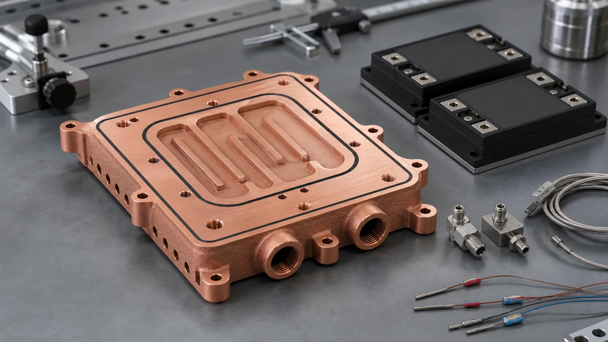
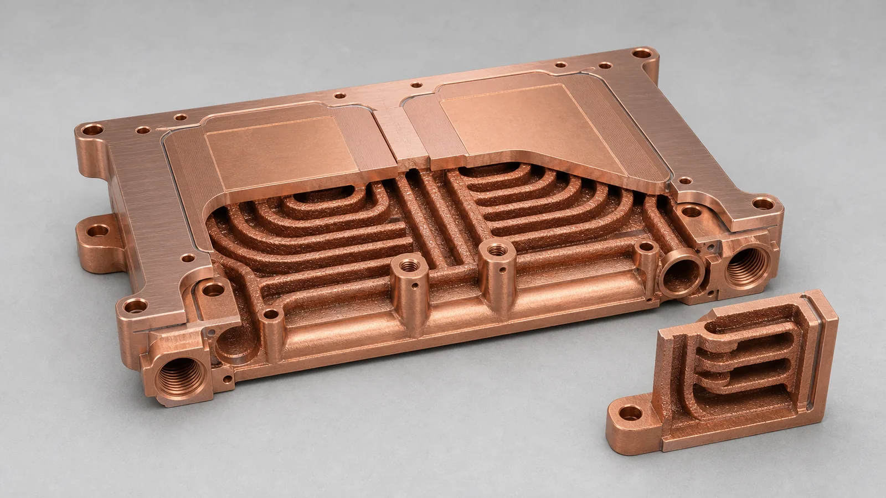
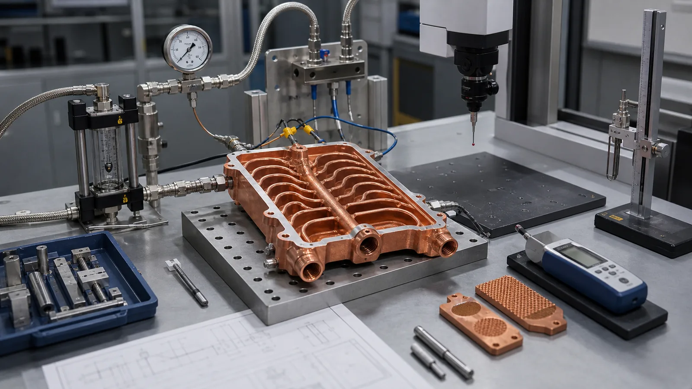

> Copper 3D printing becomes worth reviewing for SiC power module cooling when the cold plate is constrained by heat-source placement, package height, port routing, leak paths, or assembly risk. A strong RFQ should define the module footprint, heat load, coolant, pressure limit, pressure-drop target, critical flatness, machined interfaces, and inspection plan before the supplier quotes the part.

This case study is a representative engineering pattern, not a claim about a named customer program. It reflects the kind of copper additive manufacturing review that appears when a power electronics team is trying to cool compact SiC modules inside an inverter, fast charger, industrial drive, or test platform.

SiC power electronics are attractive because they support high-efficiency, high-power-density systems. Suppliers such as [Wolfspeed](https://www.wolfspeed.com/knowledge-center/article/silicon-carbide-modules-unlock-higher-power-density-in-motor-drives/) discuss SiC modules in the context of higher power density, and [Infineon](https://www.infineon.com/cms/en/product/power/sic-mosfet/) positions CoolSiC devices for high-efficiency power conversion. That trend is a useful signal for copper AM: when electrical packages become denser, the cold plate is no longer a simple metal slab. It becomes a pressure boundary, a thermal interface, a flow distributor, a cleaning challenge, and an inspection item.

For background on the broader cold plate design logic, start with [Copper 3D Printing for Microchannel Cold Plates in Thermal Management](/posts/EngineeringGuide/copper-3d-printing-microchannel-cold-plates-thermal-management/) and [How Copper Additive Manufacturing Improves Liquid Cooling Plate Design](/posts/EngineeringGuide/how-copper-additive-manufacturing-improves-liquid-cooling-plate-design/). This article narrows the discussion to a SiC power module case.

_A representative copper AM cold plate case starts with thermal footprint, sealing lands, ports, and validation requirements, not only the exterior envelope._

## The Starting Requirement

The original part concept looked simple from the outside: a rectangular copper cold plate under two SiC power modules with side ports and a low Z-height limit. The challenge was inside the plate. The coolant needed to pass under the active heat zones without increasing package height, interfering with mounting screws, or creating a brazed cover seam near the pressure boundary.

An early RFQ for this type of part may look like this:

| Requirement | Representative target for review | Why it matters |
| --- | --- | --- |
| Application | SiC power module cooling for inverter, charger, or drive hardware | Defines thermal cycling, coolant, vibration, and reliability expectations |
| Module layout | Two module footprints on one cold plate | Drives channel placement and local heat spreading |
| Material candidates | Pure copper or CuCrZr | Balances thermal conductivity, strength, threads, and heat treatment |
| Coolant | Water-glycol or dielectric coolant, project dependent | Affects corrosion, cleaning, leak test, and flow validation |
| Working pressure | Defined by system design, often with proof-test margin | Controls wall thickness, port design, and inspection scope |
| Critical surface | Machined thermal interface under the modules | Controls TIM thickness and contact resistance |
| Acceptance | Leak test, pressure test, flow check, CMM, surface finish | Prevents a visually good part from becoming an unusable part |

The first useful design question is not "Can copper 3D printing make this cold plate?" It is:

**Does additive manufacturing solve a real packaging, channel-routing, or leak-path problem that CNC machining, gun drilling, brazing, or a bolted cover cannot solve cleanly?**

If the answer is no, a conventional route may be better. Use [When Copper 3D Printing Is Better Than CNC Machining](/posts/EngineeringGuide/when-copper-3d-printing-is-better-than-cnc-machining/) and [Copper AM Process Selection: LPBF vs CNC and Brazing](/posts/EngineeringGuide/copper-am-process-selection-lpbf-cnc-brazing/) before locking the process.

## Why SiC Power Modules Create A Different Cold Plate Problem

SiC modules often push the thermal design in three ways.

First, the heat source can be compact. That means the cold plate must manage local heat flux, not only total watts. A large copper block can spread heat, but a compact internal channel route may reduce the thermal path between the module base and coolant.

Second, power electronics packages usually have strict mechanical boundaries. Ports, screws, busbars, insulation spacing, enclosure walls, and service access can conflict with the ideal cooling path. A channel network that looks good in CFD may be impossible to machine or impossible to seal with a conventional cover.

Third, the cold plate must survive the real assembly. Flatness under the module, surface roughness, O-ring compression, thread quality, pressure cycling, and coolant cleanliness can dominate the result. A nominal conductivity number is not enough. For material trade-offs, compare [Pure Copper vs CuCrZr for 3D Printed Heat Transfer Parts](/posts/EngineeringGuide/pure-copper-vs-cucrzr-3d-printed-heat-transfer-parts/) and [Copper Alloy Selection for Metal 3D Printing: Pure Cu vs CuCrZr vs CuCr1Zr](/posts/EngineeringGuide/copper-alloy-selection-metal-3d-printing-pure-cu-cucrzr-cucr1zr/).

## Why The First CAD Was Not Ready For Quotation

The first CAD package in this case pattern usually has an ambitious internal channel concept and a clean external envelope. The weak points are predictable:

- The module footprint is shown, but the maximum junction-to-fluid thermal target is not defined.
- Ports are placed where the enclosure allows them, but local wall thickness around port threads is too thin.
- The internal channels are dense, but there is no practical powder-removal path.
- The drawing calls for tight flatness on the thermal face, but leaves no machining stock.
- The leak requirement says "no leaks" without test method, pressure, hold time, or allowable leakage threshold.
- The material is listed as "copper" without saying whether pure copper, CuCrZr, or CuCr1Zr is acceptable.

Those gaps matter because copper LPBF is not a magic shortcut. [EOS](https://www.eos.info/metal-solutions/metal-materials/copper) positions copper additive manufacturing around thermal and electrical conductivity applications such as heat exchangers and electronics, but the finished component still depends on process route, geometry, post-processing, and inspection. Copper also remains difficult in laser powder bed fusion because high reflectivity and high thermal conductivity reduce process-window forgiveness; [NIST](https://www.nist.gov/publications/ultra-high-speed-printing-regime-laser-powder-bed-fusion-highly-reflective-metals) has published work around high-speed LPBF of highly reflective metals, including copper.

For a quote-ready package, use [How to Prepare CAD Files for Copper Metal 3D Printing](/posts/EngineeringGuide/how-to-prepare-cad-files-for-copper-metal-3d-printing/) and [Engineering Checklist for Copper 3D Printed Part Quotation](/posts/EngineeringGuide/engineering-checklist-copper-3d-printed-part-quotation/).

## The Revised Copper AM Design Route

The revised route used additive manufacturing where it had clear value and conventional finishing where it was necessary.

### 1. Keep The Thermal Face Machinable

The cold plate was treated as a printed near-net-shape body, not a finished print. The module contact face needed machining stock so flatness and roughness could be controlled after stress relief or heat treatment. For power module cooling, this is often more important than adding another small internal fin.

A practical RFQ should specify:

- Which face contacts the SiC module or baseplate.
- Required flatness after machining.
- Required surface roughness after machining.
- Whether the same face also carries an O-ring groove or sealing land.
- Datum scheme for inspecting the module contact plane.

For dimensional planning, see [Tolerances and Dimensional Accuracy in Copper Metal 3D Printing](/posts/EngineeringGuide/tolerances-and-dimensional-accuracy-in-copper-metal-3d-printing/).

### 2. Use Internal Channels Only Where They Earn Their Risk

The internal channel field was kept under the module heat zones, while larger manifolds handled distribution near the ports. This prevented the entire plate from becoming a dense microchannel object. Dense channels can improve local surface area, but they also increase pressure drop, cleaning time, inspection uncertainty, and quote cost.

The design review separated the cold plate into three zones:

| Zone | Design goal | Main risk |
| --- | --- | --- |
| Thermal zone under modules | Short thermal path and useful wetted area | Pressure drop, wall thickness, powder removal |
| Manifold zone | Smooth flow distribution from ports to channel field | Dead zones, trapped powder, uneven flow |
| Interface zone | Machined flatness, sealing, bolt load, port threads | Distortion, weak bosses, leakage after machining |

This zone-based review is easier to quote than a single complex channel body. It also creates a cleaner path for CT, borescope review, flushing, and flow testing.

_Internal channels are valuable only when the channel route, powder removal path, pressure boundary, and machined interfaces remain practical._

### 3. Add Powder Removal And Cleaning Logic Early

A cold plate that cannot be cleaned is not a production part. In this case pattern, the internal route needed access for powder evacuation, flushing, drying, and inspection. This changed port orientation, channel transitions, and local manifold geometry.

Common changes include:

- Avoiding blind channel branches.
- Increasing radius or opening size at high-risk turns.
- Adding temporary or functional access features where they are compatible with the part.
- Keeping minimum channel size realistic for the selected process and powder route.
- Defining whether CT inspection, borescope review, particle inspection, or flow testing will be required.

Use [Copper AM Cleaning and Powder Removal for Internal Channels](/posts/EngineeringGuide/copper-am-cleaning-powder-removal-internal-channels/) before sending a cold plate with hidden passages.

### 4. Strengthen Ports, Bosses, And Sealing Lands

The highest-risk places were not the middle of the plate. They were the transitions: threaded ports, O-ring grooves, bolt bosses, manifold edges, and machined sealing lands. Those are the areas where print porosity, machining, residual stress, or thin walls can turn into a leak path.

The revised design added local material around port bosses and left machining stock on sealing surfaces. It also separated "as-built geometry" from "finished critical geometry" on the drawing. That distinction helps the supplier quote the right operations instead of pretending the print itself will satisfy every functional surface.

For pressure-boundary planning, pair this article with [CT and Leak Test Criteria for Copper Cold Plates](/posts/EngineeringGuide/ct-scan-leak-test-acceptance-criteria-copper-cold-plates/).

## Pure Copper Or CuCrZr?

The material decision depends on which risk controls the finished part.

Pure copper is attractive when maximum thermal and electrical conductivity are the primary drivers and the geometry is mechanically forgiving. In a compact SiC cold plate, pure copper can still be reviewed, especially if the channels are not too close to threaded ports, the thermal face has enough machining stock, and the pressure requirement is moderate.

CuCrZr becomes more attractive when the part needs stronger port bosses, better thread robustness, improved mechanical stability, or heat treatment control. The penalty is lower conductivity than pure copper, but the finished component may still perform better if it stays flatter, seals better, and survives assembly with less risk.

This is why the quote should ask for an acceptable material range rather than locking the material too early. A useful wording is:

> Preferred material: pure copper if feasible. CuCrZr acceptable if needed for pressure boundary, threaded ports, dimensional stability, or heat treatment route.

For a deeper material route, use [CuCrZr 3D Printing for High-Performance Thermal Management Components](/posts/EngineeringGuide/cucrzr-3d-printing-high-performance-thermal-management-components/).

## Validation Plan For The First Article

The validation plan should match the failure modes. For a SiC module cold plate, the inspection package often matters as much as the printed geometry.

At minimum, a serious RFQ should define:

| Validation item | What to define in the RFQ |
| --- | --- |
| Dimensional inspection | Datums, module face flatness, port locations, O-ring groove dimensions, thread checks |
| Surface finish | Thermal interface roughness, sealing-land roughness, allowable as-built internal surface |
| Pressure test | Working pressure, proof pressure, hold time, medium, temperature if relevant |
| Leak test | Method, threshold, fixture, test side, post-machining timing |
| Flow test | Coolant, target flow, allowed pressure drop, inlet/outlet temperature if measured |
| Cleaning | Flush medium, drying, particle expectation, internal channel acceptance method |
| Material evidence | Material route, heat treatment if used, density or coupon evidence when required |

This is also where standards language becomes useful. [ISO/ASTM 52911-1](https://www.iso.org/standard/72951.html) gives design guidance for metal laser-based powder bed fusion, while the project drawing should define the application-specific acceptance criteria.

_For power-module cooling hardware, quotation quality improves when pressure, flow, leak, machining, and inspection expectations are defined before the first article._

## What Changed After Review

The revised design was not simply "more printable." It was more quotable and more testable.

The main changes were:

- Thermal face changed from as-printed expectation to post-machined requirement.
- Channel density was reduced in areas that did not improve module cooling enough to justify cleaning risk.
- Port bosses received more local wall thickness and clearer machining stock.
- Manifold transitions were opened to reduce trapped powder and high pressure drop.
- Leak and pressure testing were defined as finished-part checks, not raw-print checks.
- Material route stayed flexible between pure copper and CuCrZr until the pressure and machining risks were reviewed.

This is a common pattern in copper AM. The final printed body may look less aggressive than the first CAD model, but the finished part has a higher chance of passing assembly and validation.

## When This Case Pattern Is A Good Fit

A copper 3D printed cold plate is worth reviewing for SiC power module cooling when:

- Module footprints and mounting screws prevent simple drilled channels.
- Ports must be moved away from the ideal flow path.
- A brazed or bolted cover creates unacceptable leak-path or height risk.
- Local heat zones need compact coolant routing.
- The cold plate also needs integrated manifolds, bosses, or structural features.
- Prototype or low-volume production value is higher than blank-part cost.
- The buyer can define pressure, flow, surface, and inspection requirements.

It is usually weaker when:

- The part is a flat plate with open channels and an easy cover.
- The design can be gun-drilled or CNC-machined without extra assembly risk.
- The RFQ cannot define coolant, pressure, flow, or thermal target.
- The required channels are too small or too long to clean confidently.
- Cost target is driven only by commodity plate machining.

For cost expectations, use [Cost Drivers in Copper 3D Printing Projects](/posts/EngineeringGuide/cost-drivers-in-copper-3d-printing-projects/). For common avoidable mistakes, use [Common Design Mistakes in 3D Printed Copper Parts](/posts/EngineeringGuide/common-design-mistakes-in-3d-printed-copper-parts/).

## RFQ Checklist For A SiC Power Module Copper Cold Plate

Send the following information when requesting a quotation:

- STEP file and native CAD if available.
- 2D drawing with datum scheme and critical dimensions.
- Module footprint, screw pattern, keep-out zones, and interface face.
- Estimated heat load or heat-flux map.
- Coolant type, inlet temperature range, flow target, and pressure-drop limit.
- Working pressure, proof pressure, and leak test requirement.
- Material preference: pure copper, CuCrZr, CuCr1Zr, or "supplier to recommend."
- Machined surfaces, O-ring grooves, thread specs, and surface finish requirements.
- Cleaning, CT, borescope, pressure, leak, flow, and dimensional inspection needs.
- Quantity, prototype schedule, and whether the part is for test, pilot build, or production review.

If you are still organizing the package, the broad [Copper 3D Printing Service RFQ Guide](/posts/EngineeringGuide/copper-3d-printing-service-rfq-guide/) and the fixed [RFQ page](/rfq/) are the fastest next steps.

## FAQ

### Is copper 3D printing always better for SiC module cold plates?

No. It is strongest when the internal flow path, manifold integration, package height, or leak-path reduction cannot be handled cleanly by conventional manufacturing. If a simple machined and sealed plate meets the requirement, that may be the better route.

### Should the cold plate use pure copper or CuCrZr?

Pure copper is attractive when conductivity dominates and the geometry is mechanically forgiving. CuCrZr is often reviewed when port strength, threads, pressure, heat treatment, or dimensional stability matter more than the last increment of conductivity.

### Can very small microchannels be printed in copper?

Small channels can be reviewed, but printability is not the only issue. Powder removal, cleaning, CT visibility, pressure drop, and acceptance testing must be practical. A slightly larger channel that can be cleaned and tested may be better than a high-density channel that cannot be accepted.

### What information speeds up quotation the most?

The highest-value inputs are module footprint, heat load, coolant, target flow, pressure drop, working pressure, leak test method, thermal face flatness, machined surface requirements, material preference, and quantity.

### Can COPPER 3DP review a confidential SiC cold plate design?

Yes. Send CAD, drawing, quantity, material preference, and critical requirements to [info@szcomo.com](mailto:info@szcomo.com). If the first package is incomplete, the review may begin with focused clarification before quotation.
