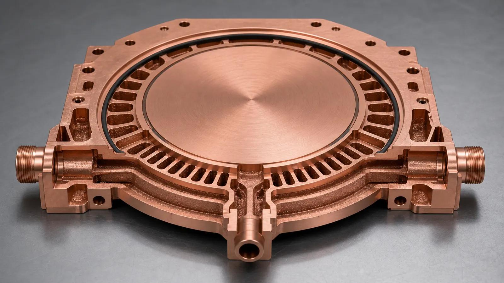
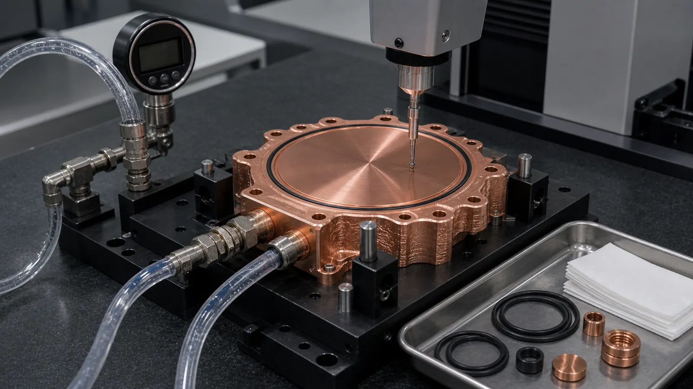

> Copper 3D printing becomes worth reviewing for semiconductor wafer processing cooling blocks when temperature uniformity, package envelope, port routing, vacuum-adjacent sealing, clean internal channels, or low-volume design iteration cannot be handled cleanly by a drilled block or brazed plate. A quote-ready RFQ should define the thermal zone, coolant, pressure, leak method, cleanliness expectation, machined contact surfaces, material route, and inspection plan before the supplier prices the part.

This case study is a representative engineering pattern, not a claim about a named customer tool. It reflects the type of review that appears when a semiconductor equipment team needs a compact copper thermal-control component for a wafer processing module, process chamber support assembly, test fixture, or local temperature-control block.

The timing supports the topic. [SEMI forecasted global front-end fab equipment spending at $110 billion in 2025](https://www.semi.org/en/semi-press-release/global-fab-equipment-investment-expected-to-reach-110-billion-dollar-in-2025), and its [300mm Fab Outlook reported expected 300mm fab equipment spending of $374 billion from 2026 to 2028](https://www.semi.org/en/semi-press-release/semi-reports-global-300mm-fab-equipment-spending-expected-to-total-374-billion-dollars-over-next-three-years). Those figures do not mean every semiconductor cooling component should be additively manufactured. They do mean wafer fab equipment remains a high-value industrial hardware category where thermal control, cleanliness, uptime, and acceptance evidence matter.

For the broad RFQ background, start with [Copper AM Parts for Semiconductor Equipment](/posts/EngineeringGuide/copper-am-semiconductor-equipment-rfq/), [Copper AM Cleaning and Powder Removal for Internal Channels](/posts/EngineeringGuide/copper-am-cleaning-powder-removal-internal-channels/), and [Copper AM Process Selection: LPBF vs CNC and Brazing](/posts/EngineeringGuide/when-copper-3d-printing-is-better-than-cnc-machining/). This article narrows the problem to one cooling block case.

_A semiconductor cooling block case starts with the thermal-control face, seal land, port location, cleanliness requirement, and acceptance method, not only the outside copper volume._

## The Starting Requirement

The first CAD package described a circular copper cooling block with a flat thermal-control face, side coolant ports, a perimeter bolt pattern, and an O-ring groove. The component sat below a wafer-zone interface in a compact process module. The buyer wanted better local temperature control without adding height, external tubing, or a two-piece brazed assembly near the pressure boundary.

At first glance, this looked like a straightforward copper part. The hidden requirements made it harder:

- The thermal zone was circular, but the available port direction was fixed by the chamber layout.
- The top face needed final machining for contact flatness and repeatable assembly.
- The internal channel path needed to avoid trapped powder and cleaning blind spots.
- The part could sit near vacuum-facing hardware, so leak paths and residue mattered.
- The RFQ used the word "clean" but did not define a measurable cleanliness or inspection method.
- The drawing called out copper but did not say whether pure copper, CuCrZr, or CuCr1Zr was acceptable.

The useful first question was not "Can this be printed in copper?" It was:

**Does additive manufacturing solve a real thermal-control, routing, cleaning, or assembly problem that CNC machining, drilling, brazing, or a conventional cold plate cannot solve with lower risk?**

That route gate is the same discipline used in [When Copper 3D Printing Is Better Than CNC Machining](/posts/EngineeringGuide/when-copper-3d-printing-is-better-than-cnc-machining/). A simple copper block with straight drilled channels should normally start with conventional machining.

## Why The Conventional Block Was Not Enough

The initial conventional design used a machined copper body with drilled cross-passages and plugs. It was familiar and cost-efficient, but the channel route obeyed tool access more than the thermal zone. Several drilled paths ran close to the seal land, and the side-port orientation forced extra volume around one edge of the block.

The team reviewed four routes.

| Route reviewed | Why it was attractive | Why it became risky |
| --- | --- | --- |
| Drilled copper block | Familiar, short lead time, easy to model | Straight passages missed the circular thermal zone and required plugs |
| CNC open-channel plate plus cover | Channels visible before closure | Cover seam or brazing step added leak and cleanliness risk |
| Tube or external manifold assembly | Lower blank cost for early prototype | Extra fittings increased height and created more joints near the module |
| Copper AM near-net block | Internal channels could follow the thermal zone | Higher print cost, powder removal, machining, leak testing, and cleanliness review |

The additive route only became credible after the buyer accepted that the part would not be "print and use." The finished component would still need machining, cleaning, leak testing, dimensional inspection, and acceptance evidence.

## The Design Change That Made The Part Quotable

The first printed-channel concept tried to maximize surface area under the circular face. That looked efficient, but it introduced too many small turns and local dead ends. The revised design separated the component into four zones:

| Zone | Design goal | Quote risk |
| --- | --- | --- |
| Circular thermal-control face | Stable heat transfer and repeatable contact | Flatness, roughness, distortion after machining |
| Annular coolant gallery | Distribute coolant around the thermal zone | Pressure drop, flow imbalance, trapped powder |
| Port and boss region | Connect fittings without weak walls | Thread strength, leak path, machining stock |
| Seal and datum region | Hold O-ring, bolts, and inspection references | Surface finish, tolerance stack, contamination control |

That layout changed the quote. The supplier could now separate near-net printed features from finished critical features. The circular thermal face, O-ring groove, thread interfaces, and datum pads were treated as post-machined requirements. Internal passages were reviewed for printability, powder evacuation, flushing, and pressure testing.

This is where copper AM creates value: not by replacing every operation, but by letting the internal coolant path follow the thermal-control problem before machining makes the interfaces usable.

_The revised channel route used an annular gallery and radial transitions around the circular thermal zone while preserving cleaning access, port bosses, seal lands, and machining stock._

## Clean Internal Channels Were A Design Requirement

For semiconductor equipment, "it passed pressure" is not the same as "it is acceptable." A cooling block can hold pressure and still carry trapped powder, coolant residue, or cleaning media. In a sensitive equipment environment, that can become a pump, valve, filter, contamination, or service problem.

The revised CAD therefore made cleaning part of the geometry:

- No decorative internal lattice.
- No blind channel pockets outside the thermal-control function.
- Larger transitions at the inlet and outlet galleries.
- Flush-through paths that aligned with port access.
- Machining stock kept away from channel walls where possible.
- Optional inspection points discussed before quotation, not after printing.

This is why [Copper AM Cleaning and Powder Removal for Internal Channels](/posts/EngineeringGuide/copper-am-cleaning-powder-removal-internal-channels/) is a foundation page for this case. If the RFQ uses terms like semiconductor clean, vacuum-adjacent, particle-sensitive, or process-facing, the buyer should define what evidence is needed. Visual cleanliness alone is too weak for a serious quote.

## Pure Copper Or CuCrZr

The buyer originally asked for pure copper because thermal conductivity was the main reason for using copper. That request was reasonable, but it did not cover the finished-part risks.

Pure copper stayed on the table if the process route could make the channel geometry with acceptable density, cleaning, and pressure performance. CuCrZr was reviewed because the part had threaded ports, machined seal lands, repeated assembly handling, and a pressure boundary. In this type of cooling block, port strength and machining stability can matter as much as nominal conductivity.

A more practical RFQ sentence was:

> Preferred material: pure copper if feasible. CuCrZr or CuCr1Zr acceptable if required for threaded ports, pressure boundary, heat treatment, dimensional stability, or supplier process route.

That wording avoids a common procurement trap. The buyer is not giving up copper thermal performance; the buyer is allowing the supplier to choose a route that has a better chance of becoming a reliable finished component. For the broader comparison, use [Pure Copper vs CuCrZr for 3D Printed Heat Transfer Parts](/posts/EngineeringGuide/pure-copper-vs-cucrzr-3d-printed-heat-transfer-parts/), [CuCrZr 3D Printing for High-Performance Thermal Management Components](/posts/EngineeringGuide/cucrzr-3d-printing-high-performance-thermal-management-components/), and [Copper Alloy Selection for Metal 3D Printing: Pure Cu vs CuCrZr vs CuCr1Zr](/posts/EngineeringGuide/copper-alloy-selection-metal-3d-printing-pure-cu-cucrzr-cucr1zr/).

Material suppliers also frame copper AM around high-value thermal and electrical applications. [EOS lists copper AM for applications including heat exchangers and electrical components](https://www.eos.info/metal-solutions/metal-materials/copper), while [Eplus3D highlights copper powder uses such as heat exchangers, induction coils, and high-frequency electronics](https://www.eplus3d.com/products/3d-printing-materials-copper/). Those application categories fit the direction of this case, but the finished design still depends on print route, machining, cleaning, and testing.

## Flatness, Sealing, And Leak Testing Controlled The Quote

The most expensive risk was not the copper blank. It was the acceptance package.

The circular thermal face needed final machining. The O-ring groove needed controlled geometry. The port threads needed enough wall thickness after machining. If the part sat near vacuum-facing hardware, leak testing and cleaning could be stricter than a normal liquid-cooling block.

The RFQ became clearer after the drawing separated:

- Printed near-net body.
- Machined circular thermal face.
- Machined O-ring groove and seal land.
- Threaded side ports.
- Datum pads for CMM inspection.
- As-built noncritical exterior surfaces.
- Internal channels accepted by flow, pressure, cleaning, or CT review where required.

For dimensional planning, use [Tolerances and Dimensional Accuracy in Copper Metal 3D Printing](/posts/EngineeringGuide/tolerances-and-dimensional-accuracy-in-copper-metal-3d-printing/). For leak and pressure scope, use [CT and Leak Test Criteria for Copper Cold Plates](/posts/EngineeringGuide/ct-scan-leak-test-acceptance-criteria-copper-cold-plates/), even when the part is called a cooling block rather than a cold plate.

## First Article Validation Plan

The first build should be treated as a controlled learning article. It should answer whether the channel route, machining route, sealing route, and cleaning route are compatible before the buyer asks for a pilot lot.

_A semiconductor cooling block first article should verify machined contact surfaces, seal geometry, leak behavior, clean internal passages, and flow function before moving toward a pilot build._

The validation plan used this structure:

| Validation item | What the RFQ should define |
| --- | --- |
| Dimensional inspection | Datums, circular face position, port locations, bolt pattern, O-ring groove dimensions |
| Contact surface | Flatness target, roughness target, machining stock, inspection method |
| Leak test | Method, threshold, medium, fixture condition, timing after machining |
| Pressure test | Working pressure, proof pressure, hold time, coolant or test medium |
| Flow check | Coolant, total flow, pressure-drop target, temperature condition if measured |
| Cleaning | Flush method, drying method, particle expectation, CT or borescope need |
| Material evidence | Material route, heat treatment if used, coupon or density evidence when required |
| Packaging | Handling, sealing, bagging, or clean transfer expectation if applicable |

Not every prototype needs every item. A feasibility article may use basic pressure and flow checks. A cooling block intended for semiconductor equipment qualification needs a clearer acceptance package, because the cost of an ambiguous failure is higher than the cost of defining the test.

## What Changed After Review

The revised component became more conservative and more quotable.

The main changes were:

- Channel density was reduced where it did not improve the circular thermal-control zone.
- The annular gallery was opened to improve flushing and reduce trapped-powder risk.
- Port bosses gained more local material before thread machining.
- The circular thermal face became a post-machined requirement.
- O-ring grooves and seal lands were separated from as-built print expectations.
- Material stayed flexible between pure copper and CuCrZr until pressure and machining risk were reviewed.
- Cleanliness and leak testing became RFQ inputs rather than late inspection surprises.

The trade-off was cost. The printed near-net body solved routing and package problems, but the quote still included CNC finishing, cleaning, pressure or leak checks, inspection, and documentation. That is the correct result. A low quote that ignores these items is not necessarily a better quote; it may only be hiding the acceptance problem.

For cost logic, use [Cost Drivers in Copper 3D Printing Projects](/posts/EngineeringGuide/cost-drivers-in-copper-3d-printing-projects/).

## When This Case Pattern Is A Good Fit

A copper 3D printed cooling block is worth reviewing for semiconductor wafer processing equipment when:

- The thermal-control zone is circular, offset, or blocked by keep-out areas.
- Port routing is constrained by chamber layout, service access, or adjacent hardware.
- A drilled block creates plugs, leak paths, or poor temperature uniformity.
- A brazed cover adds unacceptable seam, cleanliness, or qualification risk.
- The part needs integrated channels, seal lands, datums, and compact port bosses.
- The buyer can define pressure, leak, cleaning, and inspection requirements.
- Prototype or low-volume value is higher than the blank-part cost.

It is usually weaker when:

- The part is a simple copper block with straight accessible passages.
- A machined plate and conventional cover already meet pressure and cleanliness targets.
- The RFQ cannot define coolant, pressure, thermal zone, or leak method.
- Internal channels are too small or too blind to clean confidently.
- The only goal is to make a cheaper version of a simple machined cooling block.

This boundary matters for SEO as much as engineering. A useful article should not claim that copper AM is the answer for every semiconductor component. It should show the decision line.

## RFQ Checklist For A Semiconductor Cooling Block

Send the following information when requesting a quotation:

- STEP file and native CAD if available.
- 2D drawing with datums, revision, critical dimensions, and interface surfaces.
- Thermal-control zone geometry, heat load, target temperature range, and uniformity requirement if known.
- Coolant type, total flow target, allowed pressure drop, working pressure, and proof pressure.
- Leak method, leak threshold, hold time, and fixture condition.
- Material preference: pure copper, CuCrZr, CuCr1Zr, or supplier recommendation.
- Machined surfaces, flatness, roughness, O-ring groove dimensions, thread specs, and port standard.
- Cleaning, drying, CT, borescope, particle, pressure, leak, flow, and dimensional inspection requirements.
- Packaging, handling, and cleanliness expectations if the part enters a controlled equipment environment.
- Quantity, target lead time, and whether the build is concept, first article, validation, or pilot production.

If the package is not ready, use [Engineering Checklist for Copper 3D Printed Part Quotation](/posts/EngineeringGuide/engineering-checklist-copper-3d-printed-part-quotation/), [How to Prepare CAD Files for Copper Metal 3D Printing](/posts/EngineeringGuide/how-to-prepare-cad-files-for-copper-metal-3d-printing/), and the fixed [RFQ page](/rfq/) before sending files.

## FAQ

### Is this different from a normal copper cold plate?

Yes. A semiconductor cooling block may share cold plate physics, but the acceptance risk can shift toward cleanliness, leak testing, contact flatness, seal geometry, and controlled handling. The RFQ should define those risks directly.

### Should the part use pure copper or CuCrZr?

Pure copper is attractive when thermal conductivity is the controlling requirement and the pressure boundary is forgiving. CuCrZr is often reviewed when threaded ports, seal lands, machining stability, or pressure integrity matter more than maximum conductivity.

### Can copper AM make the internal channels cleaner than drilling?

Not automatically. Copper AM can create better thermal routing, but it also creates powder-removal responsibility. The design must include cleanable passages, flushing access, and a realistic inspection plan.

### Does every semiconductor cooling block need CT inspection?

No. CT can help when hidden channels, trapped powder, or wall thickness are high-risk, but it adds cost. The inspection method should match the failure mode and acceptance stage.

### What delays quotation most?

Undefined cleanliness, leak method, pressure target, material route, machined surfaces, and acceptance plan. A STEP file alone is not enough for a semiconductor equipment cooling block quote.

### Can COPPER 3DP review a confidential semiconductor cooling block?

Yes. Send CAD, drawings, quantity, material preference, lead time, and critical requirements to [info@szcomo.com](mailto:info@szcomo.com). If the first package is incomplete, the review may begin with focused clarification before quotation.
