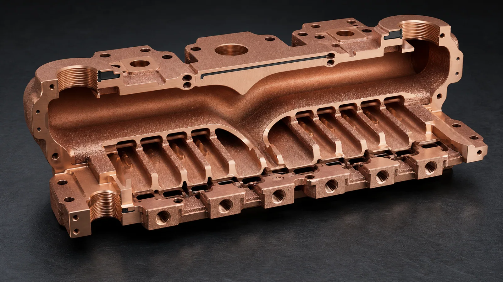
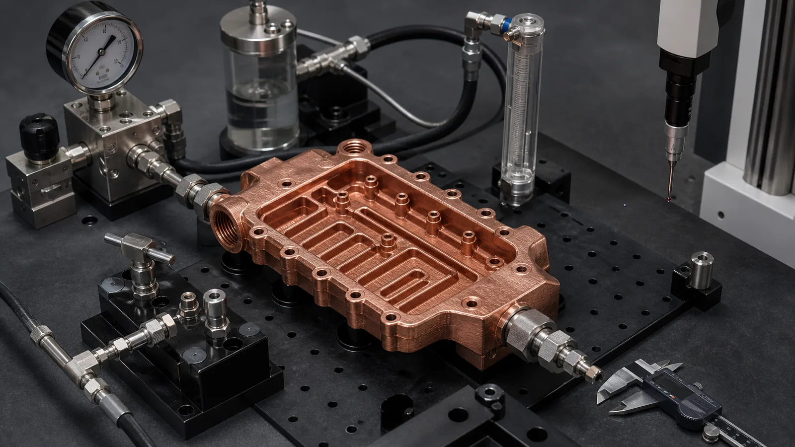

> Copper 3D printing becomes worth reviewing for liquid-cooled AI server manifolds when coolant routing, port density, assembly height, leak-path reduction, or branch flow distribution cannot be handled cleanly with machined blocks, tube assemblies, or brazed plates. A strong RFQ should define the rack or tray envelope, branch count, coolant, pressure limits, pressure-drop target, sealing interfaces, material preference, machining stock, cleaning plan, and leak or flow acceptance before the supplier quotes the part.

This case study is a representative engineering pattern, not a claim about a named customer program. It reflects the type of copper additive manufacturing review that appears when a data center hardware team wants to consolidate a cooling manifold for GPU trays, AI accelerator boards, direct-to-chip cold plates, or liquid-cooled power hardware.

The timing matters. [NVIDIA describes the GB200 NVL72](https://www.nvidia.com/en-us/data-center/gb200-nvl72/) as a rack-scale, liquid-cooled design, and its [GB200 technical blog](https://developer.nvidia.com/blog/nvidia-gb200-nvl72-delivers-trillion-parameter-llm-training-and-real-time-inference/) notes that compute trays include cold plates and liquid cooling connections. The [Open Compute Project ACS cold plate requirements document](https://www.opencompute.org/documents/ocp-acs-liquid-cooling-cold-plate-requirements-pdf) also frames cold plates as heat exchangers with internal channels for direct liquid cooling. These signals do not mean every AI server part should be printed in copper. They mean liquid cooling hardware is moving into tighter packages, higher port density, and more specification-driven procurement.

For the broader background, start with [Liquid-Cooled Server Copper Hardware RFQ Guide](/posts/EngineeringGuide/liquid-cooled-server-copper-hardware-rfq/), [Data Center Copper Busbars and Cooling Manifolds](/posts/EngineeringGuide/data-center-copper-busbars-cooling-manifolds/), and [3D Printed Copper Cold Plates for AI Accelerators](/posts/EngineeringGuide/3d-printed-copper-cold-plates-ai-accelerators/). This article narrows the discussion to one case pattern: a copper cooling manifold that had too many functional requirements to be treated as a simple plumbing block.

_A representative AI server manifold case starts with branch count, port location, seal lands, pressure boundary, and validation scope, not only the exterior envelope._

## The Starting Requirement

The first CAD package looked like a rectangular manifold with two large side ports and twelve smaller branch ports. The outside volume was constrained by a server tray, a cable-routing keep-out zone, and a service-access requirement. The branch ports needed to feed several cold plates without adding a tall tube bundle above the board.

The original concept used a machined copper block with drilled cross-passages, plugs, and threaded fittings. It was familiar, but it created four problems:

- Some drilled passages intersected at awkward angles, creating pressure-drop and cleaning uncertainty.
- Several plugs sat near the pressure boundary and added leak paths.
- The branch outlet pattern forced extra fittings that raised the assembly height.
- The final assembly had more joints than the buyer wanted to manage during service.

The useful question was not "Can this manifold be 3D printed?" The useful question was:

**Does copper AM remove enough joints, routing compromises, and branch-flow uncertainty to justify print cost, machining, cleaning, and inspection?**

That is the same process-selection logic used in [When Copper 3D Printing Is Better Than CNC Machining](/posts/EngineeringGuide/when-copper-3d-printing-is-better-than-cnc-machining/).

## RFQ Inputs That Changed The Review

The first quote request had a STEP file and a quantity target, but the missing inputs were more important than the geometry. A manifold is a pressure-boundary part. If the pressure, coolant, leak method, and branch-flow expectations are undefined, the supplier has to price uncertainty.

The review became practical after the RFQ separated the requirement into functional zones.

| RFQ input | Representative information needed | Why it controls the quote |
| --- | --- | --- |
| Server tray envelope | Length, width, height, keep-out zones, connector clearance | Controls whether AM solves a real packaging problem |
| Branch count | Number of cold plates or cooling blocks served | Drives port layout, manifold volume, pressure drop, and inspection |
| Coolant | Water-glycol, dielectric fluid, or project-specific coolant | Affects cleaning, corrosion review, sealing, and compatibility |
| Pressure data | Working pressure, proof pressure, hold time, test medium | Controls wall thickness, port bosses, and leak-test scope |
| Flow target | Total flow and branch balance expectation | Defines whether internal route review or flow testing is needed |
| Material | Pure copper, CuCrZr, CuCr1Zr, or supplier recommendation | Balances conductivity, thread strength, heat treatment, and stability |
| Finished features | Seal lands, O-ring grooves, threads, datums, contact pads | Controls CNC finishing and inspection time |
| Acceptance plan | CMM, pressure, leak, flow, CT, cleaning, documentation | Prevents the first build from becoming a visual-only prototype |

The flow target did not need to be perfect at the first inquiry stage. It did need to say whether all branches were equal, whether some branches served higher heat loads, and whether pressure drop was a hard limit or a measurement target for prototype learning.

## Why Copper AM Was Reviewed

Copper is attractive because the manifold also touched thermal hardware. The part did not only distribute liquid. It sat close to cold plates, current-carrying conductors, and dense electronics. Material suppliers and equipment makers position copper AM around heat exchangers, electrical components, high-frequency electronics, and complex thermal hardware. [EOS](https://www.eos.info/metal-solutions/metal-materials/copper) highlights copper AM for thermal and electrical conductivity applications, while [Eplus3D](https://www.eplus3d.com/products/3d-printing-materials-copper/) points to heat exchangers, induction coils, and high-frequency electronics for copper powder use.

Still, copper AM was not selected because copper is "good." It was reviewed because the geometry had a real AM reason:

- Curved internal distribution paths could reduce drilled intersections.
- The branch outlets could be integrated into one body.
- The main inlet and outlet could be placed where the tray allowed access, not where a drill preferred access.
- Some plug and fitting joints could be removed.
- Local wall thickness around ports could be reinforced without enlarging the whole block.

The counterweight was equally real. A printed copper manifold would still need support removal, stress relief or heat treatment depending on route, CNC machining of seal lands and threads, flushing, drying, leak testing, pressure testing, and dimensional inspection. For copper LPBF process risk, see [Why Copper Is Difficult to 3D Print with Standard Infrared Lasers](/posts/EngineeringGuide/why-copper-is-difficult-to-3d-print-with-standard-infrared-lasers/).

## The Revised Manifold Layout

The revised design stopped treating the manifold as a solid block with holes. It became three zones:

| Zone | Design goal | Main risk |
| --- | --- | --- |
| Main gallery | Move coolant from the two large ports into the body with low avoidable loss | Oversized volume, trapped powder, weak port bosses |
| Branch field | Feed several cold plates in a compact tray envelope | Uneven flow, small turns, cleaning access, inspection uncertainty |
| Interface surfaces | Seal against fittings, gaskets, caps, or cold plate interfaces | Machining stock, flatness, surface finish, thread quality, leak paths |

The internal route used larger galleries for bulk flow and shorter branch transitions for distribution. This mattered because dense internal channels are not automatically better. Smaller channels can increase surface area, but a manifold is not a microchannel cold plate. The dominant requirement is controlled distribution with acceptable pressure drop and cleanable geometry.

_The revised manifold route separated main galleries, branch distribution, cleaning access, and machined sealing interfaces so the part could be quoted and tested._

The design review made several practical changes:

- Blind branches were removed where possible.
- Branch transitions received larger radii to reduce trapped powder and flow loss.
- Main port bosses were thickened before thread machining.
- O-ring grooves and sealing lands were defined as post-machined features.
- Noncritical outer surfaces stayed as-built where they did not affect sealing or assembly.
- The drawing separated near-net printed geometry from finished critical features.

That last point is important. A print model can describe the body, but the quote needs to know what is accepted as-printed and what must be machined. For dimensional planning, use [Tolerances and Dimensional Accuracy in Copper Metal 3D Printing](/posts/EngineeringGuide/tolerances-and-dimensional-accuracy-in-copper-metal-3d-printing/).

## Pure Copper Or CuCrZr For The Manifold?

The first instinct was pure copper because the buyer associated copper with maximum thermal conductivity. That was understandable, but it was not the whole decision.

For a cooling manifold, the pressure boundary, ports, threads, and sealing lands can matter more than the last increment of conductivity. CuCrZr was reviewed because it can offer a more practical balance when the part needs stronger bosses, more stable threaded features, heat treatment control, and better handling during machining. Pure copper remained an option if the final design had moderate pressure, generous wall thickness, and a route that the supplier could process with confidence.

A practical RFQ did not force the material too early. It used this language:

> Preferred route: copper AM suitable for liquid-cooling manifold review. Pure copper preferred if feasible. CuCrZr or CuCr1Zr acceptable if needed for port strength, threaded interfaces, pressure boundary, machining stability, or supplier process route.

That wording gives the supplier room to choose a lower-risk route without losing the copper-function intent. For the material decision, pair this article with [Pure Copper vs CuCrZr for 3D Printed Heat Transfer Parts](/posts/EngineeringGuide/pure-copper-vs-cucrzr-3d-printed-heat-transfer-parts/) and [Copper Alloy Selection for Metal 3D Printing: Pure Cu vs CuCrZr vs CuCr1Zr](/posts/EngineeringGuide/copper-alloy-selection-metal-3d-printing-pure-cu-cucrzr-cucr1zr/).

## Powder Removal Was A Design Requirement

The most common mistake in this type of manifold is to treat cleaning as a post-processing detail. It is not. If powder cannot leave the galleries and branches, the part may pass visual inspection and still fail as a cooling component.

In this case pattern, the internal route needed:

- A practical path for powder evacuation after printing.
- Flow-through access for flushing and drying.
- No hidden dead-end volumes in nonfunctional areas.
- Branch openings large enough for the selected powder and process route.
- A way to verify flow or cleanliness before assembly.

The revised CAD kept the main galleries accessible and avoided decorative internal features. Where a branch was too small or too long to clean confidently, the design either opened the transition, changed the branch angle, or moved the branch interface.

For deeper cleaning logic, use [Copper AM Cleaning and Powder Removal for Internal Channels](/posts/EngineeringGuide/copper-am-cleaning-powder-removal-internal-channels/). If the quote requires CT, leak, or pressure evidence, use [CT and Leak Test Criteria for Copper Cold Plates](/posts/EngineeringGuide/ct-scan-leak-test-acceptance-criteria-copper-cold-plates/) as a starting point.

## Validation Plan For The First Build

The first article should not be judged by appearance. For a liquid-cooled AI server manifold, the useful validation package usually includes dimensional, pressure, leak, flow, and cleaning checks.

_A quotable manifold case defines pressure, leak, flow, cleaning, and dimensional checks before treating the printed body as an accepted server component._

The validation plan used this structure:

| Validation item | What the RFQ should define |
| --- | --- |
| Dimensional inspection | Datums, port locations, branch spacing, sealing faces, O-ring grooves, thread checks |
| Machined surfaces | Which faces are machined, roughness target, flatness target, machining stock |
| Pressure test | Working pressure, proof pressure, medium, hold time, test temperature if relevant |
| Leak test | Method, threshold, test side, fixture condition, timing after machining |
| Flow check | Coolant, total flow, branch balance requirement, allowed pressure drop |
| Cleaning | Flush method, drying, particle expectation, visual or CT review if required |
| Material evidence | Material route, heat treatment if used, coupon evidence if required |

Not every prototype needs every test. A one-piece concept demonstrator may use basic pressure and flow checks. A manifold intended for qualification or pilot builds needs a clearer acceptance package, because service risk increases with every branch outlet and every seal.

## What Changed After Review

The revised design was not simply "more printable." It was more quotable.

The main changes were:

- The part changed from a drilled-block concept to a near-net printed manifold with defined CNC finishing.
- Main galleries became smoother and easier to flush.
- Branch transitions were simplified instead of made smaller for visual compactness.
- Port bosses gained local wall thickness before thread machining.
- Sealing faces and O-ring grooves became finished features, not as-built expectations.
- Leak and pressure testing were defined on the finished component.
- Material selection stayed flexible between pure copper and CuCrZr until the pressure and machining risks were reviewed.

The trade-off was cost. The printed body removed some joints and routing compromises, but it did not remove machining or validation. The quote became more honest because the buyer could see where the money went: print time, material route, CNC finishing, cleaning, pressure/leak/flow testing, and documentation.

For project cost control, use [Cost Drivers in Copper 3D Printing Projects](/posts/EngineeringGuide/cost-drivers-in-copper-3d-printing-projects/).

## When This Case Pattern Is A Good Fit

A copper 3D printed cooling manifold is worth reviewing for liquid-cooled AI server hardware when:

- Branch count is high and conventional fittings create too much assembly height.
- Port positions are constrained by the server tray, cable paths, or service access.
- Drilled passages create too many plugs or leak paths.
- The manifold must integrate with cold plates, cooling blocks, or liquid-cooled conductors.
- Prototype or low-volume value is higher than the blank-part cost.
- The buyer can define coolant, flow, pressure, leak, and inspection requirements.

It is usually weaker when:

- The manifold is a simple rectangular block with straight passages.
- Commodity fittings and tube routing already fit the assembly.
- Flow balance is not important.
- The RFQ cannot define pressure, coolant, leak test, or branch count.
- The only goal is to make a cheaper version of a simple machined block.

This is why case articles should not pretend that copper AM is always the premium answer. A good case shows the boundary between useful complexity and unnecessary complexity.

## RFQ Checklist For An AI Server Cooling Manifold

Send the following information when requesting a quotation:

- STEP file and native CAD if available.
- 2D drawing with datums, critical dimensions, and interface surfaces.
- Server tray envelope, keep-out zones, and service-access constraints.
- Number of branches and which cold plate or cooling block each branch serves.
- Coolant type, total flow target, branch balance expectation, and pressure-drop target.
- Working pressure, proof pressure, leak test method, and hold time.
- Material preference: pure copper, CuCrZr, CuCr1Zr, or supplier to recommend.
- Machined surfaces, O-ring grooves, thread specs, and surface finish requirements.
- Cleaning, CT, pressure, leak, flow, and dimensional inspection requirements.
- Quantity, prototype schedule, and whether the build is for concept, validation, or pilot production.

If the package is not ready, use [Engineering Checklist for Copper 3D Printed Part Quotation](/posts/EngineeringGuide/engineering-checklist-copper-3d-printed-part-quotation/), [How to Prepare CAD Files for Copper Metal 3D Printing](/posts/EngineeringGuide/how-to-prepare-cad-files-for-copper-metal-3d-printing/), and the fixed [RFQ page](/rfq/) before sending files.

## FAQ

### Is copper AM always better for AI server cooling manifolds?

No. It is strongest when the manifold needs compact internal routing, branch consolidation, fewer joints, or port placement that conventional machining and fittings handle poorly. If a simple machined manifold fits the tray and passes leak requirements, that route may be better.

### Should the manifold use pure copper or CuCrZr?

Pure copper is attractive when conductivity is the primary driver and the pressure boundary is forgiving. CuCrZr is often reviewed when threaded ports, pressure, machining stability, or mechanical robustness matter more than maximum conductivity.

### Can every branch have the same flow?

Not automatically. Branch balance depends on gallery geometry, branch length, local restriction, coolant, and downstream cold plate resistance. The RFQ should state whether branch balance is a requirement or a measurement item for prototype learning.

### How many pieces should be ordered for a first build?

For a new manifold geometry, one or two prototypes may be enough for geometry, cleaning, pressure, and flow learning. Qualification or pilot builds usually need more parts because machining, leak testing, and flow repeatability must be checked across samples.

### What information speeds up the quote most?

Branch count, tray envelope, coolant, total flow, pressure-drop target, working pressure, proof pressure, leak method, critical machined surfaces, material flexibility, and quantity. A STEP file alone is not enough for a pressure-boundary manifold quote.

### Can COPPER 3DP review a confidential AI server cooling manifold?

Yes. Send CAD, drawing, quantity, material preference, and critical requirements to [info@szcomo.com](mailto:info@szcomo.com). If the first package is incomplete, the review may begin with focused clarification before quotation.
