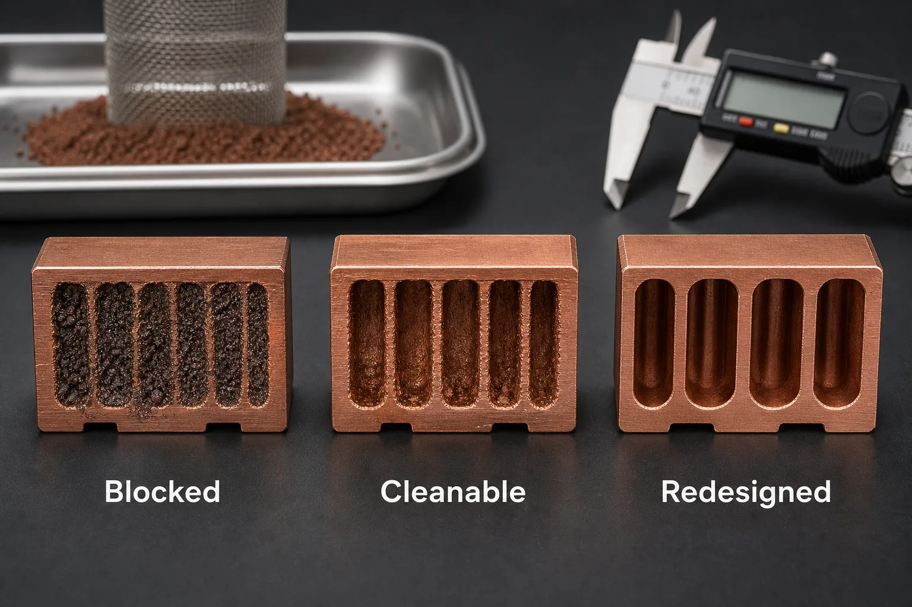
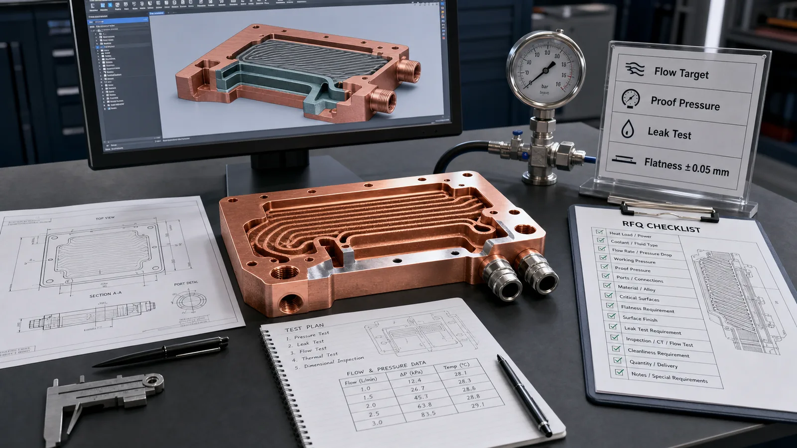

> Copper 3D printing is a strong candidate for microchannel cold plates when heat flux, package height, manifold routing, or leak-path reduction cannot be solved cleanly with CNC machining or brazing. The trade-off is clear: tighter thermal geometry usually adds powder-removal, pressure-drop, machining, inspection, and cleaning cost.

Most microchannel cold plate projects start with the same pressure: the heat source gets smaller, the power density climbs, and the available envelope does not grow with it.

We have seen RFQs where the thermal target looked reasonable in simulation: a compact copper plate, 0.8-1.5 mm channel features, inlet and outlet tucked into a restricted package, and a target pressure drop below 30-80 kPa at the design flow rate. On the CAD screen, the solution looked clean.

The manufacturing review was less forgiving.

Copper additive manufacturing can place channels close to the heat source, merge manifolds into one body, and remove brazed interfaces that would otherwise become leak or thermal-resistance risks. But the printed route is not a shortcut around physics. It moves the project into a different ledger: build orientation, minimum wall thickness, trapped powder, internal roughness, post-machining, leak testing, and flow verification all become part of the quote.

The [Open Compute Project cold plate workstream](https://www.opencompute.org/wiki/Cooling_Environments/Cold_Plate) treats coolant compatibility, interfaces, leakage, qualification, and serviceability as system-level requirements. Copper AM changes how the internal body can be manufactured; it does not remove those cold plate requirements.

If the project is already ready for supplier review, use the [3D printed copper cold plate RFQ page](/copper-cold-plates/) as the commercial entry point, then use this article to refine microchannel geometry, powder removal, pressure drop, leak testing, and acceptance criteria.

## The Process Window: What Actually Controls the Design

For microchannel cold plates, the question is not only "Can copper 3D printing make this shape?"

The better question is:

**Can the printed copper body meet thermal, flow, leak, flatness, and cleanliness requirements after all post-processing is finished?**

That distinction matters because the printed geometry is only the beginning. A useful copper AM cold plate often needs:

- LPBF build review for channel geometry and support strategy.
- Stress relief or heat treatment when required by the alloy and process route.
- CNC machining for sealing faces, mounting datums, ports, threads, and contact surfaces.
- Powder removal and internal flushing.
- Pressure, leak, and flow checks.
- CMM or flatness inspection on critical interfaces.
- Optional CT review for first articles or high-risk internal networks.

A simple cold plate may be cheaper and faster as a machined and brazed assembly. Copper 3D printing earns its place when the internal geometry changes the thermal result or reduces a real assembly risk.

## Why Microchannels Push Teams Toward Additive Manufacturing

Microchannels can increase wetted surface area and move coolant closer to the heat source. In dense electronics cooling, that can reduce temperature gradients across a base and improve local heat extraction.

The value is strongest when conventional manufacturing creates a compromise:

| Constraint | Conventional route pressure | Copper AM opportunity |
| --- | --- | --- |
| Package height | Brazed stack or cover plate may add thickness | Monolithic body can reduce assembly height |
| Port location | Drilled channels prefer straight access | Curved channels and manifolds can route around keep-outs |
| Heat-source density | Machining may limit channel placement | Channels can sit closer to local hot spots |
| Leak risk | Brazed joints add potential leak paths | Fewer joints can reduce leak interfaces |
| Prototype iteration | Tooling or joining process may slow changes | CAD-driven internal changes can be reviewed faster |

This does not mean printed cold plates always win. We have rejected printed routes when the channel network was too fine to clean, when pressure-drop risk exceeded the thermal benefit, or when a brazed plate could meet the requirement at lower cost and lower inspection burden.

That is the honest decision point. Copper AM is strongest when geometry freedom has a measurable job.

## Hard Limits That Should Be Reviewed Before Quotation

Microchannel cold plates fail quietly when the RFQ focuses on the outside envelope and hides the internal channel risk.

A practical first review should check:

- Minimum channel width and height.
- Minimum wall thickness between channels.
- Channel length-to-diameter ratio.
- Bend radius and branch count.
- Inlet and outlet access for powder removal.
- Internal surface roughness tolerance.
- Working pressure and proof pressure.
- Leak acceptance method.
- Contact-face flatness, often in the +/-0.03-0.10 mm range depending on size and interface.
- Surface finish on the heat-transfer interface, often controlled separately from as-printed internal surfaces.

One local uncertainty we always treat seriously: without a defined flow test or CT plan, we cannot guarantee that a visually successful internal channel network is clean enough for service. A blocked branch can pass basic visual inspection and still show up later as a thermal hot spot.

_Figure 2. A printed channel can be dimensionally plausible and still fail the project if powder removal and cleaning are not verified._

### Channel Size Is Not Only a Thermal Variable

Thermal models often reward narrow channels because they increase surface area and local heat transfer. Manufacturing adds a second curve.

As channel size drops, the risk of powder retention, roughness penalty, pressure loss, and inspection ambiguity rises. A design with 0.6 mm passages may look efficient in CFD but become fragile in production. A 1.2-1.8 mm hydraulic diameter may lose some surface area but gain cleaning margin, lower pressure-drop uncertainty, and better repeatability.

That trade-off is project-specific. The right value depends on coolant, flow rate, heat flux, pressure budget, alloy, build orientation, and acceptance method.

Manufacturing cleanliness is only the first gate. If the installed loop can introduce corrosion products, seal debris, hose particles, biological material, or service contamination, use the [microchannel cold plate clogging and filtration guide](/posts/EngineeringGuide/copper-microchannel-cold-plate-clogging-channel-size-filtration-and-cleaning/) to connect the vulnerable passage, filter performance, commissioning flush, hydraulic baseline, and maintenance trigger.

The regret case is familiar: a team optimizes the channel network only for thermal simulation, then discovers that the cold plate needs extra flushing, CT review, and redesign because the printed passages are difficult to depowder. The thermal model was not wrong; it was incomplete.

## Illustrative Design-Review Scenario: Dense Cold Plate for a Power Electronics Module

The following scenario is an engineering example, not a named customer project. Consider a copper cold plate for a compact power electronics module where the objective is to reduce local hot spots inside a limited envelope. The proposed design uses a curved microchannel field under the heat source and a compact internal manifold.

Initial assumptions:

- Heat source footprint: approximately 45 mm x 60 mm.
- Design flow range: 1.5-3.0 L/min.
- Pressure-drop target: below 50 kPa at nominal flow.
- Interface flatness target: +/-0.05 mm after machining.
- Leak requirement: pressure test plus no visible leakage at the specified proof condition.
- Material path: copper AM body with machined sealing and mounting surfaces.

The first printed geometry met the outside dimensions after machining, but flow testing exposed the real issue. Pressure drop was roughly 35% higher than the model predicted. The cause was not one dramatic blockage. It was the accumulation of as-built internal roughness, tight turns, and local powder retention in lower-flow regions.

The fix was not simply "print better."

A manufacturable revision could change the design ledger as follows:

- Increased the tightest channel sections by about 0.3 mm.
- Reduced one branch count in a low-value region.
- Added better access through the port geometry.
- Changed build orientation to improve powder exit.
- Machined the inlet and outlet regions after printing.
- Added a first-article flow check before thermal testing.

This type of revision improves the inspection path and reduces pressure-drop uncertainty, but it has a cost. It may reduce theoretical surface area and add machining and test steps. The resulting cold plate can be more manufacturable even when it is less aggressive than the original CFD geometry.

The lesson is to optimize the accepted component, not only the simulated channel network.

## The Cost Ledger: Where the Quote Actually Changes

Procurement teams sometimes compare printed copper cold plates against machined parts using only unit price. That misses the real cost structure.

For microchannel cold plates, the quote is usually shaped by:

| Cost driver | Why it matters | Typical decision impact |
| --- | --- | --- |
| Channel complexity | More branches and tighter passages increase cleaning and inspection risk | May trigger redesign before quote |
| Copper material route | Pure copper and CuCrZr have different conductivity, strength, and process behavior | Changes thermal and mechanical assumptions |
| Build orientation | Affects supports, distortion, channel quality, and powder exit | Can change both yield and lead time |
| CNC finishing | Sealing faces, ports, threads, and datums usually cannot remain as-printed | Adds setup and inspection cost |
| Leak or pressure test | Fluid parts need acceptance beyond dimensions | Adds fixture and test time |
| CT inspection | Useful for high-risk first articles but not free | Adds cost and interpretation limits |
| Cleanliness requirement | Filtered flush, drying, and packaging may be required | Changes post-processing route |

A hidden cost we often see is fixture work. A pressure or flow fixture can save hours across repeated builds, but the first fixture may add several thousand dollars of tooling or internal setup cost depending on port style, sealing method, and test pressure. For a one-off prototype, that cost hurts. For a qualification batch, it may be the only sensible route.

## When Copper 3D Printing Is the Right Choice

Choose copper additive manufacturing for a microchannel cold plate when at least one of these conditions is true:

- The coolant path must curve around keep-out zones or package constraints.
- The manifold needs to be integrated into the plate instead of assembled.
- Heat flux is localized and channels need to sit close to the source.
- Brazed joints create unacceptable leak, thermal cycling, or reliability concerns.
- Prototype iterations require internal geometry changes that are hard to machine.
- The cold plate also integrates mounting, electrical, sensor, or structural features.

Avoid forcing the printed route when:

- The plate is flat with simple straight channels.
- The port layout is easy to machine.
- The only goal is lower unit cost.
- The internal channels have no powder-removal path.
- The design requires smooth internal surfaces but provides no finishing access.
- Leak testing is required but no pressure or acceptance method is defined.

This is not a rejection of AM. It is process discipline.

## Readiness Check Before Sending the RFQ

Before asking for a price, check whether the RFQ package answers these questions.

- What is the heat source size, location, and heat load?
- What coolant will be used?
- What is the required flow rate or pressure-drop limit?
- What are the working pressure and proof pressure?
- Which surfaces need machining, flatness, or surface-finish control?
- Are inlet and outlet ports fixed, or can they change for cleaning and testing?
- Is CT inspection expected, or are flow and pressure testing enough?
- Is the part a prototype, qualification unit, or repeat production order?
- Is pure copper required, or is CuCrZr acceptable for strength and thread stability?

A weak RFQ says: "Please quote this 3D printed copper cold plate."

A stronger RFQ says: "Please review this copper AM cold plate for a 2.5 L/min water-glycol loop, pressure drop below 60 kPa, proof pressure 1.5x working pressure, machined interface flatness +/-0.05 mm, threaded ports, and first-article flow and leak verification."

The second request gives the supplier enough information to evaluate the part instead of guessing.

_Figure 3. A useful RFQ defines heat load, coolant, flow, pressure, surfaces, inspection, and cleanliness before final quotation._

## Practical Design Guidance

Start with the thermal problem, then build the manufacturing route around it.

For early-stage microchannel cold plates, we usually recommend:

1. Keep the first channel network less aggressive than the CFD optimum.
2. Leave cleaning and inspection access through practical port geometry.
3. Separate machined surfaces from as-printed internal surfaces.
4. Define pressure, leak, and flow acceptance early.
5. Treat CT as a targeted first-article tool, not a universal substitute for flow and leak testing.
6. Compare the printed route against CNC or brazing when the geometry is not clearly AM-driven.

The tool limit is important: CT can help identify internal blockage or trapped powder risk, but it does not automatically prove thermal performance, leak tightness, or cleanliness. Flow and pressure tests still matter because they test the function directly.

## Related Decision Paths

If this is the first cold plate review, use the broader [liquid cooling plate design guide](/posts/EngineeringGuide/how-copper-additive-manufacturing-improves-liquid-cooling-plate-design/) to compare routing, manifolds, and assembly risk before focusing only on microchannels. For larger cores, the [3D printed copper heat exchanger guide](/posts/EngineeringGuide/3d-printed-copper-heat-exchangers-design-benefits-manufacturing-limits/) explains where pressure drop, cleaning, and leakage change the manufacturing route.

For quotation details, pair this page with [powder removal for copper AM internal channels](/posts/EngineeringGuide/copper-am-cleaning-powder-removal-internal-channels/), [CT and leak test criteria for copper cold plates](/posts/EngineeringGuide/ct-scan-leak-test-acceptance-criteria-copper-cold-plates/), and the [3D printed copper cold plate RFQ checklist](/posts/EngineeringGuide/rfq-checklist-custom-3d-printed-copper-cold-plates/). Those pages help turn a thermal concept into a quote-ready package.

## FAQ

Is copper 3D printing always better for microchannel cold plates?

No. It is better when the internal channel geometry, compact manifold, joint reduction, or heat-source layout creates value that CNC machining or brazing cannot match cleanly. If the plate uses simple straight channels and accessible ports, conventional machining or brazing may be lower cost and lower risk.

What is the biggest mistake in a microchannel cold plate RFQ?

The most common mistake is sending only the outside CAD shape without defining flow, pressure, leak, cleaning, and interface requirements. The outside geometry may be printable while the internal channel network remains difficult to clean or verify.

Does copper AM internal roughness hurt thermal performance?

It depends. Roughness can increase surface area and turbulence, but it can also raise pressure drop, trap particles, and reduce repeatability. The RFQ should state whether thermal transfer, pressure drop, cleanliness, or inspection confidence is the controlling requirement.

Should every printed copper cold plate receive CT inspection?

Not always. CT can be valuable for first articles, new channel networks, and high-risk internal geometry. For stable production, flow testing, pressure testing, leak testing, and dimensional inspection may provide better practical control. The inspection plan should match the failure mode.

What files should be sent for quotation?

Send STEP or native CAD, a drawing if available, heat load, coolant, flow target, pressure limits, material preference, critical surfaces, port requirements, quantity, and inspection or cleanliness expectations. If values are still open, state the assumptions.

## Verdict

Copper 3D printing is a strong route for microchannel cold plates when the design needs compact internal geometry, integrated manifolds, reduced joints, or hot-spot cooling that conventional routes cannot provide without compromise.

It is a weak route when the design is simple, the pressure-drop budget is unclear, the channels cannot be cleaned, or the RFQ does not define acceptance.

The practical recommendation is straightforward: use copper AM for the geometry it uniquely enables, then budget for the finishing and verification that make the cold plate usable.

Send CAD, drawings, quantity, thermal requirements, coolant condition, pressure limits, material preference, critical surfaces, and inspection needs to [info@szcomo.com](mailto:info@szcomo.com). A basic review may be possible from geometry and quantity alone, but serious microchannel cold plate quotes need flow, pressure, cleaning, and acceptance context.
