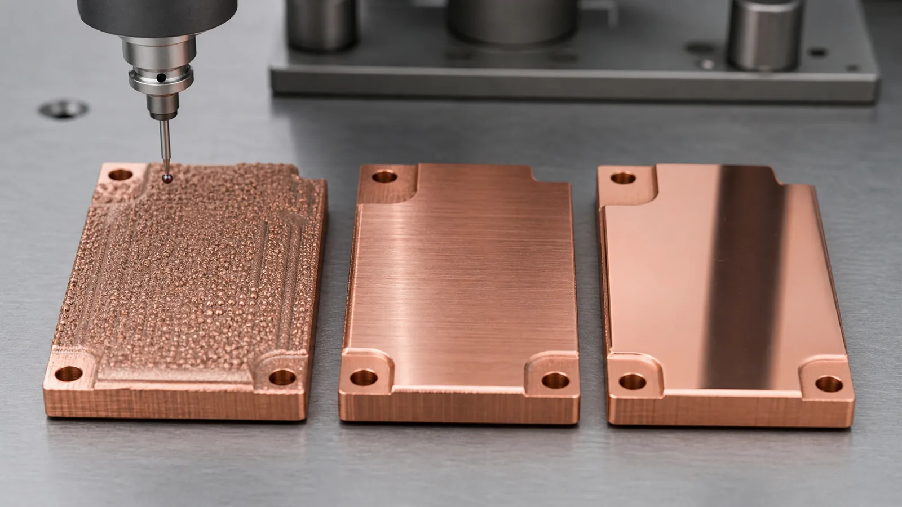
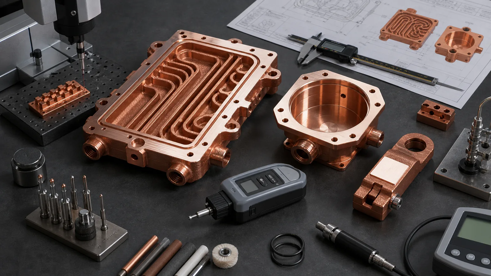

> Copper 3D printing surface finish is not one decision. A useful RFQ separates surfaces that can remain as-built, surfaces that must be CNC machined, and surfaces that need polishing, lapping, plating, or inspection. The right surface plan usually reduces risk more than a blanket "polish all surfaces" note.

_Image note: the cover and surface comparisons are AI-generated concepts. They are not measured roughness samples, before/after production evidence, or customer-part photographs._

The first surface finish mistake is treating a printed copper part like one uniform object.

A copper cold plate may combine internal channels, a thermal contact face, O-ring lands, threaded ports, and noncritical exterior walls. Rough internal surfaces can affect both heat transfer and pressure loss; they are not automatically a performance improvement. Asking every region to meet the same finish can add work without controlling the important interfaces.

The second mistake goes the other direction: assuming copper additive manufacturing creates a finished functional surface everywhere. It does not. The value of copper AM is usually geometry: internal channels, compact manifolds, integrated cooling, RF/vacuum routing, electrical-thermal consolidation, and part-count reduction. The finished surface plan is what turns that geometry into a usable component.

[EOS positions copper additive manufacturing](https://www.eos.info/metal-solutions/metal-materials/copper) around thermal and electrical conductivity applications such as heat exchangers, electronics, coils, power electronics heat sinks, and propulsion hardware. Those applications are surface-sensitive. A part can have strong bulk conductivity and still fail because one contact pad is too rough, one seal land leaks, one RF path has the wrong finish, or one internal passage traps powder.

## Start With Surface Classes, Not A Single Finish Note

The useful question is not "what surface finish does copper 3D printing have?"

The useful question is:

> Which surfaces are functional enough to pay for finishing, and which surfaces can remain as-built after cleaning?

A strong copper AM drawing usually separates surfaces into classes:

| Surface class | Typical examples | Practical finish route |
| --- | --- | --- |
| As-built acceptable | Noncritical exterior walls, hidden mass-reduction pockets, rough internal heat-transfer features | Print, support removal, cleaning, visual check |
| Machined functional | Datums, bolt pads, thermal contact faces, O-ring lands, threaded ports, fitting seats | CNC machining, roughness check, CMM or gauge inspection |
| Polished or lapped | High-voltage electrodes, selected RF surfaces, contact pads, optical-adjacent thermal hardware, low-contact-resistance faces | Machine first, then polish/lap, clean, inspect roughness |
| Plated or coated | Busbar contact pads, solderable pads, RF surfaces, corrosion-sensitive areas | Machine or polish first, mask if needed, plate, verify thickness |
| Functionally accepted internal surfaces | Cooling channels, manifolds, blind passages, porous-risk features | Clean, flow test, pressure test, CT or section coupon where justified |

This is why surface finish belongs in the RFQ, not at the end of the drawing. If the quote includes only a printed blank, the buyer may still need a second process plan for machining, polishing, cleaning, plating, and inspection. For broader quote structure, use the [Engineering Checklist for Copper 3D Printed Part Quotation](/posts/EngineeringGuide/engineering-checklist-copper-3d-printed-part-quotation/) and [How to Prepare CAD Files for Copper Metal 3D Printing](/posts/EngineeringGuide/how-to-prepare-cad-files-for-copper-metal-3d-printing/).

## What As-Built Copper LPBF Surface Finish Really Means

Name the actual surface state instead of relying on "as-built" alone. An untouched LPBF skin, a support-contact area after removal, and a blasted surface have different histories. If a quote uses "as-built after cleaning," identify the cleaning and any material-removing treatment included. None of these labels by itself proves cleanliness or a roughness limit.

As-built copper surfaces are affected by:

- Powder particle size and satellite particles.
- Layer thickness.
- Contour parameters.
- Build orientation.
- Up-skin versus down-skin geometry.
- Overhang angle.
- Heat accumulation.
- Support contact.
- Laser wavelength, power, scan speed, and melt-pool stability.
- Post-build cleaning and blasting if used.

The [copper PBF study of Gaussian and ring-shaped laser beams](https://link.springer.com/article/10.1007/s40516-025-00313-9) investigates how process and surface orientation affect roughness. Its specimen results are not a transferable acceptance band for another platform, alloy state, or channel geometry. Request evidence for the proposed surface and route rather than adopting a published Ra value as a supplier guarantee.

[NIST research on multi-build overhang surface roughness](https://www.nist.gov/publications/surface-roughness-repeatability-analysis-multi-build-overhang-parts-powder-bed-fusion) addresses repeatability in powder bed fusion. It is broader process background, not a COPPER 3DP or copper-specific capability statement. For RFQ work, require the surface orientation, treatment state, and measurement method behind a quoted value.

As-built surfaces can be acceptable when they do not control assembly, sealing, electrical contact, RF loss, or thermal contact resistance. They can also be useful inside selected cooling channels where roughness may increase wetted surface area or local mixing. But that benefit must be balanced against pressure drop, powder removal, cleanliness, and inspection limits. For internal channels, pair this page with [Powder Removal Challenges in Copper 3D Printed Internal Channels](/posts/EngineeringGuide/copper-am-cleaning-powder-removal-internal-channels/).

## Machined Copper Surfaces: The Default For Functional Interfaces

Most serious copper AM parts should be quoted as finished components, not as printed shapes.

CNC machining is usually the baseline finish for:

- Flat thermal contact faces.
- Datum pads.
- Bolt holes and locating holes.
- O-ring lands and gasket surfaces.
- Threaded ports and fitting seats.
- Electrical contact pads.
- RF flanges and mating interfaces.
- Mold cavity-facing features where final tooling quality matters.

Machining changes the surface in three ways. First, it removes the rough LPBF skin and any local support scars. Second, it establishes datum-controlled geometry. Third, it creates a repeatable texture that can be measured and accepted.

Choose a roughness requirement from the interface function and verify that the proposed route can achieve and measure it. This page does not supply a universal machined Ra range. A face can be smooth but warped, or flat but unsuitable for the intended thermal interface material (TIM). Roughness and flatness therefore need separate requirements where both control the interface.

This is where the tolerance page becomes relevant. Surface finish, flatness, and datum strategy should be planned together, not as separate notes. See [Tolerances and Dimensional Accuracy in Copper Metal 3D Printing](/posts/EngineeringGuide/tolerances-and-dimensional-accuracy-in-copper-metal-3d-printing/) before locking a surface requirement.

Machining requires enough stock for the planned cleanup, without compromising the finished channel wall or port geometry. Agree allowance by region after reviewing distortion, thermal processing, fixture access and the finished model. A generic stock range is not evidence that a particular face can be finished safely.

## Polished And Lapped Surfaces: Use Them Where The Physics Pays Back

Polishing is not a universal upgrade. It is a cost and handling decision.

Polishing or lapping may be justified when the surface controls:

- Electrical contact resistance.
- High-voltage field enhancement.
- RF surface behavior.
- Vacuum-facing cleanliness and particle retention.
- Low-leak sealing performance.
- Thermal contact resistance under thin interface materials.
- Optical or laser-adjacent copper heat-transfer hardware.
- Test coupon repeatability.

If conductivity, contact resistance, RF loss, or a sealing test depends on surface preparation, report that preparation with the result. A polished coupon is not evidence that an inaccessible production channel has the same finish or that the finished assembly will meet its functional requirement.

Polished surfaces are usually produced after machining or grinding. Polishing alone should not be expected to correct geometry. If the face is not flat, polishing can make it shiny but still wrong. If an O-ring land is out of position, polishing will not fix gland geometry. If a port is weak, polishing the face does not solve thread load.

For contact or RF parts, polishing may also interact with plating. A silver, nickel, tin, or gold finish on a rough surface is not the same as plating over a machined and prepared surface. If plating is part of the final route, use [Plating and Finishing Copper AM Parts](/posts/EngineeringGuide/plating-and-finishing-copper-am-parts-rfq/) before specifying the stack.

_Figure 2. As-built, machined, and polished copper surfaces serve different jobs. The best RFQ defines which surface state each functional area needs._

## Surface Finish By Application

Different copper AM applications spend surface finish in different places.

| Application | Usually acceptable as-built | Usually machined | Sometimes polished or plated |
| --- | --- | --- | --- |
| Liquid cold plates | Some internal channel surfaces, noncritical exterior walls | Thermal face, ports, O-ring grooves, datum pads | Contact face lapping if TIM stack is sensitive |
| Heat sinks | Noncritical fin sides if airflow test accepts them | Mounting base, datum features, assembly holes | Lapped base for low bondline thermal resistance |
| Heat exchangers | Selected internal flow surfaces after cleaning | Port seats, sealing lands, flange faces | Rare, unless sealing or cleanliness demands it |
| Busbars and conductors | Noncontact surfaces | Contact pads, bolt interfaces, locating features | Plating or polishing for contact resistance, solderability, or corrosion control |
| RF and microwave parts | Noncritical exterior regions | Flanges, datums, fit interfaces | RF-critical conductive paths, cavities, plating surfaces |
| Vacuum and semiconductor hardware | Exterior nonfunctional surfaces after cleaning | Seal faces, ports, datums, clean interfaces | Selected polished or plated vacuum/RF/contact faces |
| Mold inserts | Internal conformal channel surfaces after cleaning | Cavity-side stock, mounting faces, ports | Cavity polishing or coating depending on molded surface needs |
| High-voltage electrodes | Almost none on field-critical geometry | Datum and mounting surfaces | Field-critical surfaces, edges, and contact regions |

For thermal hardware, surface finish is often a contact-resistance problem. A printed copper heat sink can have impressive geometry but still underperform if the mounting face is rough or warped. Use [Thermal Interface Failures in Copper Heat Sinks](/copper-heat-sinks/#review-points) and [Why 3D Printed Copper Heat Sinks Underperform](/posts/EngineeringGuide/3d-printed-copper-heat-sinks-feasibility/) when the interface is part of the risk.

For RF and vacuum hardware, surface finish is often a field, loss, sealing, or cleanliness problem. A waveguide, cavity, flange, or vacuum manifold needs its critical surface path identified before quote. Use [3D Printed Copper RF Waveguide and Vacuum Components](/posts/EngineeringGuide/3d-printed-copper-rf-waveguide-vacuum-components/) and the [Copper AM Vacuum Manifold Design Review](/posts/EngineeringGuide/copper-am-vacuum-manifold-case-study-rf-semiconductor-hardware/) for application-specific context.

For conductors and electrodes, surface finish becomes electrical. Contact pads need flatness, roughness, contact area, plating if required, and assembly load. Field-sensitive electrodes may need smooth transitions, edge control, and polishing. See [Copper Busbars and Induction Coils RFQ Guide](/posts/EngineeringGuide/3d-printed-copper-busbars-induction-coils-rfq/) and [3D Printed Copper High-Voltage Electrodes](/posts/EngineeringGuide/3d-printed-copper-high-voltage-electrodes-feasibility/).

## The Cost Ledger: What Each Surface Route Adds

Surface finish has a visible cost and a hidden cost.

The visible cost is the direct operation: machining time, polishing time, inspection, masking, plating, cleaning, or fixture work.

The hidden cost is sequence control. A copper AM part may need:

1. Print orientation selected to protect critical faces.
2. Support removal without damaging functional surfaces.
3. Stress relief or heat treatment before final machining.
4. Rough machining or datum creation.
5. Internal cleaning and drying.
6. Finish machining.
7. Polishing or lapping where needed.
8. Plating or coating if required.
9. CMM, roughness, leak, pressure, flow, conductivity, or RF checks.
10. Protected packaging to avoid scratches or oxidation on finished faces.

The expensive mistake is not paying for finishing. The expensive mistake is paying for finishing in the wrong place.

For example, polishing the entire exterior of a cold plate may add cost while doing little for performance. Machining the thermal face, port seats, and seal lands may solve the real problem. On the other hand, leaving a high-current contact pad as-built can save machining time but lose value through higher contact resistance, local heating, or inconsistent assembly.

This is also why a polished part is not automatically a better part. It may be over-specified, under-inspected, or polished on faces that do not matter.

## Make a Roughness Requirement Reproducible

A roughness number without a measurement definition can produce non-comparable reports. [ISO 21920-2](https://www.iso.org/standard/72226.html) covers terms and parameters for profile surface texture. It does not choose a copper-part finish for the designer or certify a supplier's process. Specify the applicable drawing/metrology convention and obtain a measurement plan for the actual surface.

| Requirement block | What to agree and record |
| --- | --- |
| Surface identity | Drawing zone, extent, functional purpose and accessible measurement locations |
| Parameter and limit | Named profile or areal parameter, units and acceptance limit; do not treat Ra and Sa as interchangeable |
| Measurement method | Instrument/method, relevant filtering and evaluation settings, and method limitations on the actual surface |
| Direction and coverage | Measurement direction relative to lay, locations and number of traces/areas under the agreed sampling plan |
| Surface state | Before or after machining, polishing, plating, cleaning and any protective treatment |
| Result and decision | Actual results, applicable measurement uncertainty, conformity rule and traceable part/revision identity |

Roughness, waviness, flatness and lay describe different aspects of a surface. Passing one roughness parameter does not by itself prove form, absence of scratches, sealing performance, or the correct direction of machining marks. If those features matter, specify them separately with a suitable verification method. Do not substitute a photograph or finger-feel comparison for a required measurement.

For the wider acceptance record and uncertainty decision, reuse the [copper AM tolerance guide](/posts/EngineeringGuide/tolerances-and-dimensional-accuracy-in-copper-metal-3d-printing/). For coatings, the [plating RFQ guide](/posts/EngineeringGuide/plating-and-finishing-copper-am-parts-rfq/) owns stack thickness, masking and adhesion requirements; avoid hiding those in a generic polishing note.

## Surface-Zone Example: A Cold Plate with Contact Pads

This is an illustrative specification exercise, not a completed customer job. Start with a drawing that says only "polished; leak free." Replace that blanket note with separate surface and function requirements.

| Zone | Define the delivered state | Evidence and unresolved issue |
| --- | --- | --- |
| Thermal base | Machined; lapping only if the interface requires it | Separate flatness and roughness criteria, footprint and restraint condition |
| Seal land and ports | Machined to the selected seal/fitting design | Geometry and texture checks; separately specified leak-test method and limit |
| Electrical contact pads | Local finish or coating matched to assembly needs | Record the final surface state, contact area and required electrical evidence |
| Exterior walls | Defined cleaned LPBF state where function permits | Agreed visual/damage requirements, without unnecessary full-body polish |
| Internal channel | Stated cleaning/finishing route with access limits | Do not claim measured internal Ra if the required locations cannot be reached |

For an inaccessible passage, decide before ordering whether a representative section or coupon is adequate, whether another measurement method is feasible, or whether acceptance should use a different approved combination of geometry, cleanliness and functional evidence. A flow or leak pass cannot establish an unmeasured roughness value. If a mandatory surface requirement cannot be verified, return it for design/acceptance review rather than declaring it satisfied.

After additional polishing or plating, check which geometry and surface records remain valid. Material removal can alter an edge or sealing land; deposition changes the final surface and dimensions. Reinspect the affected requirements in the agreed delivered state and protect accepted faces during handling.

## RFQ Checklist For Copper AM Surface Finish

Before sending a copper 3D printing project for quotation, prepare a surface map. It does not need to be perfect, but it should show which faces matter.

| RFQ item | What to provide |
| --- | --- |
| Surface map | Mark as-built, machined, polished, plated, and no-special-finish areas |
| Function per surface | Thermal contact, sealing, RF path, electrical contact, cosmetic, datum, internal flow |
| Roughness target | Ra or equivalent where it matters, not on every face by default |
| Flatness target | Required for thermal faces, contact pads, seals, and datums where applicable |
| Machining stock | Which faces need stock and whether CAD shows printed blank or finished part |
| Internal channel rule | As-built acceptable, abrasive flow needed, flow test, CT, or section coupon |
| Polishing route | Local polishing, full-body polishing, lapping, edge control, or no polish |
| Plating/coating route | Material, thickness, masking, pre-machining, and post-plating inspection if required |
| Inspection evidence | CMM, roughness report, flatness check, conductivity, leak, pressure, flow, or RF test |
| Handling requirements | Scratch protection, clean packaging, anti-oxidation packaging, no-touch surfaces |

If the surface plan is not ready, send the CAD anyway and say which functions matter. A surface note can be developed during DFM review. A vague "best finish possible" note usually slows the quote.

For process-level design, pair this page with [Copper LPBF Design Rules](/posts/EngineeringGuide/design-rules-copper-laser-powder-bed-fusion-parts/) and [Copper AM Process Selection: LPBF vs CNC and Brazing](/posts/EngineeringGuide/when-copper-3d-printing-is-better-than-cnc-machining/). For cost planning, use [Cost Drivers in Copper 3D Printing Projects](/posts/EngineeringGuide/cost-drivers-in-copper-3d-printing-projects/).

_Figure 3. Surface finish acceptance is a route: decide the surface class, finish the functional areas, and inspect the surfaces that control performance._

## FAQ

What is the typical as-built surface finish of 3D printed copper?

There is no single universal value. Copper LPBF surface roughness depends on the process, geometry, orientation, support contact, treatment and measurement setup. Request route- and surface-specific evidence. A literature specimen or a rendered comparison is not an acceptance value for the quoted part.

Should internal copper cooling channels be polished?

Usually not by default. Internal polishing may be difficult or impossible in long enclosed channels, and roughness can sometimes support mixing. The real question is whether the channel can be depowdered, cleaned, pressure tested, flow tested, and accepted. If pressure drop, cleanliness, or particle release is critical, the channel needs a specific finishing and inspection plan.

Which surfaces should be machined on a copper AM cold plate?

Typical candidates include the thermal contact face, O-ring grooves, sealing lands, threaded ports, datum pads, bolt holes, fitting seats, and any flat interface that controls assembly or leak tightness. Noncritical exterior areas and some internal channels may remain as-built after cleaning.

Is polishing better than machining for copper AM parts?

Polishing and machining solve different problems. Machining creates geometry, datums, flatness, and controlled dimensions. Polishing reduces roughness and improves selected surface behavior after geometry is already correct. A polished but warped surface can still fail.

How should surface finish be shown on an RFQ drawing?

Use a surface map or drawing zones. Mark as-built areas, machined surfaces, polished surfaces, plated areas, internal channels, and inspection points. Include roughness and flatness only where they control function. State the reason for each critical finish: sealing, contact, RF, thermal, vacuum, or assembly.

## Practical Recommendation

Do not buy surface finish by adjective. Buy it by function.

Use as-built copper LPBF surfaces where geometry and cleaning are enough. Use CNC machining where the part needs datums, seal lands, flat thermal faces, threaded ports, or contact pads. Use polishing, lapping, or plating only where the physics pays back: RF surfaces, high-voltage features, low-contact-resistance pads, sensitive thermal interfaces, vacuum service, or defined customer specifications.

A strong RFQ for copper 3D printing surface finish includes CAD, drawing, quantity, material preference, surface map, roughness targets where needed, flatness targets where needed, machining stock, internal-channel cleaning route, and inspection expectations. Send that package to [info@szcomo.com](mailto:info@szcomo.com), or start with the [RFQ guidance page](/rfq/) if the surface plan is still open.
