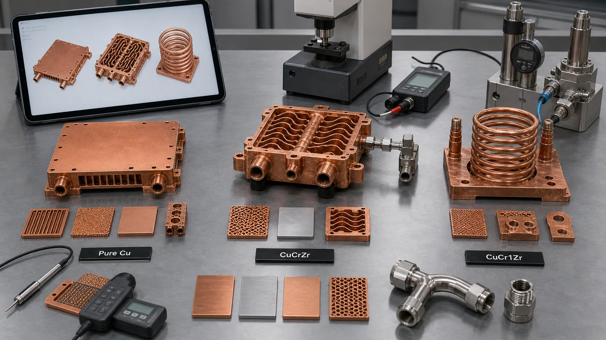
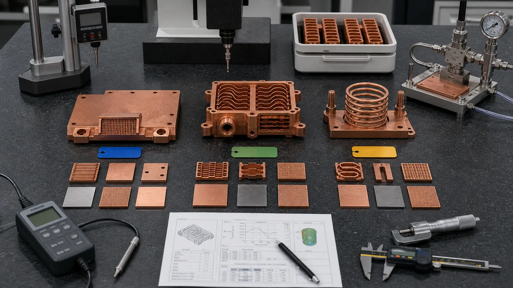

> Copper alloy selection for metal 3D printing should start with the failure mode, not the alloy name. Pure Cu is usually reviewed when maximum conductivity is the main job. CuCrZr and CuCr1Zr become stronger candidates when the copper part must also survive threads, pressure, clamp load, thin walls, heat treatment, repeated assembly, or qualification against a supplier data sheet.

The common RFQ question sounds simple:

"Should this part be pure copper, CuCrZr, or CuCr1Zr?"

The useful answer depends on what would make the part fail. A copper cold plate can fail because the alloy is not conductive enough, but it can also fail because the thermal face moves by 0.08 mm after machining, a threaded port deforms during assembly, a 0.9 mm channel traps powder, or the drawing asks for a material state that the process route never verified.

That is why alloy selection is not a branding exercise. It is an engineering gate.

As of 2026, industrial copper AM material pages from suppliers such as [EOS](https://www.eos.info/metal-solutions/metal-materials/copper), [Eplus3D](https://www.eplus3d.com/products/3d-printing-materials-copper/), and [3D Systems](https://www.3dsystems.com/materials/cucr1zr-a) point toward the same broad application families: heat exchangers, power electronics cooling, electrical conductors, induction coils, high-frequency electronics, tooling, and compact thermal hardware. Those pages are useful because they show where copper AM is commercially relevant. They do not remove the need to match the alloy to geometry, post-processing, and acceptance criteria.

## First Gate: What Property Must Not Fail?

Before comparing pure Cu, CuCrZr, and CuCr1Zr, define the property that cannot be sacrificed.

If the part is a broad heat spreader, simple electrical conductor, or low-load thermal block, the answer may be maximum conductivity. Pure copper deserves first review. If the part is a pressure-loaded cold plate with threaded ports, a cooling manifold with thin walls, or a heat sink with fragile pin structures, mechanical reserve may matter as much as conductivity. CuCrZr or CuCr1Zr deserves review.

If the project is qualification-driven, the alloy name may be controlled by the drawing or customer standard. In that case, "close enough" is not enough. CuCrZr and CuCr1Zr belong to a similar copper-chromium-zirconium family, but the required designation, powder source, heat treatment, and data sheet still matter. A buyer qualifying against a 3D Systems CuCr1Zr(A) route should not accept a generic "CuCrZr-like" answer unless the engineering and quality teams approve the substitution.

Use this opening gate:

| Dominant requirement | First alloy route to review | What can still change the decision |
| --- | --- | --- |
| Maximum thermal or electrical conductivity | Pure Cu | Threads, pressure, thin walls, clamp load, flatness retention |
| Conductivity plus mechanical stability | CuCrZr or CuCr1Zr | Required heat treatment, supplier data, final property target |
| Pressure boundary with internal channels | CuCrZr or CuCr1Zr | Channel size, wall thickness, proof pressure, leak test |
| RF or high-frequency surface | Pure Cu or copper alloy route | Surface finish, plating, dimensional tolerance, conductivity |
| Drawing calls out a qualified alloy | Named alloy and supplier route | Whether substitution is allowed by the customer |
| Early prototype with unknown service load | Open material review | RFQ should state assumptions and decision criteria |

The table is not a universal ranking. It is a way to stop comparing alloys by one number.

## Pure Cu: Use It When Conductivity Is the Main Job

Pure copper is the natural starting point when the component exists mainly to move heat or current.

Good candidates include:

- Heat spreaders with broad contact areas and modest clamp load.
- Electrical contact pads or conductors where bulk conductivity dominates.
- Simple cold plates with wide, cleanable channels and robust walls.
- RF or microwave parts where high conductivity and surface finish are primary.
- Prototype coupons for conductivity, thermal response, or process screening.

The advantage is direct. Copper is valued because it has high thermal and electrical conductivity. For additive manufacturing, that same property creates a process challenge: copper reflects common infrared laser energy and conducts heat away rapidly. EOS notes that copper's high reflectivity and high thermal conductivity historically made copper difficult to print by laser powder bed fusion. A [NIST paper on highly reflective metals in LPBF](https://www.nist.gov/publications/ultra-high-speed-printing-regime-laser-powder-bed-fusion-highly-reflective-metals) also describes copper as challenging because energy coupling can require careful process conditions.

That matters for quotation. A pure copper part should not be quoted as if it were stainless steel with a different color.

Pure Cu becomes risky when the part is also a structure. Threads near channels, sealing lands near thin walls, repeated assembly, and high clamp load can turn a conductivity advantage into a dimensional-control problem. A thermal interface that loses flatness by 0.05-0.10 mm may lose more system performance than the alloy gained through higher bulk conductivity.

The RFQ should therefore separate the material goal from the component goal:

- Do you need maximum bulk conductivity?
- Or do you need a finished component that stays flat, sealed, threaded, and inspectable?

Those are not always the same decision.

For a deeper route-level review of pure copper itself, use [Pure Copper 3D Printing: Applications, Benefits, and Manufacturing Challenges](/posts/EngineeringGuide/pure-copper-3d-printing-applications-benefits-manufacturing-challenges/). That page focuses on when pure copper is the right first choice, why pure copper LPBF needs a qualified process window, and what evidence buyers should ask for before RFQ.

## CuCrZr: Use It When Strength Protects the Thermal Result

CuCrZr is usually reviewed when the part must conduct heat or electricity while also carrying mechanical risk.

Typical candidates include:

- Liquid cold plates with threaded inlet and outlet ports.
- Heat exchanger cores with thin internal walls.
- Cooling blocks that need flatness after clamp load.
- Compact manifolds where channels, seals, and ports share one body.
- Heat sinks or thermal structures that need handling strength after finishing.

CuCrZr is not simply "stronger copper." It is a precipitation-hardenable copper alloy route. The value depends on heat treatment, powder, machine, parameter set, orientation, section thickness, and inspection method. A supplier data sheet may show a useful balance of conductivity and strength after heat treatment, but those values are not transferable promises across every machine and geometry.

That is the hidden cost. If the project chooses CuCrZr because strength and conductivity both matter, then the RFQ should include the material-state controls:

- Heat-treatment route or supplier standard.
- Witness coupons built and processed with the part.
- Conductivity check, hardness check, or tensile coupon if required.
- Dimensional inspection before and after thermal processing if flatness matters.
- Recheck of threads, ports, sealing faces, and datums after finishing.

For broader context on CuCrZr thermal parts, see [CuCrZr 3D Printing for High-Performance Thermal Management Components](/posts/EngineeringGuide/cucrzr-3d-printing-high-performance-thermal-management-components/) and [Pure Copper vs CuCrZr for 3D Printed Heat Transfer Parts](/posts/EngineeringGuide/pure-copper-vs-cucrzr-3d-printed-heat-transfer-parts/).

If the question is no longer a general alloy comparison but a strength-led decision, use [CuCrZr 3D Printing: When Strength Matters More Than Maximum Conductivity](/posts/EngineeringGuide/cucrzr-3d-printing-when-strength-matters-more-than-maximum-conductivity/) to review threads, pressure boundaries, clamp load, thin walls, machining stability, and heat-treated evidence before locking the RFQ route.

## CuCr1Zr: Use It When the Standard or Supplier Route Matters

CuCr1Zr often appears in RFQs where the buyer is working from a material standard, qualified data sheet, or supplier-specific additive route.

The practical difference between CuCrZr and CuCr1Zr is not only chemistry wording. It is also documentation. If the customer specification says CuCr1Zr, the quotation has to respect that designation, the powder route, the heat treatment, and the test method. A qualified aerospace, semiconductor, RF, or electrical program may not allow a casual substitution even if the broad material family looks similar.

3D Systems, for example, publishes a [CuCr1Zr(A) material data sheet](https://www.3dsystems.com/sites/default/files/2023-07/3d-systems-certified-cucr1zra-material-datasheet-usen-2023-07-14-a-web_0.pdf) for additive manufacturing and describes the material as a high-strength copper alloy route with high electrical conductivity after specified processing. In earlier quotation reviews, we have seen buyers treat that kind of data sheet as a qualification anchor. The question was not "Can someone print copper-chromium-zirconium?" The question was "Can the supplier match the required route and documentation?"

CuCr1Zr is therefore a strong candidate when:

- The drawing or customer standard calls out CuCr1Zr.
- Conductivity and strength both matter.
- Heat treatment is part of the required property route.
- The buyer needs material traceability, coupons, and inspection records.
- The part is used in power electronics, induction, high-current, cooling, or qualification-sensitive hardware.

The trade-off is planning. CuCr1Zr should not be requested as a keyword. It should be requested with the required standard, property target, heat treatment, and acceptance test.

For a narrower route focused on CuCr1Zr designation, supplier data sheet, heat-treatment state, accepted equivalents, and substitution control, use [CuCr1Zr Copper Alloy 3D Printing for Industrial Components](/posts/EngineeringGuide/cucr1zr-copper-alloy-3d-printing-industrial-components/).

_Figure 2. Pure Cu, CuCrZr, and CuCr1Zr often overlap in application space. The selection changes when threads, pressure, heat treatment, standards, and inspection records become part of the finished component._

## Compare the Finished Component, Not the Alloy Name

An alloy comparison becomes useful only when it includes manufacturing and validation.

| Selection factor | Pure Cu direction | CuCrZr direction | CuCr1Zr direction |
| --- | --- | --- | --- |
| Main advantage | Maximum conductivity route | Conductivity plus mechanical reserve | Qualified copper-chromium-zirconium route when specification matters |
| Common thermal use | Heat spreaders, low-load cold plates, RF surfaces | Cold plates, cooling blocks, pressure manifolds | Similar high-value cooling/electrical parts under defined data sheet |
| Electrical use | Conductors, contact pads, busbars, RF parts | Conductive parts needing strength | Induction, power electronics, current hardware with qualification need |
| Heat treatment | Usually simpler but stress relief still matters | Central to final property state | Central to final property and documentation route |
| Threaded ports | Risk rises in soft copper if load is high | Better candidate after proper route | Better candidate when standard and route are defined |
| Internal channels | Best when geometry is robust and cleanable | Stronger candidate for thin walls and pressure | Stronger candidate when pressure and documentation both matter |
| Inspection focus | Density, conductivity, flatness, surface finish | Heat treatment, coupons, hardness/conductivity, pressure | Same, with tighter route documentation if specified |
| RFQ risk | Overvaluing bulk conductivity | Assuming data-sheet values without coupons | Treating CuCr1Zr as interchangeable without approval |

This is the comparison procurement needs. A quote for a printed pure copper body is not the same as a quote for a CuCrZr part with heat treatment, machined sealing lands, pressure hold, conductivity coupons, and CMM report.

## The Process Window Still Controls the Decision

Copper alloy selection does not remove the manufacturing limits of copper laser powder bed fusion.

Review these process questions before choosing any alloy:

- Can the chosen machine and parameter set handle the required alloy?
- What is the minimum reliable wall thickness for the geometry?
- Can internal channels be depowdered and verified?
- Is there enough machining stock on critical faces?
- Will heat treatment move the part beyond tolerance?
- Are witness coupons needed to support the material state?
- Does the buyer need CT, leak testing, pressure testing, flow testing, CMM, conductivity, hardness, or roughness reports?

A material decision that ignores these questions is not complete. We have seen promising pure copper heat exchanger concepts become unrealistic because channel access was poor. We have also seen CuCrZr designs fail first review because the heat-treatment route was assumed, but no coupon or property check was specified. The alloy was not the problem. The selection process was incomplete.

For internal fluid parts, use conservative early gates:

- Avoid blind pockets that trap powder.
- Keep enough port access for flushing and drying.
- Define working pressure and proof pressure before pricing.
- Do not place threads too close to thin channel walls without review.
- Separate printable geometry from machined functional surfaces.

For electrical and RF parts, use different gates:

- Define contact resistance or conductivity target if known.
- Mark current-carrying contact faces and machining needs.
- Define plating or finishing requirements early.
- State frequency band and internal surface requirements for RF parts.
- Clarify whether surface finish is functional or cosmetic.

The right alloy depends on the route that can deliver the final part, not only the powder label on the quote.

## Case Pattern: The Alloy Changed After the Acceptance Criteria Arrived

A representative project involved a compact copper cooling and power component for a high-current test fixture. The first model looked like a simple copper part: a flat contact region, two coolant ports, internal channels, and a bolt pattern. The buyer asked whether pure copper would be best because conductivity was the main selling point.

The first review supported pure copper only if the part was a low-load heat spreader. After the drawing arrived, the project changed:

- Current path required machined contact pads.
- Coolant working pressure was 5 bar, with an 8 bar proof-pressure target.
- The internal channels passed near threaded bosses.
- The contact face needed about +/-0.05 mm flatness after finishing.
- The prototype would be assembled and disassembled during test development.

Pure copper still had the best conductivity argument. It no longer had the best finished-component argument.

We reviewed CuCrZr and CuCr1Zr routes. The buyer did not have a formal CuCr1Zr requirement, so CuCrZr remained acceptable. The design added about 0.6 mm machining stock on the contact face, increased local wall thickness near the port bosses, and added coupons for hardness or conductivity review after heat treatment. The final quote included printing, heat treatment, CNC finishing, pressure hold, flow check, and dimensional inspection.

The price of success was visible. The route added inspection time and coupon planning. It also removed an argument that would have appeared later: whether a soft pure copper body had moved under assembly load or whether the channel geometry was leaking. The alloy decision became less glamorous and more useful.

That is usually what good material selection does. It makes the later failure harder to hide.

## RFQ Inputs for Copper Alloy Selection

If you want a supplier to review pure Cu vs CuCrZr vs CuCr1Zr, send more than the alloy names.

Prepare:

- STEP or native CAD with internal channels included.
- 2D drawing showing critical dimensions, datums, tolerances, and functional surfaces.
- Material preference: pure Cu, CuCrZr, CuCr1Zr, or open to review.
- Required material standard or supplier data sheet, if any.
- Required conductivity, hardness, tensile property, or material state.
- Heat-treatment requirement or limitation.
- Heat load, current, voltage, RF frequency, pressure, flow, or service environment.
- Working pressure, proof pressure, leak rate, and test medium for fluid parts.
- Flatness, roughness, and machining requirements for thermal, sealing, RF, or contact faces.
- Quantity, development stage, lead-time target, and inspection level.
- Whether witness coupons, CT, CMM, flow, leak, conductivity, hardness, or cleanliness reports are required.

If the correct material is unknown, state the uncertainty. "Please review pure Cu vs CuCrZr vs CuCr1Zr" is a useful RFQ request when the function and acceptance criteria are included. It is not useful when the CAD file is the only input.

## Validation Should Follow the Alloy Route

The validation plan should be different for each material route.

For pure copper, the review often focuses on conductivity, density, flatness, surface finish, channel cleaning, and handling damage. If the part is a thermal interface, a flatness check after machining may matter more than a small conductivity difference.

For CuCrZr, add heat-treatment and material-state controls. Conductivity or hardness may need to be checked on witness coupons. Dimensional movement after thermal processing should be reviewed if the part has sealing faces, threads, or tight datums.

For CuCr1Zr, add documentation discipline. If the buyer is using a supplier-specific or standard-specific route, the quote should identify the required data sheet, heat treatment, coupon plan, and allowed substitution policy.

_Figure 3. The alloy decision should carry through to validation: conductivity, hardness, heat treatment, pressure, leak testing, flow, flatness, and documentation should match the selected route._

## Fast Decision Guide

Use this guide before sending the RFQ:

| Choose this route | When the project looks like this | Pause if |
| --- | --- | --- |
| Pure Cu | Maximum heat or current transfer is dominant, mechanical load is modest, channels are accessible | Threads, clamp load, pressure, or thin walls control acceptance |
| CuCrZr | Thermal or electrical performance must survive pressure, threads, thin walls, machining, or repeated assembly | No heat-treatment plan, no coupons, or property target is undefined |
| CuCr1Zr | Drawing, standard, or supplier data sheet requires this route; strength and conductivity both matter | The buyer treats it as a generic synonym without quality approval |
| Open material review | Service conditions are known but alloy is not fixed | Only the CAD file is available and function is unknown |

The best early answer is often conditional. "Pure Cu is preferred if the part remains mechanically calm; CuCrZr should be reviewed if the ports and pressure boundary stay as modeled; CuCr1Zr is required only if the customer standard demands that route." That sentence is more useful than pretending one alloy wins every comparison.

## FAQ

Is pure copper always the best material for metal 3D printed copper parts?

No. Pure copper is usually the first review route when maximum thermal or electrical conductivity is the main requirement. It can be the wrong route when the part also needs thread strength, pressure integrity, thin-wall stability, clamp-load resistance, or repeated assembly durability.

Are CuCrZr and CuCr1Zr interchangeable?

Not automatically. They belong to a similar copper-chromium-zirconium family, but drawings, standards, supplier data sheets, heat treatment, and qualification rules may require one specific designation. Treat substitution as an engineering and quality decision, not a naming shortcut.

Does CuCrZr or CuCr1Zr always have lower conductivity than pure copper?

In most practical comparisons, pure copper is selected for the highest conductivity route, while CuCrZr and CuCr1Zr trade some conductivity for mechanical properties after proper processing. The exact finished value depends on powder, machine, heat treatment, section thickness, and test method.

When should a quote include witness coupons?

Use witness coupons when conductivity, hardness, heat-treatment state, tensile properties, or qualification records matter. Coupons are especially useful for CuCrZr and CuCr1Zr parts where the selected route depends on a heat-treated material state.

What is the fastest way to choose between pure Cu, CuCrZr, and CuCr1Zr?

List the top failure mode first. If the failure is insufficient heat or current transfer and the geometry is mechanically calm, review pure Cu. If the failure is pressure leakage, thread damage, flatness drift, or thin-wall distortion, review CuCrZr or CuCr1Zr. If the drawing specifies a material standard, follow that requirement unless substitution is approved.

## Verdict

Copper alloy selection for metal 3D printing should be made at the finished-component level.

Pure Cu is the right first review when conductivity dominates and the part is mechanically forgiving. CuCrZr is the stronger candidate when the thermal or electrical function must survive pressure, threads, clamp load, thin walls, and heat treatment. CuCr1Zr becomes important when the drawing, standard, or supplier-specific qualification route requires that exact material path.

Do not select the alloy by keyword alone. Select it by function, geometry, process window, post-processing, and acceptance criteria. Send CAD, drawings, operating limits, material preference, heat-treatment expectations, critical surfaces, and inspection requirements to [info@szcomo.com](mailto:info@szcomo.com), or use the [RFQ guidance page](/rfq/) to organize the first review.

Related reading: [Pure Copper 3D Printing: Applications, Benefits, and Manufacturing Challenges](/posts/EngineeringGuide/pure-copper-3d-printing-applications-benefits-manufacturing-challenges/), [CuCr1Zr Copper Alloy 3D Printing for Industrial Components](/posts/EngineeringGuide/cucr1zr-copper-alloy-3d-printing-industrial-components/), [Engineering Checklist for Copper 3D Printed Part Quotation](/posts/EngineeringGuide/engineering-checklist-copper-3d-printed-part-quotation/), [Pure Copper vs CuCrZr for 3D Printed Heat Transfer Parts](/posts/EngineeringGuide/pure-copper-vs-cucrzr-3d-printed-heat-transfer-parts/), and [CuCrZr 3D Printing for High-Performance Thermal Management Components](/posts/EngineeringGuide/cucrzr-3d-printing-high-performance-thermal-management-components/).
