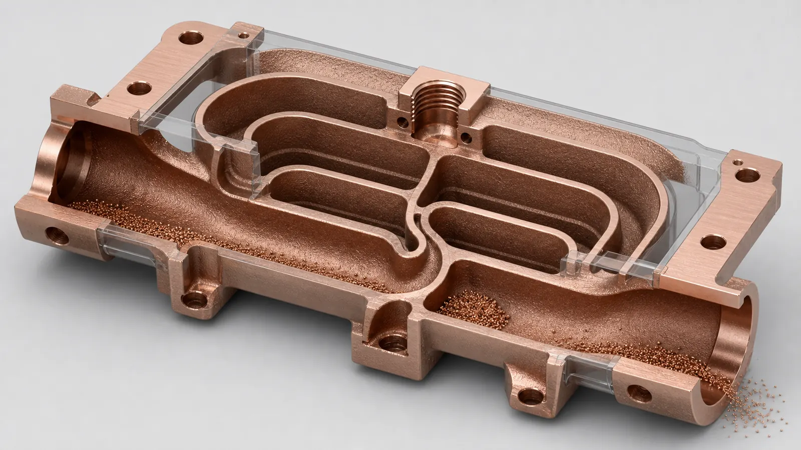
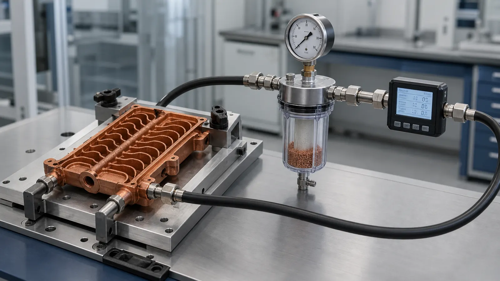

> Powder removal is one of the first reality checks for copper 3D printed internal channels. A channel can be printable, thermally attractive, and still weak for quotation if powder cannot leave the part, if cleaning cannot be verified, or if the acceptance plan only checks the outside geometry.

Internal channels are a major reason engineers review copper additive manufacturing in the first place. A printed copper part can place coolant near a hot surface, combine a manifold with a cold plate, route fluid through a compact conductor, or reduce brazed joints in a heat exchanger. That is the upside.

The cost is just as real. Every hidden passage becomes part of the production route. After laser powder bed fusion, unused copper powder must exit the channel network, partially attached particles must be controlled, cleaning media must not remain trapped, and the finished part needs enough evidence for the service condition.

This is especially important for copper. Industrial material pages from [EOS](https://www.eos.info/metal-solutions/metal-materials/copper) and [Eplus3D](https://www.eplus3d.com/products/3d-printing-materials-copper/) both position copper AM around thermal, electrical, heat exchanger, high-frequency electronic, and tooling applications. Those are exactly the applications where hidden channels often matter. At the same time, copper LPBF is not a casual process. [NIST research on LPBF for highly reflective metals](https://www.nist.gov/publications/ultra-high-speed-printing-regime-laser-powder-bed-fusion-highly-reflective-metals) is a useful reminder that copper's optical and thermal behavior affects process stability before post-processing even starts.

## The Hidden Risk: Printable Does Not Mean Cleanable

The common RFQ mistake is simple: the CAD model shows a copper cold plate, heat exchanger, manifold, or cooled conductor with internal passages, but the drawing only dimensions the outside. The buyer asks whether the part can be printed. The better question is whether the part can be printed, depowdered, cleaned, dried, tested, and accepted.

A short straight gallery with 3 mm access at both ends is a different problem from a 0.8 mm serpentine channel that changes direction 20 times and terminates in small blind pockets. Both may look like "internal channels" in a STEP file. They are not the same manufacturing risk.

In our reviews, the cleanability discussion usually starts when one of these conditions appears:

- The longest channel path is much longer than the port diameter suggests.
- The design has dead-end branches, blind holes, or small local pockets.
- A dense microchannel field is connected to small threaded ports only.
- A lattice or fin field is placed inside a closed cavity.
- The part needs leak, flow, CT, vacuum, cleanliness, or semiconductor-adjacent acceptance.
- The customer expects smooth internal surfaces where no finishing access exists.

None of these conditions automatically makes the part impossible. They make the RFQ less stable until the channel route, port strategy, and evidence plan are visible.

## Powder Removal, Final Cleanliness, And Acceptance Are Different Gates

Powder removal is the first gate. It asks whether loose unused powder can physically leave the channel network after the build. Final cleanliness is the next gate. It asks whether enough residue, loose particulate, moisture, oil, blasting media, or cleaning chemistry has been removed for the actual service. Acceptance is the proof gate. It asks how the buyer and supplier will know the part is good enough.

Treating those as one vague instruction such as "clean thoroughly" usually delays quotation.

| Gate | Practical question | Useful evidence | Common limitation |
| --- | --- | --- | --- |
| Printability | Can the channel be formed without local blockage or unsupported collapse? | Design review, build orientation, representative coupon, first article | It does not prove the channel is clean |
| Depowdering | Can unused powder exit through gravity, vibration, air, fluid, or mechanical access? | Port size review, flushing route, mass check when practical | Small branch networks can hide retained powder |
| Cleaning | Can residue and loose particles be reduced to the needed level? | Filtered flush, drying route, cleaning record, customer cleanliness note | Cleanliness must be defined by service risk |
| Flow function | Does the channel pass fluid at the expected pressure drop? | Flow and pressure-drop check against a baseline | Flow can miss a small retained pocket |
| Pressure or leak | Does the pressure boundary hold? | Pressure test, leak test, helium leak where required | Passing leak does not prove particulate cleanliness |
| Internal geometry | Can hidden passages be reviewed? | CT on first article, sectioned coupon, borescope where accessible | CT resolution, copper density, and cost matter |

For detailed route comparison before locking the process, use [Copper AM Process Selection: LPBF vs CNC and Brazing](/posts/EngineeringGuide/when-copper-3d-printing-is-better-than-cnc-machining/). For drawing and acceptance scope, pair this page with [Engineering Checklist for Copper 3D Printed Part Quotation](/posts/EngineeringGuide/engineering-checklist-copper-3d-printed-part-quotation/) and [How to Prepare CAD Files for Copper Metal 3D Printing](/posts/EngineeringGuide/how-to-prepare-cad-files-for-copper-metal-3d-printing/).

## A Useful Design Review Starts With Channel Geometry

The first cleanability review should not start with a cleaning machine. It should start with the CAD model.

Representative geometry flags include:

| Channel feature | Why it raises powder-removal risk | RFQ action |
| --- | --- | --- |
| Hydraulic diameter below about 1 mm | Powder, roughness, and partially fused particles have less exit margin | Ask whether the thermal gain justifies the cleaning risk |
| Long path-to-diameter ratio | Friction and stagnant zones increase during flushing and drying | State the longest path and expected flow direction |
| Blind pockets | Powder and cleaning media can remain trapped | Remove, vent, or define whether trapped volume is acceptable |
| Sudden expansions or contractions | Local recirculation can collect powder or residue | Smooth the transition or add access |
| Dense internal lattice | Many small surfaces can hold particles | Use only when the lattice function is measurable |
| Down-facing rough surfaces | Roughness can increase pressure drop and particulate retention | Define whether internal roughness affects performance |
| Restricted final ports | Cleaning tools, flushing flow, and inspection access are limited | Consider temporary ports or sacrificial access pads |

These values are not universal rules. A 0.9 mm short channel may be reviewable in one part, while a 1.5 mm long branched network can still be high risk. The right metric is not just minimum diameter. It is the combination of diameter, path length, branch logic, orientation, surface condition, fluid, pressure, inspection, and service consequence.

_Figure 2. The same internal network can contain easy-to-flush galleries and high-risk pockets. The RFQ should show which areas are functional and which can be simplified._

## Case Pattern: A Compact Copper Cooling Plate With Hidden Channels

A representative case starts with a compact copper liquid-cooling plate for high-power electronics. The envelope is tight, the heat source is offset from the port location, and the buyer wants to avoid a brazed cover because leak risk and package height are both sensitive.

The initial design had these features:

- Pure copper or CuCrZr under review.
- Two threaded ports on one side of the body.
- A dense channel field under the heat source.
- Local passages near 0.8-1.0 mm in several turns.
- A machined sealing face with about 0.3-0.5 mm stock planned.
- Working pressure and pressure-drop target still open.
- No statement on CT, filtered flushing, or cleanliness acceptance.

The outside shape was a credible copper AM candidate. The internal route was not quote-ready. The problem was not that the design was "too complex." The problem was that no one could explain how the smallest branches would release powder, how retained particles would be detected, or what evidence would be enough before shipment.

The revised design did not chase maximum channel density. It changed the ledger:

1. The smallest repeated passages were opened to a more reviewable range where the thermal model still had margin.
2. The inlet and outlet galleries were enlarged so flushing flow had a clear route.
3. Dead-end branches were removed unless they had a real thermal function.
4. Temporary access features were placed on surfaces that could later be machined, plugged, or excluded from the final interface.
5. Critical sealing and mounting faces were separated from as-built surfaces and treated as machined features.
6. The first article plan included flow, pressure, filtered flush, drying, and CT review only where the hidden geometry justified it.

The trade-off was visible. The design gave up some theoretical surface area, but gained a more stable powder-removal route, lower inspection uncertainty, and a clearer quote. That is usually a better engineering exchange than keeping every microchannel from the first CFD concept.

For similar thermal hardware, compare this page with [Copper 3D Printing for Microchannel Cold Plates in Thermal Management](/posts/EngineeringGuide/copper-3d-printing-microchannel-cold-plates-thermal-management/), [How Copper Additive Manufacturing Improves Liquid Cooling Plate Design](/posts/EngineeringGuide/how-copper-additive-manufacturing-improves-liquid-cooling-plate-design/), and [3D Printed Copper Heat Exchangers: Design Benefits and Manufacturing Limits](/posts/EngineeringGuide/3d-printed-copper-heat-exchangers-design-benefits-manufacturing-limits/).

## Cleaning Strategy Can Change The Manufacturing Route

Cleanability is not only a post-processing topic. It can change whether the part should be printed at all.

For some designs, copper LPBF is attractive because it reduces joints, avoids deep drilling, and integrates channels into a single pressure boundary. For other designs, the conventional route may remain stronger. A drilled copper block, a CNC-milled plate with a cover, a brazed assembly, EDM features, or a hybrid printed core plus machined interfaces can be a better answer when hidden channels cannot be cleaned or verified.

The route should be reviewed against the finished component, not the printed shape alone:

| Route option | Powder-removal implication | When it may fit |
| --- | --- | --- |
| Full copper AM body | Internal geometry can be complex, but powder removal and inspection become quote drivers | Compact channels, integrated manifolds, low-volume thermal hardware |
| AM core plus machined interfaces | Printed channel value remains, while sealing faces and datums are controlled by machining | Cold plates, cooling blocks, manifolds, semiconductor thermal parts |
| CNC plus cover or plug route | No trapped powder, but more joints, sealing surfaces, or tool-access compromises | Simple plates, larger features, mature production geometry |
| Brazed or welded assembly | No LPBF powder issue, but joint control and cleaning before joining matter | Large cold plates or repeatable thermal assemblies |
| Redesign without hidden channels | Lowest cleaning risk, but may lose thermal density or package benefit | Cost-driven parts where AM value is weak |

[When Copper 3D Printing Is Better Than CNC Machining](/posts/EngineeringGuide/when-copper-3d-printing-is-better-than-cnc-machining/) is the route-gate page for this decision. [Common Design Mistakes in 3D Printed Copper Parts](/posts/EngineeringGuide/common-design-mistakes-in-3d-printed-copper-parts/) is the faster way to catch the traps before sending files.

## Inspection Should Match The Failure Mode

Not every internal channel needs the same inspection stack. A prototype heat sink with a short coolant path may only need flushing, flow confirmation, and a pressure check. A semiconductor cooling block, RF/vacuum manifold, or high-current liquid-cooled conductor may need stricter evidence because loose particles, trapped media, or residue can damage the larger system.

_Figure 3. A useful validation setup connects the internal channel to flushing, filtered capture, flow, pressure, and leak checks instead of relying on outside appearance._

Use this practical matching logic:

| Failure mode | First useful check | When to strengthen it |
| --- | --- | --- |
| Major blockage | Flow check, pressure-drop comparison | Add CT or sectioned coupon if the path is complex |
| Retained loose powder | Filtered flush, repeated flush record, visual filter review | Add CT or mass comparison when retained volume would be costly |
| Leak path | Pressure test or leak test | Use helium leak or stricter methods for vacuum-adjacent service |
| Trapped cleaning media | Drying route, drain/vent review, packaging hold time | Add cleanliness record if the service is particle-sensitive |
| Dimensional drift near ports | CMM, thread gauge, machined datum inspection | Add more stock or fixture review near pressure boundaries |
| Internal roughness penalty | Flow and pressure-drop measurement | Add design change if the pump or thermal model has little margin |

For pressure-boundary planning, use [CT and Leak Test Criteria for Copper Cold Plates](/posts/EngineeringGuide/ct-scan-leak-test-acceptance-criteria-copper-cold-plates/). For tolerance strategy, use [Tolerances and Dimensional Accuracy in Copper Metal 3D Printing](/posts/EngineeringGuide/tolerances-and-dimensional-accuracy-in-copper-metal-3d-printing/).

## Material Choice Does Not Remove The Cleaning Problem

Pure copper, CuCrZr, and CuCr1Zr can all be relevant for internal-channel parts. Material choice affects conductivity, strength, heat treatment, machining behavior, port durability, and final acceptance. It does not make powder removal disappear.

Pure copper is usually considered when maximum conductivity dominates the decision. CuCrZr or CuCr1Zr may be reviewed when threaded ports, pressure boundaries, handling strength, or thermal cycling matter. If heat treatment is part of the route, the process order should be discussed because machining, flatness, sealing lands, and dimensions can be affected after the print.

For material selection, use [Copper Alloy Selection for Metal 3D Printing: Pure Cu vs CuCrZr vs CuCr1Zr](/posts/EngineeringGuide/copper-alloy-selection-metal-3d-printing-pure-cu-cucrzr-cucr1zr/) and [Pure Copper vs CuCrZr for 3D Printed Heat Transfer Parts](/posts/EngineeringGuide/pure-copper-vs-cucrzr-3d-printed-heat-transfer-parts/). If the part has thermal-management intent, [CuCrZr 3D Printing for High-Performance Thermal Management Components](/posts/EngineeringGuide/cucrzr-3d-printing-high-performance-thermal-management-components/) gives more context.

## Application-Specific Powder Removal Questions

The same powder-removal issue appears differently across copper AM applications.

| Application | The cleaning question that matters |
| --- | --- |
| Microchannel cold plate | Can every heat-source branch be flushed without unacceptable pressure drop? |
| Compact heat exchanger | Can both fluid sides be cleaned, dried, and tested separately? |
| Cooling manifold | Are all branch outlets swept during flushing, or can powder remain in a quiet zone? |
| Semiconductor cooling block | Is cleanliness defined as a measurable acceptance requirement, not just a label? |
| RF or vacuum copper part | Are trapped volumes, residue, plating preparation, and leak testing defined? |
| Liquid-cooled busbar or conductor | Does the cleaning route protect contact surfaces, insulation, and cooling passages? |
| Mold cooling insert | Can conformal channels be cleaned before pressure test and tooling assembly? |

This is why internal linking should be intentional. Use this page as the cleanability hub, then move into the application page that matches the part: [Copper cold plate RFQ page](/copper-cold-plates/), [Copper heat sink RFQ page](/copper-heat-sinks/), [Copper AM Parts for Semiconductor Equipment](/posts/EngineeringGuide/copper-am-semiconductor-equipment-rfq/), [3D Printed Copper RF Waveguide and Vacuum Components](/posts/EngineeringGuide/3d-printed-copper-rf-waveguide-vacuum-components/), or [Copper Busbars and Induction Coils RFQ Guide](/posts/EngineeringGuide/3d-printed-copper-busbars-induction-coils-rfq/).

## RFQ Inputs That Make Internal Channels Quotation-Ready

For copper 3D printed internal channels, a good RFQ does not need a long report. It needs the right facts.

Send as much of this as possible:

| RFQ input | Why it matters |
| --- | --- |
| STEP or native CAD with real channels | Lets the supplier review path length, branches, ports, and trapped volume |
| Section views or marked flow path | Reduces ambiguity when the outside drawing hides the inside logic |
| Minimum channel size and longest path | Helps judge powder-removal and pressure-drop risk |
| Final ports and temporary access options | Defines whether flushing, drying, and inspection are practical |
| Working pressure and proof pressure | Drives pressure testing, wall thickness, and port design |
| Flow rate or pressure-drop target | Prevents channel density from being judged only by thermal simulation |
| Coolant or service fluid | Changes corrosion, drying, compatibility, and cleanliness expectations |
| Leak or vacuum requirement | Determines whether standard pressure test is enough |
| Cleanliness expectation | Defines filtered flush, particle control, packaging, or special handling |
| Material preference | Pure copper, CuCrZr, CuCr1Zr, or supplier review |
| Machining and finishing scope | Shows which surfaces are printed, machined, polished, plated, or sealed |
| Inspection expectation | CT, flow, leak, pressure, CMM, borescope, sectioned coupon, or records |
| Quantity and stage | Prototype, first article, pilot lot, repeat production, or repair development |

If the design is early, state which values are estimates. A supplier can often review the concept with assumptions, but the assumptions should be visible. Hidden assumptions are what turn a simple quote request into repeated clarification.

## FAQ

### Can copper AM make very small internal channels?

Sometimes, but small is not the only decision. The RFQ should define minimum passage size, path length, pressure drop, powder removal route, and acceptance evidence. A slightly larger channel that can be cleaned and verified may be better than a denser channel that only looks better in simulation.

### Does pressure testing prove the channel is clean?

No. Pressure testing checks the pressure boundary. It does not prove that loose particles, residue, or trapped cleaning media are absent. For internal copper channels, flow, filtered flushing, drying, CT, or other evidence may be needed depending on service risk.

### Is CT inspection required for every copper internal-channel part?

No. CT can be useful for first articles, high-risk channel networks, and hidden geometry verification, but it adds cost and has resolution limits. Inspection should match the failure mode and the consequence of retained powder or blockage.

### Should I choose pure copper or CuCrZr for a channel part?

Choose based on the finished component, not the material name alone. Pure copper can be attractive when conductivity dominates. CuCrZr or CuCr1Zr may be stronger choices when threaded ports, pressure boundaries, heat treatment, or repeated assembly handling matter. The channel still needs a cleaning and inspection plan either way.

### What is the fastest way to get a useful quote?

Send the CAD, drawing, quantity, material preference, flow path, port details, pressure or leak requirement, cleanliness expectation, and inspection needs. If only the model is ready, send the model with known assumptions and ask for a manufacturability review before final pricing.

## Practical Next Step

Use copper 3D printing for internal channels when the geometry solves a real thermal, fluid, RF, vacuum, electrical, or packaging problem. Do not use it only because the CAD looks sophisticated. The part must still be depowdered, cleaned, machined where required, inspected, and accepted.

Send CAD, drawings, quantity, material preference, channel function, ports, pressure or flow requirements, cleanliness expectations, and inspection needs to [info@szcomo.com](mailto:info@szcomo.com). You can also start from the [RFQ guidance page](/rfq/). A simple geometry may be reviewed quickly. A dense internal-channel part may need focused clarification before final quotation.
