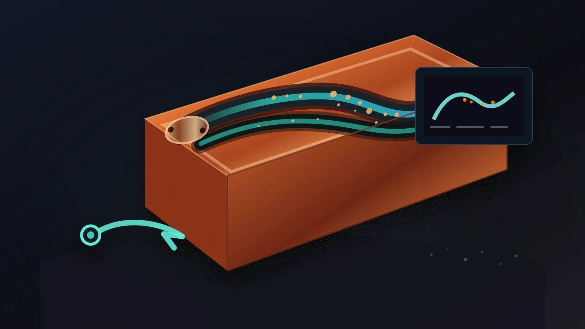

> Copper additive manufacturing can create internal cooling channels, manifolds, RF passages, and compact fluid paths that are difficult to machine. The quote should not stop at whether the part can be printed. For internal channels, the practical question is whether loose powder, residue, and cleaning media can leave the part and whether the finished channel can be verified well enough for the application.

### Internal Channels Make Cleaning Part of the Design

Internal channels are one of the strongest reasons to review [copper 3D printing](/posts/EngineeringGuide/copper-3d-printing-service-rfq-guide/). They can move coolant closer to a heat source, combine manifolds into a single body, reduce brazed joints, and create compact routing for thermal, electrical, RF, or vacuum hardware.

The same geometry also creates the main manufacturing risk: the inside of the part becomes part of the production route.

If the channel cannot be depowdered, flushed, dried, inspected, or accepted, the outside shape may look correct while the part remains weak for service. A strong RFQ describes the channel function, the cleaning route, and the acceptance requirement before asking for final price.

### The Case Pattern: A Dense Copper Cold Plate

A common case starts with a compact [copper cold plate](/copper-cold-plates/) for electronics cooling. The CAD model has several curved channels, a short manifold, threaded inlet and outlet ports, and a machined sealing face. The design looks like a good additive manufacturing candidate because a conventional drilled or brazed route would add joints or force a larger package.

The first review should separate three questions:

- Can the channel be printed without unsupported geometry or local blockage?
- Can loose powder and partially attached particles be removed from every branch?
- Can cleaning and flow be verified before the part is shipped?

If the RFQ only includes a STEP file and quantity, those questions remain assumptions. If the RFQ also includes coolant, pressure, flow target, cleanliness expectation, inspection needs, and any known port constraints, the quote can be reviewed against a practical finishing route.

### Powder Removal Is Not the Same as Final Cleanliness

Powder removal is the first gate. It asks whether unused powder can physically exit the internal channel network after printing.

Final cleanliness is a different gate. It asks whether the finished part is free enough from loose particulate, residue, trapped media, moisture, or process contamination for the intended service.

For a prototype cold plate, the key concern may be flow continuity and pressure test performance. For a semiconductor, RF, or vacuum copper part, cleanliness and trapped volume risk may matter more. For a high-current part with local liquid cooling, both coolant-side residue and contact-side handling may need control.

Do not write a generic note such as "clean thoroughly" and expect a stable quote. State what failure the cleaning step must prevent.

### Channel Features That Increase Risk

Certain geometry choices make cleaning harder even when the part is printable.

| Feature | Why it matters | RFQ note to include |
| --- | --- | --- |
| Long small channels | More friction, more powder retention, harder drying | Channel length, hydraulic diameter, flow direction |
| Blind pockets | Powder and cleaning media may remain trapped | Whether blind features are allowed |
| Dead-end branches | Flow may not sweep the branch during flushing | Branch purpose and acceptance need |
| Sudden section changes | Local powder collection and pressure-drop uncertainty | Minimum section and transition regions |
| Fine lattice or dense fins | Many small surfaces can retain particles | Whether the feature is functional or optional |
| Down-facing rough areas | Roughness can hold particles and raise pressure drop | Critical internal surfaces, if any |
| Restricted ports | Cleaning tools and flushing flow may be limited | Port size, thread, and temporary access options |

This does not mean every risky feature must be removed. It means the feature should earn its place in the design and have a cleaning or inspection plan.

### Design Inputs That Help the Supplier Review Cleanability

For parts with internal channels, the RFQ should include more than the outside drawing.

Useful inputs include:

- STEP or native CAD with internal channels included.
- A section view or drawing note that marks the intended flow path.
- Inlet and outlet size, thread, tube, or fitting requirements.
- Coolant or process fluid.
- Working pressure, proof pressure, and leak requirement if known.
- Flow rate or pressure-drop target if it controls performance.
- Material preference, such as pure copper or CuCrZr.
- Surfaces that will be machined after printing.
- Whether temporary cleaning ports are allowed.
- Whether CT, flow verification, leak test, pressure test, or particulate control is expected.

If the part is early in development, say which values are estimates. A supplier can often review the concept, but the assumptions should be visible.

### Inspection Should Match the Cleaning Risk

Inspection is not one universal step. It should match the failure mode.

| Risk | Useful check | Limit |
| --- | --- | --- |
| Blocked channel | Flow check, pressure drop comparison, CT on first article | Flow may not locate the exact blockage |
| Trapped powder | CT, sectioned sample, flushing record, mass comparison when practical | CT resolution and copper density affect visibility |
| Leak path | Pressure test or helium leak test when required | Leak test does not prove every channel is clean |
| Loose particles | Filtered flush, residue review, customer cleanliness requirement | Needs a defined acceptance level |
| Drying problem | Drying process, packaging requirement, hold time if relevant | Depends on channel geometry and fluid |
| Critical surface | Machining, polishing, visual or dimensional inspection | Hidden surfaces may not be finishable |

Adding CT to every project is not automatically the best answer. A first article or high-risk internal network may justify CT. A stable production part may rely more on flow, leak, pressure, and process controls. The right inspection stack depends on the part and the consequence of failure.

### Cleaning May Change the Manufacturing Route

Cleanability can change how the part should be built.

For example, the review may lead to:

- Larger or better-positioned ports.
- A temporary access hole that is sealed or machined away later.
- A channel diameter increase to improve powder exit and flushing.
- A less aggressive branch network with similar thermal performance.
- A different build orientation to reduce trapped powder.
- A post-machining plan that opens or finishes critical interfaces.
- A route comparison against CNC, brazing, drilling, or assembly.

This is why process selection and cleaning should be reviewed together. A printed copper part may reduce brazed joints, but if the internal channel cannot be cleaned or tested, the conventional route may still be stronger.

Related reading: [Copper AM Process Selection: LPBF vs CNC and Brazing](/posts/EngineeringGuide/copper-am-process-selection-lpbf-cnc-brazing/).

### Application-Specific Cleaning Questions

Different copper AM applications need different cleaning emphasis.

| Application | Cleaning question |
| --- | --- |
| Microchannel heat exchanger | Can every channel be flushed and verified without excessive pressure drop? |
| AI accelerator cold plate | Does the cleaning route protect sealing faces, flatness, and port integrity? |
| Liquid-cooled server hardware | Are coolant compatibility, corrosion, and particulate concerns stated? |
| RF or vacuum copper part | Are trapped volumes, residue, plating, bakeout, or leak requirements defined? |
| Semiconductor equipment part | Are cleanliness, packaging, and inspection records part of acceptance? |
| Cooled busbar or induction coil | Does the cooling path remain clean without damaging contact surfaces? |

The same printed copper geometry can be acceptable in one service and unacceptable in another. The RFQ should make the service condition visible.

### RFQ Mistakes That Delay Quotation

Cleaning-related clarification often starts when the request hides important constraints.

Common delay points include:

- The CAD shows internal channels but the drawing only dimensions the outside.
- Ports are too small or poorly positioned for cleaning and test setup.
- The RFQ asks for leak testing but gives no pressure or acceptance method.
- The part has blind pockets but no statement on whether trapped volume is allowed.
- The customer expects a smooth internal surface where no finishing access exists.
- Cleanliness is described as "medical," "semiconductor," or "vacuum" without a measurable requirement.
- The quote asks for low cost and fast delivery while also requiring CT, leak, flow, cleaning records, and special packaging.

These are not reasons to reject a project. They are reasons the quote may need focused clarification before pricing.

### A Practical RFQ Checklist

For copper AM parts with internal channels, include this short checklist with the drawing when possible:

| RFQ item | What to state |
| --- | --- |
| Function | Cooling, RF, vacuum, electrical, manifold, test fixture, or other use |
| Fluid or service medium | Coolant, gas, vacuum, dielectric, process fluid, or dry service |
| Channel intent | Main path, branch logic, critical channels, optional regions |
| Access | Final ports, temporary ports, blocked faces, machining allowance |
| Pressure and flow | Working pressure, proof pressure, flow, pressure drop, leak target |
| Cleanliness | Particle, residue, drying, packaging, or handling expectation |
| Inspection | CT, flow, pressure, leak, CMM, section sample, or records |
| Quantity and stage | Prototype, first article, qualification, or repeat order |

This level of information does not force a complex quote. It helps separate a basic printable geometry from a part that needs a controlled cleaning and acceptance route.

### Practical Recommendation

Use copper AM internal channels when the geometry solves a real thermal, fluid, electrical, RF, vacuum, or packaging problem. Treat cleaning as part of the design, not as a final shop-floor cleanup step.

Send CAD, drawing, quantity, material preference, channel function, ports, pressure or flow requirements, cleanliness expectations, and inspection needs to [info@szcomo.com](mailto:info@szcomo.com). If only the model is ready, send it with the known risks. We can review whether the part is a good copper AM candidate and whether the internal channels have a practical path for powder removal, cleaning, testing, and quotation.
