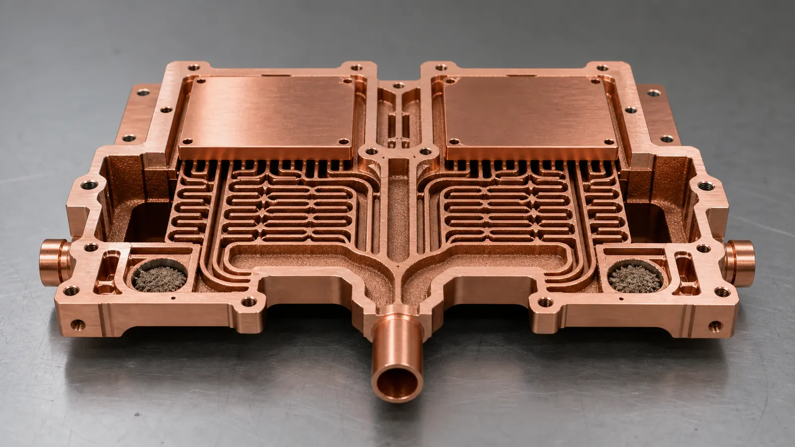
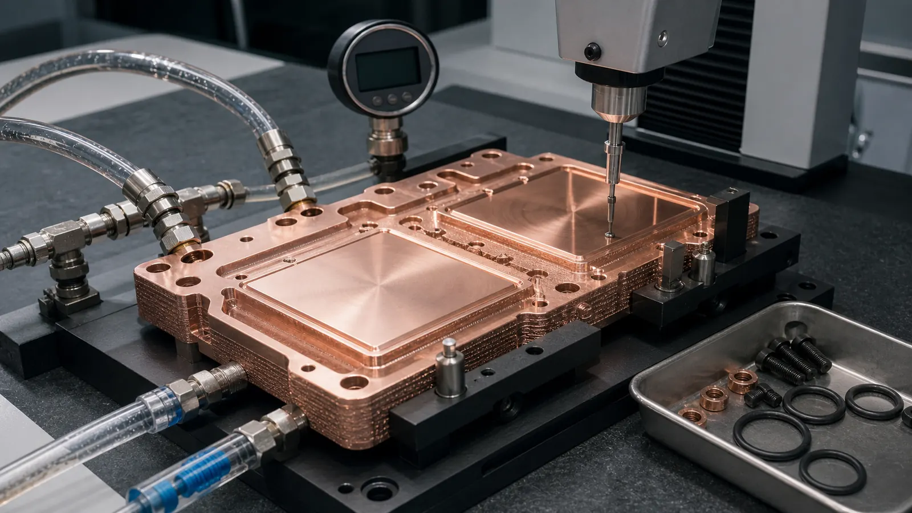

> Copper additive manufacturing becomes worth reviewing for dual-GPU AI accelerator cold plates when heat-source spacing, port routing, contact flatness, pressure drop, or leak-path risk cannot be handled cleanly by a simple machined plate and cover. A quote-ready RFQ should define the module footprint, heat load, coolant, pressure limits, pressure-drop target, machined contact pads, cleaning method, leak test, and acceptance plan before treating the part as a production candidate.

This is a representative engineering case pattern, not a claim about a named customer program. It reflects the type of review that appears when an AI hardware team is trying to cool two high-power accelerator packages on one compact liquid-cooled module.

The timing is not accidental. [NVIDIA describes GB300 NVL72](https://www.nvidia.com/en-us/data-center/gb300-nvl72/?ncid=no-ncid) as a fully liquid-cooled rack-scale architecture with 72 Blackwell Ultra GPUs and 36 Grace CPUs. Its [NVL72 AI Factory reference architecture](https://docs.nvidia.com/enterprise-reference-architectures/nvl72-ai-factory/latest/components.html) describes each compute tray as a liquid-cooled block with 4 GPUs and 2 Grace CPUs. Microsoft has also discussed microfluidic chip cooling as AI chips run hotter, while noting that cold plates are already deployed in datacenters. The signal for copper AM is clear: dense AI modules are making liquid-cooling hardware more constrained, more specified, and less tolerant of vague RFQs.

That does not mean every AI accelerator cold plate should be printed. The useful question is narrower:

**Does copper AM remove enough routing, sealing, flow-distribution, or package-height risk to justify print cost, machining, cleaning, and validation?**

For broader context, use [3D Printed Copper Cold Plates for AI Accelerators](/posts/EngineeringGuide/3d-printed-copper-cold-plates-ai-accelerators/), [Liquid-Cooled Server Copper Hardware RFQ Guide](/posts/EngineeringGuide/liquid-cooled-server-copper-hardware-rfq/), and [Copper 3D Printed Cooling Manifold Case Study for Liquid-Cooled AI Servers](/posts/EngineeringGuide/copper-3d-printed-cooling-manifold-case-study-liquid-cooled-ai-servers/). This article narrows the problem to one cold plate serving two accelerator packages on one compact module.

_A dual-GPU cold plate case starts with two heat-source zones, contact flatness, port location, seal lands, and validation scope, not only the external envelope._

## The Starting Requirement

The first concept was a low-profile copper cold plate under two accelerator packages. The buyer wanted one shared liquid-cooled body instead of two separate cold plates, because the module had limited Z-height and tight routing around board connectors, stiffeners, busbars, and service access.

From the outside, the part looked manageable: two rectangular contact zones, two fluid ports, a perimeter bolt pattern, and an O-ring seal. Inside the plate, the problem was harder. Each accelerator package had a different keep-out area around mounting screws and signal connectors. The coolant needed to reach both contact zones without creating a tall fitting stack or a brazed cover seam near the pressure boundary.

The early RFQ package included a STEP file and an approximate envelope, but it did not define enough operating data. Missing items included:

- Heat load per package and whether the two packages had equal power.
- Maximum allowed pressure drop across the cold plate.
- Coolant type and operating temperature range.
- Working pressure, proof pressure, and leak-test method.
- Flatness target for each GPU contact pad after machining.
- Surface roughness target for the thermal interface.
- Whether branch flow balance needed to be verified or only estimated.
- Cleaning and internal channel acceptance method.

A cold plate with two heat zones is not just "a plate with channels." It is a thermal interface, a pressure boundary, a flow distributor, a machined component, and an inspection item. If those requirements are missing, the supplier has to quote risk instead of geometry.

## Why Conventional Routes Became Awkward

The initial manufacturing routes were conventional: CNC machine open channels and seal them with a cover, gun-drill intersecting passages, or braze a multi-piece assembly. Each route had a reasonable argument, but none solved the package cleanly.

| Route reviewed | Why it was attractive | Why it became risky |
| --- | --- | --- |
| CNC plate plus cover | Familiar, easy to inspect open channels before closure | Cover seam near pressure boundary, gasket or brazing risk, added stack height |
| Gun-drilled copper block | Strong monolithic outside body | Straight passages did not match the two heat zones, extra plugs increased leak paths |
| Two separate cold plates | Easier to design each heat zone independently | More fittings, more assembly height, more hoses, harder service routing |
| Copper AM near-net body | Integrated internal channels and port routing | Higher print cost, powder removal, machining stock, leak and flow validation |

The additive route was not selected because it looked advanced. It was reviewed because it gave the design team control over internal flow paths that were difficult to drill, while keeping the outside envelope compact.

The same route gate appears in [When Copper 3D Printing Is Better Than CNC Machining](/posts/EngineeringGuide/when-copper-3d-printing-is-better-than-cnc-machining/) and [Copper AM Process Selection: LPBF vs CNC and Brazing](/posts/EngineeringGuide/copper-am-process-selection-lpbf-cnc-brazing/). If CNC, brazing, or a two-piece plate solves the requirement with lower risk, copper AM may not be the right route.

## The Design Decision That Changed The Case

The useful design shift was to stop chasing maximum channel density everywhere. The revised concept separated the cold plate into three functional zones:

| Zone | Design objective | Main quote risk |
| --- | --- | --- |
| Contact zones | Keep the thermal path short under each accelerator package | Flatness, roughness, distortion after machining |
| Flow-distribution zone | Split and merge coolant without starving one heat zone | Pressure drop, branch balance, trapped powder |
| Interface zone | Seal ports, hold bolts, define datums, survive handling | Thread strength, O-ring grooves, machining stock, leak paths |

That zoning made the part easier to quote. The internal channels only became dense under the two heat-source footprints. Larger galleries handled inlet and outlet distribution. The contact pads were treated as post-machined features rather than as-built print surfaces.

This is an important distinction for Google searchers and buyers alike: copper AM does not replace machining on a serious cold plate. It moves the complex geometry into the printed body, then uses machining where the finished interface must be controlled.

_The revised route used internal channels where heat transfer and package constraints justified them, while preserving larger galleries, cleaning access, and machined contact pads._

## Split Flow Is A Specification, Not A Hope

The hardest technical question was not whether coolant could reach both zones. It was whether the two zones would receive useful flow under realistic pressure drop.

In a dual-GPU cold plate, flow imbalance can happen for simple reasons:

- One branch is shorter or has fewer turns.
- One heat zone has a denser channel field than the other.
- The inlet plenum feeds the nearest zone first.
- Port position is chosen by module packaging, not by ideal fluid routing.
- Downstream hose or manifold resistance is not equal.

The revised RFQ did not pretend that every branch would be perfect. It asked the supplier to review a total flow target, a pressure-drop target, and whether branch balance needed prototype testing. That changed the conversation from "make this channel pattern" to "review this flow function."

The [Open Compute Project ACS cold plate requirements document](https://www.opencompute.org/documents/ocp-acs-liquid-cooling-cold-plate-requirements-pdf) is useful background because it treats cold plates as specified liquid-cooling components, not decorative metal parts. For custom copper AM, the project drawing still has to define the actual application acceptance criteria.

## Material Route: Pure Copper Or CuCrZr

The buyer initially asked for pure copper. That made sense because maximum thermal conductivity is attractive for a cold plate. But the finished component had other risks: thin pressure boundaries near channels, threaded ports, bolted interfaces, heat treatment, and machining stability.

Pure copper remained a valid route if the supplier could process the geometry and the pressure boundary had enough margin. CuCrZr became a practical option when the design team wanted stronger port bosses, better thread robustness, or more stable machining after thermal processing. The material decision was not only a conductivity decision; it was a finished-part reliability decision.

A better RFQ sentence was:

> Preferred material: pure copper if feasible. CuCrZr or CuCr1Zr acceptable if needed for pressure boundary, port strength, machining stability, heat treatment, or supplier process route.

That wording helps the supplier choose a lower-risk copper AM route without losing the thermal-management purpose of the part. For deeper material comparison, pair this case with [Pure Copper vs CuCrZr for 3D Printed Heat Transfer Parts](/posts/EngineeringGuide/pure-copper-vs-cucrzr-3d-printed-heat-transfer-parts/), [CuCrZr 3D Printing for High-Performance Thermal Management Components](/posts/EngineeringGuide/cucrzr-3d-printing-high-performance-thermal-management-components/), and [Copper Alloy Selection for Metal 3D Printing: Pure Cu vs CuCrZr vs CuCr1Zr](/posts/EngineeringGuide/copper-alloy-selection-metal-3d-printing-pure-cu-cucrzr-cucr1zr/).

## Flatness Became A Gate

The cold plate could have a clever internal channel network and still fail if the two contact pads were not flat enough after finishing. Thermal interface resistance can dominate the result when a high-power package is clamped to a plate with uneven contact.

The drawing therefore separated:

- As-built outer surfaces that did not affect assembly.
- Machined GPU contact pads.
- Machined seal lands and O-ring grooves.
- Port threads and fitting interfaces.
- Datums for CMM inspection.

This prevented a common quotation mistake: asking the print process to deliver finished thermal-interface quality everywhere. The realistic route was to print near-net geometry, then machine the critical surfaces after stress relief or heat treatment as required by the selected process.

For dimensional planning, use [Tolerances and Dimensional Accuracy in Copper Metal 3D Printing](/posts/EngineeringGuide/tolerances-and-dimensional-accuracy-in-copper-metal-3d-printing/). For interface risk, [Thermal Interface Failures in Copper Heat Sinks](/copper-heat-sinks/#review-points) is also relevant even though the part here is liquid cooled.

## Powder Removal Was Designed In

Copper AM can create internal flow paths that are difficult or impossible to machine. That benefit creates a second obligation: the powder and residue must be removable.

The first internal channel concept had several narrow turns and small dead-end volumes near the port transitions. Those features looked compact, but they increased cleaning risk. The revised geometry used larger manifolds at the inlet and outlet, avoided blind branches where possible, and gave the supplier a practical path for flushing and drying.

The RFQ also separated two inspection questions:

- Can the internal channels be cleaned well enough for the intended coolant system?
- Can the finished part pass pressure, leak, and flow checks after machining?

Those are not the same question. A part can pass a pressure test while still carrying trapped powder that later damages a pump, valve, connector, or cold plate. For this reason, [Copper AM Cleaning and Powder Removal for Internal Channels](/posts/EngineeringGuide/copper-am-cleaning-powder-removal-internal-channels/) should be treated as a design input, not an afterthought.

## First Article Validation Plan

The first article was planned as a learning build, not a production release. That changed the acceptance package. The team needed to learn whether the geometry, machining, cleaning, pressure boundary, and flow function were workable before scaling the design.

_A useful first article plan verifies machined contact pads, pressure boundary, leak behavior, cleaning, and flow function before treating the cold plate as production-ready._

The validation plan used this structure:

| Validation item | RFQ detail to define |
| --- | --- |
| Dimensional inspection | Datums, port locations, contact pad position, O-ring groove dimensions, thread checks |
| Contact surface | Flatness target, roughness target, machining stock, inspection method |
| Pressure test | Working pressure, proof pressure, hold time, medium, temperature if relevant |
| Leak test | Method, threshold, fixture state, test side, timing after machining |
| Flow test | Coolant, total flow, allowed pressure drop, branch-balance requirement |
| Cleaning | Flush method, drying method, particle expectation, CT or borescope need |
| Material evidence | Material route, heat treatment if used, coupon data if required |

Not every prototype needs a full qualification package. But if the buyer wants a cold plate for a real AI accelerator module, the RFQ should not stop at visual appearance. Pressure, leak, flow, and interface checks are part of the product definition.

For test planning, use [CT and Leak Test Criteria for Copper Cold Plates](/posts/EngineeringGuide/ct-scan-leak-test-acceptance-criteria-copper-cold-plates/) and [Thermal Performance Test Methods for Copper Heat Sinks](/copper-heat-sinks/#review-points). The second article is about heat sinks, but its fixture and interface logic still applies to thermal hardware.

## What Changed After Review

The revised design was more conservative than the first CAD concept. That was a good outcome.

The main changes were:

- Channel density was focused under the two heat zones instead of spread across the entire plate.
- The inlet and outlet galleries were enlarged to reduce avoidable pressure loss and cleaning risk.
- The two contact pads received defined machining stock.
- Port bosses gained more local material before thread machining.
- O-ring grooves and seal lands became finished features.
- Branch balance became a test or review item, not an assumption.
- Material selection stayed flexible between pure copper and CuCrZr until pressure and machining risks were reviewed.

The cost also became clearer. The printed body reduced routing compromises and potential leak-path count, but it did not eliminate CNC finishing, cleaning, pressure testing, leak testing, or flow validation. A good copper AM quote should show those realities rather than hiding them behind a simple part price.

For pricing logic, see [Cost Drivers in Copper 3D Printing Projects](/posts/EngineeringGuide/cost-drivers-in-copper-3d-printing-projects/).

## When This Case Pattern Is A Good Fit

A copper AM cold plate is worth reviewing for dual-GPU AI accelerator modules when:

- Two heat sources must be cooled inside one compact body.
- Port location is constrained by the board, tray, cables, or service access.
- A cover plate, brazed joint, or plug path creates unacceptable leak risk.
- Internal flow paths need to split and merge around keep-out zones.
- Contact pads require post-machined flatness and defined datums.
- Prototype or low-volume value is higher than simple machined-plate cost.
- The buyer can define coolant, pressure, flow, flatness, and inspection requirements.

It is usually weaker when:

- The part is a simple flat plate with open channels and an easy cover.
- Two separate cold plates fit without creating assembly height or hose-routing problems.
- The RFQ cannot define heat load, coolant, pressure, or flow target.
- The internal channels are too small or too long to clean confidently.
- The main goal is only lower cost than commodity CNC machining.

The boundary matters. Copper AM is strongest when geometry solves a real packaging, fluid, thermal, or assembly problem. It is not a general shortcut for cheaper copper plates.

## RFQ Checklist For A Dual-GPU AI Cold Plate

Send the following information when requesting a quotation:

- STEP file and native CAD if available.
- 2D drawing with datums, critical dimensions, and revision control.
- Module footprint for both accelerator packages.
- Heat load per package and whether the two zones are equal.
- Maximum cold plate envelope, keep-out zones, board clearance, and port access.
- Coolant type, total flow target, allowed pressure drop, and branch-balance expectation.
- Working pressure, proof pressure, leak method, and hold time.
- Material preference: pure copper, CuCrZr, CuCr1Zr, or supplier recommendation.
- Contact pad flatness, surface roughness, machining stock, and datum scheme.
- O-ring grooves, thread specs, fitting standards, and seal-land requirements.
- Cleaning, CT, leak, pressure, flow, and dimensional inspection requirements.
- Quantity, target lead time, and whether the build is concept, validation, or pilot production.

If the package is not ready, use [Engineering Checklist for Copper 3D Printed Part Quotation](/posts/EngineeringGuide/engineering-checklist-copper-3d-printed-part-quotation/), [How to Prepare CAD Files for Copper Metal 3D Printing](/posts/EngineeringGuide/how-to-prepare-cad-files-for-copper-metal-3d-printing/), and the fixed [RFQ page](/rfq/) before sending files.

## FAQ

### Is a dual-GPU cold plate different from a normal copper cold plate?

Yes. The two heat zones can create flow-balance, flatness, port-routing, and assembly risks that are less visible in a single-zone cold plate. The quote should define both thermal zones, not only the outside plate size.

### Should the part use pure copper or CuCrZr?

Pure copper is attractive when maximum conductivity is the main driver and the geometry is forgiving. CuCrZr is often reviewed when pressure boundary, threaded ports, machining stability, or mechanical robustness matter more than the last increment of conductivity.

### Can copper AM guarantee lower pressure drop?

No. Additive manufacturing gives more routing freedom, but pressure drop depends on channel size, length, turns, surface condition, coolant, and downstream restrictions. The RFQ should define a target so the channel route can be reviewed.

### Does the contact surface come directly from the print?

For serious cold plates, usually no. The GPU contact pads, seal lands, O-ring grooves, and threads should normally be treated as post-machined features with inspection requirements.

### What information speeds up quotation most?

Heat load per package, coolant, flow target, pressure-drop target, working pressure, proof pressure, leak method, contact flatness, material flexibility, and inspection scope. A STEP file alone is not enough for a pressure-boundary cold plate.

### Can COPPER 3DP review a confidential AI accelerator cold plate?

Yes. Send CAD, drawings, quantity, material preference, lead time, and critical requirements to [info@szcomo.com](mailto:info@szcomo.com). If the first package is incomplete, the review may begin with focused clarification before quotation.
