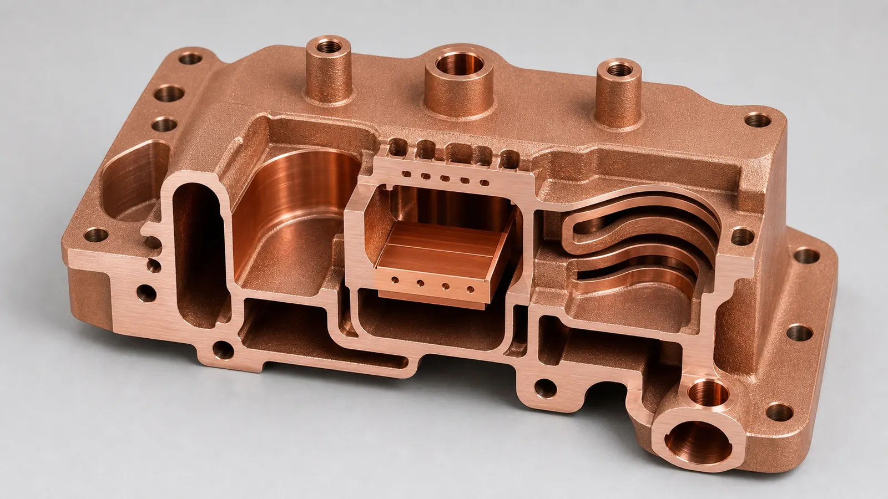
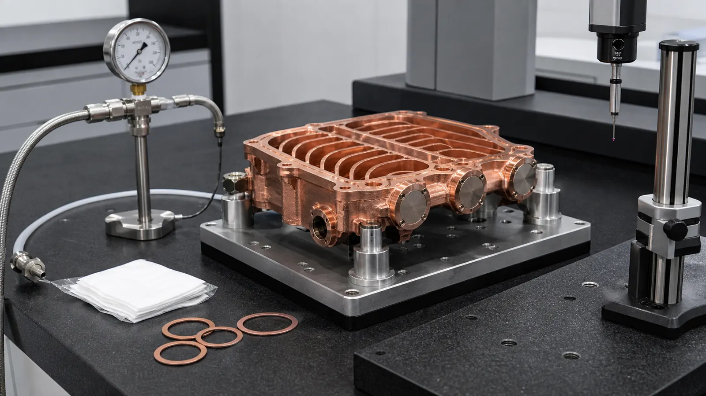

> A copper AM vacuum manifold is worth reviewing when the part is not only a block with ports. In RF and semiconductor equipment, the quote depends on sealing lands, RF-facing surfaces, internal cooling, powder removal, leak testing, cleanliness, and post-processing. The additive value is strongest when those requirements can be separated into a realistic manufacturing and acceptance route.

## Why This Case Direction Matters Now

Semiconductor equipment investment is still tied to long-term AI, advanced packaging, memory, and regional fab expansion. [SEMI's April 2026 300 mm fab outlook](https://www.semi.org/en/semi-press-release/semi-projects-double-digit-growth-in-global-300mm-fab-equipment-spending-for-2026-and-2027) projects strong equipment spending growth in 2026 and 2027. That does not automatically mean every copper part should be printed. It does mean more engineering teams are reviewing compact thermal, RF, vacuum, and current-carrying hardware under tighter package and validation constraints.

Copper additive manufacturing fits that search intent when the value comes from geometry and function, not from a broad promise that copper AM can replace machining. Industrial material pages from [EOS](https://www.eos.info/metal-solutions/metal-materials/copper) and [Eplus3D](https://www.eplus3d.com/products/3d-printing-materials-copper/) position copper materials around conductivity-driven uses such as heat exchangers, electronics, induction coils, high-frequency electronics, and tooling. The same pages also make the material route visible: pure copper and CuCrZr are different decisions.

This representative case focuses on a vacuum manifold for RF and semiconductor hardware because it sits between several high-value search themes:

- Copper AM for RF and microwave parts.
- Copper AM for semiconductor equipment.
- Vacuum-compatible copper manifolds.
- Integrated cooling channels around RF or chamber-facing hardware.
- Leak testing, cleaning, plating, and sealing-face acceptance.

It also avoids repeating the existing cold plate case studies. The part still uses copper's thermal and electrical value, but the buyer decision is controlled by sealing, RF surface condition, trapped-volume risk, and quote evidence.

## Starting Requirement

The representative RFQ started as a compact copper manifold for an RF and vacuum subassembly used near semiconductor process equipment. The customer did not need a generic copper block. The target part had to combine several functions in a small envelope:

| Requirement | RFQ impact |
| --- | --- |
| Vacuum-facing manifold path | Drives sealing faces, trapped-volume review, and leak testing |
| RF-facing cavity or waveguide-like transition | Drives conductive surface condition, geometry control, and possible plating |
| Local cooling around the active zone | Drives internal channel size, powder removal, and pressure or flow tests |
| Limited port locations | Drives three-dimensional routing and may favor AM over drilled blocks |
| Several gasket or flange interfaces | Drives CNC machining stock, flatness, and CMM datums |
| Semiconductor handling expectations | Drives cleaning, drying, packaging, and documentation scope |

The early envelope was roughly palm-sized, with a main cavity, two vacuum ports, a rectangular RF interface, and a compact cooling jacket around the hotter region. Some faces needed machined sealing lands. Some internal surfaces were RF-facing. Other exterior surfaces could remain as-printed after cleaning.

That separation was the first useful design move. Without it, the quote would have treated the entire part as one impossible surface-finish problem.

## Why Conventional Manufacturing Was Awkward

The first conventional route used a split-body concept: CNC machine two copper halves, cut internal cavities from open faces, add covers or brazed plates, then machine final sealing surfaces. That route was familiar, but it created four concerns.

First, the split line crossed a pressure or vacuum-relevant region. Even with good joining, the joint added leak-test and cleaning uncertainty.

Second, the RF-related internal geometry was constrained by tool access. The most direct machined route forced a less compact transition and added alignment features that did not help RF or vacuum function.

Third, the cooling path had to avoid the RF cavity, bolt pattern, and sealing faces. Drilled channels and plugs solved the routing on paper, but they added extra interfaces and made flushing less direct.

Fourth, the part count increased. Every cover, plug, fitting adapter, and brazed interface created another tolerance stack or acceptance step.

This did not mean the CNC route was wrong. It meant the project deserved a process comparison. For the same screening logic, see [When Copper 3D Printing Is Better Than CNC Machining](/posts/EngineeringGuide/when-copper-3d-printing-is-better-than-cnc-machining/).

## Why Copper AM Was Reviewed

Copper AM was reviewed because the value sat inside the part:

- The vacuum path could be consolidated into one body.
- The RF transition could be shaped without splitting the body along the most sensitive interface.
- Cooling could wrap around a local heat zone instead of following straight drilled holes.
- Ports could exit where the assembly allowed, not only where a cutter could reach.
- Machining could be reserved for sealing lands, datums, bolt faces, and selected RF interfaces.

The important word is "reviewed." Copper LPBF has real process constraints. Copper is reflective and conducts heat quickly, which makes stable energy coupling and repeatability more demanding than many common alloys. A recent [NIST publication on LPBF of highly reflective metals](https://www.nist.gov/publications/ultra-high-speed-printing-regime-laser-powder-bed-fusion-highly-reflective-metals) discusses this energy-coupling challenge for reflective metals such as copper and aluminum. For RFQ work, the practical lesson is simple: a supplier must quote a route, not only a shape.

For copper RF and vacuum hardware, route review should include:

- Pure copper, CuCrZr, or another copper alloy.
- Build orientation and support contact strategy.
- Machining allowance for sealing and datum surfaces.
- Cleaning access for internal cavities and cooling passages.
- Surface finishing or plating where RF or vacuum service requires it.
- Leak, pressure, dimensional, and cleanliness acceptance.

## The Design Was Split Into Functional Zones

The useful redesign did not begin by making every wall thinner or every channel smaller. It began by dividing the part into functional zones.

| Zone | What mattered most | How the RFQ handled it |
| --- | --- | --- |
| Vacuum path | Leak integrity and trapped volumes | Avoid blind pockets, define leak test expectation, add cleanable paths |
| RF-facing geometry | Surface condition and dimensional repeatability | Mark critical surfaces, machining or plating review, datum strategy |
| Cooling jacket | Flow, pressure, and cleanability | Keep channels large enough to depowder and flush |
| Sealing lands | Flatness, roughness, bolt pattern, gasket behavior | Add machining stock and inspect after finishing |
| Port bosses | Thread strength, seal engagement, access | Thicken bosses and define post-machining |
| Non-critical exterior | Shape and handling only | Allow as-printed texture after cleaning |

This is the difference between a high-value case article and a thin keyword page. The decision was not "print a vacuum manifold." The decision was which surfaces and internal features had to be printed, which had to be machined, which had to be cleaned, and which had to be tested.

_Figure 2. The design review separated the vacuum path, RF-critical surfaces, cooling jacket, sealing lands, and powder-removal route instead of treating the part as one printed shape._

## The Main AM Design Changes

The first printed concept was not accepted as-is. The review changed the part in several ways before quotation.

### 1. Larger Cleaning Routes Replaced Narrow Hidden Branches

The initial cooling path used small branches because the thermal model preferred more wetted area. The supplier review asked a different question: can powder, cleaning media, and drying air leave every branch?

Several branches were widened, a sharp reversal was replaced with a smoother transition, and one low-value dead pocket was removed. The design gave up some theoretical area but gained a more credible powder-removal and flushing route.

For more detail on this gate, see [Copper AM Cleaning and Powder Removal for Internal Channels](/posts/EngineeringGuide/copper-am-cleaning-powder-removal-internal-channels/).

### 2. Sealing Faces Received Machining Stock

Vacuum and gasket faces were not treated as printed surfaces. They were given machining stock so the finished part could receive controlled flatness, roughness, and bolt-face geometry.

The drawing also separated:

- Gasket sealing lands.
- O-ring or soft-seal grooves if used.
- Datum pads for inspection.
- Non-critical exterior faces.
- Port faces and threaded regions.

This kept the quote from applying tight surface requirements everywhere.

### 3. RF-Critical Surfaces Were Marked Early

The RF-facing region needed a surface route, not a vague finish note. Depending on the final RF requirement, the route could include machining, polishing where accessible, plating, or customer-side RF tuning. The quote could not assume that every internal face would be finished like an open CNC cavity.

If RF behavior is central to the part, the buyer should send the frequency band, interface type, critical geometry, surface expectation, and any required post-processing. The broader guide is [3D Printed Copper RF Waveguide and Vacuum Parts](/posts/EngineeringGuide/3d-printed-copper-rf-waveguide-vacuum-components/).

### 4. Ports Were Redesigned For Manufacturing, Not Only Assembly

The early CAD model placed several ports where the assembly wanted them. That was useful, but the print route needed extra checks:

- Was there enough wall thickness around threaded regions?
- Could the ports be machined after printing?
- Could cleaning tools or flushing flow access the cooling path?
- Would supports land on functional surfaces?
- Would bolt access remain practical after nearby bosses were thickened?

The revised concept kept the external port logic but changed boss geometry and machining allowance.

### 5. Inspection Datums Became Part Of The Model

For a vacuum or RF copper manifold, CMM inspection should not depend on arbitrary as-printed exterior texture. The model added or protected datum surfaces so that critical relationships could be measured after machining.

This matters for repeat orders. A prototype can survive with more manual interpretation. A repeated semiconductor equipment part needs a stable inspection story.

## Pure Copper Or CuCrZr?

The material route stayed open during early review because the controlling requirement was not fully settled.

Pure copper can be attractive when maximum electrical or thermal conductivity is the leading requirement and the mechanical load is controlled. CuCrZr can be attractive when strength, thread stability, clamping, thermal cycling, or handling robustness matters more than maximum conductivity. CuCr1Zr may also appear in specifications depending on the customer standard and supplier route.

In this case, the RFQ asked the buyer to clarify:

- Does RF loss or conductivity dominate the material decision?
- Are threads, clamp load, or repeated assembly cycles critical?
- Is heat treatment allowed?
- Are conductivity, hardness, or material reports required?
- Will selected surfaces be plated or finished after printing?
- Is vacuum compatibility tied to a customer material specification?

For adjacent material decisions, use [Pure Copper vs CuCrZr for 3D Printed Heat Transfer Parts](/posts/EngineeringGuide/pure-copper-vs-cucrzr-3d-printed-heat-transfer-parts/), [CuCrZr 3D Printing for High-Performance Thermal Management Components](/posts/EngineeringGuide/cucrzr-3d-printing-high-performance-thermal-management-components/), and the [Copper AM materials overview](/materials/).

## Surface Finish, Plating, And Vacuum Cleanliness

This case showed why finishing should be quoted as part of the manufacturing route.

For RF and vacuum hardware, "finish all surfaces" is rarely a useful instruction. The part should instead identify the surfaces that decide performance:

- RF path or cavity surfaces.
- Vacuum sealing lands.
- Gasket or flange contact faces.
- Threads and port seats.
- Datum faces.
- Internal cooling channels.
- Non-critical exterior texture.

Some faces may be CNC machined. Some may be polished or plated. Some may be masked. Some internal surfaces may be unreachable and should not be specified as if they were open.

Plating can be useful for RF behavior, oxidation control, contact compatibility, or customer specification. It can also create fit and masking problems if thickness closes small features, changes threads, or enters sealing grooves. The article [Plating and Finishing Copper AM Parts](/posts/EngineeringGuide/plating-and-finishing-copper-am-parts-rfq/) covers that RFQ scope in more detail.

Vacuum cleanliness also needs measurable language. "Clean for vacuum" is not enough by itself. The RFQ should state whether the concern is loose powder, trapped media, residue, bakeout, packaging, leak rate, customer cleaning standard, or particle control.

## First-Article Validation Plan

The validation plan matched the failure modes. It did not request every possible test by default.

_Figure 3. Vacuum-facing copper AM parts should be quoted with a realistic acceptance stack: machining, cleaning, leak testing, dimensional inspection, and protected handling._

| Risk | Practical acceptance route |
| --- | --- |
| Vacuum leak path | Helium leak test or agreed leak method after machining and cleaning |
| Distorted sealing land | CMM, flatness check, surface finish check on machined faces |
| Unclean internal passage | Flushing, drying, visual access where possible, CT on first article if justified |
| Blocked or restricted cooling path | Flow or pressure-drop check against the agreed fixture |
| RF-sensitive geometry shift | CMM against defined datums and critical surfaces |
| Plating or finishing error | Masking review, thickness evidence, inspection of functional surfaces |
| Material route uncertainty | Density, conductivity, hardness, heat-treatment record, or material report as needed |

For pressure-boundary and inspection thinking, the cold plate article [CT Scan and Leak Test Acceptance Criteria for Copper Cold Plates](/posts/EngineeringGuide/ct-scan-leak-test-acceptance-criteria-copper-cold-plates/) is still useful, even though this case is RF/vacuum-led rather than cold-plate-led.

## What Changed After Review

The quotable design differed from the first CAD concept in practical ways:

- Critical seal faces were moved out of as-printed-only scope.
- Port bosses gained machining allowance and stronger wall sections.
- The cooling path was simplified enough to depowder and test.
- One blind pocket was removed from the vacuum-adjacent volume.
- RF-critical surfaces were marked separately from non-critical surfaces.
- Datum pads were defined for CMM inspection.
- The RFQ separated optional tests from required acceptance tests.

These changes did not make the part more visually complex. They made it more manufacturable, cleanable, and quotable.

## When This Case Pattern Fits

This case pattern is a good fit when several of these conditions are present:

- The part combines RF, vacuum, cooling, or thermal functions.
- Conventional machining would require a split body, brazed cover, plug, or difficult assembly.
- Port locations are fixed by surrounding equipment.
- Internal channels or cavities create real system value.
- Sealing faces can be machined after printing.
- The buyer can define leak, cleaning, or surface acceptance.
- Prototype or low-volume quantity justifies process review.

It is weaker when:

- The part is a simple open copper block or straight manifold.
- The main value is only low cost.
- Critical internal surfaces need a finish that cannot be reached.
- The model has trapped powder regions and no cleaning route.
- No one can define the leak, RF, cleanliness, or acceptance requirement.
- CNC machining can meet the same function with fewer risks.

## Internal Links For The Buyer Journey

For a buyer researching this type of component, the most useful path is:

1. Start with the broad RF/vacuum guide: [3D Printed Copper RF Waveguide and Vacuum Parts](/posts/EngineeringGuide/3d-printed-copper-rf-waveguide-vacuum-components/).
2. If the part goes into tool hardware, read [Copper AM Parts for Semiconductor Equipment](/posts/EngineeringGuide/copper-am-semiconductor-equipment-rfq/).
3. If the part has hidden cooling or vacuum paths, read [Copper AM Cleaning and Powder Removal for Internal Channels](/posts/EngineeringGuide/copper-am-cleaning-powder-removal-internal-channels/).
4. If sealing, contact, or RF surfaces need finishing, read [Plating and Finishing Copper AM Parts](/posts/EngineeringGuide/plating-and-finishing-copper-am-parts-rfq/).
5. If the route is still open, compare [Copper AM Process Selection: LPBF vs CNC and Brazing](/posts/EngineeringGuide/when-copper-3d-printing-is-better-than-cnc-machining/).
6. Before sending files, use [How to Prepare CAD Files for Copper Metal 3D Printing](/posts/EngineeringGuide/how-to-prepare-cad-files-for-copper-metal-3d-printing/) and the [Engineering Checklist for Copper 3D Printed Part Quotation](/posts/EngineeringGuide/engineering-checklist-copper-3d-printed-part-quotation/).

## RFQ Checklist For A Copper AM Vacuum Manifold

Send as much of the following as is available:

| RFQ input | Why it matters |
| --- | --- |
| STEP or native CAD | Must include internal channels, cavities, ports, and hidden features |
| 2D drawing | Defines datums, critical dimensions, sealing lands, threads, and tolerances |
| Main function | RF, vacuum, cooling, thermal, electrical, or mixed requirement |
| Vacuum requirement | Leak method, leak rate if known, vacuum level, bakeout, cleaning expectation |
| RF requirement | Frequency band, interface type, critical surfaces, plating or test expectation |
| Cooling requirement | Coolant, flow, pressure, proof pressure, pressure drop, cleaning route |
| Material preference | Pure copper, CuCrZr, CuCr1Zr, or supplier review |
| Surface map | As-printed, machined, polished, plated, masked, or non-critical surfaces |
| Inspection scope | CMM, leak, pressure, flow, CT, conductivity, hardness, plating evidence |
| Quantity and schedule | Prototype, first article, pilot batch, or repeat production |

If some values are not fixed, state the assumption. A supplier can review the part more efficiently when open requirements are named instead of hidden.

## FAQ

### Can copper AM replace a CNC machined vacuum manifold?

Sometimes, but not by default. Copper AM is strongest when the internal geometry, port routing, reduced joint count, or integrated cooling creates value that CNC, brazing, or assembly cannot provide cleanly. Simple open manifolds should usually be screened for CNC first.

### Is pure copper always better for RF and vacuum hardware?

No. Pure copper may be preferred when conductivity dominates, but CuCrZr can be relevant when thread strength, clamp load, thermal cycling, or mechanical robustness matters. The RFQ should state what controls the part.

### Can as-printed copper surfaces be used for vacuum sealing?

Sealing lands usually need CNC machining or another defined finishing route. The RFQ should mark seal faces, gasket regions, grooves, datum pads, and any surfaces that must not remain as-printed.

### Do RF surfaces always need plating?

No. Plating depends on RF performance, corrosion or oxidation control, mating hardware, customer standards, and surface accessibility. If plating is required, masking and thickness effects should be included in the quote scope.

### Should every vacuum copper AM part require CT inspection?

No. CT can be useful for a first article or high-risk hidden geometry, but inspection should match the failure mode. Flow, leak, pressure, CMM, surface finish, flushing records, or section samples may be more appropriate depending on the part.

## Practical Next Step

For a copper AM vacuum manifold, RF cavity, waveguide transition, cooled copper manifold, or semiconductor equipment component, send CAD, drawings, quantity, material preference, target lead time, RF or vacuum requirements, sealing surfaces, cleaning expectations, and inspection scope.

Send the package to [info@szcomo.com](mailto:info@szcomo.com), or start from the [RFQ guidance page](/rfq/). A simple prototype may be quoted with stated assumptions. A vacuum-facing, RF-sensitive, or semiconductor equipment part may need focused clarification before final pricing.
