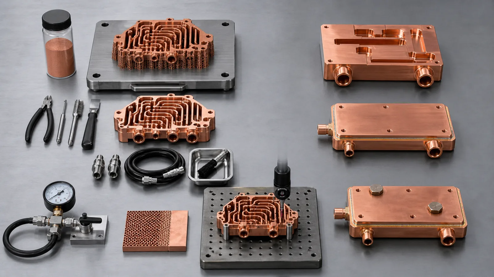
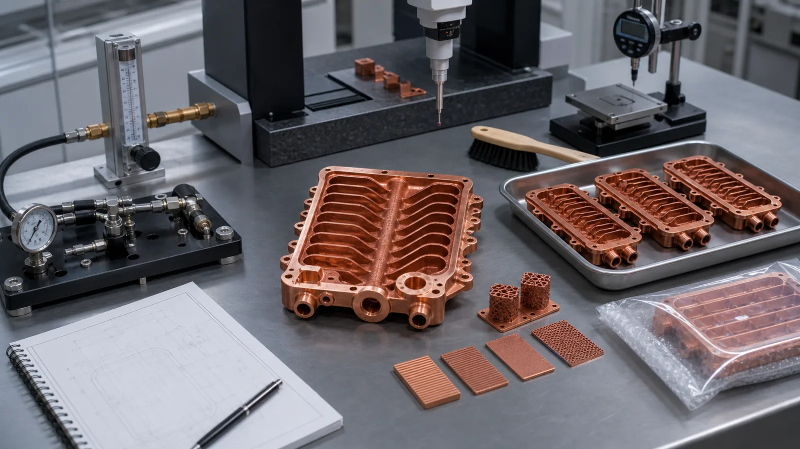

> The cost of a copper 3D printing project is rarely controlled by the printed shape alone. The quote is shaped by material route, build time, support strategy, powder removal, CNC finishing, heat treatment, inspection, pressure or leak testing, and the risk carried by missing RFQ information. A low price for only the printed body is not comparable to a finished, cleaned, machined, and accepted copper component.

The most useful cost question is not "How much per gram?"

For copper additive manufacturing, that question is usually too small. A 120 g printed coupon, a 120 g internal-channel cold plate, and a 120 g RF cavity can have completely different quotation routes. The mass may be similar. The cost drivers are not.

We usually see the real cost appear in the work around the print: process setup, build orientation, support removal, machining stock, internal cleaning, leak or pressure testing, CMM inspection, conductivity checks, and documentation. In one project review, the printed body looked like 40% of the job. The finished-component scope, including machining and test fixtures, controlled the other 60%.

That is not a reason to avoid copper AM. It is a reason to quote it correctly.

## Cost Driver 1: Why the Part Is Being Printed

The first cost driver is strategic: does additive manufacturing remove a real constraint?

Copper 3D printing is easier to justify when the part needs internal cooling channels, integrated manifolds, fewer brazed joints, compact RF or vacuum geometry, a three-dimensional conductor, or low-volume design iteration. It is harder to justify when the part is a simple copper block, plate, heat spreader, or busbar with accessible machined features.

If the only requirement is a flat copper shape with holes, CNC machining may give a cleaner cost structure. If the design needs a curved coolant path, a monolithic pressure boundary, or a manifold that would otherwise require plugs and brazed covers, copper AM can compete because it reduces assembly risk.

For route selection, start with [When Copper 3D Printing Is Better Than CNC Machining](/posts/EngineeringGuide/when-copper-3d-printing-is-better-than-cnc-machining/). Cost only makes sense after the route has a reason.

## Cost Driver 2: Build Time and Machine Occupancy

Laser powder bed fusion is priced partly by machine time. For copper, that machine time is sensitive to layer thickness, part height, build area, support volume, recoating conditions, and parameter route.

As of 2026, public copper AM material data sheets show why this cannot be treated as a generic metal-printing cost. For example, the [EOS Copper Cu material data sheet](https://www.eos.info/metal-solutions/data-sheets/all-processes-and-materials?id=eos-copper-cu) lists a 20 um layer thickness for one EOS M 290 copper process and gives a published volume rate for that route. A thinner layer can support surface and feature goals, but it can also increase the number of layers and build time. A thicker or faster route may reduce machine time, but only if density, properties, and acceptance requirements remain suitable.

The build quote is usually affected by:

- Part height in the build direction.
- Number of layers.
- Cross-sectional area per layer.
- Support volume and support density.
- Machine platform and laser route.
- Powder handling and inert atmosphere requirements.
- Whether the build can share space with other compatible jobs.

A 25 mm tall part may be cheaper to build than the same envelope rotated to 80 mm height, but orientation is not only a cost choice. It also changes supports, distortion, surface quality, channel cleaning, and machining stock. A lower build price that creates a later finishing problem is not a real saving.

## Cost Driver 3: Copper Process Difficulty

Copper costs more to process than many common alloys because the same properties that make it valuable also make it demanding in LPBF.

Copper conducts heat away from the melt zone quickly and reflects common laser wavelengths strongly. [NIST research published in 2026 on LPBF of highly reflective metals](https://www.nist.gov/publications/ultra-high-speed-printing-regime-laser-powder-bed-fusion-highly-reflective-metals) describes excessive energy losses for metals such as copper and aluminum, while also showing that process optimization can improve absorption behavior. The practical quotation point is simple: copper is not stainless steel with a different color.

This process difficulty can affect cost through:

- Parameter development or validated parameter selection.
- Higher sensitivity to geometry and orientation.
- Density and defect-risk review.
- More conservative first-article planning.
- Additional coupons for conductivity, hardness, or density review.
- Possible heat treatment when material properties depend on it.

Modern green-laser and optimized infrared LPBF routes have improved copper capability. That does not remove the need to price the process route honestly, especially when the part is a pressure boundary, RF surface, thermal interface, or high-current conductor.

For design-side risk, see [Design Rules for Copper Laser Powder Bed Fusion Parts](/posts/EngineeringGuide/design-rules-copper-laser-powder-bed-fusion-parts/).

## Cost Driver 4: Material Route, Not Just Material Name

"Copper" is not enough information for a quote.

Pure copper, CuCrZr, and CuCr1Zr can all be valid, but they do not create the same cost structure. Pure copper is usually reviewed when thermal or electrical conductivity dominates and mechanical loads are controlled. CuCrZr and CuCr1Zr deserve review when threads, pressure boundaries, thin walls, repeated assembly, or heat treatment become part of the acceptance path.

Industrial suppliers position copper AM materials around conductivity-driven applications. EOS describes copper materials around thermal and electrical conductivity, heat exchangers, electronics, power electronics, and coils. [3D Systems presents CuCr1Zr(A)](https://www.3dsystems.com/materials/cucr1zr-a) as a high-conductivity, high-strength copper alloy for applications such as heat exchangers, electrical components, and induction coils. Those signals are useful, but the quote still depends on the finished part.

Material route can change the quote through:

- Powder cost and availability.
- Parameter set and platform availability.
- Heat treatment requirements.
- Witness coupon requirements.
- Conductivity or hardness testing.
- Documentation tied to a named alloy or customer specification.
- Scrap risk if the material route is immature for the geometry.

If the project does not require a named alloy, write "material open to review" and explain the function. That may produce a better quote than forcing pure copper into a part that actually needs thread strength or pressure integrity.

For material trade-offs, use [Copper Alloy Selection for Metal 3D Printing: Pure Cu vs CuCrZr vs CuCr1Zr](/posts/EngineeringGuide/copper-alloy-selection-metal-3d-printing-pure-cu-cucrzr-cucr1zr/).

## Cost Driver 5: Support Strategy and Removal Work

Supports are not free scaffolding. They consume material, machine time, and manual labor. They also decide which surfaces will need finishing.

In copper AM, support strategy affects cost in at least four ways:

- More support volume increases build time and powder use.
- Support contact can damage surfaces that later need flatness or sealing.
- Manual support removal may be slow around ports, fins, or channel openings.
- Support scars may require CNC cleanup or redesign.

The lowest-cost orientation is not always the best orientation. If rotating the part reduces supports but places rough surfaces on an O-ring land, the quote may move cost from printing to machining. If orientation helps machining but traps powder in a long channel, the cost moves to cleaning and inspection.

A good RFQ should identify surfaces that must not carry support scars:

- Thermal contact faces.
- Sealing lands.
- RF or microwave surfaces.
- Electrical contact pads.
- Datum pads.
- Threaded port seats.

That information lets the supplier price support and finishing together instead of guessing.

## Cost Driver 6: Internal Channels and Powder Removal

Internal channels are one of the strongest reasons to use copper additive manufacturing. They are also one of the strongest cost drivers.

A channel network changes the quote when it has small passages, long enclosed paths, blind pockets, many branches, poor flushing access, or pressure requirements. A 1.0 mm passage and a 2.0 mm passage may look close in CAD, but they can be very different for powder removal, flow testing, and CT review. A dead-end volume may be acceptable in a cosmetic model and unacceptable in a fluid component.

_Figure 2. The expensive part of an internal-channel copper AM project is often the route after printing: support removal, cleaning, machining, pressure or flow testing, and acceptance evidence._

Channel-related cost usually comes from:

- Section review before quoting.
- Build orientation chosen around powder evacuation.
- Cleaning access features or temporary openings.
- Flushing, ultrasonic cleaning, drying, or borescope review.
- Flow testing or pressure-drop measurement.
- Leak or proof-pressure testing.
- CT inspection when the risk justifies it.

The best way to control this cost is not to ask for the smallest possible channel. It is to design channels that can be printed, cleaned, and verified. For more detail, see [Copper AM Cleaning and Powder Removal for Internal Channels](/posts/EngineeringGuide/copper-am-cleaning-powder-removal-internal-channels/) and [3D Printed Copper Heat Exchangers: Design Benefits and Manufacturing Limits](/posts/EngineeringGuide/3d-printed-copper-heat-exchangers-design-benefits-manufacturing-limits/).

## Cost Driver 7: CNC Finishing After Printing

Copper AM rarely replaces CNC machining completely.

The printed body can create the internal geometry and near-net form. Functional surfaces still often need machining. This includes sealing lands, O-ring grooves, threaded ports, flat thermal faces, electrical contact pads, RF surfaces, datum pads, tube interfaces, and mounting faces.

Finishing cost depends on:

| Finished feature | Why it changes cost | Better RFQ input |
| --- | --- | --- |
| Thermal face | Needs flatness and roughness control | Flatness target, roughness target, heat-source area |
| O-ring groove | Needs dimensional control and surface condition | Groove size, seal type, compression assumption |
| Threaded port | Needs torque and sealing reliability | Thread standard, depth, fitting type, pressure |
| Electrical pad | Needs contact resistance control | Contact area, plating, roughness, current |
| RF surface | Needs geometry and surface finish control | Frequency band, critical faces, plating requirement |
| Datum system | Controls inspection and machining setup | Datum scheme and critical dimensions |

One common cost mistake is sending a CAD model at finished size while the drawing demands machined surfaces. Adding 0.5-1.0 mm of stock later can change channel distance, wall thickness, port strength, support strategy, and build time. State the finished surfaces early.

## Cost Driver 8: Inspection and Acceptance Scope

Inspection is not paperwork after the job. It is part of the manufacturing route.

A quote for a printed copper prototype with visual inspection is not comparable to a quote for a finished cold plate with CMM report, pressure hold, leak test, flow check, and cleanliness packaging. Both can be legitimate. They are different deliverables.

Acceptance scope may include:

- CMM report for machined datums and hole positions.
- Surface roughness measurement.
- Flatness or parallelism report.
- Leak test or pressure hold.
- Flow rate or pressure-drop test.
- CT inspection for internal geometry.
- Conductivity or hardness testing.
- Witness coupons processed with the part.
- Cleaning record or packaging requirement.

In a pressure-boundary project, a simple gauge fixture may add 1-3 working days but prevent a costly ambiguity. Without a pressure test, the buyer may not know whether a later failure came from the printed body, a port thread, an O-ring, or the test setup. That time is not waste. It is risk control.

_Figure 3. Cost increases when the quote includes the real acceptance scope, but that scope is what turns a printed copper body into usable industrial hardware._

## Cost Driver 9: Quantity, Batch Strategy, and Development Stage

Quantity changes the cost model, but not always in the way buyers expect.

For one to three pieces, engineering review, setup, support planning, and post-processing can dominate the unit price. For 10-30 pieces, batch layout, shared inspection, and repeatable machining fixtures may reduce unit cost. For hundreds of simple parts, conventional manufacturing may deserve a serious comparison unless AM removes assembly, improves performance, or reduces failure risk.

The development stage also matters:

| Stage | Typical cost logic | Quote expectation |
| --- | --- | --- |
| Concept review | Geometry and route are still open | Conditional estimate or DFM feedback |
| Prototype | Learning matters more than unit cost | Limited batch, stated assumptions |
| First article | Acceptance route must be proven | Full finishing and inspection scope |
| Pilot batch | Repeatability starts to matter | Fixture and batch inspection planning |
| Production | Cost stability matters | Defined process route and change control |

Do not ask a prototype quote to behave like a mature production quote. If the geometry is likely to change after the first test, say so. A supplier may recommend a lighter inspection route for the first print and a stronger validation route for the next build.

## Cost Driver 10: RFQ Completeness

Missing information is a cost driver.

When an RFQ omits pressure, flow, current, material state, critical surfaces, inspection, or quantity stage, the supplier has three options. They can ask questions, quote with assumptions, or add risk allowance. None of those options is as clean as receiving the right data at the start.

The most expensive missing items are usually:

- No function statement.
- No channel section views.
- No working pressure or proof pressure for fluid parts.
- No current, duty cycle, or contact surface definition for electrical parts.
- No RF band or critical surface definition for RF parts.
- No material preference or property target.
- No machining stock on critical faces.
- No inspection or acceptance method.
- No development stage or target quantity.

Use the [Engineering Checklist for Copper 3D Printed Part Quotation](/posts/EngineeringGuide/engineering-checklist-copper-3d-printed-part-quotation/) before requesting a formal price. The goal is not to make the first email perfect. The goal is to avoid hiding the expensive parts of the quote.

## A Practical Copper AM Cost Breakdown

Use this table to read a copper AM quote more intelligently.

| Cost item | Low-risk condition | Higher-cost condition |
| --- | --- | --- |
| Build preparation | Simple orientation, few supports | Complex supports, distortion risk, channels |
| Material | Common qualified route | Special alloy, coupons, strict documentation |
| Machine time | Low height, shared build possible | Tall build, dense cross-section, dedicated run |
| Support removal | External, accessible supports | Supports near ports, fins, channels, critical faces |
| CNC finishing | Few accessible faces | Many datums, ports, O-ring grooves, RF surfaces |
| Cleaning | Open geometry | Long internal channels or cleanliness requirement |
| Heat treatment | Not required or standard | Property-driven route with coupons |
| Inspection | Dimensional check only | CMM, leak, flow, CT, conductivity, hardness |
| Documentation | Basic delivery | First-article report, material route, test records |
| Schedule | Flexible | Rush timing, fixed test date, third-party inspection |

This table also helps procurement compare quotes. If one supplier includes machining, pressure testing, and CMM while another only prices the printed body, the lower number may not be the lower project cost.

## Case Pattern: The Cheap Quote Was Missing the Work

A representative copper cooling block RFQ started with a 100 mm x 72 mm x 22 mm part, two threaded ports, and a dense internal flow path. Quantity was five pieces. The buyer asked for pure copper and wanted a fast prototype quote.

The first low quote covered only printing, support removal, and basic external finishing. It did not include the threaded ports as machined features. It did not include flatness on the thermal face. It did not include pressure testing. It did not include any check that the internal channel could be cleared.

After the drawing arrived, the real scope appeared:

- Thermal face flatness target near +/-0.05 mm after finishing.
- Two ports to be machined and pressure tested.
- Working pressure of 6 bar and proof pressure of 10 bar.
- Coolant flow target around 2 L/min.
- Internal channel cleaning and flow check.
- CMM inspection of mounting holes and port positions.

The quote increased, but the part did not become worse. The quote became honest. The buyer could then compare it against a CNC-and-braze route with the same finished scope: machining, joining, leak test, flatness correction, and flow verification.

That is the correct comparison. Printed blank against machined blank is a weak comparison. Finished accepted component against finished accepted component is the only comparison that protects the project.

## How to Reduce Cost Without Weakening the Part

Cost reduction in copper AM should remove unnecessary work, not necessary controls.

Start with these actions:

- Open the manufacturing route if CNC, brazing, or hybrid processing may be better.
- State whether pure Cu, CuCrZr, or CuCr1Zr is required or only preferred.
- Increase channel access where cleaning is the real risk.
- Mark only the surfaces that truly need machining.
- Avoid over-tight tolerances on nonfunctional faces.
- Separate prototype inspection from production acceptance if the first part is for learning.
- Allow supplier review of build orientation and support placement.
- Consolidate batch requirements when parts are stable.
- Define leak, pressure, flow, or CMM acceptance before quotation.

Do not reduce cost by removing the test that proves the function. If a copper cold plate must hold pressure, removing the pressure test only moves the risk to the buyer. If an RF component depends on an internal surface, ignoring finish requirements does not make the surface acceptable.

For application-specific cost control, see [Copper 3D Printing for Microchannel Cold Plates in Thermal Management](/posts/EngineeringGuide/copper-3d-printing-microchannel-cold-plates-thermal-management/), [Copper 3D Printed Heat Sinks for Power Electronics Cooling](/copper-heat-sinks/), and [Copper AM Parts for Semiconductor Equipment](/posts/EngineeringGuide/copper-am-semiconductor-equipment-rfq/).

## FAQ

What is the biggest cost driver in copper 3D printing?

For simple parts, machine time and material route may dominate. For functional thermal, fluid, RF, or electrical parts, the largest cost driver is often the finished scope: CNC machining, cleaning, pressure or leak testing, inspection, and documentation.

Is copper 3D printing priced by weight?

Weight matters, but it is not enough. A lightweight part with difficult internal channels can cost more than a heavier simple part because cleaning, supports, inspection, and risk drive the route.

Why does a copper AM quote include CNC machining?

Copper AM creates near-net geometry and internal features, but functional surfaces often need machining. Sealing lands, flat thermal faces, ports, threads, datum pads, RF surfaces, and electrical contact pads should be treated as finished features.

Can we lower cost by removing CT inspection?

Sometimes. CT should match the failure mode. If flow, pressure, and leak testing give enough evidence for the part, CT may not be needed. If hidden geometry is the acceptance risk, removing CT may only hide the problem. Define the acceptance logic before deleting inspection steps.

What information helps produce a better copper AM quote?

Send CAD, drawing, quantity, material preference, function, operating pressure or current, thermal requirement, critical surfaces, post-processing expectations, and inspection requirements. If some values are unknown, state the assumptions rather than leaving them hidden.

## Verdict: Price the Finished Copper Component

Copper 3D printing cost should be evaluated as a manufacturing route, not a printed-object price.

The useful cost ledger is: why print the part, which material route is needed, how long the build takes, where supports go, how powder leaves internal channels, which faces need CNC finishing, what tests prove acceptance, and how much RFQ uncertainty remains.

If the part is simple and accessible, conventional machining may be the better cost route. If the part needs internal channels, integrated manifolds, fewer joints, compact thermal paths, or low-volume iteration, copper AM deserves review. The quote should make every major cost driver visible before the purchase order, not after the first article fails.

Send CAD, drawing, quantity, material preference, operating requirements, critical surfaces, and acceptance criteria to [info@szcomo.com](mailto:info@szcomo.com), or use the [RFQ guidance page](/rfq/) to organize the package.

Related reading: [Engineering Checklist for Copper 3D Printed Part Quotation](/posts/EngineeringGuide/engineering-checklist-copper-3d-printed-part-quotation/), [Design Rules for Copper Laser Powder Bed Fusion Parts](/posts/EngineeringGuide/design-rules-copper-laser-powder-bed-fusion-parts/), [When Copper 3D Printing Is Better Than CNC Machining](/posts/EngineeringGuide/when-copper-3d-printing-is-better-than-cnc-machining/), and [Copper AM Cleaning and Powder Removal for Internal Channels](/posts/EngineeringGuide/copper-am-cleaning-powder-removal-internal-channels/).
