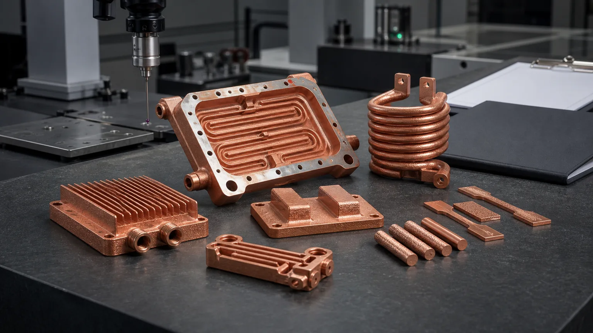

> CuCr1Zr copper alloy 3D printing is worth specifying when an industrial part needs a documented copper-chromium-zirconium route, not only a broad "strong copper" material note. The buyer's real decision is whether the drawing, customer standard, supplier data sheet, heat-treatment state, and acceptance tests require CuCr1Zr by name or allow a more general CuCrZr review.

CuCr1Zr often appears late in a copper additive manufacturing discussion.

The first conversation is usually about function:

- Can the part move heat fast enough?
- Can it carry current without excessive loss?
- Can the internal channels be printed, cleaned, and pressure tested?
- Can contact pads, sealing faces, threads, and datums be finished after printing?

Then the drawing or quality plan introduces a stricter question:

"The material is CuCr1Zr. Can you quote that exact route?"

That question is different from "Can you print a copper alloy?" It asks whether the supplier can support a specific copper alloy designation, a qualified powder and machine route, a heat-treatment condition, and evidence that the final part is not just copper-colored, but acceptable for the program.

_Figure 1. CuCr1Zr AM projects usually need both functional geometry and documentation discipline: material designation, heat-treatment state, machining plan, coupons, conductivity checks, hardness checks, and finished-part inspection._

This guide focuses on CuCr1Zr as a specified industrial material route. For the broader material comparison, use [Copper Alloy Selection for Metal 3D Printing: Pure Cu vs CuCrZr vs CuCr1Zr](/posts/EngineeringGuide/copper-alloy-selection-metal-3d-printing-pure-cu-cucrzr-cucr1zr/). For the strength-first route gate, use [CuCrZr 3D Printing: When Strength Matters More Than Maximum Conductivity](/posts/EngineeringGuide/cucrzr-3d-printing-when-strength-matters-more-than-maximum-conductivity/). This page is narrower: it helps buyers decide when CuCr1Zr should be named and documented in the RFQ.

## What CuCr1Zr Means In A Copper AM RFQ

CuCr1Zr is a copper-chromium-zirconium alloy designation. In additive manufacturing, it is usually discussed when a part needs a balance of conductivity and mechanical properties after qualified processing.

[3D Systems describes CuCr1Zr(A)](https://www.3dsystems.com/materials/cucr1zr-a) as a high-conductivity, high-strength copper alloy route for parts that need strength with thermal or electrical conductivity. The same supplier page connects it with heat exchangers, electrical components, conductive contacts, induction coils, and demanding thermal hardware. It also identifies CuCr1Zr(A) with the C18150 and CW106C designations in its DMP route.

[EOS describes CopperAlloy CuCrZr](https://www.eos.info/metal-solutions/metal-materials/data-sheets/mds-eos-copperalloy-cucrzr) as a copper alloy with electrical and thermal conductivity plus mechanical properties reached through heat treatment, and notes that the chemical composition corresponds to C18150 and CW106C. [Eplus3D positions CuCrZr](https://www.eplus3d.com/products/3d-printing-materials-copper/) around high thermal conductivity, mechanical strength, mold inserts, high-power electronic components, heat exchangers, and tooling.

These supplier signals matter because they show how the market treats copper-chromium-zirconium alloys: not as commodity copper, but as process-qualified material routes for parts where conductivity and strength must work together.

They do not mean every supplier's CuCr1Zr, CuCrZr, C18150, or CW106C answer is automatically interchangeable. The exact route still depends on powder, machine, parameter set, heat treatment, coupon plan, post-processing, and test method.

## CuCr1Zr Is Not A Keyword Substitute For CuCrZr

CuCr1Zr and CuCrZr overlap in application space. Both are reviewed when pure copper may not provide enough mechanical reserve. Both can appear in discussions about heat exchangers, induction coils, high-current hardware, mold inserts, and pressure or thermal components.

The difference becomes important when the project is controlled by documentation.

| RFQ situation | Better wording | Why it matters |
| --- | --- | --- |
| The drawing says CuCr1Zr | "CuCr1Zr required; state route, data sheet, heat treatment, and substitution policy." | The supplier must respond to the specified designation, not a broad alloy family. |
| The buyer wants a stronger conductive copper alloy but has no fixed standard | "Review CuCrZr / CuCr1Zr route; recommend based on function and evidence." | This allows supplier process knowledge to guide the quote. |
| A supplier proposes CuCrZr for a CuCr1Zr drawing | "Substitution requires written engineering approval." | Broad similarity is not enough for a qualification-controlled program. |
| The part is a first prototype | "CuCr1Zr preferred if available; otherwise quote qualified copper-chromium-zirconium alternative separately." | The quote can compare lead time, evidence, cost, and risk. |
| The buyer only cares about maximum conductivity | "Review pure copper first; consider CuCr1Zr only if mechanical risks appear." | Pure copper may be the more direct route when strength is not controlling acceptance. |

This is why CuCr1Zr should be treated as an RFQ control item. It tells the supplier what must be documented and what cannot be changed casually.

## When CuCr1Zr Should Be Requested By Name

Request CuCr1Zr explicitly when the program has one or more of these conditions:

1. The 2D drawing, customer specification, or material standard calls out CuCr1Zr.
2. The buyer is qualifying against a supplier-specific CuCr1Zr additive route.
3. A C18150 or CW106C-related route is part of the procurement or quality requirement.
4. Conductivity and mechanical properties both need documented evidence after heat treatment.
5. The part has pressure, threaded ports, clamp load, repeated assembly, or thin walls, and the material state must be traceable.
6. The quote must include witness coupons, hardness, conductivity, tensile, or other material checks.
7. The customer must approve any substitution from CuCr1Zr to CuCrZr, pure copper, or another alloy.

If none of those conditions apply, the RFQ can stay more open. "Review pure copper, CuCrZr, and CuCr1Zr based on the finished component requirements" may produce a better engineering response than forcing a material name too early.

Use [Pure Copper 3D Printing: Applications, Benefits, and Manufacturing Challenges](/posts/EngineeringGuide/pure-copper-3d-printing-applications-benefits-manufacturing-challenges/) when the main question is whether pure copper is enough. Use [Electrical Conductivity in 3D Printed Copper Parts](/posts/EngineeringGuide/electrical-conductivity-in-3d-printed-copper-parts/) when current path, contact resistance, and conductivity evidence control the material choice.

## Industrial Components Where CuCr1Zr Makes Sense

CuCr1Zr is not limited to one application. It becomes valuable when a copper part must conduct heat or current while behaving like a reliable industrial component.

### Heat Exchangers And Cold Plates

Heat exchangers and cold plates often need copper conductivity, but they also need pressure integrity, threaded ports, flat contact faces, thin walls, and clean internal channels.

CuCr1Zr may be worth specifying when:

- The drawing already requires CuCr1Zr or a C18150 / CW106C-related route.
- The component has thin pressure walls around internal channels.
- Ports, seal lands, and flat thermal faces must survive machining and proof testing.
- The buyer needs conductivity or hardness evidence after heat treatment.
- The project cannot accept a generic alloy substitution without review.

For geometry and process limits, review [3D Printed Copper Heat Exchangers: Design Benefits and Manufacturing Limits](/posts/EngineeringGuide/3d-printed-copper-heat-exchangers-design-benefits-manufacturing-limits/), [Microchannel Cold Plates in Thermal Management](/posts/EngineeringGuide/copper-3d-printing-microchannel-cold-plates-thermal-management/), and [Powder Removal Challenges in Copper Internal Channels](/posts/EngineeringGuide/copper-am-cleaning-powder-removal-internal-channels/).

### Conductive Contacts, Busbars, And Power Hardware

For high-current components, material selection should not stop at bulk conductivity. Contact resistance, contact pad flatness, plating, clamping, insulation, cooling, and repeated assembly can dominate the finished result.

CuCr1Zr may be a strong review route for:

- Conductive contact blocks with bolted or clamped interfaces.
- Liquid-cooled power distribution parts.
- Busbar sections with integrated cooling or compact routing.
- High-current components where contact pads need machining and inspection.
- Prototypes that will be assembled and disassembled many times.

Pure copper may still be preferred for simple current paths. The material decision should follow the failure mode. Use [Copper Busbars and Induction Coils RFQ Guide](/posts/EngineeringGuide/3d-printed-copper-busbars-induction-coils-rfq/) and [Copper AM Surface Finish Options](/posts/EngineeringGuide/copper-3d-printing-surface-finish-as-built-machined-polished-options/) before locking the route.

### Induction Coils And Complex Conductors

Induction coils are a natural copper AM topic because additive manufacturing can create compact turns, integrated cooling, custom bends, and nonstandard conductor geometry.

CuCr1Zr may be considered when the coil or conductor needs:

- Better mechanical reserve than pure copper.
- Integrated cooling passages that require pressure and flow validation.
- Machined terminals or clamping pads.
- Heat-treatment evidence and supplier documentation.
- A qualified material route for industrial equipment rather than a display prototype.

The RFQ should include current, duty cycle, cooling medium, flow target, pressure limit, insulation plan, terminal geometry, and required material evidence. The supplier cannot infer those from a STEP file alone.

### Mold Inserts, Tooling, And Thermal Control Parts

Tooling components need more than conductivity. They need cavity-face finishing, channel pressure integrity, mounting stability, thermal cycling resistance, and a post-machining plan.

CuCr1Zr may be relevant when:

- A mold insert or tooling component is specified against a copper-chromium-zirconium material route.
- Conformal channels run close to hot spots, cavity faces, or port bosses.
- The insert needs hardness, dimensional stability, or coupon evidence after heat treatment.
- Machining and polishing happen after printing and thermal processing.

For tooling-specific context, use [Copper AM Conformal Cooling Mold Inserts](/posts/EngineeringGuide/copper-am-conformal-cooling-mold-inserts/) and the [CuCrZr Mold Hot-Spot Insert Case](/posts/EngineeringGuide/cucrzr-cooling-insert-case-study-injection-mold-hot-spots/).

### RF, Vacuum, And Semiconductor Equipment Hardware

RF, vacuum, and semiconductor equipment parts often combine conductivity, surface finish, cleanliness, sealing, thermal control, and dimensional stability.

CuCr1Zr may be useful when a copper body must carry:

- RF-facing or high-frequency surfaces that will be machined, polished, or plated.
- Vacuum sealing lands, ports, and leak-test requirements.
- Internal cooling channels near precision surfaces.
- Cleanliness requirements after powder removal and finishing.
- Documentation that prevents unapproved material substitution.

For those routes, link material selection to the finish and inspection plan. Use [3D Printed Copper RF Waveguide and Vacuum Components](/posts/EngineeringGuide/3d-printed-copper-rf-waveguide-vacuum-components/), [Copper AM Parts for Semiconductor Equipment](/posts/EngineeringGuide/copper-am-semiconductor-equipment-rfq/), and [Plating and Finishing Copper AM Parts](/posts/EngineeringGuide/plating-and-finishing-copper-am-parts-rfq/).

## The Heat-Treatment State Must Be Part Of The Quote

CuCr1Zr should not be quoted as only a powder name.

The quote should explain the intended material state. That usually means the supplier should state:

- The qualified powder and machine route.
- The heat-treatment route or supplier-controlled condition.
- Whether final machining happens before or after the heat-treated state.
- Which evidence will be supplied: conductivity, hardness, tensile, density, coupon records, or material certificate.
- Whether the same witness coupons follow the same build and thermal route as the parts.

EOS notes in its CuCrZr data sheet that heat treatment can target different property balances and that part properties depend on many factors. That caution is useful for buyers. Public material data is not a substitute for a project-specific route, especially when the part has thin walls, internal channels, pressure boundaries, or machined contact faces.

For a deeper heat-treatment workflow, use [Heat Treatment for CuCrZr 3D Printed Components](/posts/EngineeringGuide/heat-treatment-cucrzr-3d-printed-components/). The same RFQ discipline applies to CuCr1Zr: state the expected material state and evidence instead of assuming the alloy name guarantees the finished result.

## Do Not Separate Material From Manufacturing Limits

CuCr1Zr does not remove copper LPBF constraints.

Copper alloys are still affected by reflectivity, heat conduction, melt-pool stability, support strategy, distortion, internal powder removal, machining access, and inspection planning. A material data sheet can support feasibility, but it cannot fix a design that traps powder, hides critical surfaces, or lacks test access.

Before releasing a CuCr1Zr RFQ, check the same manufacturability gates used for other copper AM projects:

- Are internal channels reachable for depowdering, flushing, drying, and inspection?
- Are seal lands, contact pads, and datums accessible for machining?
- Are threads printed, machined, inserted, or added after finishing?
- Is there enough stock for post-machining after heat treatment?
- Are wall thicknesses around channels, ports, and bolt holes realistic?
- Is CT, borescope, leak, pressure, conductivity, hardness, or CMM inspection required?
- Does the quote allow design-for-AM changes if the first CAD model is not printable?

Use [Copper LPBF Design Rules](/posts/EngineeringGuide/design-rules-copper-laser-powder-bed-fusion-parts/), [Tolerances and Dimensional Accuracy in Copper Metal 3D Printing](/posts/EngineeringGuide/tolerances-and-dimensional-accuracy-in-copper-metal-3d-printing/), and [Post-Processing Methods for 3D Printed Copper Parts](/posts/EngineeringGuide/post-processing-methods-for-3d-printed-copper-parts/) to define the route before cost comparison.

## A Practical Material Decision Table

| Choose this route | Use it when | What to specify in the RFQ |
| --- | --- | --- |
| Pure copper | Maximum conductivity is the main requirement and mechanical load is controlled | Conductivity target, contact surfaces, finish, cleaning, and inspection |
| CuCrZr | Strength, threads, pressure, clamp load, or thermal cycling matter, but the exact CuCr1Zr designation is not mandatory | Heat-treatment target, coupons, machining order, pressure or load tests |
| CuCr1Zr | The drawing, standard, data sheet, or supplier qualification requires that exact route | Material designation, accepted equivalents, data sheet, heat treatment, evidence, and substitution policy |
| Supplier review | The function is clear but the material is not fixed | Operating limits, failure mode, quantity, inspection scope, and allowed material alternatives |

This table protects both sides. The buyer gets a quote that respects the real acceptance criteria. The supplier avoids guessing whether a material name is mandatory or only a preference.

## Case Pattern: CuCr1Zr Was Chosen For Documentation, Not Marketing

A representative RFQ involved a compact copper component for high-current test equipment. The part combined a liquid-cooled conductor body, two bolted contact pads, threaded coolant ports, and an internal channel network close to the mounting holes.

The first review considered pure copper because the function was electrical and thermal. The geometry, however, added mechanical and quality requirements:

- The contact pads needed machined flatness after thermal processing.
- The coolant ports required pressure testing.
- The internal channels were close to threaded bosses.
- The buyer wanted coupon evidence for material state.
- The customer drawing referenced a CuCr1Zr route and did not allow casual substitution.

The final RFQ did not ask for "any printable copper alloy." It asked for CuCr1Zr review, the supplier's qualified route, heat-treatment condition, witness coupons, conductivity and hardness evidence, CNC finishing, cleaning, pressure test, and CMM inspection.

That decision did not make the project simpler. It made it more controlled. CuCr1Zr was valuable because the buyer needed traceability, property evidence, and a route that quality could approve.

## RFQ Checklist For CuCr1Zr Industrial Parts

Send these inputs when requesting a CuCr1Zr quotation:

1. STEP or native CAD with all internal channels, ports, bosses, contact pads, and critical surfaces included.
2. 2D drawing with datums, tolerances, flatness, roughness, threads, seal lands, and inspection notes.
3. Material requirement: CuCr1Zr required, CuCr1Zr preferred, CuCrZr acceptable, or open supplier review.
4. Required standard, data sheet, or qualification route if one exists.
5. Accepted equivalents or clear statement that substitution requires approval.
6. Operating function: heat transfer, current delivery, RF surface, pressure boundary, tooling, or structural thermal part.
7. Working temperature, current, heat load, pressure, coolant, flow target, duty cycle, or vacuum requirement as applicable.
8. Heat-treatment expectation or property target if known.
9. Required evidence: material certificate, witness coupons, conductivity, hardness, tensile, density, CT, leak, pressure, flow, CMM, roughness, or cleanliness.
10. Machining sequence and critical surfaces that cannot remain as-built.
11. Quantity, revision stage, target lead time, and whether design-for-AM changes are allowed.
12. Commercial note: whether the first order is a prototype, qualification lot, bridge production batch, or repeat production part.

The [Engineering Checklist for Copper 3D Printed Part Quotation](/posts/EngineeringGuide/engineering-checklist-copper-3d-printed-part-quotation/) is the best starting hub if the RFQ package is still incomplete.

## FAQ

Is CuCr1Zr the same as CuCrZr in copper 3D printing?

Not automatically. They overlap as copper-chromium-zirconium alloy routes, but a drawing, customer standard, supplier data sheet, or qualified additive process may require one designation by name. Treat substitution as an engineering and quality decision, not a casual wording change.

When should I specify CuCr1Zr instead of pure copper?

Specify CuCr1Zr when the part needs documented strength plus conductivity, or when the drawing or qualification route calls for it. Use pure copper first when maximum conductivity dominates and mechanical loads, pressure, threads, and qualification evidence are not controlling acceptance.

Does CuCr1Zr 3D printing require heat treatment?

If the selected route depends on a balance of conductivity and mechanical properties, the heat-treated state is usually central to the quote. The supplier should state the qualified route and what evidence will be provided, such as coupons, conductivity, hardness, tensile, or material records.

Can CuCr1Zr be used for heat exchangers and induction coils?

Yes, it can be reviewed for heat exchangers, cold plates, induction coils, contact blocks, and conductive hardware when the project needs conductivity plus mechanical reserve or documented material state. The final choice depends on geometry, pressure, current, finish, cleaning, and inspection requirements.

What is the biggest RFQ mistake with CuCr1Zr AM parts?

The biggest mistake is writing "CuCr1Zr" in the material field but omitting the standard, data sheet, heat-treatment condition, accepted substitutions, coupons, and final acceptance tests. CuCr1Zr should be quoted as a finished-component route, not only as a powder label.

## Verdict

CuCr1Zr copper alloy 3D printing is the right conversation when the material route needs documentation discipline.

Use pure copper when maximum heat or current transfer is the primary job and the geometry is mechanically forgiving. Review CuCrZr when strength, pressure, threads, clamp load, or heat-treated evidence matter but the exact designation is flexible. Specify CuCr1Zr when the drawing, standard, supplier data sheet, or qualification route requires that material path by name.

The practical rule is simple: do not let the alloy name do all the work. Tie CuCr1Zr to the real acceptance package: CAD, drawing, heat treatment, machining order, internal channel cleaning, conductivity or hardness checks, pressure or flow testing, CMM inspection, and substitution approval.

Send CAD, drawings, material requirement, accepted equivalents, operating limits, heat-treatment expectations, and inspection needs to [info@szcomo.com](mailto:info@szcomo.com), or use the [RFQ guidance page](/rfq/) to prepare a structured CuCr1Zr copper AM review.

Related reading: [Copper Alloy Selection for Metal 3D Printing](/posts/EngineeringGuide/copper-alloy-selection-metal-3d-printing-pure-cu-cucrzr-cucr1zr/), [CuCrZr 3D Printing: When Strength Matters More Than Maximum Conductivity](/posts/EngineeringGuide/cucrzr-3d-printing-when-strength-matters-more-than-maximum-conductivity/), [Pure Copper 3D Printing Guide](/posts/EngineeringGuide/pure-copper-3d-printing-applications-benefits-manufacturing-challenges/), [Electrical Conductivity in 3D Printed Copper Parts](/posts/EngineeringGuide/electrical-conductivity-in-3d-printed-copper-parts/), and [Post-Processing Methods for 3D Printed Copper Parts](/posts/EngineeringGuide/post-processing-methods-for-3d-printed-copper-parts/).
