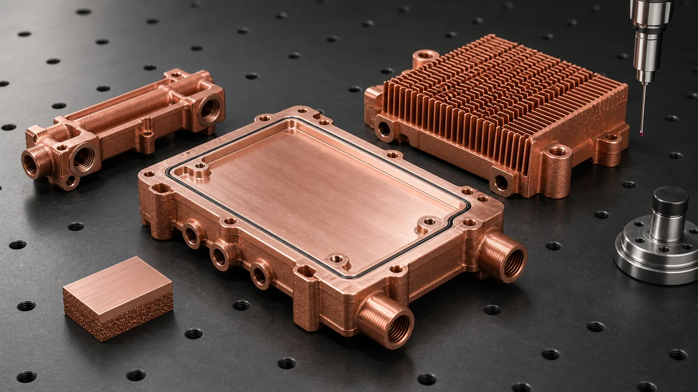
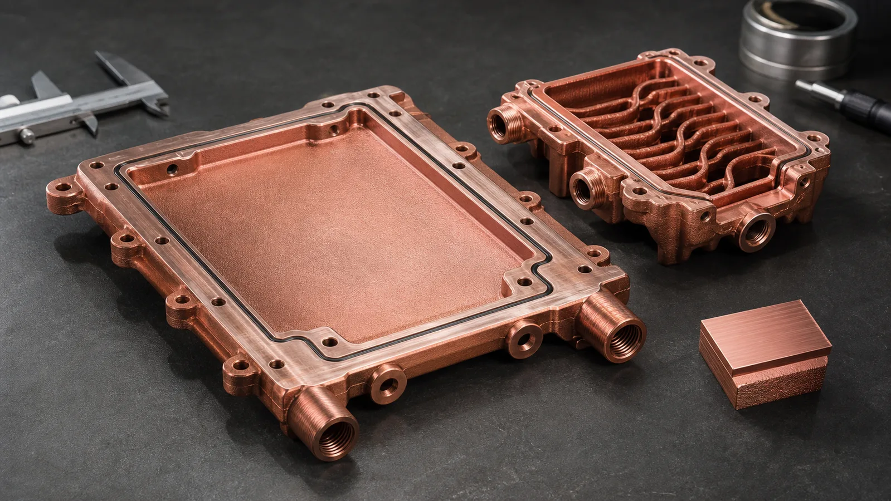
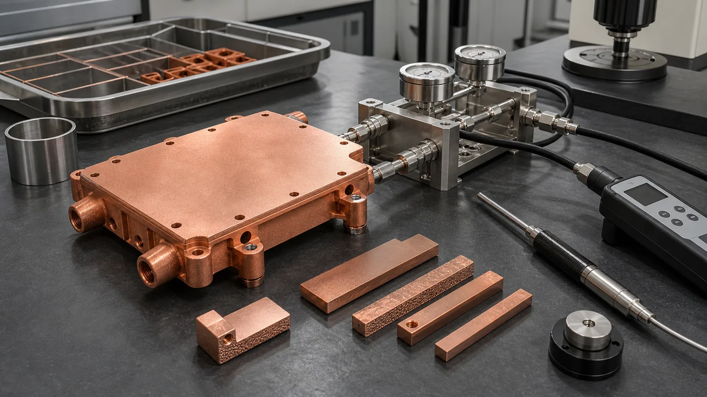

> CuCrZr 3D printing is valuable for high-performance thermal management components when the part must conduct heat and also survive pressure, clamp load, threads, thin walls, handling, or repeated thermal cycling. The trade-off is clear: CuCrZr usually gives up some headline conductivity compared with pure copper, but it can create a more stable finished component when strength and heat treatment are part of the requirement.

Many thermal RFQs begin with a simple request: print the part in copper because copper conducts heat well.

That request is reasonable, but it is not complete. A cold plate, heat exchanger, cooling manifold, or high-heat-flux fixture is not only a conductor. It is also a pressure boundary, an assembly interface, a threaded port carrier, a sealing surface, and sometimes a part that must keep flatness after torque and temperature exposure. In that environment, maximum bulk conductivity is only one number in the decision.

CuCrZr changes the conversation. It is a precipitation-hardenable copper alloy used when thermal or electrical conductivity must be balanced against mechanical stability. [EOS lists copper and CuCrZr additive manufacturing materials](https://www.eos.info/en/3d-printing-materials/metals/copper) for applications where conductivity matters, while suppliers such as [Eplus3D position Pure Cu and CuCrZr](https://www.eplus3d.com/products/3d-printing-materials-copper/) for heat exchangers, electronics, and electrical hardware. The material is not a shortcut around engineering review. It is a route for parts where the finished assembly needs both heat flow and mechanical reserve.

_Figure 1. CuCrZr is most useful when a thermal component also needs stable threads, machined sealing lands, pressure integrity, and repeatable assembly surfaces._

## Start With the Selection Gate

The first question is not "Can we print CuCrZr?" The useful question is "What failure mode are we trying to prevent?"

If the component has a large, flat heat-spreading area, low mechanical load, and accessible machining routes, pure copper may still be the better candidate. If the component includes thin channel walls, threaded ports, clamp-loaded interfaces, proof pressure, thermal cycling, or fragile fins, CuCrZr deserves a serious review.

Use this gate before choosing the alloy:

| Requirement in the thermal part | Pure copper direction | CuCrZr direction |
| --- | --- | --- |
| Maximum bulk thermal conductivity | Strong fit when loads are modest | Accept conductivity trade-off only if mechanics require it |
| Threaded ports or repeated torque | Use inserts or geometry support | Stronger candidate, but verify heat-treated state |
| Thin walls around internal channels | Higher handling and distortion risk | Better mechanical reserve after correct heat treatment |
| High clamp load on a flat interface | Risk of creep, bow, or flatness drift | Good candidate when flatness repeatability matters |
| Pressure boundary with 4-10 bar service range | Possible with robust geometry and testing | Often reviewed when walls, ports, and proof test are demanding |
| Later brazing or high-temperature joining | Distortion risk still matters | Must control over-aging or property drift |

The table does not say CuCrZr is always better. It says the material earns its place when mechanical instability would damage thermal performance. A cold plate that bows by 0.08 mm under clamp load can lose more performance at the thermal interface than it gained from using a slightly higher-conductivity copper grade.

## Why CuCrZr Fits Thermal Management Components

CuCrZr is attractive because the same part often has two jobs. It must move heat, and it must stay usable after manufacturing, finishing, assembly, and service exposure.

Common candidates include:

- Liquid cold plates for power electronics, laser modules, and compact test fixtures.
- Copper heat exchanger cores with integrated manifolds and thin internal walls.
- Cooling blocks for semiconductor or high-power RF equipment.
- Heat sinks where fins, pins, or threaded mounts must survive handling and cleaning.
- Thermal manifolds where ports, seals, and flow distribution share the same copper body.

The value appears when additive manufacturing enables internal geometry and CuCrZr helps the geometry survive. A 1.2-1.8 mm internal passage may be thermally useful, but it also needs enough wall thickness for printing, flushing, machining, pressure testing, and assembly. A threaded port may be easy to model, but it still has to hold torque after heat treatment and final machining.

For broader cooling-plate design context, see [How Copper Additive Manufacturing Improves Liquid Cooling Plate Design](/posts/EngineeringGuide/how-copper-additive-manufacturing-improves-liquid-cooling-plate-design/) and [3D Printed Copper Heat Exchangers: Design Benefits and Manufacturing Limits](/posts/EngineeringGuide/3d-printed-copper-heat-exchangers-design-benefits-manufacturing-limits/). This article is narrower: it focuses on when the CuCrZr alloy route is justified.

## The Process Window Is Still Copper LPBF

CuCrZr does not make laser powder bed fusion behave like stainless steel.

Copper alloys are still challenging because copper reflects much of the energy from common infrared laser systems and conducts heat away quickly. A [NIST publication on highly reflective metals in laser powder bed fusion](https://www.nist.gov/publications/ultra-high-speed-printing-regime-laser-powder-bed-fusion-highly-reflective-metals) notes that copper and aluminum printing can require high laser power, slower scan conditions, or careful parameter optimization because energy coupling is difficult. That reality affects density, surface condition, distortion, and repeatability.

The RFQ should therefore separate three states:

1. The printed CuCrZr body.
2. The heat-treated and stress-managed body.
3. The finished thermal component after CNC machining, cleaning, inspection, and testing.

Those are not the same deliverable. A supplier-specific CuCrZr data sheet may report strong property improvements after heat treatment. For example, one EOS CuCrZr material data sheet reports electrical conductivity moving from about 23% IACS in an as-built condition to about 88% IACS after a conductivity-oriented heat treatment, along with a minimum wall-thickness guideline for its parameter set. A [3D Systems CuCr1Zr data sheet](https://www.3dsystems.com/sites/default/files/2023-07/3d-systems-certified-cucr1zra-material-datasheet-usen-2023-07-14-a-web_0.pdf) also describes a high-strength copper alloy route where conductivity can exceed 90% IACS with appropriate heat treatment.

Those numbers are useful, but they are not universal promises. Machine platform, powder, parameter set, heat treatment, orientation, section thickness, and test method all matter. If the project requires a minimum conductivity, hardness, tensile property, or proof-pressure result, the quote should include witness coupons or a defined inspection route.

## Internal Channels Need Material and Process Discipline

CuCrZr is often selected for parts with internal flow features, but the channel network still has to be manufacturable.

The practical review looks at:

- Minimum channel width and height.
- Longest closed flow path between ports.
- Branch count and flow-balance risk.
- Dead-end pockets that trap powder.
- Wall thickness around channels, ports, and bolt holes.
- Machining stock on sealing lands, thermal interfaces, and datum pads.
- Port access for flushing, drying, leak testing, and pressure testing.

In many thermal components, we would rather review a 1.4 mm passage with clean port access than a 0.7 mm passage that looks efficient in CFD but cannot be confidently depowdered. A small increase in channel size may reduce local surface area, but it can also reduce scrap, shorten cleaning time, and make flow testing meaningful.

_Figure 2. CuCrZr helps when internal channels need mechanical reserve, but channel geometry still needs powder removal, machining allowance, and test access._

### Heat Treatment Is a Design Input, Not a Note

CuCrZr gets much of its usefulness from controlled heat treatment. That means the thermal process sequence should be reviewed before the first build, not added after the part fails an inspection gate.

The design team should decide:

- Whether the project requires conductivity-optimized, strength-optimized, or balanced heat treatment.
- Whether witness coupons will travel through the same build and heat-treatment route.
- Which property checks matter: conductivity, hardness, density, tensile coupons, or dimensional movement.
- Whether later joining, soldering, brazing, or high-temperature service could shift the aged condition.
- Whether machining happens before or after selected thermal steps.

This is where hidden cost appears. A coupon set and conductivity check may add only a small piece of material, but it adds planning, traceability, and inspection time. Skipping it can be more expensive if the finished cold plate meets geometry but misses the property state that made CuCrZr worth choosing.

## Case Pattern: A Cooling Block That Needed Stability More Than Maximum k

A representative project involved a compact cooling block for a high-power electronics fixture. The heat source covered about 55 mm x 75 mm. Nominal coolant flow was 2.0-2.8 L/min. Working pressure was 6 bar with a 9 bar proof-pressure check. The thermal interface required final machining to about +/-0.05 mm flatness relative to the mounting datum, and two side ports needed thread integrity after repeated assembly trials.

The first design assumption was pure copper. The thermal reason was obvious: maximize conductivity. The manufacturing review found a different controlling risk:

- The threaded port bosses were close to internal channels.
- Two thin wall regions were exposed to both coolant pressure and clamp load.
- The flat interface had little allowance for distortion after stress relief and machining.
- The prototype would go through multiple assembly and teardown cycles before release.

We did not reject pure copper because the conductivity was poor. We moved the review toward CuCrZr because the thermal result depended on the part staying flat, sealed, and mechanically stable.

The revised design used a CuCrZr route, increased local wall thickness near the ports by about 0.4 mm, added 0.7 mm machining stock on the thermal interface, and opened two channel transitions that were creating cleaning risk. The heat-transfer model lost a small amount of local wetted area, but the part became a better candidate for pressure testing, thread finishing, and repeatable assembly.

The price of success was real:

- Heat treatment and coupon verification were added to the process plan.
- The first article included pressure hold, flow check, flatness inspection, and hardness or conductivity checks.
- Machining time increased because the critical face, port seats, and datum pads had to be treated as functional surfaces.

For a single prototype, that extra work can feel heavy. For a production-intent thermal component, it is often the difference between a useful build and a copper object that cannot be accepted.

## What Should Be Finished After Printing

A printed CuCrZr body is rarely the final thermal part. Functional surfaces usually need CNC finishing.

Typical finishing and verification items include:

- Machined thermal contact faces with defined flatness and roughness.
- Machined sealing lands, O-ring grooves, and datum pads.
- Threaded ports or post-machined tube/fitting interfaces.
- Deburring and edge conditioning around flow openings.
- Internal flushing, filtered cleaning, and drying.
- Pressure hold or proof-pressure testing.
- Leak testing when the component is a pressure boundary.
- Flow test when pressure drop or branch balance matters.
- Conductivity, hardness, or coupon checks when the alloy state is critical.
- CT inspection or sectioned coupon review when internal channel risk justifies it.

The quote should make these items visible. A low price for only the printed body is not useful if the buyer actually needs a machined, sealed, cleaned, and verified cooling component.

_Figure 3. Finished CuCrZr thermal components should be validated as assemblies: heat treatment, machining, pressure or leak testing, flow behavior, and coupon property checks all matter._

## CuCrZr vs Pure Copper: The Practical Decision

The shortest version is this:

- Choose pure copper when maximum conductivity is the dominant requirement and mechanical loads are controlled.
- Choose CuCrZr when strength, thread stability, flatness retention, pressure integrity, or thermal cycling would otherwise damage the thermal result.
- Review CuCr1Zr as a supplier-specific or standard-specific route when the project requires that alloy naming, data sheet, or qualification path.
- Do not choose an alloy by keyword alone. Choose it by service condition and acceptance criteria.

For a more direct material comparison, see [Pure Copper vs CuCrZr for 3D Printed Heat Transfer Parts](/posts/EngineeringGuide/pure-copper-vs-cucrzr-high-performance-heat-sinks/). For material availability and project framing, the [copper 3D printing materials page](/materials/) gives the site-level overview.

## RFQ Inputs for CuCrZr Thermal Components

To make a CuCrZr 3D printing quote more reliable, send:

- STEP or native CAD with internal channels included.
- Drawing or section views showing critical surfaces and flow paths.
- Material preference: CuCrZr, CuCr1Zr, pure copper, or open to review.
- Heat load, heat-source footprint, and target temperature if known.
- Coolant type, operating temperature, nominal flow rate, and pressure-drop limit.
- Working pressure, proof pressure, and leak acceptance method.
- Clamp load, torque values, assembly cycle count, or thread requirements.
- Flatness, roughness, and datum requirements for thermal and sealing faces.
- Heat-treatment requirement or property target if specified.
- Conductivity, hardness, density, tensile, CT, flow, pressure, leak, or cleanliness expectations.
- Quantity, development stage, and target lead time.

If some values are unknown, state the assumptions. A basic review can start from CAD and quantity, but a serious CuCrZr thermal component quote needs the operating and acceptance context. Send the package to [info@szcomo.com](mailto:info@szcomo.com) or start from the [RFQ guidance page](/rfq/).

## FAQ

Is CuCrZr better than pure copper for every thermal management part?

No. Pure copper may be the better choice when maximum thermal conductivity is the controlling requirement and mechanical load is modest. CuCrZr becomes attractive when strength, thread stability, flatness retention, pressure integrity, or thermal cycling would otherwise create failure risk.

Does CuCrZr 3D printing remove the need for CNC machining?

No. Sealing lands, flat thermal interfaces, datums, threads, and port seats normally need machining after printing. The printed body provides internal geometry; finishing makes the component usable in an assembly.

Should the drawing specify CuCrZr or CuCr1Zr?

Use the alloy designation that matches your standard, supplier data sheet, or qualification requirement. If the project is still in design review, state the functional need first: conductivity target, strength need, heat treatment, pressure, thread load, and operating temperature. The exact alloy route can then be reviewed against available powder, machine, and heat-treatment capability.

What is the main risk with CuCrZr heat treatment?

The main risk is assuming that one heat treatment optimizes every property at once. Conductivity, strength, hardness, dimensional movement, and later thermal exposure must be balanced. If the part will see brazing, soldering, elevated service temperature, or repeated thermal cycling, include that information in the RFQ.

Can CuCrZr be used for microchannel cold plates?

Yes, when the channels are printable, cleanable, and testable. The alloy can help with thin-wall robustness and port stability, but it does not make very small, blind, or poorly accessible passages safe by default. Channel size, port access, powder removal, and pressure drop still define feasibility.

## Verdict

CuCrZr 3D printing is a strong route for high-performance thermal management components when the part needs more than conductivity. It is most useful for cold plates, heat exchangers, cooling blocks, manifolds, and heat sinks where internal geometry, pressure integrity, threads, flatness, and thermal cycling all matter.

It is a weak route when the part only needs a simple copper shape, when the finishing requirements are undefined, or when the buyer expects heat treatment and inspection to be free details outside the quote.

The practical recommendation is to treat CuCrZr as a material-process-acceptance package. Define the alloy route, heat treatment, machining stock, critical surfaces, channel cleaning, pressure or leak test, and property checks before quotation. That discipline is what turns CuCrZr from an attractive keyword into a usable thermal component.

> _Disclaimer: All scenarios described are based on real or closely analogous executed projects. If you choose to implement any of the examples described in this article, please conduct a careful evaluation first. This site assumes no responsibility for losses resulting from implementations made without prior evaluation._
