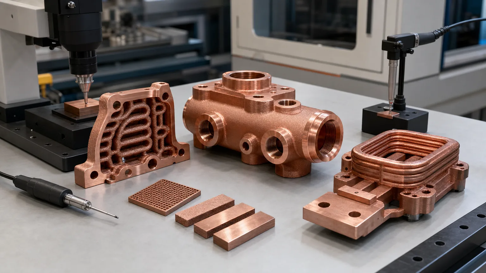

> CuCrZr 3D printing is worth reviewing when the copper part must stay threaded, sealed, flat, pressure-capable, and dimensionally stable after heat treatment, machining, assembly, and service. Pure copper may offer the stronger conductivity argument, but CuCrZr can be the safer finished-component route when strength protects the thermal or electrical function.

Many copper additive manufacturing RFQs start with a familiar assumption:

"Use pure copper because we need the highest conductivity."

Sometimes that is correct. Pure copper is often the first material to review when a part exists mainly to move heat or current and the mechanical load is modest.

But many industrial copper AM parts are not only conductors. They are also pressure bodies, threaded housings, clamped thermal interfaces, coil mounts, mold inserts, vacuum manifolds, or compact structures with thin internal walls. In those parts, the highest conductivity material can still lose at the system level if the body deforms, leaks, loses flatness, damages threads, or cannot be validated after finishing.

That is the practical role of CuCrZr. It is not a magic upgrade and it is not always better than pure copper. It is a copper alloy route for projects where mechanical reliability, heat-treated material state, and inspection evidence matter enough to justify a conductivity trade-off.

_Figure 1. CuCrZr becomes useful when a printed copper component must conduct heat or current while also surviving threaded ports, pressure boundaries, clamp load, machining, heat treatment, and inspection._

## Why Strength Can Protect Conductivity

Copper is chosen because it conducts heat and electricity well. That part is simple.

The finished component is less simple. A cold plate with high bulk conductivity can still perform poorly if the thermal face bows under clamp load. A cooled busbar can overheat if a contact pad is rough or distorted. A mold insert can lose cycle-time benefit if the conformal channel leaks or the cavity face moves after finishing. A vacuum manifold can fail acceptance because a sealing land is not stable after machining.

In those cases, the material decision is not "maximum conductivity at any cost." The better decision is "which route keeps the useful conductivity connected to the real interface?"

CuCrZr can help because the route is designed around a balance of conductivity and mechanical properties after appropriate processing. [EOS describes CopperAlloy CuCrZr](https://www.eos.info/metal-solutions/metal-materials/copper) as combining electrical and thermal conductivity with good mechanical properties, with useful properties reached during heat treatment. [3D Systems positions CuCr1Zr(A)](https://www.3dsystems.com/materials/cucr1zr-a) as a high-conductivity, high-strength copper alloy for applications that need both strength and thermal or electrical conductivity. [Eplus3D describes CuCrZr](https://www.eplus3d.com/products/3d-printing-materials-copper/) around high thermal conductivity, mechanical strength, mold inserts, electronics, and heat exchangers.

Those supplier pages point in the same direction: copper-chromium-zirconium alloys are useful when the part needs conductivity plus mechanical reserve. They do not remove the need for project-specific review. Powder, machine, parameters, heat treatment, orientation, section thickness, machining, and test method still control the final result.

For the broader material comparison across pure Cu, CuCrZr, and CuCr1Zr, use [Copper Alloy Selection for Metal 3D Printing](/posts/EngineeringGuide/copper-alloy-selection-metal-3d-printing-pure-cu-cucrzr-cucr1zr/). This page is narrower. It focuses on the buyer's route gate: when strength matters more than the last increment of conductivity.

## The Route Gate: What Would Make The Part Fail?

Before choosing CuCrZr, define the failure mode that would make the part unacceptable.

| Failure mode in the finished component | Why pure copper may become risky | Why CuCrZr may deserve review |
| --- | --- | --- |
| Thread damage during assembly | Soft threaded features can deform, gall, or lose torque consistency | Heat-treated alloy route can provide more mechanical reserve |
| Pressure leakage near channels | Thin walls, ports, and sealing lands carry load together | Better candidate when pressure and proof testing are central |
| Flatness drift on thermal interface | Clamp load or stress relief can increase interface resistance | Stronger material state can help protect machined faces |
| Thin walls around internal channels | Handling, machining, pressure, and cleaning can damage weak sections | More reserve for compact walls, bosses, and manifolds |
| Repeated assembly cycles | Ports, bosses, and contact pads see wear and torque | More stable route for prototypes with many teardown cycles |
| Machining stability | Soft copper can smear or move at delicate edges | Heat-treated CuCrZr may machine more predictably |
| Qualification evidence | Conductivity alone does not prove strength or material state | Coupons, hardness, conductivity, and heat-treatment records can be tied together |

This table is not a universal rule. It is a screening method. If none of these risks matter, pure copper may remain the right route. If several of them control acceptance, CuCrZr deserves serious review.

## When Pure Copper Still Wins

Pure copper should not be dismissed. It is often the correct first choice when the part is conductivity-led and mechanically calm.

Good pure copper candidates include:

- Broad heat spreaders with large contact area and modest load.
- Simple conductive blocks or contact hardware with robust sections.
- RF or microwave components where surface finish and conductivity dominate.
- Electrical parts where current path is the main requirement and strength is handled by the assembly.
- Thermal prototypes where the goal is to test maximum copper conductivity under controlled mechanical load.

The key phrase is "mechanically calm." If a pure copper part has wide channels, thick walls, light clamp load, reachable machining surfaces, and no difficult pressure boundary, the higher conductivity route may be more useful than a stronger alloy.

Use [Pure Copper 3D Printing: Applications, Benefits, and Manufacturing Challenges](/posts/EngineeringGuide/pure-copper-3d-printing-applications-benefits-manufacturing-challenges/) when the first question is whether pure copper AM is viable. Use [Electrical Conductivity in 3D Printed Copper Parts](/posts/EngineeringGuide/electrical-conductivity-in-3d-printed-copper-parts/) when current path, contact resistance, plating, or conductivity evidence controls the quote.

## When CuCrZr Is Usually The Better Review Path

CuCrZr becomes more attractive when the copper body has to act like a functional structure.

Typical triggers include:

- Threaded coolant ports, tube fittings, inserts, or repeated torque.
- Pressure boundaries in cold plates, manifolds, heat exchangers, and tooling inserts.
- Clamp-loaded thermal interfaces where flatness retention matters.
- Thin walls, internal channels, and bosses placed close together.
- Machined sealing lands, O-ring grooves, RF surfaces, contact pads, or datum faces.
- Thermal cycling, vibration, handling damage, or repeated assembly.
- Need for witness coupons, hardness checks, conductivity checks, or tensile evidence.
- Drawing language that requires CuCrZr, CuCr1Zr, or a qualified copper-chromium-zirconium route.

The reason is practical. CuCrZr is rarely selected just to make the material name look stronger. It is selected because the final part needs to survive a route: print, depowder, heat treat, machine, clean, inspect, pressure test, assemble, and operate.

That route should be discussed before price comparison. A low quote for a pure copper printed blank may be irrelevant if the accepted deliverable needs heat treatment, machined threads, flat sealing faces, flow testing, and pressure evidence.

## Application Patterns Where Strength Becomes The Deciding Factor

### Cold Plates And Heat Exchangers

Cold plates and heat exchangers are common CuCrZr review candidates because they combine heat transfer with pressure and assembly load.

Pure copper may win when channels are robust, pressure is modest, and the thermal face is easy to finish. CuCrZr moves higher in the review when:

- The inlet and outlet ports are threaded directly into the copper body.
- Internal channel walls are thin or close to bolt holes.
- Working pressure and proof pressure are important acceptance tests.
- The contact face needs flatness after heat treatment and machining.
- The component will be assembled and disassembled during development.

For thermal material comparison, use [Pure Copper vs CuCrZr for 3D Printed Heat Transfer Parts](/posts/EngineeringGuide/pure-copper-vs-cucrzr-3d-printed-heat-transfer-parts/). For cooling-plate geometry and channel routing, use [Microchannel Cold Plates in Thermal Management](/posts/EngineeringGuide/copper-3d-printing-microchannel-cold-plates-thermal-management/) and [Liquid Cooling Plate Design with Copper AM](/posts/EngineeringGuide/how-copper-additive-manufacturing-improves-liquid-cooling-plate-design/).

### Busbars, Contact Blocks, And Induction Coils

For high-current parts, pure copper is often the first material to review. The part exists to carry current, so conductivity matters.

CuCrZr deserves review when the same part also has:

- Clamped contact pads that must hold flatness.
- Integrated coolant channels with pressure requirements.
- Threaded or bolted terminals that see repeated assembly.
- Compact coil or conductor geometry with fragile unsupported sections.
- Elevated service temperature or mechanical vibration.

For this path, separate bulk conductivity from contact performance. A high-conductivity body with a poor contact interface may lose more performance at the joint than it gained in the alloy. Use [Copper Busbars and Induction Coils RFQ Guide](/posts/EngineeringGuide/3d-printed-copper-busbars-induction-coils-rfq/) and [Electrical Conductivity in 3D Printed Copper Parts](/posts/EngineeringGuide/electrical-conductivity-in-3d-printed-copper-parts/) before final material selection.

### Mold Inserts And Tooling

Copper AM mold inserts are not only thermal components. They are tooling components with cavity faces, shutoff surfaces, mounting datums, coolant pressure, polishing, and production handling.

Pure copper may be useful when heat extraction is the only difficult job and the insert is mechanically supported. CuCrZr becomes more attractive when:

- Conformal channels pass close to cavity features.
- Port threads and plugs are close to internal channels.
- The insert needs hardness or strength after heat treatment.
- The cavity face requires machining or polishing after printing.
- Thermal cycling and repeated tool maintenance are expected.

Use [Copper AM Conformal Cooling Mold Inserts](/posts/EngineeringGuide/copper-am-conformal-cooling-mold-inserts/) and the [CuCrZr mold hot-spot insert case](/posts/EngineeringGuide/cucrzr-cooling-insert-case-study-injection-mold-hot-spots/) when tooling function is the buyer intent.

### RF, Vacuum, And Semiconductor Hardware

RF, vacuum, and semiconductor equipment parts often combine several requirements: conductivity, surface finish, sealing, cleanliness, cooling, and dimensional stability.

Pure copper can be strong for RF surfaces and current paths. CuCrZr can be useful when the same body must carry threaded fittings, vacuum sealing, cooling passages, or clamp load. In these parts, the material decision must be tied to surface finishing and cleaning. A strong alloy route does not rescue an as-built RF surface if the finish requirement needs machining, polishing, or plating.

Use [3D Printed Copper RF Waveguide and Vacuum Components](/posts/EngineeringGuide/3d-printed-copper-rf-waveguide-vacuum-components/), [Copper AM Parts for Semiconductor Equipment](/posts/EngineeringGuide/copper-am-semiconductor-equipment-rfq/), and [Plating and Finishing Copper AM Parts](/posts/EngineeringGuide/plating-and-finishing-copper-am-parts-rfq/) for those acceptance paths.

## Heat Treatment Is Evidence, Not A Decoration

CuCrZr gets much of its value from the heat-treated material state. That makes heat treatment part of the engineering route, not a vague post-processing note.

A weak RFQ says:

> Print in CuCrZr and heat treat.

A stronger RFQ says:

> Material: CuCrZr or approved copper-chromium-zirconium AM route. Supplier shall state the qualified heat-treatment route, intended property balance, and whether conductivity, hardness, tensile, or other evidence will be provided by witness coupons processed with the build. Final machining of sealing faces, contact pads, and threaded ports shall be scoped after the heat-treated state unless the supplier proposes an approved alternate route.

The exact heat-treatment recipe should come from the supplier's qualified process, not from copying a public data sheet into a different machine and powder route. The buyer's job is to state the property target and acceptance evidence.

For the detailed heat-treatment discussion, use [Heat Treatment for CuCrZr 3D Printed Components](/posts/EngineeringGuide/heat-treatment-cucrzr-3d-printed-components/). This page only makes the selection argument: if you need CuCrZr because strength matters, the heat-treated state and evidence must be part of the quote.

## Do Not Ignore The Copper LPBF Process Window

CuCrZr does not make copper additive manufacturing easy by default.

Copper and copper alloys still bring process-window constraints because of reflectivity, heat conduction, melt-pool stability, supports, distortion, and internal channel cleaning. EOS notes that copper's reflectivity and high thermal conductivity historically made copper printing difficult. The same engineering discipline still applies to CuCrZr:

- Keep internal channels cleanable and testable.
- Avoid blind pockets that trap powder.
- Add machining stock to critical faces.
- Do not put threads too close to thin channel walls without review.
- Define pressure, leak, flow, conductivity, hardness, and dimensional checks before quotation.
- Treat coupons as part of the material evidence when property state matters.

Use [Copper LPBF Design Rules](/posts/EngineeringGuide/design-rules-copper-laser-powder-bed-fusion-parts/), [Powder Removal Challenges in Copper Internal Channels](/posts/EngineeringGuide/copper-am-cleaning-powder-removal-internal-channels/), and [Tolerances and Dimensional Accuracy in Copper Metal 3D Printing](/posts/EngineeringGuide/tolerances-and-dimensional-accuracy-in-copper-metal-3d-printing/) before locking geometry.

## Case Pattern: The Stronger Route Won After Assembly Requirements Arrived

A representative RFQ involved a compact copper part for a power electronics test fixture. The component combined a current-carrying contact block, an internal liquid cooling path, two threaded ports, and a machined interface surface.

The first material request was pure copper. That made sense from the electrical and thermal side. The buyer wanted maximum conductivity and short thermal path.

The drawing changed the decision:

- The contact pad needed a flat machined surface under clamp load.
- The ports were threaded directly into the copper body.
- The cooling path had thin walls near the port bosses.
- The part would see repeated assembly during test development.
- The acceptance plan included pressure hold, flow check, and dimensional inspection.

At that point, pure copper still had the best conductivity story. CuCrZr had the better finished-component story.

The revised route used CuCrZr review, added machining stock on the contact face, reinforced local wall thickness around the ports, and included witness coupons for material-state evidence. The quote included printing, heat treatment, CNC finishing, cleaning, pressure testing, and inspection after final machining.

The part did not become cheaper. It became more quotable and more defensible. That is usually the point of CuCrZr selection: not to win a conductivity table, but to reduce the risk that the accepted part fails because the copper body is too mechanically fragile for its job.

## RFQ Checklist For CuCrZr Strength-Driven Parts

When asking a supplier to review CuCrZr, send more than a STEP file and an alloy name.

Include:

1. STEP or native CAD with internal channels, ports, threads, and functional surfaces included.
2. 2D drawing with datums, tolerances, flatness, roughness, and critical dimensions.
3. Material preference: CuCrZr required, CuCrZr preferred, CuCr1Zr required, or open material review.
4. Reason for CuCrZr: strength, threads, pressure, clamp load, thin walls, fatigue, temperature, or qualification.
5. Heat-treatment requirement or property target if known.
6. Conductivity, hardness, tensile, or coupon evidence required by the program.
7. Working pressure, proof pressure, leak rate, flow target, and test medium for fluid parts.
8. Current, duty cycle, contact resistance target, or plating need for electrical parts.
9. RF band, vacuum requirement, cleanliness level, or surface finish target for RF and semiconductor parts.
10. Machining stock, critical faces, threaded features, and surfaces that cannot remain as-built.
11. Required inspections: CMM, CT, borescope, pressure, leak, flow, conductivity, hardness, roughness, or cleanliness.
12. Quantity, revision stage, lead-time target, and whether design-for-AM changes are allowed.

If the exact material is not fixed, say so. "Review pure copper first, but recommend CuCrZr if threads, pressure, or flatness dominate" is better than forcing an alloy without explaining the failure mode.

Use the [Engineering Checklist for Copper 3D Printed Part Quotation](/posts/EngineeringGuide/engineering-checklist-copper-3d-printed-part-quotation/) to organize the full RFQ package.

## Fast Decision Guide

| Choose this direction | Use it when | Be careful if |
| --- | --- | --- |
| Pure copper | Maximum conductivity dominates and mechanical load is controlled | The part has threads, pressure, clamp load, or thin walls |
| CuCrZr | Conductivity must coexist with strength, stability, pressure, or assembly load | Heat treatment, coupons, and final inspection are not scoped |
| CuCr1Zr | Drawing, standard, or supplier qualification requires that designation | The team treats it as a generic synonym for CuCrZr |
| Open supplier review | The function is known but the alloy is not fixed | The RFQ includes only CAD and no service conditions |

The best early answer is often conditional. Pure copper may be preferred if the part remains mechanically calm. CuCrZr should be reviewed if pressure, ports, clamp load, thin walls, or repeated assembly control acceptance. CuCr1Zr should be used when the drawing or qualification route requires that designation.

## FAQ

Is CuCrZr better than pure copper for copper 3D printing?

No. CuCrZr is better only when the finished part needs strength, thread stability, pressure integrity, dimensional stability, or heat-treated material evidence enough to justify a conductivity trade-off. Pure copper can still be the better route when maximum conductivity is the main requirement and mechanical load is modest.

When should a copper AM RFQ choose CuCrZr first?

Choose CuCrZr for first review when the part has threaded ports, thin pressure walls, clamped thermal faces, repeated assembly cycles, mold tooling loads, or qualification needs tied to heat-treated material evidence.

Does CuCrZr always need heat treatment after printing?

If the project selected CuCrZr for its conductivity-strength balance, heat treatment is usually central to the route. The supplier should state the qualified route and the evidence offered, such as witness coupons, conductivity checks, hardness checks, or tensile data if required.

Can CuCrZr replace pure copper in high-current electrical parts?

It can be reviewed when the conductor also needs strength, cooling, threads, contact-pad stability, or repeated assembly. For simple conductors where maximum conductivity dominates, pure copper may remain the better choice. Review current path, contact resistance, surface finish, and plating before deciding.

What is the main RFQ mistake with CuCrZr 3D printing?

The main mistake is requesting "CuCrZr" as a keyword while leaving heat treatment, machining sequence, critical surfaces, coupons, pressure testing, and inspection evidence undefined. The quote should cover the finished accepted component, not only the printed blank.

## Verdict

CuCrZr 3D printing is the right conversation when copper's function depends on more than conductivity.

Use pure copper when maximum heat or current transfer is the dominant requirement and the geometry is mechanically forgiving. Review CuCrZr when the copper part must also survive pressure, threads, clamp load, thin walls, machining, repeated assembly, thermal cycling, or qualification evidence. Review CuCr1Zr when a drawing, standard, or supplier-qualified route requires that exact material designation.

The practical recommendation is simple: select the alloy by the failure mode of the finished component. If the failure mode is insufficient heat or current transfer, pure copper may win. If the failure mode is leaking, stripping threads, losing flatness, distorting during finishing, or lacking material-state evidence, CuCrZr may be the stronger route.

Send CAD, drawings, material preference, operating limits, pressure or current requirements, critical surfaces, heat-treatment expectations, and inspection needs to [info@szcomo.com](mailto:info@szcomo.com), or use the [RFQ guidance page](/rfq/) to prepare a structured review.

Related reading: [Pure Copper 3D Printing Guide](/posts/EngineeringGuide/pure-copper-3d-printing-applications-benefits-manufacturing-challenges/), [Copper Alloy Selection for Metal 3D Printing](/posts/EngineeringGuide/copper-alloy-selection-metal-3d-printing-pure-cu-cucrzr-cucr1zr/), [Heat Treatment for CuCrZr 3D Printed Components](/posts/EngineeringGuide/heat-treatment-cucrzr-3d-printed-components/), [Post-Processing Methods for 3D Printed Copper Parts](/posts/EngineeringGuide/post-processing-methods-for-3d-printed-copper-parts/), and [Copper AM Surface Finish Options](/posts/EngineeringGuide/copper-3d-printing-surface-finish-as-built-machined-polished-options/).

> _Disclaimer: All scenarios described are based on real or closely analogous executed projects. If you choose to implement any of the examples described in this article, please conduct a careful evaluation first. This site assumes no responsibility for losses resulting from implementations made without prior evaluation._
