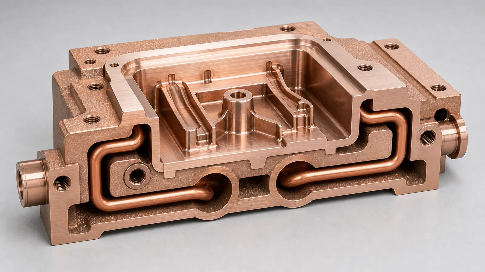
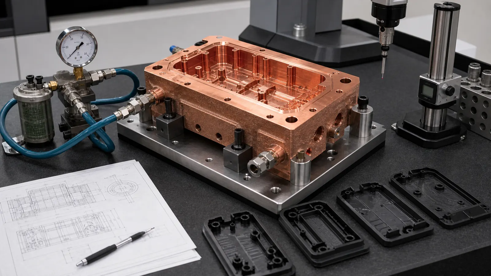

> A CuCrZr copper AM cooling insert is worth reviewing when a mold hot spot is caused by geometry that straight drilled channels cannot reach. The value is not only better heat transfer. The insert must still survive machining, polishing, clamping, coolant pressure, thermal cycling, cleaning, and production handling.

## Why This Case Direction Matters

Injection molding teams keep returning to the same business problem: the tool is capable of making the shape, but the cooling pattern controls cycle time, warpage, sink marks, dimensional drift, and scrap. This is a long-term search topic because cooling is not a trend word. It is a production constraint.

The recent tooling conversation is also tied to reshoring, shorter product refresh cycles, electronics housings, medical and industrial plastic components, and automotive connectors. Buyers do not only ask for a mold insert. They ask how quickly a part can reach a stable molding window without creating a fragile tool.

Academic and industry literature continues to treat conformal cooling as a way to reduce uneven temperature fields and improve cycle efficiency. A recent [Scientific Reports study on conformal cooling channels for injection molds](https://www.nature.com/articles/s41598-025-98657-x) is one signal that the topic remains active in 2025. Industrial copper AM material pages also point in the same direction: [Eplus3D lists molding and tooling](https://www.eplus3d.com/products/3d-printing-materials-copper/) among copper AM application areas, and [EOS positions copper materials](https://www.eos.info/metal-solutions/metal-materials/copper) around thermal and electrical conductivity applications, including CuCrZr as a stronger copper alloy route.

This representative case focuses on a CuCrZr cooling insert for an injection mold hot spot because it connects several high-value searches:

- CuCrZr 3D printing for tooling inserts.
- Copper AM conformal cooling mold inserts.
- Injection mold hot spot cooling.
- Conformal cooling around ribs, bosses, and deep pockets.
- RFQ inputs for machined, polished, pressure-tested copper tooling components.

The site already has a broad guide for [Copper AM Conformal Cooling Mold Inserts](/posts/EngineeringGuide/copper-am-conformal-cooling-mold-inserts/). This article does not replace it. It shows how that guide applies to one case-style RFQ.

## Starting Requirement

The representative RFQ involved a small mold insert for a plastic enclosure with ribs, screw bosses, and a deeper pocket near one corner. The molded part could be filled, but the process window was narrow.

The customer reported three symptoms:

- A local hot spot around a boss and rib intersection.
- Visible sink risk and delayed ejection near the same zone.
- Dimensional drift between early shots and stabilized production.

The conventional mold layout used a steel insert with straight drilled water channels. The channels were reliable and easy to service, but they stayed too far from the local heat zone because ejector features, mounting screws, and cavity geometry blocked the drilling path.

The RFQ did not ask for "the most complex conformal channel." It asked whether a copper alloy insert could put useful cooling closer to the hot spot while still behaving like a real production tooling component.

## Why A Simple Copper Insert Was Not Enough

Pure copper has excellent thermal conductivity, but an injection mold insert is not only a heat spreader. It has to work as a precision tooling component:

| Tooling requirement | Why it affected the material route |
| --- | --- |
| Cavity detail and shutoff faces | Need machining, polishing, and dimensional stability |
| Screws and clamp load | Need thread durability or insert strategy |
| Coolant pressure | Needs pressure boundary, port machining, and leak logic |
| Thermal cycling | Needs stable properties after heat exposure and repeated molding cycles |
| Handling and maintenance | Needs resistance to local dents, scratches, and assembly damage |
| Repeat production | Needs a route that can be inspected, documented, and repeated |

CuCrZr was reviewed because it can balance copper-level thermal behavior with better mechanical reserve than commercially pure copper after the correct process and heat-treatment route. That does not make CuCrZr automatically correct for every mold insert. It makes it a serious candidate when threads, clamp load, machining, and tool life matter.

For the broader material comparison, see [CuCrZr 3D Printing for High-Performance Thermal Management Components](/posts/EngineeringGuide/cucrzr-3d-printing-high-performance-thermal-management-components/), [Pure Copper vs CuCrZr for 3D Printed Heat Transfer Parts](/posts/EngineeringGuide/pure-copper-vs-cucrzr-3d-printed-heat-transfer-parts/), and [Copper Alloy Selection for Metal 3D Printing](/posts/EngineeringGuide/copper-alloy-selection-metal-3d-printing-pure-cu-cucrzr-cucr1zr/).

## Why Conventional Cooling Was Awkward

Straight drilled cooling is often the correct first route for mold tooling. It is predictable, serviceable, and cost effective when the cooling line can be placed where heat must leave the cavity.

In this case, the drilled route had three weaknesses.

First, the channel had to stay behind a screw pattern and ejector keep-out. That pushed coolant away from the rib and boss area.

Second, a baffle or bubbler concept added complexity but did not solve the lateral heat path cleanly. It also introduced maintenance and sealing questions.

Third, adding a separate high-conductivity insert only as a passive heat spreader helped the local temperature but still forced heat toward a distant steel waterline.

Copper AM was reviewed because it could combine three functions in one insert:

- A CuCrZr body near the cavity surface.
- A conformal coolant path around the hot spot.
- Conventional machined interfaces where the tool needed precision.

For the general process gate, use [When Copper 3D Printing Is Better Than CNC Machining](/posts/EngineeringGuide/when-copper-3d-printing-is-better-than-cnc-machining/).

## Functional Zones In The Revised Insert

The first useful design review separated the insert into zones instead of treating it as one printed copper block.

| Zone | Primary concern | RFQ decision |
| --- | --- | --- |
| Cavity face | Finish, wear, polish, dimensional stability | Add machining stock and finish after printing |
| Shutoff and parting-line faces | Seal, flash control, repeatability | Keep as controlled machined surfaces |
| Conformal cooling channel | Heat extraction, pressure drop, cleanability | Use smooth radii and practical channel size |
| Coolant ports | Threads, fittings, O-rings, maintenance | Machine after printing and inspect |
| Mounting datums | Tool alignment and CMM inspection | Define datum pads and bolt faces |
| Non-critical exterior | Handling and clearance | Allow cleaned as-printed texture where acceptable |

This zoning protected the quote from a common mistake: applying the tightest mold-finish requirement to every printed surface. The cavity face and shutoff surfaces needed a tooling finish. The hidden coolant path needed powder removal, cleaning, flow, and pressure acceptance. The non-critical outside surfaces did not need cosmetic perfection.

_Figure 2. The design review kept the conformal channel close enough to remove heat, but large enough to depowder, flush, pressure test, and protect cavity surfaces._

## The Main Design Changes

The first AM concept was too aggressive. It followed the hot spot closely, but it also created cleaning and tooling risk. The revised design changed the insert in practical ways.

### 1. Channel Distance Was Set By Tool Risk, Not Only Thermal Modeling

Thermal simulation wanted the channel close to the cavity wall. Tooling review asked whether that distance left enough wall for machining, polishing, pressure, and unexpected rework.

The final channel path stayed close to the rib and boss zone, but not so close that polishing or EDM finishing would expose or weaken the coolant wall. The RFQ also marked any areas where the channel passed near screw holes, ejector features, or thin ribs.

### 2. Channel Diameter And Bend Radius Were Made Cleanable

The concept design used narrow turns in the tightest hot-spot region. The supplier review widened the smallest passages, smoothed the bends, and removed one low-value dead-end branch.

This reduced theoretical surface area, but it improved the chances that powder, flushing fluid, and drying air could leave the insert. For internal-channel planning, see [Copper AM Cleaning and Powder Removal for Internal Channels](/posts/EngineeringGuide/copper-am-cleaning-powder-removal-internal-channels/).

### 3. Port Bosses Received Machining Allowance

Coolant ports are not decorative features. They define sealing, fittings, maintenance, and pressure test setup.

The revised model added material around the port bosses and left stock for:

- Thread machining.
- O-ring groove machining where required.
- Face machining for fittings or plugs.
- CMM inspection of port position.
- Pressure test fixture connection.

### 4. Cavity Surfaces Were Protected From Support And Rough Texture

The build orientation avoided support contact on cavity and shutoff surfaces where possible. The model also reserved finishing allowance for cavity details and parting-line regions.

This is especially important for plastic parts with visible surfaces, snap features, ribs, or tight dimensional expectations. A printed insert still has to become a mold component, not only a thermal component.

### 5. Acceptance Tests Were Defined Before Pricing

The quote separated optional development checks from required acceptance checks. That made the first price more honest.

The minimum review included:

- CMM inspection of tooling datums and cavity-critical dimensions.
- Pressure test of the coolant path.
- Flow check through the channel.
- Review of cavity finish and shutoff faces after machining.
- Material and heat-treatment route for CuCrZr.
- Optional molded-part thermal trial or tool temperature mapping.

## What Made CuCrZr The Practical Choice

The customer initially asked whether pure copper would cool faster. The answer was: maybe, but that was not the only pass/fail criterion.

Pure copper can be attractive when the part is mainly a heat conductor. In a production mold insert, CuCrZr may become more practical because the insert also sees:

- Screw load and local contact pressure.
- Port threads and serviceable fittings.
- Polished cavity detail.
- Repeated molding cycles.
- Handling during tool maintenance.
- Possible coating, polishing, or EDM finishing.

The trade is not "conductivity versus no conductivity." The trade is finished-tool behavior. The RFQ should state whether maximum heat transfer, mechanical stability, machining behavior, or production durability controls the decision.

Use the [materials overview](/materials/) when the alloy is open.

## Validation Plan

The validation plan matched the failure modes. It did not request CT, thermal trials, and full documentation by default for every insert. It separated prototype learning from production acceptance.

_Figure 3. First-article tooling validation should connect cooling performance to pressure integrity, flow, machining datums, cavity finish, and molded-part evidence._

| Risk | Practical acceptance route |
| --- | --- |
| Coolant leakage | Pressure test, leak check, port inspection |
| Blocked or restricted channel | Flow check, pressure-drop comparison, CT on first article if justified |
| Poor cavity finish | Machining and polish inspection on defined surfaces |
| Insert misalignment | CMM inspection of datums, mounting faces, and critical dimensions |
| Weak threads or ports | Thread inspection, port face check, torque or assembly review if needed |
| Material uncertainty | Heat-treatment record, hardness, conductivity, or material report as required |
| Molding hot spot remains | Tool temperature mapping, molded-part inspection, or short molding trial |

The buyer did not need every inspection on every reorder. The first article needed enough evidence to prove the route. Later orders could use the stable acceptance stack agreed after trial.

## What Changed After Review

The final quotable concept changed in ways that made the insert more boring and more useful:

- The channel route still followed the hot spot but avoided risky thin walls.
- The tightest bends were smoothed.
- One trapped branch was removed.
- Port bosses gained machining allowance.
- The cavity face and shutoff faces were separated from as-printed surfaces.
- Datum pads were defined for CMM inspection.
- Pressure and flow checks were included as quote items.
- Optional molded-part thermal validation was separated from part manufacturing.

That last point matters commercially. Some buyers want only a printed and machined insert. Others want tooling trial support or molded-part evidence. The RFQ should not hide that difference.

## When This Case Pattern Fits

This case pattern is a strong fit when:

- The molded part has a local hot spot near ribs, bosses, deep pockets, or cores.
- Straight drilled channels cannot reach the thermal zone.
- The insert is small or medium enough for a targeted copper AM route.
- CuCrZr strength, threads, and tooling behavior matter.
- The design can leave enough wall thickness around channels.
- Ports are accessible for machining and pressure testing.
- The buyer can define cavity finish, pressure, flow, and inspection requirements.

It is weaker when:

- Straight drilled steel tooling already controls the temperature field.
- The insert is large, simple, and cost-driven.
- The channel cannot be cleaned or pressure tested.
- The cavity face needs heavy finishing that removes too much stock.
- The RFQ has no mold context, pressure, coolant, or hot-spot evidence.
- The production volume favors a conventional route after the first development loop.

## Internal Links For The Buyer Journey

For this type of project, the best path through the site is:

1. Start with [Copper AM Conformal Cooling Mold Inserts](/posts/EngineeringGuide/copper-am-conformal-cooling-mold-inserts/) for the foundation.
2. Compare the material route with [CuCrZr 3D Printing for High-Performance Thermal Management Components](/posts/EngineeringGuide/cucrzr-3d-printing-high-performance-thermal-management-components/).
3. Check alloy selection with [Pure Copper vs CuCrZr for 3D Printed Heat Transfer Parts](/posts/EngineeringGuide/pure-copper-vs-cucrzr-3d-printed-heat-transfer-parts/) and [Copper Alloy Selection for Metal 3D Printing](/posts/EngineeringGuide/copper-alloy-selection-metal-3d-printing-pure-cu-cucrzr-cucr1zr/).
4. Review route selection with [Copper AM Process Selection: LPBF vs CNC and Brazing](/posts/EngineeringGuide/when-copper-3d-printing-is-better-than-cnc-machining/).
5. Check internal channels with [Copper AM Cleaning and Powder Removal for Internal Channels](/posts/EngineeringGuide/copper-am-cleaning-powder-removal-internal-channels/).
6. Avoid drawing mistakes with [Common Design Mistakes in 3D Printed Copper Parts](/posts/EngineeringGuide/common-design-mistakes-in-3d-printed-copper-parts/) and [Copper AM Tolerances and Dimensional Accuracy](/posts/EngineeringGuide/tolerances-and-dimensional-accuracy-in-copper-metal-3d-printing/).
7. Before sending files, use [How to Prepare CAD Files for Copper Metal 3D Printing](/posts/EngineeringGuide/how-to-prepare-cad-files-for-copper-metal-3d-printing/) and the [Engineering Checklist for Copper 3D Printed Part Quotation](/posts/EngineeringGuide/engineering-checklist-copper-3d-printed-part-quotation/).

## RFQ Checklist For A CuCrZr Cooling Insert

Send as much of the following as possible:

| RFQ input | Why it matters |
| --- | --- |
| Insert STEP or native CAD | Shows cavity geometry, channels, ports, and mounting logic |
| 2D drawing | Defines datums, tolerances, finish, cavity surfaces, and threads |
| Mold assembly context | Shows cavity side, core side, shutoffs, ejectors, screws, and keep-outs |
| Hot-spot evidence | Tool temperature map, molded-part defect, cycle issue, or simulation result |
| Channel model | Confirms channel diameter, distance to cavity, branches, and port positions |
| Coolant and pressure | Defines pressure test, leak logic, flow, and fittings |
| Material route | CuCrZr, pure copper, CuCr1Zr, or supplier review |
| Machining and finish | Cavity polish, shutoff faces, datums, port machining, and coating if any |
| Acceptance tests | CMM, pressure, flow, leak, hardness, conductivity, CT, or molding trial |
| Quantity and stage | Prototype insert, pilot tool, production tool, or repeat reorder |

If the tool is still in development, send the current assumptions. A useful quote can separate what is fixed from what still needs review.

## FAQ

### Is CuCrZr always better than pure copper for mold inserts?

No. Pure copper can be useful when conductivity dominates and the part has limited mechanical load. CuCrZr becomes more attractive when the insert needs strength, threads, clamping stability, machining behavior, or repeated tooling cycles.

### Can conformal cooling remove every injection molding hot spot?

No. It can help when coolant placement is the limiting constraint. If the hot spot is caused by part design, gate location, material behavior, packing, venting, or poor process settings, a new insert may not solve the root cause.

### How close can a cooling channel be to the mold cavity?

That depends on material, pressure, channel size, machining stock, cavity finish, and tool risk. The RFQ should not specify distance from thermal simulation alone. It should also account for polishing, pressure, and production handling.

### Does a copper AM mold insert still need machining?

Usually yes. Cavity faces, shutoff faces, datums, mounting faces, threads, ports, and sealing regions normally need post-machining or finishing. The quote should define which surfaces are printed, machined, polished, or inspected.

### Should every conformal cooling insert require CT inspection?

No. CT can be useful for first articles or high-risk internal channels, but pressure, flow, CMM, and visual or dimensional checks may be sufficient for some prototypes. Inspection should match the risk.

## Practical Next Step

For a CuCrZr cooling insert, copper AM mold insert, conformal cooling insert, or tooling component with local hot spots, send CAD, drawing, mold context, hot-spot evidence, coolant pressure, material preference, critical surfaces, and inspection scope.

Send the package to [info@szcomo.com](mailto:info@szcomo.com), or start from the [RFQ guidance page](/rfq/). A simple insert may be quoted with stated assumptions. A production tooling insert may need focused clarification before final pricing.
