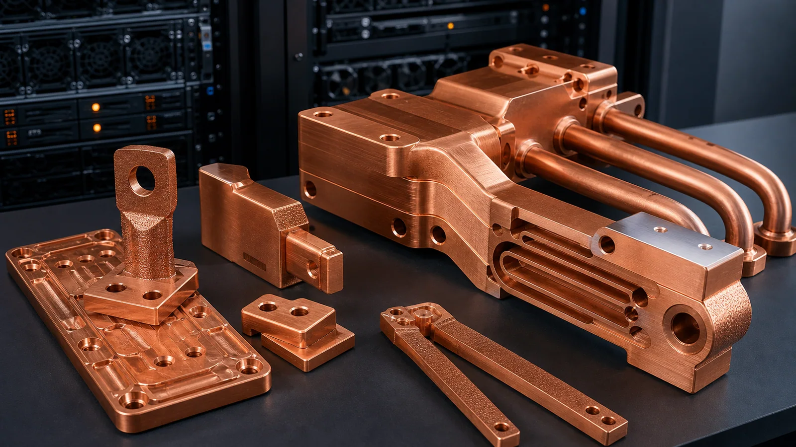

> Data center copper busbars and cooling manifolds are worth reviewing for additive manufacturing when current density, heat removal, package routing, contact geometry, or part consolidation creates a real constraint. Send CAD, drawings, quantity, current and thermal requirements, material preference, insulation or plating needs, critical surfaces, and inspection requirements.

### Why Data Center Copper Hardware Is Becoming More Integrated

High-density compute hardware places thermal and electrical problems close together. A rack, tray, power shelf, accelerator baseboard, or liquid-cooling loop may need copper parts that are not only conductive blocks. They may also need coolant routing, compact manifolds, contact faces, bolt patterns, insulation clearance, and serviceable interfaces.

Copper additive manufacturing may be relevant when conventional copper fabrication cannot easily combine those requirements.

Useful AM review cases include:

- Copper conductors with integrated cooling paths.
- Compact busbar geometry that routes around a restricted envelope.
- Current-carrying parts with local heat-spreading or liquid-cooling features.
- Copper manifolds that need complex internal distribution.
- Prototype rack or server power hardware where geometry is still changing.
- Consolidated copper parts that reduce joints, plugs, or brazed interfaces.

It is usually not the first route for simple flat busbars, straight bars, open manifolds, or low-complexity copper plates.

### Separate Electrical, Thermal, and Mechanical Requirements

A data center copper part can fail in several ways. The quote should not treat it as only "a copper shape." State which function matters most.

| Function | RFQ information to provide |
| --- | --- |
| Electrical conduction | Current, duty cycle, temperature rise, contact area, voltage clearance |
| Thermal management | Heat source, coolant, flow, pressure drop, interface flatness |
| Mechanical mounting | Bolt pattern, clamp force, vibration, assembly sequence |
| Insulation or safety | Creepage, clearance, coating, sleeve, spacer, or isolation requirement |
| Surface condition | Machined contact pads, plating, polishing, cleaning, protected packaging |
| Inspection | CMM, conductivity, pressure, leak, flow, coating, or contact-surface checks |

If the part carries current and coolant, define both. If it is only a manifold, define pressure and flow. If it is only a busbar, define current, contact faces, and insulation logic.

### When a Busbar May Be an AM Candidate

Many copper busbars are best made by cutting, bending, stamping, laminating, or CNC machining. Additive manufacturing should be considered only when the geometry or function justifies it.

Strong candidates may include:

- Organic current paths that must fit around tight keep-out zones.
- Thick terminals with complex transition geometry.
- Integrated cooling near a high-current contact or power module.
- Contact pads that need local post-machining while the rest of the body is complex.
- Prototype conductors where the current path may change after testing.
- Copper parts that combine manifold, mount, and conductor functions.

Weak candidates include:

- Flat bars with simple holes.
- Bent sheet conductors with standard insulation.
- Laminated busbars where layer structure is the main function.
- Parts where plating, insulation, and contact requirements are not defined.

If the part looks like a simple flat busbar, send it anyway if you want review, but expect the recommendation may point to a conventional route.

### Liquid-Cooled Conductors Need More Than a CAD Model

Liquid-cooled copper conductors combine two risk categories: electrical contact and sealed cooling. That makes the RFQ more sensitive to missing information.

State:

- Current and duty cycle.
- Maximum temperature rise or operating temperature.
- Coolant type, flow rate, pressure drop, and working pressure.
- Contact pad size, flatness, finish, and plating expectation.
- Threaded features, bolt torque, and clamp load if known.
- Insulation, creepage, clearance, or coating requirements.
- Leak test, proof pressure, cleaning, and packaging requirements.

If internal cooling channels are present, review them like cold plate channels: they must be printable, cleanable, testable, and connected to real ports.

### Cooling Manifolds Should Be Quoted by Flow Logic

Copper manifolds for data center or server cooling may be candidates when port placement and distribution are difficult. A useful manifold RFQ should include:

- Inlet and outlet locations.
- Number of branches.
- Flow distribution target.
- Pressure-drop limit.
- Working and proof pressure.
- Port standard, thread, or fitting region.
- Sealing method.
- Cleaning and inspection expectation.

For additive manufacturing, the manifold should not contain blind pockets unless they are intentional and accepted. Every branch should have a plausible cleaning, flow, and verification route.

### Contact Surfaces and Plating Should Be Named

Electrical copper parts often need selective finishing. Do not leave this to interpretation.

Define:

- Contact pads that need machining.
- Flatness or roughness for electrical contact.
- Plating or coating requirements.
- Areas that must remain uncoated.
- Edges that need deburring or radius control.
- Datum surfaces for inspection.
- Packaging required to protect contact faces.

If the contact requirement is not known, say that it is open. That is better than over-specifying all surfaces.

### Material Selection and Post-Processing

Pure copper may be reviewed when conductivity dominates. CuCrZr may be reviewed when mechanical strength, temperature stability, threads, or clamp load matter. The material route should follow service condition, not only the word "copper."

Post-processing may include:

- Stress relief or heat treatment.
- CNC machining of contact pads, sealing faces, and datums.
- Port threading or fitting preparation.
- Polishing, plating, coating, or cleaning.
- Conductivity testing, CMM, pressure testing, leak testing, or flow checks.

Use the [materials overview](/materials/) when the alloy is open, and see the [copper busbars and induction coils RFQ guide](/posts/EngineeringGuide/3d-printed-copper-busbars-induction-coils-rfq/) for more detail on high-current copper hardware.

### What a Strong Data Center Copper RFQ Looks Like

A strong RFQ separates the electrical path, the cooling path, and the assembly interfaces. It does not ask the supplier to guess which one controls acceptance.

For a busbar or conductor, mark:

- Current-carrying contact pads.
- Surfaces that need machining or plating.
- Bolt-hole and clamp-load regions.
- Insulation, creepage, clearance, or coating constraints.
- Maximum temperature rise or operating temperature, if known.

For a cooling manifold or liquid-cooled conductor, mark:

- Inlet and outlet ports.
- Branch count and flow direction.
- Working pressure, proof pressure, and leak test expectation.
- Dead legs, blind cavities, or trapped-volume concerns.
- Cleaning and drying requirements.

For a prototype, also state what may change after the first article: current path, port location, contact area, envelope, material, or test method. That helps the quote separate prototype review from repeat production assumptions.

### Red Flags Before Quoting

Review these issues before treating a data center copper part as a straightforward print:

- The part carries current, but contact face flatness and plating are not defined.
- The part carries coolant, but pressure, flow, and leak acceptance are missing.
- The model contains hidden internal passages with no cleaning access.
- Insulation is required, but clearance or coating boundaries are not stated.
- The design is a simple flat busbar where a conventional process may be lower risk.
- The RFQ asks for copper, but does not state whether conductivity, strength, or temperature stability is the main reason.

These are not reasons to avoid sending the project. They are the points that change material choice, post-processing, test scope, and cost.

### Practical RFQ Email

For data center copper busbars, liquid-cooled conductors, or copper cooling manifolds, send STEP or native CAD, drawing if available, quantity, current requirement, heat or coolant requirement, pressure condition, material preference, contact or sealing surfaces, plating or insulation expectations, and inspection requirements.

Send files to [info@szcomo.com](mailto:info@szcomo.com). A simple geometry can be reviewed with assumptions; a high-current, liquid-cooled, or field-critical part may need focused clarification before pricing.
