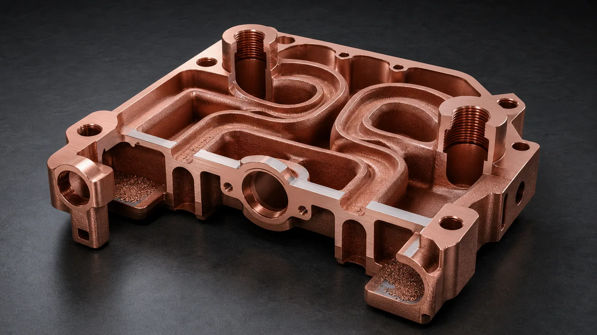
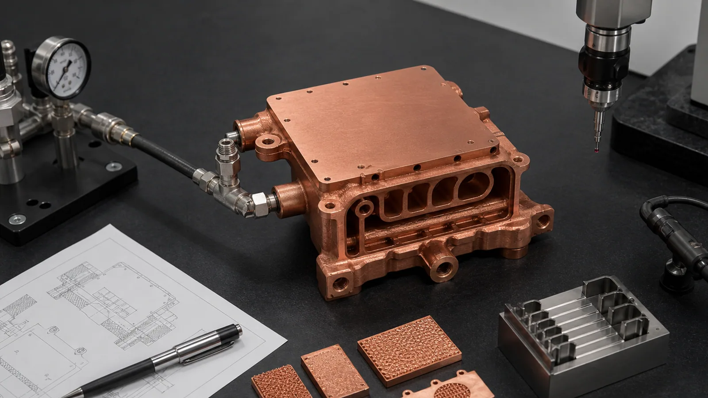

> Copper laser powder bed fusion design rules are not only about what can be printed. A useful copper LPBF design must also be cleaned, heat treated, machined, inspected, leak tested, and accepted as a finished thermal, electrical, RF, or fluid component. The most expensive mistake is treating copper like stainless steel with better conductivity.

Most early copper LPBF projects fail the first review for a boring reason: the model was optimized as a shape, not as a manufacturing route.

The part may have elegant internal channels, thin walls, tight bolt patterns, and a polished copper rendering. Then the manufacturing questions arrive. Can powder leave the channel network? Is there enough stock for the sealing face? Are threads too close to a coolant passage? Will the part move during heat treatment? Is the selected alloy pure Cu, CuCrZr, or CuCr1Zr? Does the drawing ask for +/-0.05 mm flatness on a face that was modeled at final size with no machining allowance?

Those are not late details. They are the design rules.

As of 2026, industrial material pages from [EOS](https://www.eos.info/metal-solutions/metal-materials/copper), [Eplus3D](https://www.eplus3d.com/products/3d-printing-materials-copper/), and [3D Systems](https://www.3dsystems.com/materials/cucr1zr-a) all position copper additive manufacturing around conductivity-driven applications such as heat exchangers, electrical components, high-frequency electronics, induction hardware, and compact thermal parts. At the same time, copper remains difficult in laser powder bed fusion because high reflectivity and high thermal conductivity make energy coupling and melt-pool stability more demanding than many common engineering alloys. [NIST research on highly reflective metals in LPBF](https://www.nist.gov/publications/ultra-high-speed-printing-regime-laser-powder-bed-fusion-highly-reflective-metals) points to that same process challenge.

That is why copper LPBF design needs a separate rule set. The design must respect both the value of copper and the cost of making copper behave.

## Rule 1: Define the Finished Component Before the Printed Body

The first design rule is to decide what the buyer is actually purchasing.

There are at least four possible deliverables:

- A near-net printed copper body for development.
- A printed and stress-relieved body with supports removed.
- A machined copper component with flat faces, threads, sealing lands, or contact pads.
- A validated component with pressure, leak, flow, conductivity, hardness, dimensional, roughness, CT, or cleanliness records.

Those four scopes can look similar in CAD and behave very differently in cost and lead time.

If the part is a thermal interface, a printed surface is usually not enough. A cold plate may need 0.4-1.0 mm of machining stock on the contact face, depending on size, flatness requirement, build orientation, and post-processing route. If the part is a fluid component, the drawing should define working pressure, proof pressure, leak test, and test medium before the quote is finalized. If the part is an RF or electrical component, current-carrying surfaces, RF surfaces, plating, conductivity target, and surface finish must be separated from nonfunctional printed surfaces.

The finished-component scope should be written in one sentence:

"Print in copper LPBF, heat treat as required, machine the sealing face and ports, clean internal channels, and validate with pressure hold and CMM inspection."

That sentence is more useful than "3D print this in copper."

## Rule 2: Treat Copper as a Narrower Process Window

Copper is attractive because it conducts heat and electricity well. Those same properties make LPBF more sensitive.

Pure copper reflects common infrared laser energy more strongly than steels and conducts heat away from the melt zone quickly. Modern copper LPBF routes, including green laser systems and optimized high-power infrared systems, have improved the practical window, but the design still needs to account for thermal behavior, heat accumulation, support strategy, and geometry repeatability.

Do not import a steel or aluminum design rule blindly. A feature that prints reliably in 316L may be risky in pure copper. A thin wall that looks efficient in CFD may distort, trap powder, or fail leak testing after machining.

Use these early review gates:

| Design question | Why it matters in copper LPBF | Practical RFQ action |
| --- | --- | --- |
| Is the alloy pure Cu, CuCrZr, or CuCr1Zr? | Conductivity, strength, heat treatment, and data-sheet route change together | State material preference or ask for material review |
| Are critical surfaces printed or machined? | LPBF surface texture is rarely suitable for seals, RF surfaces, or thermal contact faces | Mark faces that need CNC finishing |
| Are channels cleanable? | Copper powder removal becomes difficult in long, small, or blind passages | Show section views and flushing access |
| Are support scars on functional faces? | Support removal can damage surfaces that need flatness or sealing | Place supports on sacrificial or machined regions |
| Is heat treatment part of the property route? | CuCrZr and CuCr1Zr properties depend on thermal processing | Define coupons and property checks when needed |

The numbers are supplier dependent, but the logic is stable. Copper LPBF should be designed around a verified process window, not around a generic additive manufacturing brochure.

## Rule 3: Make Internal Channels Printable, Cleanable, and Testable

Internal channels are the strongest reason to use copper LPBF in many projects. They are also the easiest place to hide an unmanufacturable design.

For a cold plate, heat exchanger, cooling manifold, or fluid block, channel design should be reviewed in three steps:

1. Can the channel be printed with acceptable density and shape?
2. Can unfused powder leave the channel after the build?
3. Can the channel be verified by flow, pressure, leak, CT, borescope, or sectioned coupons?

If the answer to step 2 or step 3 is unclear, the channel is not ready for quotation.

Early-stage copper LPBF channel rules should be conservative:

- Avoid blind channels unless the closure and inspection route are defined.
- Avoid dead-end pockets where powder can collect.
- Add flushing access where the channel path is long or branched.
- Keep local wall thickness stronger near ports, threads, and bolt bosses.
- Use generous radii instead of abrupt turns where flow, printing, and cleaning all matter.
- Do not place a thread minor diameter too close to an internal channel wall without review.
- Use section views to show minimum passage size and longest enclosed path.

A 0.8 mm passage may be attractive in simulation. A 1.2-1.8 mm passage with cleaner access may be easier to print, depowder, and validate. That trade-off is not a failure of additive manufacturing. It is the price of turning an internal channel into an accepted copper component.

For deeper channel-risk context, see [Copper AM Cleaning and Powder Removal for Internal Channels](/posts/EngineeringGuide/copper-am-cleaning-powder-removal-internal-channels/) and [Copper 3D Printing for Microchannel Cold Plates in Thermal Management](/posts/EngineeringGuide/copper-3d-printing-microchannel-cold-plates-thermal-management/).

_Figure 2. A copper LPBF channel is not ready just because it exists in CAD. It must have powder removal access, robust walls near ports, machining allowance, and a way to validate flow or leakage._

## Rule 4: Keep Functional Faces Out of the As-Built Surface Category

Copper LPBF surface finish can be useful for area, heat exchange, and noncritical geometry. It is rarely the final surface for sealing, flat thermal contact, RF performance, or electrical contact.

Identify functional surfaces before build orientation is selected:

- Thermal contact faces.
- O-ring grooves and sealing lands.
- Threaded ports and fitting seats.
- Electrical contact pads.
- RF or microwave internal surfaces.
- Datum pads and mounting faces.
- Tube, brazing, soldering, or welding interfaces.

Then add stock where needed. For many copper AM components, 0.4-1.0 mm machining allowance is a reasonable early discussion range for functional faces, but the exact value depends on part size, distortion risk, build orientation, support strategy, heat treatment, and required flatness. A small coupon or first article may be needed when the requirement is tight.

The common error is modeling a face at final size while the drawing requires flatness, roughness, or sealing behavior that only machining can deliver. The part becomes smaller than intended after finishing, or the channel wall becomes too thin after stock is added late.

Design the printed blank and finished component separately. The blank carries stock. The finished component carries acceptance criteria.

## Rule 5: Design Support Strategy Before the Quote

Support structures are not just a printing detail. They affect surface quality, support scars, removal time, thermal distortion, powder access, and machining plan.

In copper LPBF, support planning should answer:

- Which faces can tolerate support contact?
- Which faces will be machined after support removal?
- Can supports be removed without damaging thin fins, ports, or channel openings?
- Does the orientation reduce support volume but create powder-removal problems?
- Does the orientation improve channel cleaning but increase distortion or stair-stepping?
- Are witness coupons needed in the same orientation or thermal condition?

An unsupported overhang rule such as "45 degrees" is too simple for copper production work. Local heat buildup, feature thickness, surface quality, recoater risk, and post-machining access all matter. A short overhang on a thick copper body is not the same as a long roof over a thin internal channel.

The safest RFQ language is conditional:

"Build orientation and supports are open to supplier review, but support scars must not remain on the thermal face, sealing land, RF surface, or electrical contact pad."

That gives the manufacturer room to choose a workable route while protecting the surfaces that matter.

For thin walls and enclosed passages, use the dedicated [copper AM support-strategy guide](/posts/EngineeringGuide/support-strategy-for-copper-am-parts-with-thin-walls-and-enclosed-flow-paths/) to separate external removable supports from inaccessible flow paths, review orientation trade-offs, and define feature-level verification.

## Rule 6: Give Threads and Ports More Structure Than the CAD Suggests

Threaded ports are often underestimated in copper LPBF parts.

A port is not only a hole. It is a load path, sealing interface, machining feature, cleaning access point, and pressure boundary. If the port boss is too close to an internal channel, it may print, but it may not survive machining, assembly torque, proof pressure, or repeated teardown.

Use these rules for early review:

- Leave enough wall thickness between channel and thread.
- Avoid placing threads directly into fragile as-built material when torque is high.
- Consider post-machining threads after heat treatment or stress relief.
- Define thread standard, depth, class, insert strategy, and torque if known.
- Add a machined seat or sealing land where fittings must seal.
- Keep wrench clearance and assembly access visible in the model.
- Define working pressure and proof pressure before finalizing port geometry.

For soft pure copper, repeated assembly can be a bigger risk than the first pressure test. For CuCrZr or CuCr1Zr, heat treatment and final property state matter. In both cases, the thread should be reviewed as part of the finished component, not as a cosmetic feature in CAD.

## Rule 7: Separate Material Selection From Geometry Ambition

Copper LPBF material choice is part of design for manufacturing.

Pure copper is usually reviewed when maximum conductivity is the main requirement and mechanical loads are controlled. CuCrZr and CuCr1Zr deserve review when the part also needs strength, thread stability, pressure integrity, thin-wall robustness, heat treatment, or qualification against a data sheet.

Do not choose pure copper only because the word "copper" sounds best. Do not choose CuCrZr only because it sounds stronger. Match the alloy route to the failure mode:

| Dominant risk | Design direction | Material route to review |
| --- | --- | --- |
| Heat or current transfer is dominant | Keep paths short, avoid unnecessary section loss, machine contact faces | Pure Cu first, unless mechanics control acceptance |
| Thin walls, ports, or clamp load control acceptance | Increase local structure, add stock, verify heat treatment | CuCrZr or CuCr1Zr |
| Internal channels and pressure boundary dominate | Avoid blind pockets, add cleaning access, define pressure tests | CuCrZr or CuCr1Zr often deserves review |
| RF or microwave surface dominates | Control internal surface finish, geometry, plating, and conductivity | Pure Cu or qualified copper alloy route |
| Drawing specifies a material standard | Follow named material and test route | Required alloy and supplier data sheet |

For a direct material decision guide, see [Copper Alloy Selection for Metal 3D Printing: Pure Cu vs CuCrZr vs CuCr1Zr](/posts/EngineeringGuide/copper-alloy-selection-metal-3d-printing-pure-cu-cucrzr-cucr1zr/).

## Rule 8: Plan Distortion Control and Inspection Together

Copper parts can move during printing, stress relief, heat treatment, support removal, and CNC finishing. The design should decide which dimensions must survive that route.

A 120 mm long cold plate with a thin base and dense channel network may need a different orientation, stock allowance, and machining sequence than a compact conductor or RF cavity. A flatness requirement of +/-0.05 mm is not just a drawing note. It affects stock, fixtures, datum strategy, inspection method, and sometimes the material route.

Before quotation, define:

- Critical datums.
- Flatness and parallelism requirements.
- Surface roughness targets.
- Hole position tolerances.
- Port alignment requirements.
- Whether dimensions apply before or after heat treatment and machining.
- Whether the inspection report should cover printed geometry, machined geometry, or both.

A 3D scanner may be useful for external geometry, but it will not confirm a hidden channel. A CMM may verify datums and machined features, but it will not prove powder removal. A pressure test may prove the pressure boundary, but it will not measure flatness. Inspection must match the failure mode.

## Case Pattern: The Design Passed CFD and Failed Manufacturing Review

A representative copper LPBF project started as a compact liquid-cooled copper block for a power electronics test fixture. The thermal model looked promising. The design used narrow serpentine channels, two threaded side ports, a 95 mm x 70 mm mounting pattern, and a thin thermal interface directly below the heat source.

The first manufacturing review found five problems:

- The smallest channel was below 1.0 mm and had two long enclosed turns with poor flushing access.
- The side-port threads were too close to the channel wall.
- The thermal face had no machining stock, but the drawing requested about +/-0.05 mm flatness.
- Support contact was likely on a region that later needed sealing.
- The material was listed only as "copper," even though the part had pressure and torque requirements.

The part was not rejected. It was redesigned.

The channel section increased, two access paths were opened for flushing, the port bosses gained local wall thickness, 0.7 mm stock was added to the thermal face, and the alloy route was changed from "pure copper preferred" to "pure Cu or CuCrZr to be reviewed against pressure and thread requirements." The quote scope also added pressure hold, flow check, CMM on the machined face, and optional witness coupons if CuCrZr was selected.

The price of success was visible. The redesign gave up some local heat-transfer area and added machining time. It also made the component quotable. Without those changes, the first article might have looked impressive and still failed cleaning, assembly, or acceptance.

## RFQ Checklist for Copper LPBF Design Rules

Before sending a copper LPBF design for quotation, prepare these inputs:

- STEP or native CAD file with internal channels included.
- 2D drawing with datums, tolerances, critical surfaces, threads, and roughness notes.
- Material preference: pure Cu, CuCrZr, CuCr1Zr, or open to review.
- Functional priority: thermal, electrical, RF, vacuum, fluid, tooling, or structural.
- Minimum channel size, longest enclosed path, and powder-removal access.
- Working pressure, proof pressure, leak requirement, and test medium for fluid parts.
- Heat load, flow rate, current, voltage, RF frequency, or service temperature where relevant.
- Surfaces that require CNC finishing, sealing, flatness, conductivity, or plating.
- Heat treatment, material state, or data sheet requirement if specified.
- Inspection expectations: CMM, CT, leak, pressure, flow, conductivity, hardness, roughness, or cleanliness.
- Quantity, development stage, lead-time target, and acceptable design-change window.

If the design is not final, say so. An early DFM review can be more valuable than a rushed formal quote. A supplier can often suggest larger channels, stronger ports, better support zones, or a different material route before cost is locked into the model.

_Figure 3. Copper LPBF design rules should end in acceptance logic: pressure, flow, CMM, surface finish, material coupons, and cleaning checks should match the part's actual failure modes._

## FAQ

What is the most important design rule for copper LPBF parts?

Define the finished component route before optimizing the printed shape. Copper LPBF parts often need heat treatment, support removal, CNC machining, cleaning, pressure or leak testing, and dimensional inspection. A design that ignores those steps may print but still fail acceptance.

Can copper LPBF print very small internal channels?

Sometimes, but the better question is whether the channels can be cleaned and verified. Very small, long, or blind passages can trap powder and create inspection risk. For early RFQ review, section views, minimum passage size, longest enclosed path, and flush access are more useful than a CFD image alone.

Does copper LPBF remove the need for CNC machining?

No. LPBF can create internal geometry and near-net copper shapes, but functional surfaces often require machining. Thermal contact faces, sealing lands, O-ring grooves, threads, datum pads, RF surfaces, and electrical contact pads should be treated as post-processing features.

Should support scars be allowed on copper AM parts?

Support scars can be acceptable on nonfunctional or later-machined regions. They should not remain on sealing faces, thermal interfaces, RF surfaces, electrical contact pads, or precision datums unless the drawing explicitly allows it.

When should CuCrZr be reviewed instead of pure copper?

Review CuCrZr or CuCr1Zr when mechanical stability is part of the copper function: threaded ports, clamp load, pressure boundaries, thin channel walls, repeated assembly, heat treatment, or qualification requirements. Pure copper remains attractive when maximum conductivity dominates and mechanical loads are controlled.

## Verdict

Design rules for copper laser powder bed fusion parts should be written around the complete acceptance path, not only around printability.

The practical sequence is straightforward: choose the material route, protect critical surfaces with machining stock, make channels cleanable, place supports on sacrificial regions, give ports enough structure, define heat treatment if needed, and match inspection to the failure mode. That sequence prevents the common mistake of creating a beautiful copper model that cannot be cleaned, machined, sealed, or accepted.

For RFQ review, send CAD, drawing, function, material preference, operating limits, channel section views, critical surface requirements, and validation expectations to [info@szcomo.com](mailto:info@szcomo.com), or use the [RFQ guidance page](/rfq/) to organize the package.

Related reading: [Engineering Checklist for Copper 3D Printed Part Quotation](/posts/EngineeringGuide/engineering-checklist-copper-3d-printed-part-quotation/), [Copper Alloy Selection for Metal 3D Printing: Pure Cu vs CuCrZr vs CuCr1Zr](/posts/EngineeringGuide/copper-alloy-selection-metal-3d-printing-pure-cu-cucrzr-cucr1zr/), and [Copper AM Cleaning and Powder Removal for Internal Channels](/posts/EngineeringGuide/copper-am-cleaning-powder-removal-internal-channels/).
