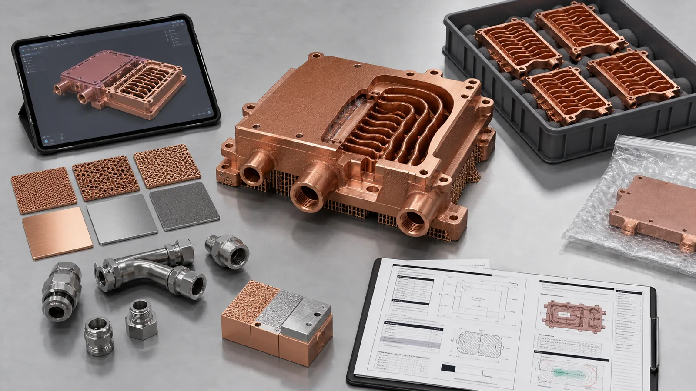
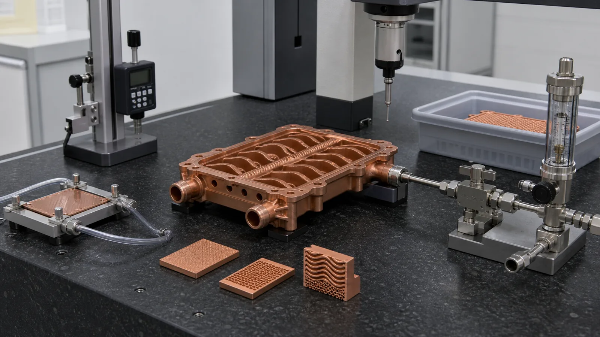

> A copper 3D printed part quotation becomes reliable only when the RFQ describes the function, geometry, material state, post-processing, and acceptance criteria. A STEP file and quantity are useful, but they are not enough for a serious copper additive manufacturing quote when internal channels, pressure boundaries, conductivity, sealing faces, or inspection records matter.

The fastest way to delay a copper AM quotation is to ask for "price for this copper part" without saying what the part must survive.

We have seen the same pattern many times. The CAD file looks complete. The model has ports, channels, bolt holes, and a polished copper appearance in the rendering. Then the quote review starts, and the missing information becomes the real project: no working pressure, no proof pressure, no coolant, no flatness target, no leak criterion, no material preference, no channel section view, no machining allowance, and no acceptance test.

That does not mean the part is impossible. It means the supplier cannot price the finished component honestly.

Copper additive manufacturing is different from ordering a simple machined bracket. Copper is chosen because it conducts heat or electricity, but the finished part often also has to work as a pressure boundary, RF surface, current path, thermal interface, vacuum component, or compact fluid manifold. The quote has to cover the full ledger: printing, heat treatment, support removal, machining, cleaning, leak testing, conductivity checks, dimensional inspection, packaging, and scrap risk.

## Start With the Function, Not the File

The first gate is simple: what must the copper part do that a conventional route cannot do cleanly?

For a heat transfer part, the answer may be coolant routing near a heat source, fewer brazed joints, or a package height below 20 mm. For a busbar or high-current conductor, the answer may be a three-dimensional current path with integrated cooling or mounting features. For an RF part, it may be a compact waveguide or cavity shape that is awkward to machine. For semiconductor equipment, it may be a mix of cooling, cleanliness, vacuum-facing surfaces, and repeatable thermal control.

State the function in one sentence before sending the RFQ:

- "This is a liquid-cooled copper cold plate for a 70 mm x 100 mm power module."
- "This is a CuCrZr cooling manifold with internal channels and threaded side ports."
- "This is a high-current copper conductor where contact resistance and mounting stiffness both matter."
- "This is a copper RF component where internal surface finish and dimensional control are critical."

That sentence tells the reviewer which risks to look for. Without it, the review becomes guesswork. A 0.05 mm flatness requirement matters for a thermal interface. It may not matter for a non-contact flow distributor. A 10 bar proof pressure matters for a cold plate. It may be irrelevant for a heat spreader. Conductivity may dominate one project, while thread stability or heat treatment may dominate another.

## The Core RFQ Checklist

Use this checklist before requesting a copper 3D printed part quotation. It does not make the project expensive by itself. It prevents hidden requirements from appearing after the first price.

| RFQ input | What to provide | Why it affects quotation |
| --- | --- | --- |
| CAD file | STEP, Parasolid, or native CAD with internal channels included | Defines build orientation, supports, powder removal, and machining stock |
| Drawing | Critical dimensions, datums, tolerances, surface finish, thread notes | Separates cosmetic surfaces from functional surfaces |
| Function | Thermal, electrical, RF, fluid, vacuum, tooling, or structural role | Tells the reviewer which failure mode matters most |
| Material route | Pure copper, CuCrZr, CuCr1Zr, or open to engineering review | Changes process window, heat treatment, properties, and cost |
| Internal channels | Section views, minimum passage size, longest flow path, branch count | Controls printability, cleaning, pressure drop, and inspection method |
| Operating limits | Temperature, pressure, flow, current, voltage, duty cycle, environment | Defines service risk and validation scope |
| Critical surfaces | Thermal face, sealing land, RF surface, contact pad, datum, thread, port | Determines CNC finishing and inspection effort |
| Acceptance tests | Leak, pressure, flow, CT, CMM, conductivity, hardness, roughness, cleanliness | Turns a printed body into an accepted component |
| Quantity and stage | Prototype, first article, pilot batch, production, target delivery | Changes fixture logic, documentation, and pricing strategy |

If you can complete at least 70% of this table, the quotation review becomes much faster. If you can complete less than half, the first response should probably be an engineering clarification, not a fixed price.

## CAD Files: Show the Real Internal Geometry

A copper additive manufacturing RFQ should include the internal geometry, not only the outside envelope.

For cold plates, heat exchangers, cooling jackets, and manifolds, send a file that includes channels, ports, wall thickness, caps, bosses, and any planned machining allowance. If the channel network is confidential, send a simplified review model with the same minimum passage size, longest flow path, and port relationship. A supplier cannot judge powder removal from an outside shape.

Useful channel data includes:

- Minimum channel width and height.
- Longest enclosed channel path between openings.
- Minimum wall thickness between channel and outer surface.
- Minimum wall thickness between channel and thread or bolt hole.
- Number of branches fed by one inlet.
- Dead-end pockets, blind volumes, or trapped-powder zones.
- Cleaning access, flush direction, and planned closure method if applicable.

A 0.8 mm channel may look attractive in CFD. It may also be difficult to depowder, inspect, and pressure test in a copper LPBF part. A 1.2-1.6 mm passage with better access may produce a more quotable component even if the simulation loses some local surface area. That is not conservative thinking. It is manufacturing reality.

For broader internal-channel context, see [Copper 3D Printing for Microchannel Cold Plates in Thermal Management](/posts/EngineeringGuide/copper-3d-printing-microchannel-cold-plates-thermal-management/) and [Copper AM Cleaning and Powder Removal for Internal Channels](/posts/EngineeringGuide/copper-am-cleaning-powder-removal-internal-channels/).

## Material Choice Must Match the Acceptance Criteria

Do not write "copper" as the only material requirement if the part depends on a specific property.

Pure copper, CuCrZr, and CuCr1Zr can all make sense, but they solve different problems. Pure copper is usually reviewed when maximum thermal or electrical conductivity is the main requirement and mechanical loads are controlled. CuCrZr and CuCr1Zr deserve review when pressure boundaries, threads, clamp load, thin walls, or repeated assembly make mechanical stability part of the thermal or electrical result.

Industrial suppliers frame copper AM materials around the same engineering directions. [EOS lists copper materials](https://www.eos.info/metal-solutions/metal-materials/copper) for applications linked to thermal and electrical conductivity, including heat exchangers, electronics, power electronics heat sinks, rocket propulsion systems, and copper coils. [Eplus3D presents copper AM materials](https://www.eplus3d.com/products/3d-printing-materials-copper/) for heat exchangers, induction coils, high-frequency electronics, molding, tooling, and electronics. Those application signals are useful, but they do not replace a part-specific review.

For material selection, provide:

- Preferred alloy: pure copper, CuCrZr, CuCr1Zr, or open.
- Required conductivity, if specified.
- Required hardness, strength, or material state, if specified.
- Heat-treatment requirement or limitation.
- Service temperature range and thermal cycling requirement.
- Any standard, customer specification, or data sheet that must be followed.
- Whether witness coupons are required.

If the part is still in development, it is acceptable to say "material open to review." That is better than forcing pure copper into a geometry that needs strength, or forcing CuCrZr into a part where maximum conductivity is the only important requirement.

## Critical Surfaces Decide the Post-Processing Cost

A printed copper body is rarely the final deliverable.

The quote changes sharply when the part has machined sealing lands, flat thermal faces, RF surfaces, contact pads, threads, datum pads, O-ring grooves, or tube/fitting interfaces. These surfaces need allowance in the model and clear requirements on the drawing.

Provide these values when they matter:

- Flatness target, such as +/-0.05 mm or a defined GD&T callout.
- Surface roughness target for thermal, sealing, RF, or electrical contact faces.
- Datum scheme and inspection reference.
- Thread size, depth, class, insert strategy, and torque.
- O-ring groove dimensions and compression assumptions.
- Port type, fitting standard, tube interface, or weld/braze interface.
- Machining stock, if already planned.
- Areas that must not be machined.

One hidden cost appears when the CAD model has no machining stock but the drawing requires a functional surface. Adding 0.5-1.0 mm of stock to a thermal face may be reasonable. Adding it late can change channel distance, wall thickness, weight, support strategy, and lead time.

We would rather see a rough drawing with critical surfaces circled than a beautiful rendering with no acceptance information.

_Figure 2. The quotation gate includes more than geometry: material, channels, pressure, finishing, inspection, and batch intent all change the quote._

## Operating Conditions: The Numbers That Change the Quote

For copper AM parts, operating data can be more important than the nominal dimensions.

For thermal and fluid components, provide:

- Heat load or heat-source map.
- Heat-source footprint, such as 60 mm x 80 mm or 100 mm x 120 mm.
- Coolant type, inlet temperature, and operating temperature range.
- Nominal flow rate and maximum pressure drop.
- Working pressure and proof pressure.
- Leak test method and acceptance limit.
- Cleanliness or particle requirement, if used in sensitive equipment.

For electrical components, provide:

- Current, voltage, duty cycle, and temperature rise target.
- Contact face requirements and plating requirement, if any.
- Insulation, clearance, creepage, or assembly constraints.
- Heat generated in the conductor or nearby devices.
- Torque, clamp load, and repeated assembly requirement.

For RF and microwave parts, provide:

- Frequency band and critical internal surfaces.
- Dimensional tolerances linked to RF performance.
- Surface finish and plating requirements.
- Vacuum, cleanliness, or outgassing expectations.
- Assembly datums and flange requirements.

These numbers do not need to be perfect during early design. They do need to be visible. A quote for a cold plate with 3 bar service pressure is different from a quote for one that must pass a 12 bar proof test. A busbar carrying 80 A steady state is different from one carrying 400 A pulses in a constrained thermal envelope.

## Cost Ledger: What Missing Information Does

Missing RFQ data does not disappear. It becomes risk allowance, clarification time, or rework.

| Missing item | Typical quotation effect | Better input |
| --- | --- | --- |
| No channel section view | Supplier must assume cleaning and blockage risk | Section views and minimum passage dimensions |
| No pressure target | Leak and proof-test scope cannot be priced | Working pressure, proof pressure, test medium |
| No critical surface definition | Machining may be underquoted or overquoted | Mark thermal, sealing, RF, datum, and contact faces |
| No material state requirement | Conductivity or hardness checks may be missed | Alloy, heat treatment, coupons, test method |
| No quantity stage | Fixture and inspection strategy remain unclear | Prototype, first article, pilot, or production batch |
| No acceptance method | Finished component scope is ambiguous | CMM, CT, leak, pressure, flow, conductivity, roughness |

In one project, a pressure test fixture saved the buyer from two ambiguous failure modes. It added about 2-3 working days to first-article release, but it separated a channel blockage problem from a seal-interface problem. Without the fixture, the team would have argued about whether the printed part, the gasket, or the pump setup caused the pressure-drop error.

That is the price of clarity. It is usually cheaper than discovering the missing requirement after parts are already printed.

## Case Pattern: A Quote That Changed After the Drawing Arrived

A representative RFQ involved a compact 3D printed copper cooling block for a power electronics fixture. The first inquiry included a STEP file and a quantity of five pieces. The outside envelope was about 95 mm x 70 mm x 18 mm, with two side ports and an internal serpentine channel. The buyer asked for "pure copper if possible."

The first review could not produce a responsible fixed quote because five key items were missing:

- Working pressure and proof pressure.
- Coolant and flow rate.
- Flatness requirement on the thermal face.
- Thread requirement for the side ports.
- Whether the part needed leak testing or only dimensional inspection.

After clarification, the project changed shape. The coolant flow was 2.0 L/min. Working pressure was 6 bar. Proof pressure was 10 bar. The thermal face needed about +/-0.05 mm flatness after finishing. The side ports required repeated assembly during test stand development.

Those values changed the route. The review moved from "print in copper" to a finished-component quote with CuCrZr as an option, machining stock on the thermal face, post-machined ports, pressure hold, flow check, and witness coupon review. The part did not become more complicated because the supplier wanted to add cost. It became more honest because the acceptance criteria finally matched the job.

The design also changed. Two channel transitions were opened slightly, local wall thickness near the port bosses increased by about 0.4 mm, and a machining datum was clarified. The thermal model lost a small amount of local surface area, but the quote became executable. The buyer could compare cost, lead time, and risk against the original concept.

That is what a good checklist does. It converts a price request into a manufacturing plan.

## Inspection Requirements Should Be Decided Before Quotation

Inspection is not paperwork after manufacturing. For copper AM, inspection can control the entire route.

Possible acceptance checks include:

- Dimensional inspection of external features.
- CMM report for datums, hole positions, port locations, and flatness.
- Surface roughness measurement on sealing, thermal, RF, or contact faces.
- Pressure hold or proof-pressure test.
- Leak test with defined method and acceptance limit.
- Flow test at specified coolant and flow rate.
- CT inspection for internal channels, if risk justifies it.
- Conductivity or hardness checks for material state.
- Witness coupons processed with the part.
- Cleanliness, drying, and packaging requirements.

The key is to match inspection to the failure mode. CT inspection can help with internal geometry risk, but it does not replace leak testing. A conductivity coupon can support material-state confidence, but it does not prove flatness after machining. A CMM report can confirm dimensions, but it does not show whether powder remains in a long internal passage.

If the part is going into semiconductor equipment, vacuum hardware, high-power electronics, RF systems, or production tooling, define the acceptance method early. A late-added CT requirement or helium leak test can change cost and lead time more than a small geometry edit.

_Figure 3. Finished copper AM parts should be quoted with the validation route included: machining, pressure or leak testing, flow checks, dimensional inspection, and material coupons where needed._

## Lead Time: Separate Review, Build, Finishing, and Validation

Buyers often ask for one lead time. Copper AM usually has four lead-time buckets.

The first bucket is engineering review. This includes geometry screening, material selection, channel review, support strategy, machining allowance, and clarification of acceptance criteria. A complete RFQ can move quickly. An incomplete RFQ may sit for days while basic service data is collected.

The second bucket is printing and thermal processing. Copper LPBF has a narrower process window than many steels because copper reflects common laser energy and conducts heat away rapidly. [NIST describes highly reflective metals such as copper](https://www.nist.gov/publications/ultra-high-speed-printing-regime-laser-powder-bed-fusion-highly-reflective-metals) as challenging in laser powder bed fusion because energy coupling and process conditions require careful control. The schedule must allow for machine availability, build orientation, supports, stress relief, and heat treatment when required.

The third bucket is CNC finishing and cleaning. Sealing lands, thermal faces, contact pads, threads, datum pads, and port seats normally need finishing. Internal channels may need flushing, drying, and verification.

The fourth bucket is validation. Leak testing, pressure testing, flow checks, CMM, roughness, conductivity, hardness, CT, or cleanliness records can add time. Some checks are quick. Others depend on fixture availability or third-party lab schedules.

If the deadline is fixed, say so. The supplier may recommend a staged approach:

1. Design-for-quotation review.
2. Prototype print with limited inspection.
3. First article with full acceptance testing.
4. Pilot batch with refined fixtures and inspection plan.

That sequence is usually more realistic than asking a first prototype to carry the full burden of production qualification.

## Quote Readiness Score

Use this quick scoring method before sending the package.

| Score | RFQ condition | What to expect |
| --- | --- | --- |
| 0-4 | CAD and quantity only, limited function data | Clarification questions before pricing |
| 5-7 | Function, material direction, critical surfaces, and basic operating data included | Budgetary or conditional quotation possible |
| 8-10 | CAD, drawing, operating limits, post-processing, inspection, quantity, and lead-time target included | Strong candidate for formal quotation |

Most serious copper AM projects should aim for 8/10 before requesting a formal quote. A 6/10 package can still start the conversation, but the first response should be treated as a review stage, not a final production price.

## What to Send for a Copper 3D Printed Part Quote

Before sending the RFQ to [info@szcomo.com](mailto:info@szcomo.com), collect:

- STEP or native CAD file with internal channels included.
- 2D drawing with datums, tolerances, critical surfaces, threads, and finish notes.
- One-sentence function statement.
- Preferred material or request for material review.
- Quantity, development stage, and target delivery date.
- Heat load, current, RF frequency, pressure, flow, temperature, or service environment.
- Coolant, gas, vacuum, or process media if applicable.
- Working pressure, proof pressure, and leak requirement for fluid parts.
- Conductivity, hardness, heat treatment, or coupon requirement if material state matters.
- Machining requirements for sealing lands, thermal faces, datums, ports, and contact pads.
- Inspection expectations: CMM, CT, leak, pressure, flow, roughness, conductivity, hardness, or cleanliness.
- Photos or assembly context if the part interfaces with existing equipment.
- Any current manufacturing route, failure history, or reason for considering copper AM.

If you do not know every value, mark it as unknown. A transparent unknown is easier to manage than a hidden requirement.

## FAQ

Can we get a copper 3D printed part quote with only a STEP file?

Sometimes, but it will usually be a rough or conditional quote. A STEP file can show geometry, but it does not define pressure, flow, conductivity, surface finish, heat treatment, leak testing, or acceptance criteria. For simple prototypes, CAD and quantity may start the review. For functional copper AM parts, more data is needed.

What is the most important missing item in copper AM RFQs?

For fluid and thermal parts, pressure and flow data are often missing. For electrical parts, current, contact surfaces, and temperature-rise targets are often missing. For RF parts, internal surface requirements and frequency band are often missing. Across all projects, the most common gap is unclear acceptance criteria.

Should we specify pure copper, CuCrZr, or CuCr1Zr?

Specify the alloy if it is required by your drawing, standard, or qualification plan. If the project is still in design review, describe the functional priority first: maximum conductivity, pressure integrity, thread stability, heat treatment, flatness, electrical contact, or RF surface. The material route can then be reviewed against the geometry and acceptance criteria.

Does copper additive manufacturing remove the need for CNC machining?

No. Copper AM creates the near-net internal and external geometry, but functional faces usually need machining. Thermal contact faces, sealing lands, datum pads, threads, O-ring grooves, port seats, RF surfaces, and electrical contact pads should be reviewed as post-processing items.

How can procurement compare quotes from different suppliers?

Compare the scope, not only the price. Check whether each quote includes material route, heat treatment, machining, cleaning, pressure or leak testing, flow testing, CMM, CT, conductivity or hardness checks, packaging, and documentation. A low quote for only the printed body may not be comparable to a quote for a finished and accepted component. Use the [copper 3D printing supplier audit](/posts/EngineeringGuide/how-to-audit-copper-3d-printing-supplier/) to verify process and change-control evidence, then use the [service capability matrix](/posts/EngineeringGuide/copper-3d-printing-service-capability-matrix/) to compare thermal, electrical, and RF requirements.

## Verdict

A strong copper 3D printed part quotation starts before pricing. It starts with a clear function, realistic material choice, complete internal geometry, defined critical surfaces, operating limits, and acceptance criteria.

For copper AM, the central question is not only "Can this shape be printed?" The better question is: can it be printed, cleaned, machined, tested, accepted, and used in the assembly without surprising the buyer later?

Send the CAD, drawing, quantity, material preference, operating conditions, critical surfaces, and inspection expectations together. That gives the supplier enough information to quote the finished component instead of guessing at the hidden work.

Related reading: [Pure Copper vs CuCrZr for 3D Printed Heat Transfer Parts](/posts/EngineeringGuide/pure-copper-vs-cucrzr-3d-printed-heat-transfer-parts/), [3D Printed Copper Heat Exchangers: Design Benefits and Manufacturing Limits](/posts/EngineeringGuide/3d-printed-copper-heat-exchangers-design-benefits-manufacturing-limits/), and [How Copper Additive Manufacturing Improves Liquid Cooling Plate Design](/posts/EngineeringGuide/how-copper-additive-manufacturing-improves-liquid-cooling-plate-design/).
