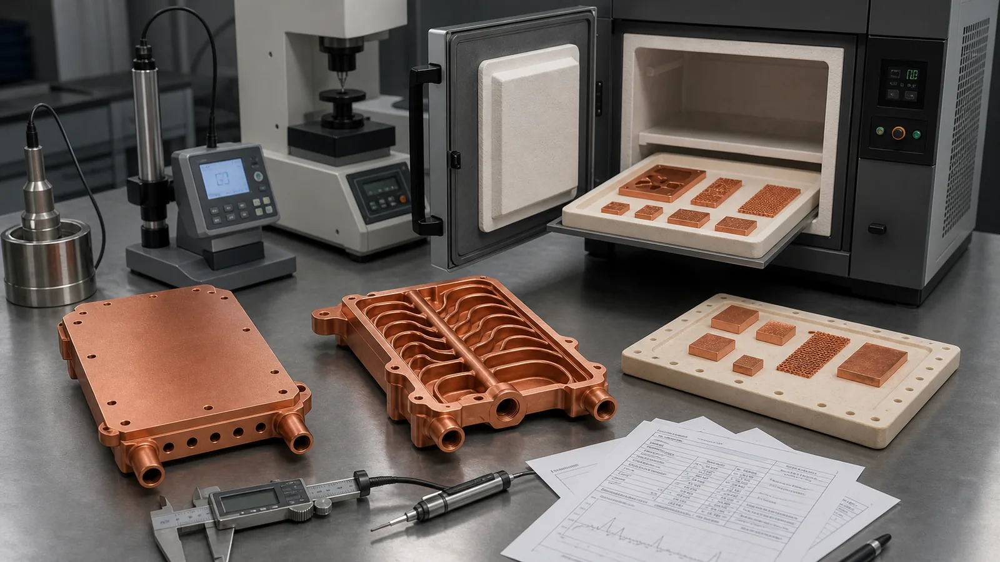
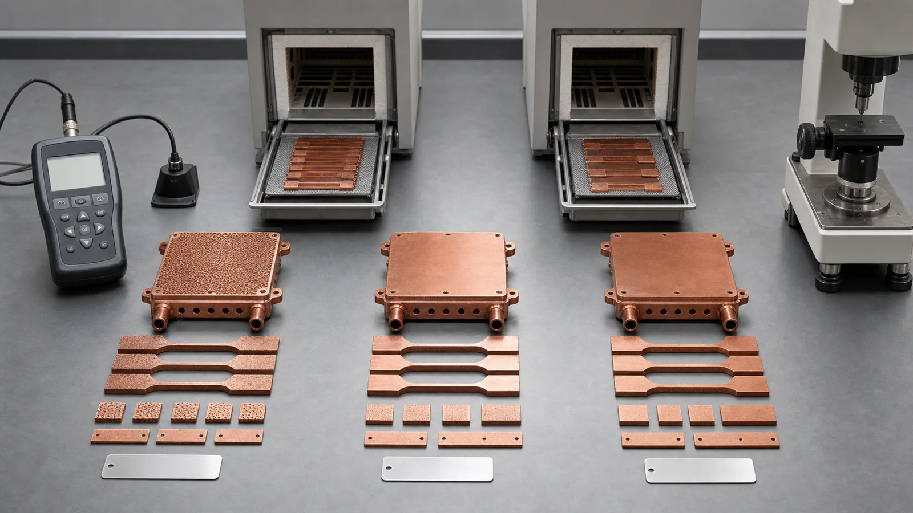
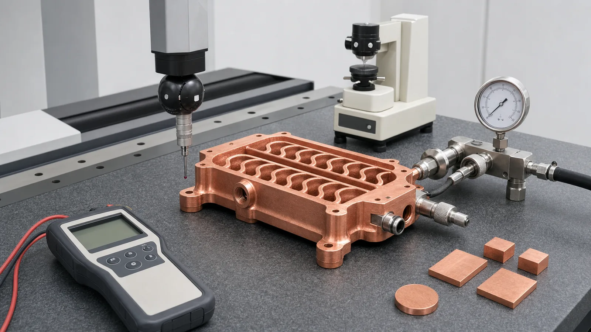

> Heat treatment for CuCrZr 3D printed components is not a generic oven note. It is a property route that affects conductivity, strength, hardness, dimensional movement, machining order, and final acceptance. A useful RFQ should state whether the part needs maximum conductivity, stronger threaded features, flatter sealing faces, or documented evidence from coupons processed with the same build.

The common drawing note is short:

"Heat treat after printing."

That note is usually not enough.

For CuCrZr additive manufacturing, heat treatment is one of the reasons to choose the alloy in the first place. CuCrZr is a precipitation-hardenable copper alloy route, so the printed state, aged state, machined state, and accepted component state are different deliverables. A cold plate that looks correct after LPBF can still fail because the threaded ports are soft, the sealing face moves after aging, or the conductivity check was never tied to the same process route.

We treat heat treatment as a process-window decision. The question is not only "What temperature and time?" The better question is "Which finished property protects the part from its most likely failure?"

_Figure 1. Heat treatment should be planned with the printed part, witness coupons, machining stock, conductivity checks, and hardness or dimensional inspection in the same manufacturing route._

## Start With the Property Target

CuCrZr is often selected when pure copper looks attractive but the finished component also needs mechanical reserve. That reserve may be needed around M5 or M6 ports, thin walls near 1.0-1.8 mm internal channels, clamped thermal faces, pressure boundaries, or tooling inserts that see repeated assembly.

The first gate is simple:

| Finished-component requirement | Heat-treatment decision to define | Evidence that should be quoted |
| --- | --- | --- |
| Highest practical conductivity | Conductivity-oriented aging route | Conductivity coupon, test method, material state |
| Threaded ports and clamp load | Strength or hardness-oriented route | Hardness check, tensile coupon if required, thread inspection |
| Tight flatness after machining | Sequence of aging, stress relief, and finish machining | CMM report, datum strategy, pre/post thermal movement review |
| Pressure or leak-critical channels | Thermal route plus final pressure or leak test | Proof pressure, leak limit, channel cleaning evidence |
| Qualification-sensitive production | Supplier-qualified route, not a copied recipe | Data sheet route, batch traceability, witness coupons |

The table matters because one CuCrZr route may not maximize every property at the same time. A route optimized for conductivity may not be the same route selected for tensile performance or hardness. A route that looks good on a small coupon may still move a thin cold plate enough to change a +/-0.05 mm flatness requirement.

That is why a good RFQ avoids one-line instructions. It defines the property that must not fail.

## What Public Material Data Tells Us

Published material data is useful, but it needs to be read as supplier-specific process evidence.

The [EOS CopperAlloy CuCrZr data sheet](https://www.eos.info/metal-solutions/data-sheets/all-processes-and-materials?id=eos-copperalloy-cucrzr) lists different heat-treatment routes for different property targets, including a conductivity-oriented aging route and a tensile-oriented aging route under inert atmosphere. The practical lesson is not that every project should copy those exact settings. The lesson is that CuCrZr properties are tied to the validated machine, powder, parameter set, heat treatment, orientation, and test method.

That same caution applies to adjacent copper-chromium-zirconium routes. [3D Systems lists CuCr1Zr(A)](https://www.3dsystems.com/materials/cucr1zr-a) as an additive manufacturing copper alloy route for heat management and high-strength conductive applications, and its published data sheet discusses high conductivity after specified processing. CuCr1Zr and CuCrZr can be close in application intent, but they are not interchangeable when a drawing, standard, or qualified supplier route names one exact material path.

Suppliers such as [Eplus3D](https://www.eplus3d.com/products/3d-printing-materials-copper/) also position copper and CuCrZr materials around heat exchangers, electronics, and electrical hardware. Those application pages confirm the commercial direction of copper additive manufacturing. They do not remove the need to define the heat-treated state of the finished component.

For material choice before heat treatment, see [Copper Alloy Selection for Metal 3D Printing: Pure Cu vs CuCrZr vs CuCr1Zr](/posts/EngineeringGuide/copper-alloy-selection-metal-3d-printing-pure-cu-cucrzr-cucr1zr/) and [Pure Copper vs CuCrZr for 3D Printed Heat Transfer Parts](/posts/EngineeringGuide/pure-copper-vs-cucrzr-3d-printed-heat-transfer-parts/).

## The Heat-Treatment Route Should Follow the Failure Mode

In a real quotation review, "heat treat CuCrZr" branches into at least three routes.

### Route A: Conductivity-Led Aging

Use this route when the part is mainly a thermal or electrical conductor and the mechanical requirements are controlled.

Typical examples include broad heat spreaders, moderate-pressure cold plates, electrical terminals with machined contact faces, or cooling blocks where the contact path dominates performance. The acceptance plan should include conductivity evidence, not only a statement that heat treatment was performed. A common practical target might be a minimum conductivity measured on witness coupons, with the final value tied to the same powder batch, build platform, and aging cycle.

The hidden cost is inspection scope. Adding two or four coupons looks minor in CAD, but it adds traceability, handling, testing, and review. We still prefer that cost over discovering late that the finished component has the right geometry but the wrong material state.

### Route B: Strength or Hardness-Led Aging

Use this route when the copper part has to survive mechanical abuse.

Threaded ports, bolt bosses, clamp-loaded thermal faces, pressure fittings, mold insert edges, and repeated assembly can make a slightly lower-conductivity but stronger state more valuable than a conductivity-maximized state. In one cooling-block review, the decisive risk was not bulk heat flow. It was whether two side ports would stay stable after machining, torque, and 9 bar proof-pressure testing.

The quote should state whether hardness, tensile properties, or thread inspection are required. If a tensile coupon is needed, specify orientation, heat-treatment route, and whether the coupon is built with the part or from a separate qualification build.

### Route C: Dimensional-Stability-Led Sequencing

Use this route when flatness, parallelism, sealing lands, or datums are the real acceptance gate.

CuCrZr heat treatment can change residual stress and dimensional state. The movement may be small, but small is not harmless when the drawing calls for +/-0.03 mm flatness on a thermal face or a sealing land near internal channels. In those cases, the process order can matter more than the nominal material selection.

A practical route may be:

1. Print with machining stock on functional faces.
2. Remove supports and complete initial cleaning.
3. Apply the supplier-qualified heat-treatment route.
4. Finish-machine datums, sealing faces, and threads after thermal processing.
5. Inspect flatness, ports, channel cleanliness, and functional tests after finishing.

This sequence is not universal, but it protects the drawing from being validated too early. Measuring flatness before aging does not prove the final component will seal.

_Figure 2. The same CuCrZr geometry can follow different aging routes depending on whether conductivity, hardness, tensile behavior, or dimensional stability is the controlling requirement._

## Machining Order Is Part of the Heat-Treatment Decision

CuCrZr AM parts are rarely accepted straight from the printer. The useful component usually includes machined sealing lands, datum pads, threaded ports, flat thermal interfaces, polished or plated contact areas, and cleaned internal channels.

That creates a sequencing problem.

If the part is machined too early, later aging may move a face that was already finished. If the part is heat treated too late, final dimensions and threads may change after inspection. If the part is cleaned before all machining is complete, loose chips or abrasive residue can re-enter internal channels. If pressure testing is done before final finishing, the test may not represent the actual sealing surface.

For most CuCrZr thermal and fluid parts, we review this order:

| Step | Engineering reason | Common mistake |
| --- | --- | --- |
| Build and support removal | Establish printed body and remove obvious process risk | Assuming the printed blank is the finished part |
| Initial depowdering and visual inspection | Remove trapped powder before thermal processing where possible | Leaving closed channels unverified |
| Heat treatment or aging | Set material state before final dimensions are locked | Adding vague heat treatment after drawing release |
| CNC finishing | Create datums, sealing lands, threads, and contact faces | Modeling final surfaces with no machining stock |
| Final cleaning and drying | Remove chips, abrasive residue, and loose powder | Treating cleaning as cosmetic |
| Functional acceptance | Check flatness, leak, pressure, flow, conductivity, hardness, or CMM | Testing coupons but not the component function |

This is where a heat-treatment note becomes an RFQ package. The route should connect to [post-processing methods for 3D printed copper parts](/posts/EngineeringGuide/post-processing-methods-for-3d-printed-copper-parts/), [tolerances and dimensional accuracy in copper metal 3D printing](/posts/EngineeringGuide/tolerances-and-dimensional-accuracy-in-copper-metal-3d-printing/), and [copper AM surface finish options](/posts/EngineeringGuide/copper-3d-printing-surface-finish-as-built-machined-polished-options/).

## Case Pattern: A CuCrZr Cooling Block That Needed the Right State

A representative project involved a compact liquid cooling block for a high-power test fixture. The part envelope was about 140 mm x 85 mm x 18 mm. It included internal serpentine channels, two threaded side ports, a machined thermal face, and eight mounting holes around the perimeter.

The first RFQ asked for CuCrZr and heat treatment. It did not specify which property mattered most.

During review, the controlling requirements were clearer:

- Working pressure: 8 bar.
- Proof pressure: 12 bar.
- Thermal face flatness: +/-0.05 mm after final machining.
- Machining stock on the contact face: 0.6-0.8 mm.
- Target surface roughness on the thermal face: Ra 1.6 um after machining.
- Ports: repeated assembly trials before release.

The thermal team cared about conductivity. The mechanical team cared about threads, pressure, and flatness. Procurement only wanted a quote that would not grow after drawing release.

We treated the heat treatment as a route decision instead of a checkbox. The revised RFQ asked suppliers to quote a supplier-qualified CuCrZr aging route, identify whether it was oriented toward conductivity or strength, and include witness coupons processed with the part. Final CNC finishing was placed after heat treatment for the thermal face, sealing lands, and threads. Pressure testing, flow check, and dimensional inspection were placed after final cleaning.

The price of success was real. The quote added coupons, heat-treatment traceability, CMM inspection, and a pressure test fixture. Lead time increased by several working days. But the alternative was worse: a lower first price with no evidence that the finished part had the material state that justified CuCrZr.

The case did not prove that CuCrZr is always better than pure copper. It proved that the material state must be tied to the part failure mode. If the same block had used wide channels, low pressure, no threaded ports, and a tolerant interface, pure copper might have remained the better route.

## How Heat Treatment Changes RFQ Language

The best RFQ language is specific enough to price and flexible enough for a qualified supplier to use its validated route.

A weak note says:

> Print in CuCrZr and heat treat.

A better note says:

> Material: CuCrZr or supplier-equivalent copper-chromium-zirconium AM route, subject to engineering approval. Supplier shall state heat-treatment route and property target. Include witness coupons processed with the build when conductivity, hardness, or tensile evidence is quoted. Final machining of sealing faces and threaded ports shall occur after heat treatment unless supplier proposes an approved alternate sequence.

For a pressure or thermal part, add:

> Quote shall include final cleaning, pressure or leak test after machining, CMM inspection of functional datums, and conductivity or hardness evidence where required by the drawing.

For an early prototype, do not over-specify. State the decision goal:

> Prototype goal: compare pure Cu and CuCrZr routes for thermal performance, thread stability, and flatness after finishing. Supplier should recommend material state, coupons, and inspection scope.

That language helps avoid two common quotation failures. The first is underpricing a printed blank when the buyer needs a finished component. The second is over-constraining a heat-treatment recipe without knowing the supplier's qualified parameter set.

For broader RFQ structure, use the [engineering checklist for copper 3D printed part quotation](/posts/EngineeringGuide/engineering-checklist-copper-3d-printed-part-quotation/) and [cost drivers in copper 3D printing projects](/posts/EngineeringGuide/cost-drivers-in-copper-3d-printing-projects/).

## Acceptance Checks After Heat Treatment

Heat treatment should end with evidence, not assumptions.

The right evidence depends on the component. A busbar may need conductivity and machined contact faces. A cold plate may need pressure hold, leak check, flow confirmation, and flatness. A mold insert may need CMM, cavity finish, pressure test, and proof that conformal channels were cleaned. A semiconductor cooling part may need cleaning, drying, leak testing, and documentation compatible with the equipment environment.

Common checks include:

- Conductivity on coupons or accessible part features, with method stated.
- Hardness check when strength or wear resistance supports the decision.
- Tensile coupons when the program requires mechanical property evidence.
- CMM inspection of datums, sealing lands, threaded ports, and mounting holes.
- Flatness and roughness checks on thermal contact faces.
- Pressure hold or leak testing after final machining and cleaning.
- Flow check when internal-channel restriction or trapped powder is a risk.
- CT scan or borescope review when channels are dense or critical.

[ISO/ASTM 52908](https://www.iso.org/standard/81779.html) is useful as a reference point because it treats additive manufacturing post-processing as part of the production chain, not as a cosmetic afterthought. For copper AM, that mindset is especially important. Heat treatment, machining, cleaning, testing, and documentation are connected.

_Figure 3. Acceptance should verify the heat-treated component as a finished part: material state, machined datums, pressure boundary, channel cleanliness, and functional surfaces._

## Where CuCrZr Heat Treatment Adds the Most Value

CuCrZr heat treatment is most valuable when the part combines conductivity with mechanical risk. That makes it relevant to several copper AM application clusters:

- [Microchannel cold plates](/posts/EngineeringGuide/copper-3d-printing-microchannel-cold-plates-thermal-management/) where pressure, flatness, and cleaning control acceptance.
- [3D printed copper heat exchangers](/posts/EngineeringGuide/3d-printed-copper-heat-exchangers-design-benefits-manufacturing-limits/) where thin walls and integrated manifolds need a stable route.
- [Copper cooling blocks for semiconductor equipment](/posts/EngineeringGuide/copper-3d-printed-cooling-block-case-study-semiconductor-wafer-processing-equipment/) where leak testing and clean channels matter.
- [Copper mold inserts with conformal cooling](/posts/EngineeringGuide/copper-am-conformal-cooling-mold-inserts/) where heat flow must coexist with tooling interfaces.
- [Copper busbars and induction coils](/posts/EngineeringGuide/3d-printed-copper-busbars-induction-coils-rfq/) when electrical function also requires structural reliability.
- [RF and vacuum copper hardware](/posts/EngineeringGuide/copper-am-vacuum-manifold-case-study-rf-semiconductor-hardware/) when thermal, sealing, surface, and documentation requirements overlap.

It is less useful when the part is a simple low-load conductor and pure copper can meet the requirement with fewer process steps. Heat treatment is not a way to rescue an unmanufacturable design. It will not fix trapped powder in blind channels, missing machining stock, unsupported thin walls, or an RFQ that never defined the acceptance test.

## Practical Readiness Check

Before releasing a CuCrZr AM drawing, answer these questions:

- Is the part being selected for conductivity, strength, hardness, dimensional stability, or a combination?
- Does the drawing require CuCrZr, CuCr1Zr, pure copper, or supplier review?
- Which heat-treated property must be documented?
- Are witness coupons required, and will they follow the same build and heat-treatment route?
- Which surfaces need stock for machining after heat treatment?
- Which dimensions must be inspected after final finishing, not before?
- Is pressure, leak, flow, CT, or cleanliness evidence required?
- Could later brazing, soldering, plating, or service temperature change the material state?
- Is the quote for a printed blank or a finished accepted component?

If those answers are missing, the supplier can still quote something. The problem is that "something" may not be the part your system needs.

## Recommendation

Choose CuCrZr heat treatment when the finished copper component needs a controlled balance of conductivity and mechanical stability. Do not specify it as a generic post-processing line. Specify the property target, supplier-qualified route, machining sequence, coupons, and acceptance checks.

For a thermal part, the strongest route is usually practical rather than elegant:

- Leave machining stock on functional surfaces.
- Heat treat before final machining when flatness or threads are critical.
- Use coupons when conductivity, hardness, or tensile evidence matters.
- Validate the component after final cleaning, not just the printed blank.
- Let the supplier state its qualified route instead of copying settings from a public data sheet into a different process.

That is how CuCrZr heat treatment becomes an engineering control instead of an expensive assumption.

## FAQ

Is heat treatment required for CuCrZr 3D printed parts?

Usually, yes, if the project selected CuCrZr for its conductivity-strength balance. The exact route should come from the supplier's qualified process and the required property target. A non-critical prototype may use a simplified route, but production parts should define the material state and acceptance evidence.

Does heat treatment increase conductivity in CuCrZr AM parts?

It can, depending on powder, machine, parameter set, aging route, and test method. Public CuCrZr data sheets show that heat treatment can significantly change conductivity, but those values are supplier-specific. Quote the required conductivity evidence instead of assuming a universal number.

Should CuCrZr parts be machined before or after heat treatment?

Critical sealing faces, thermal interfaces, threaded ports, and datums are often finish-machined after heat treatment so the final inspection represents the final material state. Some rough machining or support removal can happen earlier. The correct sequence depends on geometry, movement risk, and supplier practice.

Can pure copper use the same heat treatment as CuCrZr?

No. Pure copper and CuCrZr have different metallurgy and different property routes. Pure copper is usually selected for maximum conductivity, while CuCrZr depends on precipitation-hardening behavior. Do not transfer a CuCrZr aging note to pure copper without material engineering review.

What should be included in an RFQ for heat-treated CuCrZr AM parts?

Include material designation, target property, operating pressure or temperature, critical surfaces, machining stock, heat-treatment route or supplier standard, coupon requirements, inspection methods, leak or pressure test needs, flow or cleaning evidence, and whether the quote is for a printed blank or a finished component.

> _Disclaimer: All scenarios described are based on real or closely analogous executed projects. If you choose to implement any of the examples described in this article, please conduct a careful evaluation first. This site assumes no responsibility for losses resulting from implementations made without prior evaluation._
