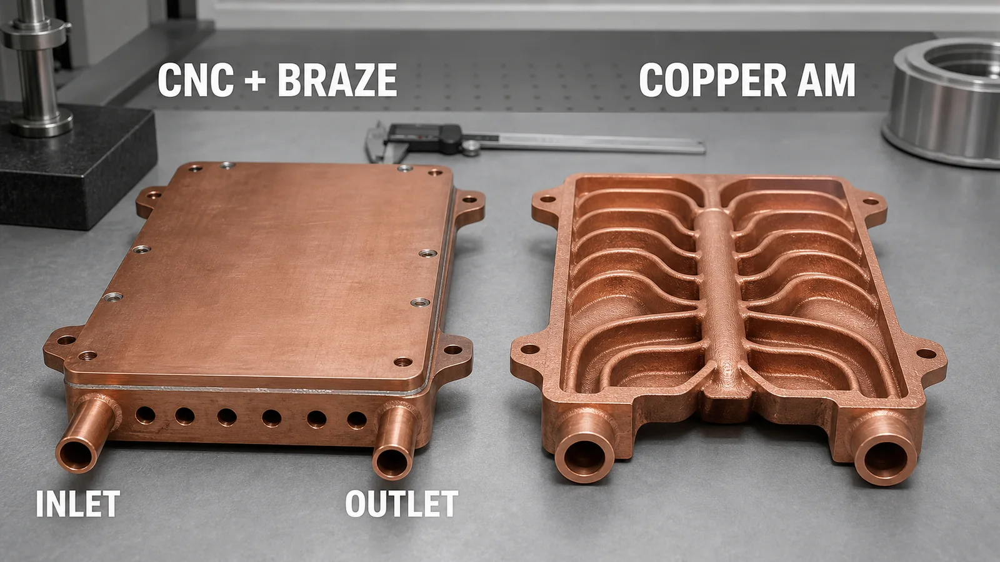
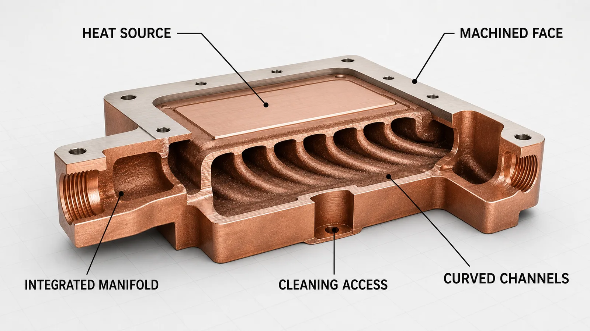
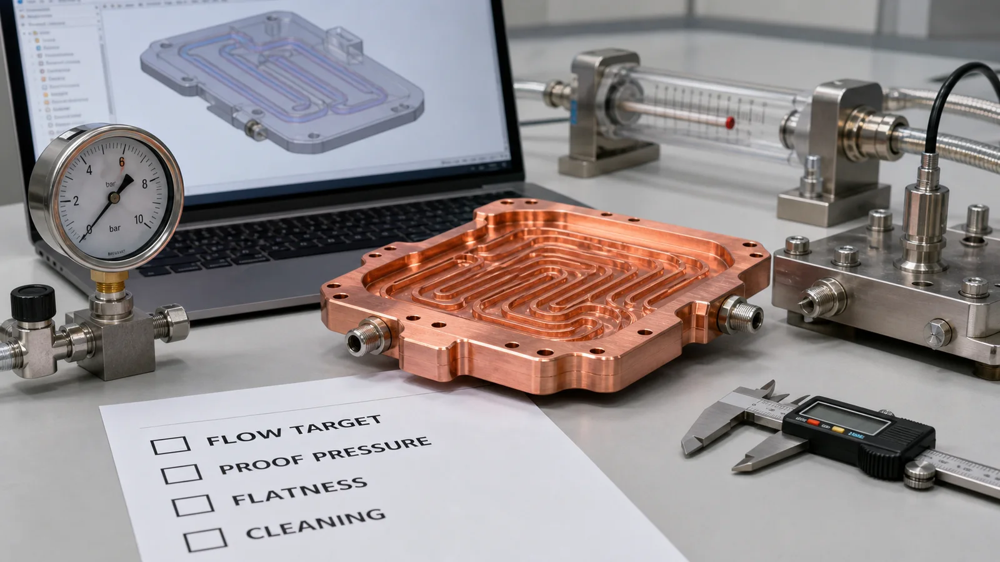

> Copper additive manufacturing improves liquid cooling plate design when the coolant path, manifold geometry, package height, or leak-path risk cannot be handled well by drilling, milling, brazing, or stacked assemblies. The benefit is not automatic. The design must still pass pressure drop, powder removal, machining, flatness, leak testing, and cleanliness review.

The strongest cooling plate RFQs usually start with a packaging problem, not a printing problem.

A power module gets shorter. A laser package loses 6 mm of available height. A test fixture needs coolant around fasteners and sensor pockets. A server component has ports that cannot sit where a drilled channel wants them. In those cases, the first CAD model often becomes a negotiation between thermal need and manufacturing access.

Conventional copper cooling plates work well when the channels are straight, the cover plate is easy to braze, and the sealing faces are accessible. We still recommend that route for many flat plates because it is understood, inspectable, and cost-efficient. Copper additive manufacturing becomes interesting when the conventional route forces a larger envelope, adds too many joints, or leaves hot spots because the coolant path cannot reach the loaded region.

That is the honest frame. Copper AM does not make liquid cooling easy. It changes which design freedoms are available and which controls must be paid for.

_Figure 1. Copper AM improves the design space when curved internal channels and integrated manifolds solve a packaging or thermal problem that a drilled and brazed route cannot handle cleanly._

## The Design Ladder: What Actually Improves

The word "improves" needs a boundary. In liquid cooling plate work, copper additive manufacturing usually improves one or more of these five design areas:

| Design area | What AM can improve | What still needs control |
| --- | --- | --- |
| Coolant routing | Curved channels can pass around keep-out zones and fasteners | Pressure drop and powder removal still limit the geometry |
| Heat-source coverage | Channels can follow a hot-spot pattern instead of a straight drill path | Internal roughness and flow balance can change the thermal result |
| Manifold integration | Inlet and outlet manifolds can be built into one body | Port machining and leak testing remain mandatory for fluid parts |
| Assembly risk | Fewer brazed or gasketed interfaces can reduce leak-path count | Printed bodies still need proof pressure and sealing-face inspection |
| Package height | A monolithic body can reduce stack height in some layouts | Machining stock and flatness control may add thickness back |

This is why a useful design review starts with the cooling duty, not the AM feature list. A curved channel is only valuable if it lowers temperature, reduces envelope, improves flow distribution, or removes a real assembly risk.

One practical example: a machined plate with six drilled channels may meet the bulk heat load but leave a 12-18 C gradient across the die attach region. A printed route can place coolant closer to the local hot zone and use a wider outlet manifold to reduce branch imbalance. That design may still need 0.5-1.0 mm machining stock on the contact face and a flow test at 2-4 L/min before anyone trusts the result.

The geometry improves the opportunity. The verification proves whether it was useful.

### Why Copper Changes the Cooling Plate Discussion

Copper is attractive because thermal conductivity and electrical conductivity matter in the same hardware families that need liquid cooling: power electronics, RF systems, laser packages, battery systems, semiconductor tooling, and compact test equipment.

The processing difficulty is also real. In laser powder bed fusion, copper reflects much of the infrared laser energy and conducts heat away quickly. Those two facts narrow the stable process window. A printed copper plate may need a suitable material route, parameter set, build orientation, heat treatment, and machining plan before it becomes a reliable cooling component.

For many projects, the material decision is not simply "copper or not copper." It is often:

- Pure copper when maximum conductivity is the main reason for the part.
- CuCrZr or CuCr1Zr when strength, thread stability, heat treatment response, or operating robustness matters more than the last increment of conductivity.
- A conventional machined or brazed copper assembly when the channel geometry is simple and the acceptance burden should stay low.

As of 2026, most serious copper AM discussions still come back to that trade-off. Thermal performance, printability, finishing, and inspection have to be reviewed together.

## Internal Channels Are the Main Design Lever

Liquid cooling plates are rarely limited by copper conductivity alone. They are usually limited by how close the coolant can get to the heat source, how evenly flow is distributed, and how much pressure drop the pump budget can tolerate.

Copper additive manufacturing can improve that layout by combining features that are hard to machine in one piece:

- Curved channels under an irregular heat-source footprint.
- Split and recombined flow branches for better coverage.
- Integrated inlet and outlet manifolds.
- Local channel density changes near hot spots.
- Internal transitions from round ports to rectangular cooling fields.
- Mounting bosses, sensor pockets, or structural ribs near the coolant path.

The trap is over-optimization. A CFD model may reward narrower passages, sharper turns, and dense branching. Manufacturing may punish the same choices with trapped powder, higher roughness, difficult drying, and pressure drop that is 20-40% above the clean theoretical model.

We have seen this more than once. The thermal model was not careless; it simply assumed a smoother and cleaner internal world than the printed part delivered.

_Figure 2. The useful AM design levers are internal: channel coverage, manifold integration, cleaning access, machined faces, and port geometry._

### The Pressure Drop Ledger

A cooling plate is not better if the coolant path looks sophisticated but exceeds the pump budget.

For early design review, we usually ask for the nominal flow rate, maximum allowable pressure drop, coolant, working pressure, and proof pressure. If the RFQ says only "water-cooled copper plate," the supplier has to guess too much. If it says "water-glycol, 2.5 L/min nominal, pressure drop below 60 kPa, working pressure 4 bar, proof pressure 1.5x," the manufacturing review can become specific.

The design ledger often looks like this:

| AM design choice | Thermal effect | Manufacturing or test cost |
| --- | --- | --- |
| Smaller channel hydraulic diameter | More surface area and local heat transfer | Higher pressure drop, harder depowdering, more inspection uncertainty |
| More flow branches | Better hot-spot coverage | Branch imbalance and cleaning risk |
| Integrated manifold | Lower assembly height and fewer joints | More complex internal geometry and CT or flow-test need |
| Curved routing | Better fit around keep-outs | Roughness and local powder retention can rise in low-flow zones |
| Monolithic body | Reduced brazed interfaces | Requires machining of ports, sealing faces, and contact surfaces |

This is the price of the design freedom. A printed copper cooling plate can be smaller and more functionally integrated, but the quote has to include the steps that make the internal geometry usable.

## Case Pattern: The Plate That Got Better After It Became Less Aggressive

A representative project involved a liquid cooling plate for a compact power electronics assembly. The first concept had a thin copper body, curved channels under two heat sources, and a compact internal manifold. The target was reasonable: keep the interface flat within +/-0.05 mm after machining, maintain a pressure drop below 50 kPa at nominal flow, and pass a pressure test before thermal testing.

The first AM concept looked strong on the screen. It used narrow passages near the heat sources and a dense branch network to maximize wetted area.

The first manufacturing review pushed back on three points:

- Several channel turns were hard to depowder through the final ports.
- The smallest branches had too much pressure-drop uncertainty.
- The sealing face needed more machining allowance than the first CAD model provided.

We changed the design instead of defending it.

The revised plate used slightly larger passages in the lowest-value regions, fewer branches near the outlet, and a cleaner port transition for flushing. The design lost some theoretical surface area, roughly 8-10% in the hottest region, but gained a more realistic cleaning path and a lower risk of first-article rework.

That trade was worth it. The final plate was not the most aggressive CFD geometry. It was the geometry that could be printed, cleaned, machined, pressure tested, and used.

The hidden cost was not only the redesign time. The flow-test fixture and port adapters added setup effort before the first batch. For a single prototype, that extra work can feel heavy. For a qualification program, it prevents a much more expensive failure later.

## Where Copper AM Beats Conventional Plate Design

Copper AM is most useful when at least one design constraint is hard and measurable.

Choose copper additive manufacturing when:

- The coolant path must follow a non-straight heat-source pattern.
- The plate needs an integrated manifold inside a tight package.
- Brazing adds too many leak paths or thermal cycle concerns.
- The design has local hot spots that straight channels cannot cover.
- Ports must avoid keep-out zones, fasteners, electrical features, or optics.
- A prototype program needs fast internal geometry changes before tooling.

Stay with conventional machining, brazing, or assembled copper plates when:

- The channel network is straight and accessible.
- The package can tolerate a cover plate or stacked construction.
- Unit price is the controlling requirement and performance is already met.
- The internal channel cannot be cleaned through available ports.
- The drawing requires smooth internal surfaces that cannot be finished.
- The RFQ has no flow, pressure, leak, flatness, or cleanliness requirement.

This comparison is not about defending one process. It is about choosing the route with the lowest total risk for the actual geometry.

### Flatness, Ports, and Sealing Faces Still Belong to CNC

Even when the body is printed, a serious liquid cooling plate is rarely finished directly from the build plate.

Critical faces usually need CNC machining. Threaded ports need controlled geometry. O-ring grooves, gasket surfaces, mounting datums, and heat-transfer interfaces often require a surface finish that the as-built AM process does not provide. Depending on plate size and application, flatness requirements may sit around +/-0.03-0.10 mm, and that should be stated in the RFQ instead of assumed.

This is where some early AM designs fail commercially. They count only the printed shape and forget the finishing stack. The print may be the enabling step, but machining, deburring, cleaning, leak testing, and dimensional inspection are what turn it into a cooling plate.

## RFQ Inputs That Make the Design Review Faster

The fastest useful quote is not the one with the fewest questions. It is the one where the important questions are already visible.

For a copper AM liquid cooling plate, send:

- STEP or native CAD, including internal channels.
- A drawing or section view that marks critical channels and surfaces.
- Heat load, heat-source footprint, and target temperature limit if known.
- Coolant type and operating temperature range.
- Nominal flow rate and pressure-drop limit.
- Working pressure, proof pressure, and leak acceptance method.
- Material preference: pure copper, CuCrZr, CuCr1Zr, or open to review.
- Flatness and surface finish requirements for contact and sealing faces.
- Port thread, fitting, or tube interface requirements.
- Quantity, stage, and expected inspection level.
- Whether CT, flow testing, leak testing, filtered flushing, or special packaging is expected.

Without proper gauging and a defined machining datum, we cannot guarantee interface flatness beyond the specified inspection method. Without a flow target, we cannot tell whether a channel network is thermally useful or merely printable. Without cleaning access, a compact internal manifold can become a trapped-powder risk.

_Figure 3. A strong RFQ defines the functional tests before the quote: flow target, pressure, flatness, cleaning, material, and acceptance level._

## Readiness Check Before You Choose AM

Before moving a liquid cooling plate from conventional design to copper AM, answer these questions.

| Question | Why it matters |
| --- | --- |
| Does the channel geometry solve a problem that machining cannot solve cleanly? | Prevents using AM as an expensive substitute for simple milling |
| Can every internal path be depowdered and flushed? | Protects flow performance and cleanliness |
| Is the pressure-drop target realistic for as-built internal roughness? | Avoids late pump or thermal test failure |
| Which faces will be machined after printing? | Controls flatness, sealing, and assembly |
| Is pure copper required, or can CuCrZr be reviewed? | Balances conductivity, strength, and process stability |
| What is the acceptance method? | Aligns quote, inspection, and delivery risk |

If the answer to the first question is weak, AM may not be the right route. If the answer to the cleaning and acceptance questions is weak, the route may be technically promising but not ready for quotation.

## FAQ

Does copper AM always reduce the cost of a liquid cooling plate?

No. Copper AM can reduce assembly complexity or prototype iteration time, but it often adds printing, depowdering, CNC finishing, inspection, and test cost. It is most cost-effective when the internal geometry creates value that conventional manufacturing cannot provide cleanly.

Can copper AM replace brazed cold plates?

Sometimes. It can reduce brazed interfaces when a monolithic internal channel network is practical. Brazed cold plates remain strong when the design is flat, accessible, and already meets thermal and leak requirements at lower cost.

What is the main design risk in printed copper liquid cooling plates?

The main risk is treating the internal channel network as only a thermal feature. It is also a powder-removal, pressure-drop, cleaning, inspection, and leak-test feature. The channel shape must support all of those requirements.

Should the first article be CT scanned?

CT can be valuable for new internal channel networks, high-risk manifolds, or first-article validation. It should not replace functional checks. Flow testing, pressure testing, leak testing, and interface inspection still matter because they test what the cooling plate must do.

What material should be used for a printed copper cooling plate?

Pure copper is preferred when conductivity is the main driver. CuCrZr or CuCr1Zr may be reviewed when strength, threaded features, heat treatment response, or operating robustness matter more. The right choice depends on thermal duty, mechanical load, finishing, and acceptance criteria.

## Verdict

Copper additive manufacturing improves liquid cooling plate design when it gives the coolant a better path, integrates the manifold, reduces assembly interfaces, or keeps the cooling function inside a tighter envelope.

It is the wrong choice when the geometry is simple, the quote is driven only by unit price, or the internal channel network cannot be cleaned and tested.

Our practical recommendation is to use copper AM for the geometry it uniquely enables, then budget for the process controls that make the plate usable: machining, flatness inspection, cleaning, pressure testing, leak testing, and flow verification.

Send CAD, drawings, quantity, heat load, coolant, flow target, pressure limits, material preference, critical surfaces, and inspection needs to [info@szcomo.com](mailto:info@szcomo.com). A useful review can start from a STEP file, but a serious liquid cooling plate quote needs the operating and acceptance context.

> _Disclaimer: All scenarios described are based on real or closely analogous executed projects. If you choose to implement any of the examples described in this article, please conduct a careful evaluation first. This site assumes no responsibility for losses resulting from implementations made without prior evaluation._
