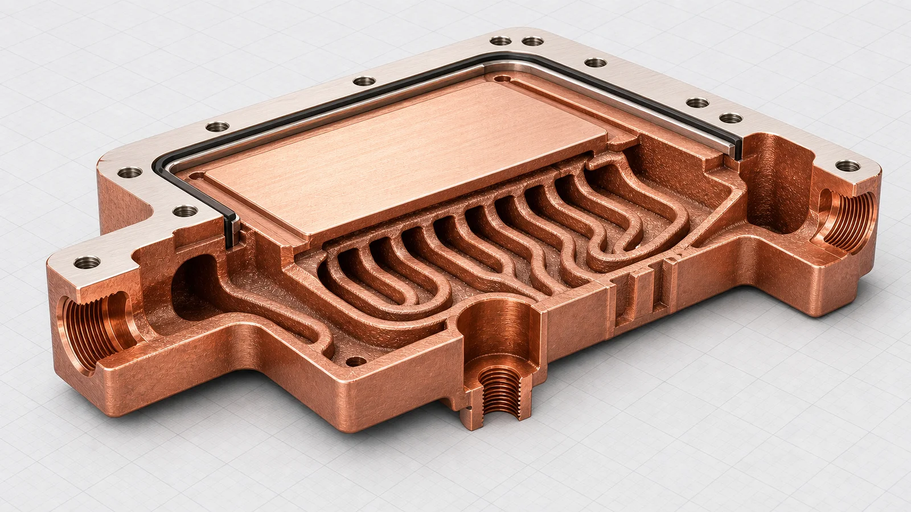
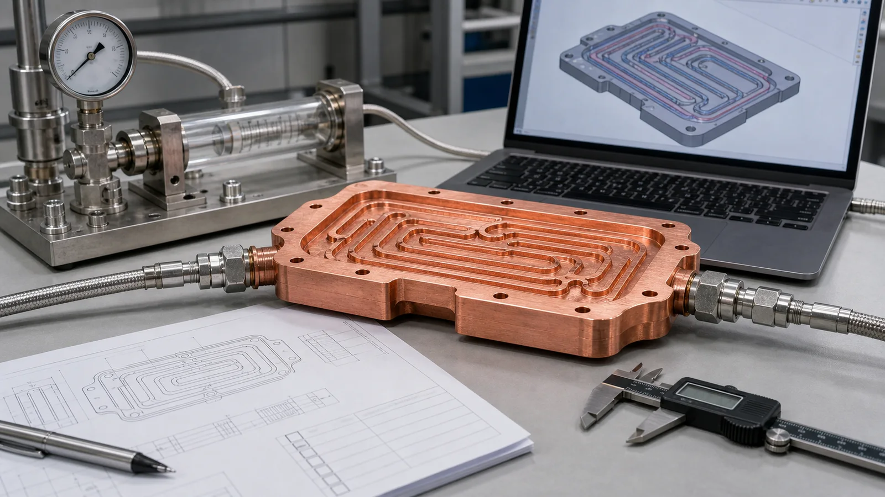

> Copper additive manufacturing improves liquid cooling plate design when the cooling path needs more freedom than drilling, milling, brazing, or stacked construction can provide. The value is strongest in compact thermal management parts with curved internal channels, integrated manifolds, local hot-spot coverage, and reduced leak interfaces. The cost is also real: pressure drop, powder removal, machining, flatness, leak testing, and cleanliness must be planned before quotation.

Most liquid cooling plate projects do not fail because copper lacks thermal conductivity. They fail because the coolant cannot reach the heat source in the shape, height, or port layout the product actually allows.

We see this in power electronics, laser modules, RF hardware, semiconductor equipment, and compact test fixtures. The heat source may be only 40-80 mm wide, the available package height may be below 15 mm, and the ports may be forced to one side because cables, optics, fasteners, or busbars block the easy route. A conventional drilled plate can still work, but the channel path starts to obey the tool rather than the thermal problem.

That is where copper additive manufacturing earns a serious review. It can create a monolithic copper body with curved channels, integrated inlet and outlet manifolds, and local channel density changes under hot zones. It does not remove the need for CNC finishing or testing. It changes the design problem from "How do we machine this path?" to "Can this internal path be printed, cleaned, machined, tested, and accepted?"

## Why Liquid Cooling Plates Hit a Geometry Limit

Conventional copper cooling plates are strong when the design is flat, the channels are straight, and the cover plate or brazed joint is easy to inspect. We still recommend conventional machining and brazing for many simple plates because the process is familiar, cost-efficient, and easy to qualify.

The limit appears when thermal performance depends on geometry that conventional tools do not like:

- Coolant must curve around mounting holes, keep-out zones, or electrical features.
- Inlet and outlet positions cannot align with straight drilled channels.
- Local heat flux requires denser channel coverage under one hot zone.
- The plate needs a lower stack height than a brazed assembly can provide.
- Leak interfaces should be reduced because thermal cycling or pressure cycling is severe.
- Prototype iterations need internal geometry changes before tooling is justified.

A typical early target may include 1.5-4.0 L/min flow, a pressure drop limit below 30-80 kPa, working pressure around 3-8 bar, and an interface flatness requirement around +/-0.03-0.10 mm after machining. Those numbers are not universal, but they show why the design review cannot stop at "Is the shape printable?"

For a real RFQ, the printed body is only one line item. The finished cooling plate also needs machined sealing faces, port finishing, pressure or leak testing, cleaning, and dimensional inspection.

## What Copper AM Actually Improves

The word "improves" needs discipline. Copper additive manufacturing does not automatically make a cooling plate cheaper, smoother, or easier to qualify. It improves the design only when the geometry freedom changes a measurable outcome.

| Design area | Improvement from copper AM | Required control |
| --- | --- | --- |
| Coolant routing | Curved channels can follow the heat source and avoid keep-outs | Pressure drop and powder removal must be reviewed |
| Manifold design | Inlet and outlet manifolds can be integrated into one body | Port machining and leak testing remain necessary |
| Hot-spot coverage | Local channel density can increase near high-flux zones | Flow balance and internal roughness affect performance |
| Assembly risk | Fewer brazed or gasketed interfaces can reduce leak-path count | Proof pressure and sealing-face inspection are still required |
| Package height | Monolithic geometry can reduce stack height in constrained layouts | Machining allowance may add 0.5-1.0 mm back to critical faces |

The best projects usually have at least one hard constraint: a smaller envelope, a hotter local region, a port layout that cannot move, or a leak-risk reduction target. If the plate is just a rectangle with straight passages, conventional manufacturing may still be the better route.

### Copper Material Choice Changes the Trade-Off

For liquid cooling plate design, material selection is not only a conductivity question.

Pure copper is attractive when maximum thermal conductivity is the main driver. CuCrZr or CuCr1Zr may be a better fit when the design needs more strength, better thread stability, heat treatment response, or improved handling around thin features. The final choice depends on the thermal duty, wall thickness, port design, surface finishing, and acceptance criteria.

Copper LPBF also has a narrower process window than many steels and titanium alloys. Copper reflects infrared laser energy and conducts heat away quickly, so melt stability, density, surface quality, and distortion must be handled by a suitable machine, material, parameter set, and build strategy. That reality should appear in the design review instead of being hidden behind broad claims.

As of 2026, a responsible copper AM cooling plate discussion still balances four items: conductivity, printability, finishing, and verification.

## Internal Channels Are the Main Design Lever

Liquid cooling plate performance is usually controlled by three questions:

- How close can coolant get to the heat source?
- How evenly does flow cover the hot region?
- How much pressure drop can the pump and system tolerate?

Copper additive manufacturing gives designers more freedom in the first two questions, but it can make the third question harder if the channel network is too aggressive. A CFD model may reward small hydraulic diameters, sharp turns, and dense branching. The printed part adds internal roughness, trapped-powder risk, cleaning uncertainty, and local flow imbalance.

A narrow simulated passage may be a poor manufacturing choice when the available ports do not support powder removal. Evaluate a larger or more accessible passage as a candidate, then compare thermal and hydraulic behavior under unchanged boundary conditions. No universal channel dimension is established here; the [channel cleaning and clogging guide](/posts/EngineeringGuide/copper-microchannel-cold-plate-clogging-channel-size-filtration-and-cleaning/) explains the evidence needed before fixing that dimension.

That is the practical ledger: the most elegant thermal model is not always the best manufactured part.

_Figure 2. Useful copper AM liquid cooling design usually happens inside the part: curved channels, integrated manifolds, cleaning access, machined sealing faces, and practical port geometry._

### Pressure Drop Is a Design Gate, Not a Late Test

A cooling plate is not improved if it lowers hot-spot temperature in simulation but exceeds the pump budget on the bench.

For early review, the RFQ should state coolant, nominal flow rate, maximum pressure drop, working pressure, and proof pressure. A request such as "quote a 3D printed copper cold plate" is too thin. A request such as "water-glycol, 2.5 L/min nominal flow, pressure drop below 60 kPa, working pressure 4 bar, proof pressure 1.5x, machined interface flatness +/-0.05 mm" lets the supplier review the design against a real process route.

The pressure-drop ledger often looks like this:

| Design choice | Thermal benefit | Manufacturing or test cost |
| --- | --- | --- |
| Smaller passages | More surface area near the heat source | Higher pressure drop, harder cleaning, more CT or flow-test need |
| More branches | Better local hot-spot coverage | Branch imbalance and trapped powder risk |
| Curved routing | Better fit around package constraints | More difficult depowdering at low-flow corners |
| Integrated manifold | Lower assembly height and fewer joints | More complex internal verification |
| Monolithic body | Fewer brazed interfaces | More reliance on CNC finishing and leak testing |

The point is not to avoid complexity. The point is to make every complexity earn its place.

## Case Pattern: A Better Plate After a Less Aggressive Redesign

A representative project involved a compact liquid cooling plate for a power electronics assembly. The initial CAD model used a thin copper body, two local cooling zones, and a curved internal manifold. The requirements were achievable but not casual:

- Heat-source footprint: about 50 mm x 70 mm.
- Nominal flow: 2.0-3.0 L/min.
- Pressure drop target: below 50 kPa at nominal flow.
- Interface flatness after machining: +/-0.05 mm.
- Acceptance: pressure test before thermal test.
- Material route: copper AM body with machined ports and sealing surfaces.

The first concept gave excellent simulated hot-spot coverage. It also created three manufacturing concerns: tight turns near the outlet, small branches that were difficult to depowder, and too little machining stock on the sealing face.

We changed the design instead of treating the manufacturing comments as an obstacle.

The revised version increased selected channel sections by about 0.3 mm, reduced one low-value branch group, added a cleaner port transition, and left more stock for final machining. The theoretical wetted area dropped by roughly 8-10% in the densest region. In exchange, the design became easier to clean, easier to test, and less likely to fail the first flow check.

That was the price of success. The finished design was less dramatic than the first CFD concept, but it was more likely to become a usable copper cooling plate.

The hidden cost was fixture work. A pressure and flow fixture can save hours across a qualification batch, but the first setup can add cost and time before the first article ships. For a one-off prototype, that feels inefficient. For a production-intent design, it is often the cheapest way to avoid a late failure.

## Design Rules for Copper AM Liquid Cooling Plates

The following rules help keep the design review practical.

1. Start with a manufacturable channel network, not the most aggressive CFD result. If the smallest passages are difficult to clean or test, the design is not ready.
2. Keep port geometry large enough for powder removal, flushing, and pressure test setup. Ports are part of the manufacturing route, not only the system interface.
3. Separate as-built internal surfaces from machined functional surfaces. Sealing faces, datums, threads, and contact pads usually need CNC finishing.
4. Define flatness, surface finish, and inspection method before quotation. A flatness note without a datum and measurement method creates avoidable uncertainty.
5. Treat CT as a targeted first-article tool, not a universal substitute for flow and leak testing. CT may reveal internal risk, but functional tests prove service behavior.
6. Compare copper AM against CNC and brazing when the geometry is simple. AM should solve a real constraint, not only replace a known process.

Related reading: [Copper 3D Printing for Microchannel Cold Plates in Thermal Management](/posts/EngineeringGuide/copper-3d-printing-microchannel-cold-plates-thermal-management/) and [Copper AM Cleaning and Powder Removal for Internal Channels](/posts/EngineeringGuide/copper-am-cleaning-powder-removal-internal-channels/).

## RFQ Inputs That Make the Quote More Reliable

The fastest quote is not the one with the fewest questions. It is the one where the important requirements are visible early.

For a copper AM liquid cooling plate, include:

- STEP or native CAD with internal channels included.
- Drawing or section view marking critical surfaces and flow paths.
- Heat load, heat-source footprint, and target temperature limit if known.
- Coolant type and operating temperature range.
- Nominal flow rate and pressure-drop limit.
- Working pressure, proof pressure, and leak acceptance method.
- Material preference: pure copper, CuCrZr, CuCr1Zr, or open to review.
- Flatness and surface finish requirements for contact and sealing faces.
- Port thread, fitting, tube, or manifold interface requirements.
- Quantity, development stage, and expected inspection level.
- Whether CT, flow testing, leak testing, filtered flushing, drying, or special packaging is expected.

Without a flow target, we cannot judge whether the channel network is thermally useful or only printable. Without a defined flatness method, we cannot guarantee interface behavior beyond the inspection setup. Without cleaning access, an integrated manifold can become a trapped-powder risk.

_Figure 3. A strong RFQ defines the functional tests before the quote: flow target, proof pressure, leak method, flatness, material route, cleaning, and inspection level._

## When Copper Additive Manufacturing Is the Right Route

Choose copper additive manufacturing when:

- The coolant path must follow a non-straight heat-source pattern.
- The design needs an integrated manifold inside a tight package.
- Brazed joints create unacceptable leak, thermal cycling, or reliability concerns.
- Ports must avoid keep-out zones, fasteners, electrical hardware, or optics.
- Local hot spots cannot be covered by straight drilled channels.
- Prototype iterations need internal geometry changes before tooling.

Avoid forcing copper AM when:

- The plate is flat with straight and accessible channels.
- A machined and brazed assembly already meets the thermal target.
- Unit price is the only decision driver.
- The channel network has no practical powder-removal path.
- The internal surface finish requirement cannot be achieved or verified.
- The RFQ does not define flow, pressure, leak, flatness, cleanliness, or acceptance.

This is not a rejection of AM. It is route discipline. Copper AM is strongest when geometry freedom has a measurable job.

## Related Copper Cooling Guides

Use [microchannel cold plates in thermal management](/posts/EngineeringGuide/copper-3d-printing-microchannel-cold-plates-thermal-management/) when the design is driven by dense channels near a localized heat source. Use [3D printed copper heat exchangers](/posts/EngineeringGuide/3d-printed-copper-heat-exchangers-design-benefits-manufacturing-limits/) when the core behaves more like a distributed exchanger with flow distribution, pressure drop, and cleaning risk.

For RFQ planning, combine this page with [powder removal for copper AM internal channels](/posts/EngineeringGuide/copper-am-cleaning-powder-removal-internal-channels/), [tolerances and dimensional accuracy in copper metal 3D printing](/posts/EngineeringGuide/tolerances-and-dimensional-accuracy-in-copper-metal-3d-printing/), and [post-processing methods for 3D printed copper parts](/posts/EngineeringGuide/post-processing-methods-for-3d-printed-copper-parts/). Those guides help define finishing, inspection, and acceptance before price comparison.

## FAQ

Does copper additive manufacturing always make liquid cooling plates better?

No. It improves the design when internal channel geometry, manifold integration, package height, or reduced leak interfaces create real value. If the plate has simple straight channels and accessible ports, CNC machining or brazing may be lower risk and lower cost.

What is the biggest design risk in copper AM cooling plates?

The biggest risk is treating internal channels only as thermal features. They also control powder removal, cleaning, pressure drop, flow balance, inspection, and leak-test planning. A channel network that cannot be cleaned or tested is not ready for production review.

Should a printed copper cooling plate use pure copper or CuCrZr?

Pure copper is usually reviewed when maximum conductivity is the main requirement. CuCrZr or CuCr1Zr may be reviewed when strength, thread stability, heat treatment response, or mechanical robustness matters more. The best choice depends on thermal duty, geometry, finishing, and acceptance criteria.

Can copper AM replace brazed cold plates?

Sometimes. It can reduce brazed interfaces and integrate manifolds when the internal channel network is practical. Brazed cold plates remain strong when the design is flat, accessible, and already meets thermal and leak requirements at lower cost.

What files should be sent for a copper AM liquid cooling plate quote?

Send STEP or native CAD, a drawing if available, heat load, coolant, flow target, pressure limits, material preference, critical surfaces, port requirements, quantity, and inspection or cleanliness expectations. If values are still open, state the assumptions.

## Verdict

Copper additive manufacturing can improve liquid cooling plate design when it lets coolant move closer to the real heat source, integrates the manifold, reduces assembly interfaces, or fits the cooling function into a tighter envelope.

It is a weak route when the geometry is simple, the pressure-drop budget is undefined, the channels cannot be cleaned, or the RFQ gives no acceptance criteria.

The practical recommendation is clear: use copper AM for the geometry it uniquely enables, then budget for the finishing and verification that make the part usable. That means CNC machining, flatness inspection, cleaning, pressure testing, leak testing, and flow verification.

Send CAD, drawings, quantity, heat load, coolant, flow target, pressure limits, material preference, critical surfaces, and inspection needs to [info@szcomo.com](mailto:info@szcomo.com). A basic review can start from geometry and quantity, but a serious liquid cooling plate quote needs the operating and acceptance context.
