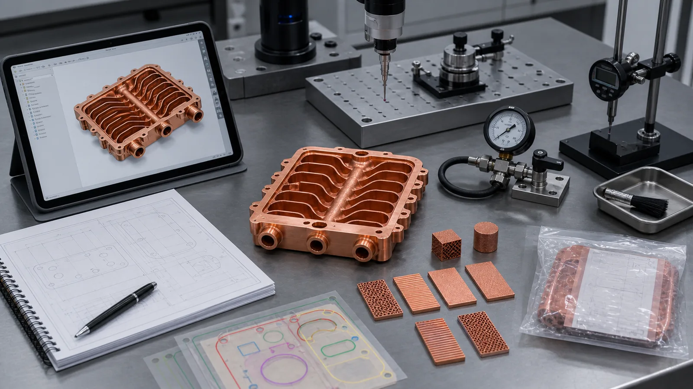
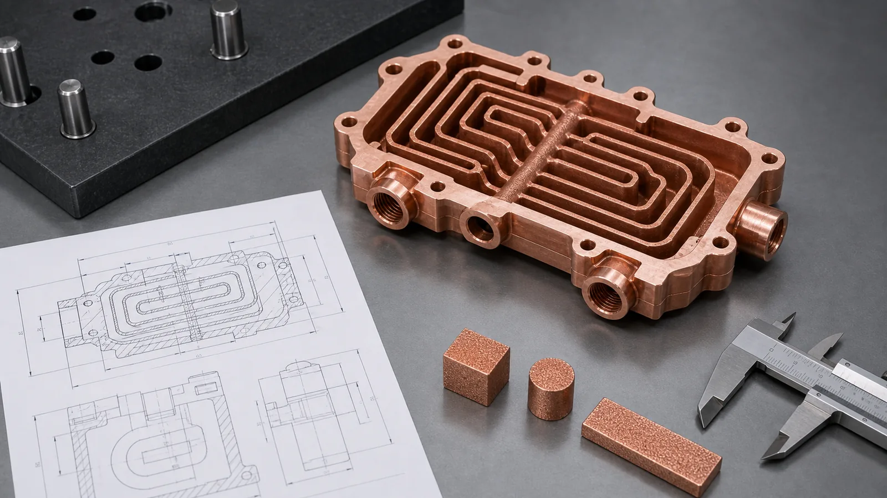
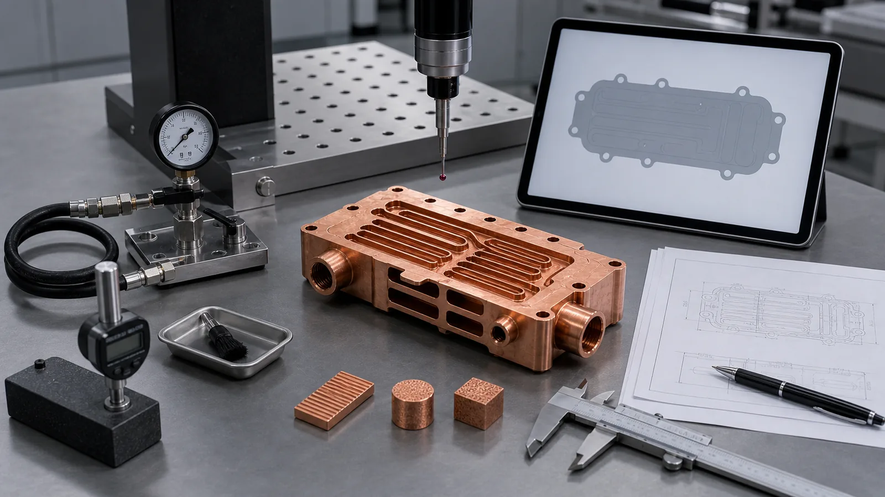

> A useful CAD package for copper metal 3D printing is not only a STEP file. It should show the real internal geometry, units, revision, critical surfaces, machining allowance, material preference, pressure or thermal requirements, and inspection expectations. The goal is to help the supplier quote a finished copper component, not only a printable shape.

The fastest way to slow down a copper AM quote is to send a beautiful model that hides the important work.

We have seen this pattern many times. The CAD file opens cleanly. The copper part looks complete on screen. It has ports, bolt holes, curved channels, thin walls, and a polished copper rendering. Then the review starts and the missing information becomes the project: no channel section view, no units, no drawing revision, no pressure requirement, no critical face definition, no machining stock, no material route, and no acceptance test.

The shape may still be printable. The quote is not ready.

Copper metal 3D printing, especially laser powder bed fusion, is used because copper can combine thermal conductivity, electrical conductivity, compact internal channels, and part consolidation. That value only becomes useful when the CAD files describe the finished component route: print, depowder, heat treat if required, machine critical faces, clean, inspect, and test.



_Figure 1. A useful CAD package for copper metal 3D printing combines geometry, drawings, material direction, critical surfaces, inspection intent, and RFQ context._

## Start With the Right File Package

For copper metal 3D printing review, send the best available editable geometry first.

Recommended file package:

- STEP file for neutral exchange.
- Parasolid X_T or X_B when available.
- Native CAD file if the design is still changing.
- 2D PDF drawing for controlled dimensions and requirements.
- Section views for internal channels, ports, and wall thickness.
- Assembly context if the part interfaces with existing hardware.
- Optional STL only as a visual or mesh reference, not as the main engineering file.

A STEP file is usually the minimum useful starting point. A native CAD file can be better when the part needs design-for-manufacturing changes, because features can be edited without rebuilding the model. A 2D drawing is still important because it tells the reviewer what must be controlled. CAD shows shape. The drawing shows intent.

Do not send only a screenshot, render, STL, or mesh unless the project is at concept stage. Mesh files can be useful for some additive workflows, but they often hide design history, exact feature intent, datums, threads, and surfaces that need machining. For a functional copper cold plate, RF part, or electrical conductor, a mesh alone usually creates too many assumptions.

This is consistent with the broader metal AM design logic in [ISO/ASTM 52911-1:2019](https://www.iso.org/standard/72951.html), which covers laser-based powder bed fusion of metals and design recommendations. The standard is not a copper-specific quotation checklist, but it reinforces the practical point: PBF-LB/M parts need process-specific design information, not only a generic 3D shape.

## Define Units, Revision, and File Authority

Small administrative gaps can create real manufacturing risk.

Before sending files, confirm:

- Units: mm or inch.
- Model scale: 1:1.
- Revision: drawing and CAD must match.
- File authority: which file controls if STEP and drawing disagree.
- Quantity and development stage: prototype, first article, pilot batch, or production.
- Any NDA, export, or customer drawing control requirement.

The most common issue is a mismatch between the model and drawing. A STEP file may show one port depth while the PDF drawing shows another. A filename may say Rev B while the title block says Rev A. A supplier can ask for clarification, but that delay is avoidable.

Use simple revision control:

```text
project-name_part-name_rev-c_step_2026-05-27.step
project-name_part-name_rev-c_drawing_2026-05-27.pdf
project-name_part-name_rev-c_requirements_2026-05-27.pdf
```

The date does not replace revision control. It helps prevent two versions with the same revision name from circulating in email.

## Show the Real Internal Geometry

Internal channels are one of the strongest reasons to use copper additive manufacturing. They are also the easiest place for a CAD package to fail review.

For cold plates, heat exchangers, cooling jackets, manifolds, RF passages, and compact fluid components, the CAD file should include the actual internal geometry. Do not send only the outside shape and expect the reviewer to infer the flow path.

Show:

- Minimum channel width and height.
- Longest enclosed path between openings.
- Minimum wall thickness between channel and outer surface.
- Minimum wall thickness between channel and threads or bolt holes.
- Branch count and feed logic.
- Blind pockets, dead-end volumes, or trapped-powder areas.
- Inlet and outlet relationship.
- Cleaning access, flushing direction, or temporary openings if planned.

If the channel network is confidential, send a simplified review model that preserves the same minimum passage size, longest path, wall thickness, and port relationship. A simplified model is much more useful than an outside envelope with hidden channels.

A 0.8 mm channel may look efficient in CFD. It may also be difficult to print, depowder, flush, and inspect in copper LPBF. A 1.2-1.8 mm passage with better access can sometimes produce a more reliable quote, even if the simulation gives up some local surface area.

For deeper channel risk, see [Copper AM Cleaning and Powder Removal for Internal Channels](/posts/EngineeringGuide/copper-am-cleaning-powder-removal-internal-channels/) and [3D Printed Copper Heat Exchangers: Design Benefits and Manufacturing Limits](/posts/EngineeringGuide/3d-printed-copper-heat-exchangers-design-benefits-manufacturing-limits/).



_Figure 2. Internal channels should be visible as manufacturing features: section views, wall thickness, port relationships, and cleaning access are quote-critical._

## Separate the Printed Blank From the Finished Part

A common CAD mistake is modeling only the final shape while forgetting that the printed blank needs material for finishing.

Copper metal 3D printed parts often need post-machining on:

- Thermal contact faces.
- Sealing lands.
- O-ring grooves.
- Threaded ports.
- Datum pads.
- Electrical contact pads.
- RF surfaces.
- Tube or fitting interfaces.
- Mounting faces.

If a face must meet flatness, roughness, sealing, conductivity, or datum requirements, do not assume the as-built surface will be enough. Add machining allowance or mark the area for supplier review.

Typical early discussion ranges:

| Feature | CAD preparation action | Why it matters |
| --- | --- | --- |
| Thermal face | Add stock or mark as machined | Supports flatness and interface resistance control |
| O-ring land | Model enough material for groove machining | Protects sealing geometry after printing |
| Threaded port | Leave robust boss and wall thickness | Reduces thread damage and pressure risk |
| Electrical pad | Define finished contact area | Controls contact resistance and plating scope |
| RF surface | Separate critical surface from noncritical surfaces | Affects machining, polishing, or plating route |
| Datum pad | Provide accessible machined reference | Makes CMM inspection and setup practical |

For many copper AM components, 0.4-1.0 mm of machining stock on functional faces is a reasonable early review range, but the exact value depends on part size, orientation, heat treatment, distortion risk, and required tolerance. Do not treat that range as a universal rule.

The CAD file should make the finished state visible. If the model represents the printed blank, label it as the printed blank in the RFQ notes. If it represents the final machined part, say which faces need machining allowance before printing.

For cost impact, see [Cost Drivers in Copper 3D Printing Projects](/posts/EngineeringGuide/cost-drivers-in-copper-3d-printing-projects/).

## Use the 2D Drawing to Control Requirements

The drawing does not need to be overloaded. It needs to say what the model cannot say clearly.

At minimum, include:

- General tolerance standard or specific tolerance notes.
- Datums and coordinate reference.
- Critical dimensions.
- Thread callouts and depth.
- Port and fitting interface details.
- Flatness, parallelism, or perpendicularity where important.
- Surface roughness requirements for functional faces.
- Areas to be machined after printing.
- Areas where as-built surface is acceptable.
- Material preference or material openness.
- Heat treatment, if required.
- Inspection and acceptance notes.

Do not apply tight tolerances to every face unless every face truly matters. A blanket +/-0.05 mm requirement across a complex copper AM part can turn a reasonable project into a machining and inspection problem. Mark the critical faces instead.

A rough drawing with critical surfaces circled is more useful than a polished rendering with no tolerances. If the project is early, send the drawing as "preliminary" and identify which dimensions are fixed.

## Prepare Ports, Threads, and Interfaces Carefully

Ports and threads create many hidden failures in copper AM parts.

A threaded side port is not only a hole. It is a pressure boundary, machining feature, sealing interface, assembly load path, and cleaning access point. A thread that looks fine in CAD may be too close to an internal channel wall after machining stock is added. A port that prints successfully may still fail torque or leak testing if the local wall is too thin.

For ports and threads, include:

- Thread standard and size.
- Thread depth.
- Whether the thread is machined after printing.
- Fitting type and sealing method.
- Working pressure and proof pressure.
- Torque or repeated assembly expectation.
- Minimum wall thickness near the port.
- Wrench clearance and assembly access.

For soft pure copper, repeated assembly can be a greater risk than the first pressure test. CuCrZr or CuCr1Zr may deserve review when threads, clamp load, and pressure matter. For material route guidance, see [Copper Alloy Selection for Metal 3D Printing: Pure Cu vs CuCrZr vs CuCr1Zr](/posts/EngineeringGuide/copper-alloy-selection-metal-3d-printing-pure-cu-cucrzr-cucr1zr/).

## State the Material Route Without Forcing the Wrong Answer

Write "copper" only if the material is genuinely open.

For copper metal 3D printing, material choice changes process, cost, heat treatment, properties, and inspection. Pure copper may be reviewed when maximum thermal or electrical conductivity dominates. CuCrZr or CuCr1Zr may be reviewed when strength, pressure, threads, thin walls, or heat treatment matter.

Industrial material pages point in the same direction. [EOS positions copper materials](https://www.eos.info/metal-solutions/metal-materials/copper) around thermal and electrical conductivity, including heat exchangers, electronics, power electronics heat sinks, rocket propulsion systems, and copper coils. [Eplus3D describes copper AM](https://www.eplus3d.com/products/3d-printing-materials-copper/) for heat exchangers, induction coils, high-frequency electronics, molding, tooling, and electronics. Those application signals do not replace a part-specific review, but they show why material selection and function belong in the CAD/RFQ package.

Include:

- Preferred material: pure Cu, CuCrZr, CuCr1Zr, or open to review.
- Required conductivity, if specified.
- Required hardness or strength, if specified.
- Heat-treatment requirement or restriction.
- Service temperature.
- Thermal cycling or repeated assembly expectation.
- Required supplier data sheet or customer material specification.
- Whether witness coupons are required.

If the project is early, use language such as:

"Material open to review. Primary function is thermal performance, but threaded ports and 8 bar proof pressure must be considered."

That sentence gives the reviewer room to choose a practical route.

## Account for Copper LPBF Process Limits

Copper is attractive because it conducts heat and electricity well. Those properties also make laser powder bed fusion more sensitive than many steels.

Copper reflects common laser energy and conducts heat away rapidly. [NIST research on LPBF of highly reflective metals](https://www.nist.gov/publications/ultra-high-speed-printing-regime-laser-powder-bed-fusion-highly-reflective-metals) discusses the energy-coupling challenge for highly reflective metals such as copper and aluminum. In practical quotation terms, copper CAD should not simply copy stainless steel LPBF rules.

This affects CAD preparation:

- Avoid unsupported thin walls without review.
- Avoid deep blind pockets where powder can remain.
- Use generous radii where flow, printing, and cleaning all benefit.
- Add structure around ports, bolt bosses, and threads.
- Keep functional faces away from support scars when possible.
- Leave build orientation open unless there is a strong reason to constrain it.
- Provide enough stock for machining after heat treatment or stress relief.

If the CAD package already fixes build orientation, explain why. Orientation affects supports, surface quality, channel cleaning, distortion, heat flow, and machining allowance. A better RFQ often says:

"Build orientation is open to supplier review, but support scars must not remain on the thermal face, sealing land, datum pads, or electrical contact surfaces."

That protects the function without constraining the process too early.

## Do Not Hide Acceptance Criteria Outside the CAD Package

If the finished copper part must pass a test, include the test in the RFQ package.

Possible acceptance data:

- Working pressure and proof pressure.
- Leak test method and acceptance limit.
- Flow rate and pressure-drop target.
- Heat load or heat-source footprint.
- Current, voltage, duty cycle, and contact surface requirement.
- RF frequency band and critical internal surfaces.
- CMM report requirement.
- Surface roughness requirement.
- Conductivity or hardness test.
- CT inspection, if internal geometry risk justifies it.
- Cleanliness, drying, and packaging expectation.

CAD alone cannot tell the supplier whether the part is a display model, prototype, pressure boundary, thermal device, RF component, or production fixture. A 95 mm x 70 mm copper cooling block with no pressure requirement is a different quote from the same block with 6 bar working pressure, 10 bar proof pressure, a 2 L/min flow target, and +/-0.05 mm flatness on the thermal face.

The acceptance criteria do not need to be final during concept review. They do need to be visible.



_Figure 3. A CAD package becomes quote-ready when the geometry is connected to acceptance: pressure, flow, CMM, surface finish, material coupons, and critical surfaces._

## Mesh and STL Files: When They Help and When They Hurt

An STL can help show a concept, but it is rarely the best source file for copper metal 3D printing quotation.

Mesh problems include:

- No feature history.
- No reliable thread intent.
- No clear datum structure.
- Tessellation can distort small radii or sealing curves.
- Internal channels may become faceted or non-watertight.
- Hard to add machining stock cleanly.
- Difficult to edit wall thickness or port bosses.

If you must send an STL, also send:

- Units.
- Intended tolerance or mesh chord height.
- STEP or native CAD if available.
- Drawing showing critical dimensions.
- Notes explaining whether the mesh is concept geometry or controlled geometry.

For serious copper AM parts, the better package is STEP or native CAD plus drawing. Mesh can be a supplement, not the engineering authority.

## Case Pattern: The STEP File Was Clean, but the Quote Was Not

A representative RFQ involved a compact copper cooling plate for a power electronics test fixture. The first email included one STEP file and a quantity of five. The part opened correctly. The outside envelope was about 110 mm x 76 mm x 20 mm. It had two side ports, a serpentine internal path, and a bolt pattern around the perimeter.

The CAD file had no obvious geometry corruption. The problem was missing intent.

The review found six gaps:

- The internal channel had no section view or minimum passage note.
- The thermal face was modeled at final size with no machining allowance.
- The side ports had no thread standard or sealing method.
- The material was listed only as "copper."
- No pressure, coolant, flow, or leak requirement was included.
- The drawing revision did not match the CAD filename.

The buyer did not need a complete redesign. They needed a better file package.

The revised package included a STEP file, native CAD, a preliminary drawing, section views, 0.7 mm machining stock on the thermal face, G1/4 port intent, working pressure of 6 bar, proof pressure of 10 bar, coolant flow around 2 L/min, and "pure Cu or CuCrZr to be reviewed." The channel transitions were opened slightly, port bosses were thickened, and support-sensitive faces were marked as functional.

The quote became more expensive than the first rough estimate. It also became executable. The new package allowed the supplier to quote the printed body, machining, channel cleaning, pressure hold, CMM inspection, and material route instead of guessing.

That is the point of CAD preparation. It does not make the project complicated. It makes the real requirements visible before the purchase order.

## CAD File Preparation Checklist

Use this checklist before sending the RFQ.

| CAD item | What to prepare | Why it affects copper AM |
| --- | --- | --- |
| Neutral model | STEP or Parasolid | Enables review across software systems |
| Native file | Original CAD if editable design review is expected | Speeds DFM changes and stock adjustments |
| Units and scale | mm/inch, 1:1 model | Prevents size mistakes |
| Revision control | Matching CAD and drawing revision | Avoids quoting the wrong geometry |
| Internal channels | Section views, minimum passage size, wall thickness | Controls printability, cleaning, and inspection |
| Critical surfaces | Mark thermal, sealing, RF, contact, and datum faces | Defines machining and inspection |
| Machining stock | State printed blank vs final part | Prevents late wall-thickness and channel-distance changes |
| Ports and threads | Thread standard, depth, sealing method, pressure | Controls machining, torque, and leak risk |
| Material | Pure Cu, CuCrZr, CuCr1Zr, or open | Changes process route and tests |
| Acceptance tests | Leak, pressure, flow, CMM, CT, conductivity, roughness | Defines finished-component scope |
| Quantity and stage | Prototype, first article, pilot, production | Changes cost and validation logic |

If you can complete most of this table, the first review can focus on manufacturability. If the table is mostly blank, the first response should be clarification, not a fixed production price.

## What to Send in the First Email

For a copper metal 3D printing RFQ, send:

- STEP or Parasolid file.
- Native CAD file if design changes are possible.
- 2D PDF drawing, even if preliminary.
- Section views for internal channels.
- Quantity and development stage.
- Material preference or request for material review.
- Heat load, coolant, pressure, flow, current, RF band, or service requirement where relevant.
- Critical surfaces and surfaces that may remain as-built.
- Machining stock or request for supplier review.
- Inspection and acceptance requirements.
- Photos or assembly context if the part must fit existing equipment.
- Current manufacturing route, if one exists.
- Target lead time and any fixed test date.

Send the package to [info@szcomo.com](mailto:info@szcomo.com), or start from the [RFQ guidance page](/rfq/). A basic review can start with CAD and quantity. A reliable quote for a functional copper AM part needs the operating and acceptance context.

## FAQ

<details>
<summary>Is a STEP file enough for copper metal 3D printing quotation?</summary>

Sometimes, for a simple concept or early budget review. For functional copper AM parts, a STEP file should be accompanied by a drawing, material preference, critical surfaces, operating requirements, and inspection expectations. Internal-channel parts should also include section views.

</details>

<details>
<summary>Should we send STL files for copper AM?</summary>

An STL can be useful as a reference, but it should not be the main engineering authority for a serious quote. STEP, Parasolid, or native CAD is better because the geometry is easier to inspect, edit, machine, and relate to drawing requirements.

</details>

<details>
<summary>Should the CAD model show the printed blank or the final machined part?</summary>

State which one it represents. If the model shows the final part, the quote may need added machining stock before printing. If the model shows the printed blank, the drawing should define the final machined dimensions and functional surfaces.

</details>

<details>
<summary>Do internal channels need to be included in the CAD file?</summary>

Yes, unless confidentiality prevents it. If the true channel geometry cannot be shared, send a simplified model with the same minimum passage size, wall thickness, longest enclosed path, and port relationship. The supplier cannot judge depowdering or flow risk from the outside shape alone.

</details>

<details>
<summary>What is the most common CAD mistake in copper AM RFQs?</summary>

The most common mistake is treating the CAD model as finished intent while omitting manufacturing intent. Missing machining stock, hidden channels, undefined critical surfaces, unclear material, and absent acceptance tests usually create more delay than small geometry defects.

</details>

## Verdict: Prepare the CAD for the Finished Route

Copper metal 3D printing CAD preparation should make the finished route visible.

The right package shows more than shape. It shows internal channels, wall thickness, ports, functional faces, machining allowance, material route, inspection method, quantity, and revision control. That information lets the supplier review whether the part can be printed, cleaned, machined, tested, and accepted.

For simple copper geometry, a basic STEP file and drawing may be enough to start. For internal-channel cold plates, heat exchangers, RF parts, high-current conductors, semiconductor hardware, or pressure components, the CAD package should carry the manufacturing risks clearly.

Related reading: [Engineering Checklist for Copper 3D Printed Part Quotation](/posts/EngineeringGuide/engineering-checklist-copper-3d-printed-part-quotation/), [Design Rules for Copper Laser Powder Bed Fusion Parts](/posts/EngineeringGuide/design-rules-copper-laser-powder-bed-fusion-parts/), [Cost Drivers in Copper 3D Printing Projects](/posts/EngineeringGuide/cost-drivers-in-copper-3d-printing-projects/), and [Copper AM Cleaning and Powder Removal for Internal Channels](/posts/EngineeringGuide/copper-am-cleaning-powder-removal-internal-channels/).

> _Disclaimer: All scenarios described are based on real or closely analogous executed projects. If you choose to implement any of the examples described in this article, please conduct a careful evaluation first. This site assumes no responsibility for losses resulting from implementations made without prior evaluation._
