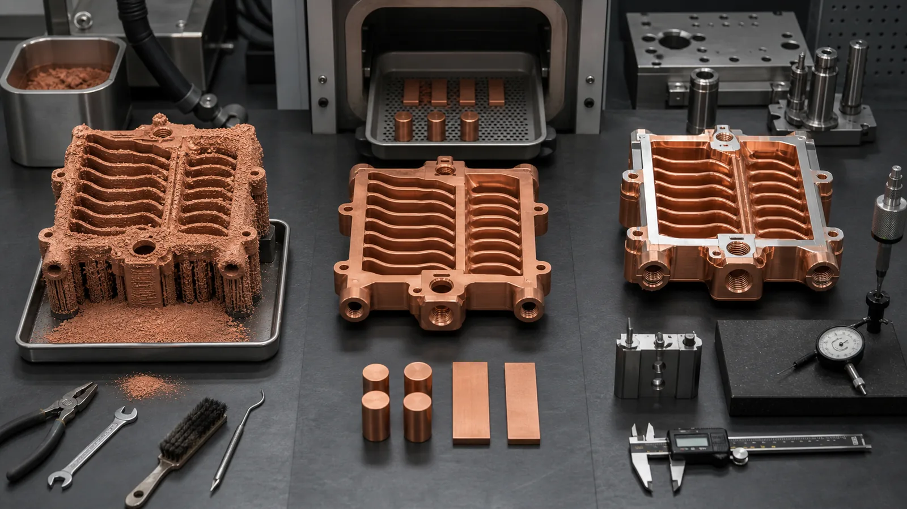
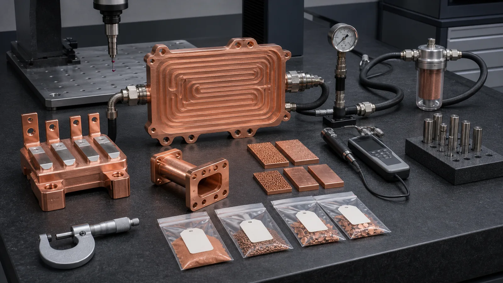

> Post-processing for 3D printed copper parts is not a cosmetic tail after printing. It is the route that turns a copper LPBF blank into a usable component: depowdered, stress managed, heat treated when needed, machined at critical interfaces, cleaned, finished, inspected, and accepted for thermal, electrical, RF, vacuum, or fluid service.

The weakest copper AM quote is the one that stops at the printed shape.

That quote may look attractive at first. The CAD model is complex, the copper part is near-net, and the build file proves the geometry can exist. But the installed component still needs to survive assembly torque, seal pressure, contact resistance, coolant flow, thermal cycling, cleanliness rules, or RF surface requirements.

Post-processing is where those risks become visible.

For a simple noncritical prototype, the route may be light: print, remove supports, clean, inspect visually, and ship. For a copper cold plate, RF/vacuum manifold, high-current conductor, semiconductor cooling block, or mold insert, the finished scope may include depowdering, heat treatment, CNC machining, polishing, plating, CMM inspection, roughness measurement, pressure testing, leak testing, flow verification, and protected packaging.

That difference is why a buyer should not ask only, "Can you print this copper part?" The better question is:

> What post-processing route makes this copper part acceptable for its real function?

[ISO/ASTM 52908:2023](https://www.iso.org/standard/81779.html) is useful context because it treats powder bed fusion metal parts through finished-part properties, post-processing, inspection, and testing. That mindset fits copper especially well. Copper's value comes from conductivity and geometry, but the accepted part is usually a hybrid of AM, machining, cleaning, finishing, and proof.

## Start With The Acceptance Gates

Do not start a post-processing plan by listing every possible method.

Start with the gates the part must pass.

| Acceptance gate | Practical question | Common post-processing methods |
| --- | --- | --- |
| Powder removal | Can loose copper powder leave the part? | Depowdering, vibration, compressed air, flushing, temporary access |
| Residual stress and properties | Does the material state need stabilization or aging? | Stress relief, aging, solution and aging route where specified, witness coupons |
| Functional geometry | Which interfaces need controlled dimensions? | CNC machining, drilling, tapping, reaming, EDM, grinding, lapping |
| Surface condition | Which surfaces control sealing, contact, RF, wear, or thermal interface? | Machining, polishing, blasting, lapping, electropolish review, local finishing |
| Coating or plating | Does the surface need contact, corrosion, solderability, or RF behavior? | Nickel, silver, gold, tin, masking, thickness control, pre-cleaning |
| Cleanliness | What residue or particles can the system tolerate? | Ultrasonic cleaning, filtered flushing, drying, vacuum-compatible cleaning, clean packaging |
| Proof and documentation | What evidence makes the part acceptable? | CMM, roughness, CT, pressure, leak, flow, conductivity, hardness, first-article report |

The post-processing plan should be shorter for low-risk prototypes and stronger for production-facing hardware. A 40 mm copper coupon does not need the same route as a liquid-cooled power module plate with 8 bar proof pressure. A visual model does not need the same route as a semiconductor vacuum manifold with leak and cleanliness requirements.

For general quote readiness, start with the [Engineering Checklist for Copper 3D Printed Part Quotation](/posts/EngineeringGuide/engineering-checklist-copper-3d-printed-part-quotation/) and [How to Prepare CAD Files for Copper Metal 3D Printing](/posts/EngineeringGuide/how-to-prepare-cad-files-for-copper-metal-3d-printing/). Those pages help define the information that should control post-processing before pricing.

## Method 1: Support Removal And Depowdering

Support removal is the first visible operation after the build. Depowdering is the first hidden operation.

They are not the same.

Support removal clears external structures, sacrificial pads, and build aids. It can leave scars, burrs, local roughness, and manual finishing work. Depowdering removes unused powder from cavities, channels, blind regions, and surface pockets. A part may look clean outside while still holding powder inside a cooling channel.

For copper AM, this matters because many high-value parts are selected specifically for internal geometry:

- Cold plates with curved channels.
- Compact heat exchangers.
- Liquid-cooled busbars.
- RF/vacuum manifolds with hidden cooling.
- Mold inserts with conformal channels.
- Semiconductor cooling blocks with sealed internal passages.

The risk grows when passages are small, long, branched, blind, or connected only through restrictive ports. A short 3 mm straight gallery can be relatively easy to flush. A 0.8-1.0 mm serpentine network with dead-end branches may need redesign, temporary ports, CT review, or a different manufacturing route.

This is the point where copper AM discipline prevents expensive surprise. If the part has internal channels, use [Powder Removal Challenges in Copper 3D Printed Internal Channels](/posts/EngineeringGuide/copper-am-cleaning-powder-removal-internal-channels/) before finalizing the drawing. If the part is a heat exchanger, use [3D Printed Copper Heat Exchangers: Design Benefits and Manufacturing Limits](/posts/EngineeringGuide/3d-printed-copper-heat-exchangers-design-benefits-manufacturing-limits/) to compare geometry value against cleaning and verification burden.

## Method 2: Stress Relief, Aging, And Heat Treatment

Heat treatment is not one universal copper AM step.

Pure copper, CuCrZr, and CuCr1Zr can need different post-build logic. Pure copper projects often care about density, conductivity, surface condition, machining, and thermal performance. CuCrZr and CuCr1Zr projects often add strength, hardness, thread stability, pressure boundary margin, and heat-treatment response to the discussion.

Public material data makes the trade-off visible. The [EOS CopperAlloy CuCrZr data sheet](https://www.eos.info/metal-solutions/data-sheets/all-processes-and-materials?id=eos-copperalloy-cucrzr) describes heat treatment routes that can be optimized for conductivity or tensile properties. The page lists, for example, a conductivity-optimized aging route of 3 h at 550 deg C under inert atmosphere, and a tensile-optimized aging route of 1 h at 490 deg C under inert atmosphere. Those are not instructions to copy blindly into every project. They show why the material state must be part of the RFQ.

[3D Systems' CuCr1Zr material page](https://www.3dsystems.com/materials/cucr1zr-a) frames CuCr1Zr as a high-conductivity, high-strength copper alloy for direct metal printing applications such as heat exchangers, electrical components, and induction coils. That is exactly the type of part where the buyer should ask whether the quote includes heat treatment, coupons, conductivity checks, hardness checks, or customer-specific documentation.

The sequence also matters. Heat treatment before final machining can reduce the chance that later stress movement breaks a flatness target. Heat treatment after rough machining may be useful in some routes. Final machining before an aging step may be risky if tight faces move. The correct sequence depends on alloy, part mass, geometry, datum plan, internal channels, and acceptance method.

For material strategy, use [Copper Alloy Selection for Metal 3D Printing: Pure Cu vs CuCrZr vs CuCr1Zr](/posts/EngineeringGuide/copper-alloy-selection-metal-3d-printing-pure-cu-cucrzr-cucr1zr/) and [CuCrZr 3D Printing for High-Performance Thermal Management Components](/posts/EngineeringGuide/cucrzr-3d-printing-high-performance-thermal-management-components/).



_Figure 2. Post-processing sequence is part of the design. Depowdering, heat treatment, machining, and inspection should be planned before the quote, not improvised after the build._

## Method 3: CNC Machining Of Functional Interfaces

Copper AM produces near-net geometry. It does not remove the need for CNC finishing on functional interfaces.

The most common post-machined features are:

- Flat thermal contact faces.
- Datum pads.
- O-ring grooves and gasket lands.
- Threaded coolant ports.
- Fitting seats.
- Bolt holes and locating holes.
- Electrical contact pads.
- RF flanges and mating surfaces.
- Mold cavity-side stock.
- Tube interfaces and manifold ports.

The important point is not that every surface must be machined. The point is that the surfaces controlling assembly, sealing, current, heat transfer, RF behavior, or measurement usually need a controlled finish.

Machining requires allowance. In early copper AM review, 0.4-1.0 mm of stock on critical faces is a common discussion range, but the actual value depends on part size, distortion risk, channel proximity, fixture access, heat treatment, and final flatness or roughness requirement. Too little stock can leave support scars or as-built waviness. Too much stock can threaten wall thickness, channels, ports, or cost.

This is where [Tolerances and Dimensional Accuracy in Copper Metal 3D Printing](/posts/EngineeringGuide/tolerances-and-dimensional-accuracy-in-copper-metal-3d-printing/) becomes directly relevant. A good drawing separates as-built geometry from post-machined geometry. It does not apply one tight general tolerance to every printed wall and hidden channel.

For route selection, compare [When Copper 3D Printing Is Better Than CNC Machining](/posts/EngineeringGuide/when-copper-3d-printing-is-better-than-cnc-machining/). A printed part with heavy finishing may still be correct when internal geometry or reduced joints create real value. It should not be priced as if machining disappeared.

## Method 4: Surface Finishing, Polishing, And Local Lapping

Surface finishing should be assigned by function.

As-built LPBF texture can be acceptable on noncritical exterior walls and some internal flow surfaces. Machined surfaces may be enough for datums, seal lands, and ports. Polishing or lapping may be justified for high-current contact pads, RF paths, high-voltage electrodes, selected vacuum-facing surfaces, sensitive thermal interfaces, or customer-specified contact regions.

The mistake is buying a finish adjective instead of a finished function.

For example:

- "Polish all surfaces" may add cost while leaving hidden channels unchanged.
- "As printed acceptable" may be weak for an O-ring land or contact pad.
- "Ra 0.8 um everywhere" may be impossible or unnecessary on internal passages.
- "Cosmetic finish" may not address leak, pressure, conductivity, or RF behavior.

The better RFQ uses a surface map. Mark which regions remain as-built, which are machined, which are polished or lapped, which are plated, and which internal surfaces are accepted by cleaning and functional testing. The #16 page, [Copper 3D Printing Surface Finish: As-Built, Machined, and Polished Options](/posts/EngineeringGuide/copper-3d-printing-surface-finish-as-built-machined-polished-options/), is the detailed surface guide for that decision.

For heat sinks and contact hardware, surface finish often controls interface resistance. A copper heat sink can have useful fin geometry and still underperform if the mounting face is rough or warped. Use [Thermal Interface Failures in Copper Heat Sinks](/copper-heat-sinks/#review-points) when the part depends on a flat thermal face.

## Method 5: Plating, Coating, And Masking

Plating can be useful, but it is not a default fix for every printed copper surface.

Common reasons to consider plating include:

- Contact resistance control.
- Solderability or bondability.
- Oxidation or corrosion control.
- Wear resistance on repeated mating features.
- RF surface behavior.
- Customer specification.
- Vacuum or semiconductor process compatibility.

[Eplus3D describes pure copper AM](https://www.eplus3d.com/products/3d-printing-materials-copper/) around high electrical and thermal conductivity for heat exchangers, induction coils, and high-frequency electronics. Those applications explain why plating can matter. The surface is not only cosmetic; it can be electrical, RF, sealing, or assembly-critical.

The plating risk is usually in the details:

- A 10-20 um coating can change a thread, port, or precision fit.
- Nickel, silver, gold, tin, or other stacks may need different masking and inspection.
- Plating over rough as-built copper is not the same as plating over a machined pad.
- Internal channels may not be uniformly reachable or acceptable for plating.
- A sealing land may need masking, machining after plating, or a defined sequence.

Use [Plating and Finishing Copper AM Parts](/posts/EngineeringGuide/plating-and-finishing-copper-am-parts-rfq/) when a project involves contact pads, RF surfaces, solderability, masking, or coating thickness. That page should sit under this broader post-processing route.

## Method 6: Final Cleaning, Drying, And Packaging

Cleaning is not the same as depowdering.

Depowdering removes loose powder. Final cleaning reduces residue, loose particles, oils, blasting media, polishing compound, coolant, moisture, or handling contamination to a level appropriate for the application.

The cleanliness bar changes by service:

| Application | Cleaning concern |
| --- | --- |
| Liquid cold plate | Loose particles, trapped media, coolant compatibility, drying, pressure-test residue |
| RF or microwave component | Surface residue, plating preparation, conductive path cleanliness, handling marks |
| Vacuum or semiconductor hardware | Particle release, trapped volume, leak path, clean packaging |
| Busbar or contact part | Oxide, plating preparation, contact pad protection, no-touch surfaces |
| Mold insert | Channel flushing, machining coolant removal, cavity-side surface protection |
| Prototype geometry sample | Visual cleaning may be enough if function is not tested |

This step often exposes hidden cost. A part that needs filtered flushing, drying, clean bagging, and protected contact pads is different from a part that only needs shop cleaning. If the customer does not state the cleanliness requirement, the supplier must assume a route or ask questions.

For semiconductor-facing projects, see [Copper AM Parts for Semiconductor Equipment](/posts/EngineeringGuide/copper-am-semiconductor-equipment-rfq/) and [Copper 3D Printed Cooling Blocks for Semiconductor Equipment](/posts/EngineeringGuide/copper-3d-printed-cooling-block-case-study-semiconductor-wafer-processing-equipment/). Those parts often combine thermal control, leak testing, cleanliness, machined datums, and handling requirements.

## Method 7: Inspection, Testing, And Acceptance Evidence

Post-processing is incomplete until the acceptance evidence matches the failure mode.

A finished copper AM part may need:

- Visual inspection for support scars and surface damage.
- CMM report for datums, ports, holes, and machined faces.
- Roughness measurement for contact pads, seal lands, RF surfaces, or thermal faces.
- Flatness check for heat-transfer interfaces.
- CT inspection for hidden channels or first-article geometry.
- Flow and pressure-drop testing for cooling parts.
- Pressure hold or proof-pressure test for fluid parts.
- Helium leak testing where vacuum service justifies it.
- Conductivity or hardness checks for material state.
- Witness coupons for density, heat treatment, or process control.

The right inspection package is not the biggest package. It is the package that proves the part's risk.

For copper cold plates and pressure-boundary hardware, use [CT and Leak Test Criteria for Copper Cold Plates](/posts/EngineeringGuide/ct-scan-leak-test-acceptance-criteria-copper-cold-plates/). For high-current parts, connect the inspection plan to contact faces and current path using the [Copper Busbars and Induction Coils RFQ Guide](/posts/EngineeringGuide/3d-printed-copper-busbars-induction-coils-rfq/). For RF and vacuum hardware, use [3D Printed Copper RF Waveguide and Vacuum Components](/posts/EngineeringGuide/3d-printed-copper-rf-waveguide-vacuum-components/).



_Figure 3. Finished copper AM means accepted copper AM. The validation route should prove the surfaces, channels, dimensions, material state, and functional risks that matter._

## A Practical Sequence For Common Copper AM Parts

There is no universal sequence, but these routes are useful starting points.

| Part type | Practical post-processing sequence |
| --- | --- |
| Copper cold plate | Print, depowder, stress relief or heat treatment if specified, clean channels, machine thermal face, machine ports and seal lands, pressure/leak test, flow check, final clean |
| Compact heat exchanger | Print, depowder, flush, heat treatment if required, machine ports and flanges, inspect walls and datums, pressure or leak test, flow/pressure-drop check |
| Liquid-cooled busbar | Print, depowder, heat treatment route if alloy requires it, machine contact pads and mounting features, polish or plate pads if specified, flow or pressure test, conductivity review |
| RF/vacuum copper part | Print, depowder, stress relief, machine flanges and seal faces, finish RF surfaces, clean, plate if required, leak test, CMM or RF-related inspection |
| Mold cooling insert | Print, depowder conformal channels, heat treat if CuCrZr route, machine mounting and cavity-side stock, polish cavity-facing surfaces, pressure test cooling channels |
| Simple prototype | Print, remove supports, clean, basic dimensional check, ship with assumptions stated |

The expensive mistake is using the simple-prototype route for a production-risk part.

The opposite mistake also happens. Some early prototypes are overburdened with production-level inspection before the geometry has been tested. For first learning builds, it may be enough to print, clean, machine key faces, and test one or two critical functions. Once the design stabilizes, the post-processing and inspection route can become stricter.

The [copper AM prototype build planning guide](/posts/EngineeringGuide/copper-am-prototype-build-planning/) shows how to stage that evidence. When the route moves into repeat orders, the [prototype-to-low-volume control guide](/posts/EngineeringGuide/prototype-to-low-volume-copper-am-production-controls/) identifies which post-processing variables should remain frozen or require approval before change.

This distinction matters for cost. The [Cost Drivers in Copper 3D Printing Projects](/posts/EngineeringGuide/cost-drivers-in-copper-3d-printing-projects/) page explains why the printed body and the accepted component can have very different price structures.

## Case Pattern: The Printed Copper Part Was Not The Deliverable

A representative RFQ involved a compact copper cooling and power-interface component. The part was about 125 mm x 80 mm x 20 mm, with a curved coolant channel, four threaded ports, two high-current contact pads, and one flat thermal interface.

The first request asked for:

```text
Print in copper.
Polish surface.
Leak free.
Quantity: 8 pieces.
```

That looked simple. It was not quotable as a finished component.

The review separated the part into gates:

1. Internal channel powder removal and filtered flushing.
2. Material route review between pure copper and CuCrZr.
3. Stress relief or heat treatment before final machining.
4. CNC machining of thermal face, ports, O-ring lands, and contact pads.
5. Local polishing only on contact pads, not the entire exterior.
6. Pressure hold and leak test on the coolant path.
7. CMM report for ports, datum pads, and mounting holes.
8. Final cleaning and protected packaging for contact surfaces.

The revised route added work, but it also removed waste. Full-body polishing disappeared. Machined contact pads and seal lands became explicit. The quote no longer compared a printed blank against an installed component. It compared the finished accepted copper part against alternatives such as CNC plus brazing or a multi-piece assembly.

The lesson was direct: post-processing is not a penalty after copper AM. It is the manufacturing route that makes copper AM useful.

## RFQ Checklist For Post-Processing 3D Printed Copper Parts

Send as much of this as possible when requesting a quote:

| RFQ input | Why it matters |
| --- | --- |
| STEP or native CAD | Allows review of internal channels, supports, machining stock, and fixture access |
| 2D drawing | Defines datums, tolerances, surface finish, threads, ports, and critical features |
| Material preference | Pure Cu, CuCrZr, CuCr1Zr, or supplier review |
| Development stage | Concept, prototype, first article, pilot, or production |
| Internal-channel details | Minimum size, longest path, ports, cleaning access, pressure drop, flow |
| Heat-treatment requirement | Required alloy state, conductivity, hardness, strength, or customer specification |
| Machining scope | Seal lands, thermal faces, datum pads, contact pads, ports, RF faces |
| Surface finish map | As-built, machined, polished, lapped, plated, or no-special-finish regions |
| Plating or coating needs | Stack, thickness, masking, reason, inspection requirement |
| Cleanliness requirement | Standard clean, filtered flush, vacuum clean, particle concern, packaging |
| Acceptance tests | CMM, roughness, CT, leak, pressure, flow, conductivity, hardness, coupons |
| Quantity and timing | One-off prototype, small batch, repeat order, target delivery window |

If some values are unknown, state that they are open. "Material open to supplier review" is often better than forcing pure copper into a part that may need CuCrZr strength. "Pressure target to be confirmed" is better than hiding the pressure requirement until after the quote.

## FAQ

<details>
<summary>What post-processing is usually needed for 3D printed copper parts?</summary>

Common steps include support removal, depowdering, cleaning, stress relief or heat treatment where required, CNC machining of critical interfaces, surface finishing, plating when specified, and inspection or functional testing. The exact route depends on material, geometry, application, and acceptance requirements.

</details>

<details>
<summary>Do 3D printed copper parts always need CNC machining?</summary>

Not every surface needs machining. Functional interfaces often do: thermal faces, seal lands, datum pads, threaded ports, contact pads, RF flanges, and precision mounting features. Noncritical exterior walls and some internal surfaces may remain as-built after cleaning.

</details>

<details>
<summary>Is heat treatment required for pure copper and CuCrZr?</summary>

It depends on the material route and property target. CuCrZr and CuCr1Zr often need heat-treatment planning because strength, conductivity, hardness, and thread stability can depend on the condition. Pure copper projects may focus more on density, conductivity, machining, cleaning, and surface condition, but the supplier's qualified route should control the final decision.

</details>

<details>
<summary>Can internal channels be polished after copper LPBF?</summary>

Usually not by default. Long enclosed channels are difficult to polish uniformly. The practical route is to design channels that can be depowdered, cleaned, dried, flow tested, pressure tested, and accepted. If internal finish is critical, define the requirement early and review whether abrasive flow, redesign, or another manufacturing route is more realistic.

</details>

<details>
<summary>What is the most common post-processing mistake in copper AM RFQs?</summary>

The most common mistake is treating the printed blank as the final deliverable. A strong RFQ defines the finished component: material condition, critical machined surfaces, internal cleaning route, surface finish, plating, inspection, and functional tests.

</details>

## Practical Recommendation

Post-processing methods for 3D printed copper parts should be selected by risk, not habit.

Use depowdering and cleaning because internal copper geometry must be cleared. Use heat treatment when the material route or property target requires it. Use CNC machining where the part needs datums, sealing, flat thermal contact, threads, contact pads, or RF interfaces. Use polishing, lapping, plating, and coating only where the surface function pays back. Use inspection and testing to prove the failure modes that matter.

The most useful RFQ does not ask for "best finish." It defines the route from printed blank to accepted copper component.

Send CAD, drawings, quantity, material preference, post-processing expectations, critical surfaces, operating pressure or current, cleanliness needs, and inspection requirements to [info@szcomo.com](mailto:info@szcomo.com). If the route is still open, start with the [RFQ guidance page](/rfq/) and state which functions must be protected.
