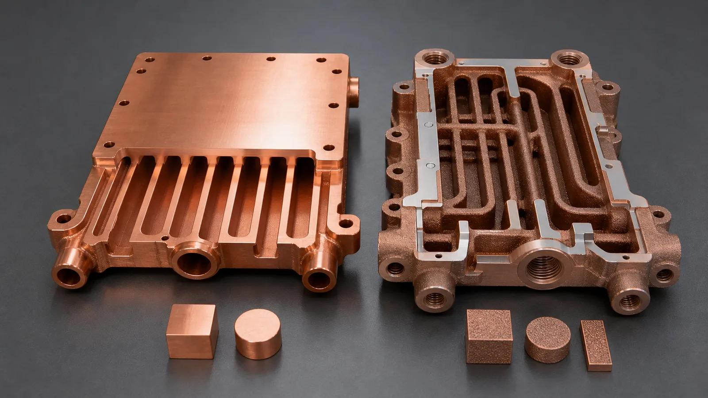
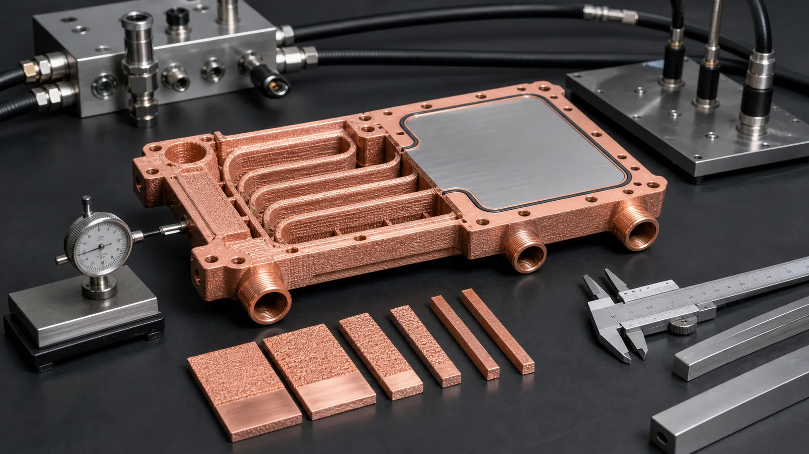

> Pure copper and CuCrZr can both be valid for 3D printed heat transfer parts, but they solve different problems. Pure copper is strongest when bulk conductivity dominates and the part is mechanically calm. CuCrZr becomes more attractive when pressure, threads, thin walls, clamp load, heat treatment, or repeatable assembly would otherwise damage the thermal result.

The common RFQ question is simple: "Should this heat transfer part be pure copper or CuCrZr?"

The useful answer is less simple. A 3D printed cold plate, heat exchanger core, cooling manifold, or heat spreader is rarely just a block of conductive metal. It also has ports, seals, bolt patterns, internal walls, machining stock, cleaning access, pressure requirements, and sometimes a heat treatment route that changes the final property state.

That is why the material choice should start with the dominant failure mode, not the best-looking conductivity number.

## The First Gate: What Is the Thermal Part Also Doing?

If the part is a simple heat spreader, a broad contact plate, or a low-pressure thermal block with modest assembly load, pure copper may be the cleanest candidate. Copper's value is direct: high thermal conductivity and high electrical conductivity. The [Copper Information Center](https://help.copper.fyi/hc/en-us/articles/360021017340-Copper) notes thermal conductivity around 394 W/m-K and high-conductivity copper at about 101% IACS in electrical applications. That is why engineers reach for copper first.

If the same part includes 1.0-1.8 mm internal walls, threaded ports near channels, high clamp load, proof pressure, repeated assembly cycles, or elevated thermal exposure, the decision shifts. CuCrZr is a precipitation-hardenable copper alloy. [EOS describes CuCrZr](https://www.eos.info/metal-solutions/metal-materials/copper) as a copper alloy with a favorable combination of electrical and thermal conductivity plus mechanical properties, and states that its useful properties are reached during heat treatment. That is the trade: less headline conductivity than commercially pure copper, but more mechanical reserve after the correct process route.

The material is not automatically better. It is better only when mechanical stability protects the thermal function.

## Pure Copper: When Maximum Conductivity Is the Main Job

Pure copper is usually reviewed first for heat transfer parts where the heat path is the bottleneck and the mechanical requirements are controlled.

Good candidates include:

- Heat spreaders with large contact areas and limited torque load.
- Simple cold plates where channels are wide, accessible, and not close to threaded bosses.
- Electrical-thermal components where conductivity is more important than strength.
- Prototype test coupons where thermal response matters more than production handling.
- Components that will receive enough support from external fixtures, frames, or fasteners.

The hidden cost of pure copper appears when the geometry asks the material to be a structure. A soft copper body can lose flatness, creep under clamp load, distort during stress relief, or smear at thin edges during finishing. A 0.06 mm flatness change at the thermal interface can matter more than a small gain in bulk conductivity if it increases the thermal interface material thickness.

For pure copper AM, process stability also deserves attention. Copper reflects energy strongly and conducts heat away quickly, which has made laser powder bed fusion difficult on conventional systems. [EOS states](https://www.eos.info/metal-solutions/metal-materials/copper) that copper's reflectivity and high thermal conductivity historically made 3D printing difficult. A 2026 [NIST publication on LPBF of highly reflective metals](https://www.nist.gov/publications/ultra-high-speed-printing-regime-laser-powder-bed-fusion-highly-reflective-metals) also describes copper and aluminum as challenging in LPBF because reflected energy losses can require high power or careful scan conditions.

In other words, pure copper is attractive, but it is not a free pass. The RFQ still needs machine capability, powder route, geometry review, and acceptance criteria.

For a broader pure copper route decision across thermal, electrical, RF, and semiconductor parts, use [Pure Copper 3D Printing: Applications, Benefits, and Manufacturing Challenges](/posts/EngineeringGuide/pure-copper-3d-printing-applications-benefits-manufacturing-challenges/). This heat-transfer article compares pure copper and CuCrZr; the broader guide explains when pure copper is worth quoting at all and what evidence should be requested.

## CuCrZr: When Strength Protects Heat Transfer

CuCrZr deserves review when the part must conduct heat and also remain dimensionally stable after manufacturing, machining, heat treatment, and use.

Typical candidates include:

- Cold plates with threaded inlet and outlet ports.
- Heat exchanger cores with thin internal walls and pressure boundaries.
- Cooling blocks that need flatness after clamp load and thermal cycling.
- Manifolds where port bosses, seals, and internal channels share a compact body.
- Heat transfer hardware that needs witness coupons, conductivity checks, or hardness checks.

The material route matters because CuCrZr is not only "copper with strength." It depends on heat treatment and supplier-specific data. The [EOS CuCrZr material data sheet](https://www.eos.info/05-datasheet-images/Assets_MDS_Metal/EOS_CopperAlloy_CuCrZr/Material_DataSheet_EOS%20_Copper_CuCrZr_en.pdf) reports different property states for as-manufactured and heat-treated conditions, including conductivity changes after heat treatment. A [3D Systems CuCr1Zr data sheet](https://www.3dsystems.com/sites/default/files/2023-07/3d-systems-certified-cucr1zra-material-datasheet-usen-2023-07-14-a-web_0.pdf) similarly describes a high-strength copper alloy route for additive manufacturing with electrical conductivity exceeding 90% IACS under specified heat-treatment conditions and lists heat management and cooling systems among typical uses.

Those numbers help engineers frame the decision, but they are not universal promises. Machine platform, powder, build parameters, heat treatment, part thickness, orientation, and test method all affect the finished result. If the project needs a minimum conductivity or hardness, use witness coupons and define the test method before quotation.

## Material Comparison for 3D Printed Heat Transfer Parts

| Decision point | Pure copper direction | CuCrZr direction | RFQ consequence |
| --- | --- | --- | --- |
| Main thermal driver | Maximum bulk conductivity | Conductivity plus mechanical reserve | State whether W/m-K or dimensional stability is the priority |
| Internal channels | Best when channels are wider and mechanically supported | Better candidate for thin walls and pressure boundaries | Provide channel section views and powder-removal access |
| Threaded ports | Risk rises when threads are loaded directly in soft copper | Stronger candidate after proper heat treatment | Specify thread size, torque, inserts, and port finishing |
| Clamp-loaded flat face | Can work if load is low or carried elsewhere | Good candidate when flatness retention matters | Define flatness before and after thermal exposure |
| Pressure testing | Feasible with robust geometry and test plan | Often preferred when walls, ports, and seals are compact | Provide working pressure, proof pressure, and leak criteria |
| Heat treatment | Usually simpler, but stress relief can still move the part | Core part of the material property route | Include coupons, conductivity, hardness, and process sequence |
| Cost and lead time | Lower process complexity if geometry is forgiving | Higher planning burden and validation scope | Expect extra review for heat treatment and first-article testing |

This is why we do not treat material selection as a single line item. It is a package: alloy, process, geometry, finishing, and acceptance criteria.

_Figure 2. The practical choice is often visible in the geometry: broad low-load heat paths favor pure copper; compact channels, ports, pressure walls, and reinforced bosses often justify CuCrZr review._

## Case Pattern: A Cold Plate Where Pure Copper Looked Better Until Assembly

A representative RFQ involved a compact liquid-cooled heat transfer part for a power electronics test fixture. The heat source footprint was about 65 mm x 90 mm. Coolant flow was 2.5 L/min. Working pressure was 6 bar, with a 10 bar proof-pressure target. The drawing called for a machined thermal face with +/-0.05 mm flatness relative to the mounting datum and two threaded side ports.

At first glance, pure copper looked correct. The simulation team wanted maximum conductivity, and the first thermal model predicted a small improvement, roughly 1-2 degrees C at the hot spot compared with a lower-conductivity copper alloy route.

The manufacturing review found a different risk:

- The threaded port bosses were close to internal channels.
- Two channel walls were thin enough to raise distortion and depowdering concerns.
- Clamp load from the fixture would pass through the same body that carried the coolant boundary.
- The part would be assembled and disassembled during development, not mounted once and left alone.

We did not reject pure copper because it was a bad thermal material. We rejected the assumption that conductivity alone controlled the result.

The revised route used CuCrZr, added about 0.5 mm machining stock on the thermal interface, increased local wall thickness near the port bosses by 0.3-0.4 mm, and opened the worst channel transition to reduce cleaning risk. The thermal model lost some local surface area, but the finished part became easier to machine, pressure test, and assemble without flatness drift.

The price of success was real:

- Heat treatment and coupon verification added planning time, typically several working days depending on queue and inspection scope.
- The first article required pressure hold, flow check, flatness inspection, and either hardness or conductivity verification.
- Machining could not be treated as cosmetic. The thermal face, sealing lands, datum pads, and port seats were functional surfaces.

For a one-off prototype, that can feel heavy. For a production-intent heat transfer part, it is often the cost that prevents the copper component from becoming an unaccepted trial piece.

## Do Not Compare Materials Without Comparing Interfaces

The most expensive mistake is comparing pure copper and CuCrZr only by thermal conductivity. Heat transfer parts fail at interfaces as often as they fail in the bulk material.

Review these before choosing:

- Thermal interface material thickness and pump-out risk.
- Contact face flatness after machining, heat treatment, and thermal cycling.
- Surface roughness target for the contact face.
- Sealing land geometry and O-ring compression.
- Port thread depth, torque, and insert strategy.
- Channel pressure drop and powder removal route.
- Cleaning method and residual-powder acceptance.
- Proof pressure, leak rate, and flow-balance criteria.

If the interface dominates the thermal resistance, a stronger alloy with lower bulk conductivity can outperform pure copper at the system level because it holds the interface geometry more reliably. That is not a material slogan. It is a stack-up problem.

## Validation Should Follow the Material Route

The inspection plan for pure copper and CuCrZr should not be identical.

For pure copper, we usually focus on:

- Density or internal-defect risk when the AM process is new.
- Machined flatness and surface finish.
- Distortion after stress relief or thermal exposure.
- Channel cleaning and flow restriction.
- Handling damage around thin fins, edges, or ports.

For CuCrZr, we add material-state controls:

- Heat-treatment route and furnace record.
- Witness coupons built and processed with the part.
- Conductivity or hardness checks when property state matters.
- Dimensional movement before and after thermal processing.
- Recheck of flatness, port alignment, and sealing surfaces after finishing.

_Figure 3. Material selection should carry through to validation: heat treatment, coupons, pressure or leak checks, flow testing, and final flatness inspection should match the chosen route._

## RFQ Readiness Checklist

Before asking for a quote on pure copper vs CuCrZr heat transfer parts, prepare the following:

- STEP or native CAD with internal channels included.
- Section views showing channels, wall thickness, ports, and sealing faces.
- Material preference: pure copper, CuCrZr, CuCr1Zr, or open to engineering review.
- Heat load, heat-source footprint, target temperature, and duty cycle if known.
- Coolant, flow rate, operating temperature, pressure drop target, and cleanliness requirement.
- Working pressure, proof pressure, leak rate, and test medium.
- Clamp load, torque values, assembly cycle count, and thread requirements.
- Flatness, roughness, and datum requirements for thermal and sealing surfaces.
- Heat treatment, conductivity, hardness, tensile, density, CT, leak, pressure, or flow test expectations.
- Quantity, prototype or production stage, and target lead time.

If the team does not know the correct alloy yet, say so. "Please review pure copper vs CuCrZr" is better than forcing a material that conflicts with the geometry. Send the package to [info@szcomo.com](mailto:info@szcomo.com), or use the [RFQ guidance page](/rfq/) to organize the first review.

## Related Material and Process Decisions

Use the [pure copper 3D printing guide](/posts/EngineeringGuide/pure-copper-3d-printing-applications-benefits-manufacturing-challenges/) when the buyer needs to decide whether pure copper is an appropriate AM route before comparing alloys. Use the [copper alloy selection guide](/posts/EngineeringGuide/copper-alloy-selection-metal-3d-printing-pure-cu-cucrzr-cucr1zr/) when the choice includes pure copper, CuCrZr, and CuCr1Zr rather than only two routes. If CuCrZr is selected for strength or thermal cycling stability, the [CuCrZr heat treatment guide](/posts/EngineeringGuide/heat-treatment-cucrzr-3d-printed-components/) explains why property state and inspection evidence should be part of the quote.

For projects where the material decision is driven less by thermal comparison and more by threads, pressure, clamp load, thin walls, or machining stability, use [CuCrZr 3D Printing: When Strength Matters More Than Maximum Conductivity](/posts/EngineeringGuide/cucrzr-3d-printing-when-strength-matters-more-than-maximum-conductivity/) as the strength-first route gate.

For finished heat transfer components, material choice also depends on [surface finish requirements](/posts/EngineeringGuide/copper-3d-printing-surface-finish-as-built-machined-polished-options/), [post-processing scope](/posts/EngineeringGuide/post-processing-methods-for-3d-printed-copper-parts/), and [tolerances in copper metal 3D printing](/posts/EngineeringGuide/tolerances-and-dimensional-accuracy-in-copper-metal-3d-printing/). These pages help keep the RFQ focused on the usable part, not only the printed alloy.

## FAQ

Is pure copper always better for heat transfer?

No. Pure copper usually has the advantage in bulk conductivity, but a heat transfer part also depends on contact flatness, surface finish, channel cleanliness, sealing, pressure integrity, and assembly stability. If pure copper deforms and increases interface resistance, the system-level result can be worse than a more stable CuCrZr part.

When should we choose CuCrZr instead of pure copper?

Choose CuCrZr for review when the part includes threaded ports, thin channel walls, pressure boundaries, high clamp load, repeated assembly, thermal cycling, or a need for stable machined interfaces. The alloy must still be matched to a defined heat-treatment and inspection route.

Does CuCrZr need heat treatment after printing?

Usually yes when the project depends on its balanced conductivity and mechanical properties. The exact route depends on supplier capability, powder, machine, parameter set, and required property state. If the drawing requires a minimum conductivity or hardness, include witness coupons and test requirements in the RFQ.

Can pure copper be used for microchannel cold plates?

It can be reviewed when channels are printable, cleanable, and mechanically supported. The risk increases when channels are very small, close to port threads, or inside a pressure-loaded body. In those cases, the review should compare thermal benefit against build stability, powder removal, and final inspection risk.

What is the fastest way to decide between the two materials?

Start with two questions: what property must be maximized, and what failure would make the part unacceptable? If the answer is maximum conductivity with low mechanical risk, pure copper is a strong candidate. If the answer includes flatness drift, thread damage, pressure leakage, thin-wall distortion, or heat-treatment property control, CuCrZr deserves review.

## Verdict

Pure copper is the right direction when the heat transfer part is mainly a conductor: broad heat path, controlled load, simple interfaces, accessible channels, and a clear need for maximum conductivity.

CuCrZr is the right direction when the heat transfer part is also a mechanical component: pressure boundary, threaded body, thin internal structure, clamp-loaded interface, repeated assembly, or thermal cycling requirement.

The practical recommendation is to quote the finished component, not just the printed material. Define the alloy, internal channels, heat treatment, machining stock, critical surfaces, inspection method, and acceptance criteria together. That is how pure copper and CuCrZr stop being abstract material names and become usable 3D printed heat transfer parts.
