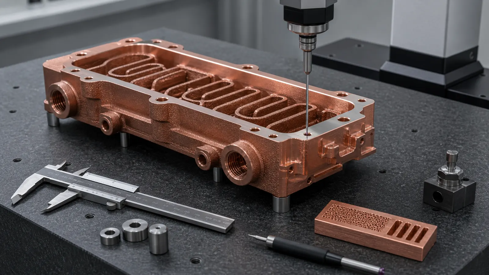
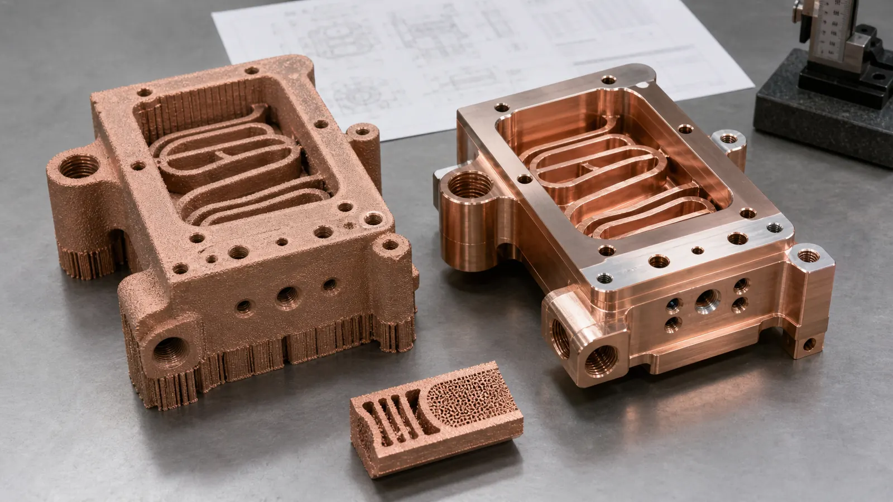
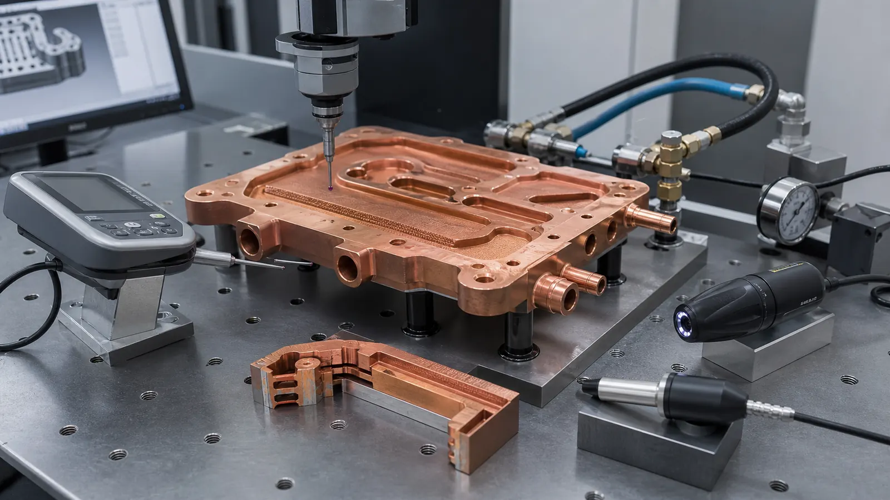

> Tolerances in copper metal 3D printing should be assigned by function. A printed copper part may need loose near-net envelope control, tight machined datum control, and functional acceptance tests on the same drawing. The RFQ becomes clearer when the buyer separates as-built geometry, post-machined interfaces, and inspected performance evidence.

The most expensive tolerance mistake in copper AM is asking every surface to behave like a CNC-machined copper block.

It usually appears as a simple drawing note:

```text
General tolerance: +/-0.05 mm unless otherwise specified.
```

That note may be normal for a small machined copper plate. It becomes weak for a copper LPBF part with internal channels, threaded ports, seal lands, flat thermal faces, support-side surfaces, and thin walls. The supplier must guess which dimensions are critical, which can be machined, which are only near-net, and which are hidden inside the part where a normal CMM cannot reach.

The issue matters more in 2026 because copper additive manufacturing is being reviewed for denser thermal, electrical, RF, and semiconductor hardware. [EOS positions copper AM](https://www.eos.info/metal-solutions/metal-materials/copper) around conductivity-driven applications such as heat exchangers, electronics, motors, inductors, and power electronics heat sinks. Those applications do not fail only because the outer envelope is off by 0.2 mm. They fail when a seal land leaks, a contact pad does not sit flat, a port thread cuts too close to a channel, or an internal passage cannot be verified.



_Figure 1. Copper AM tolerances should be reviewed as a finished-component route: printed blank, machined datums, critical surfaces, and inspection evidence._

## The Tolerance Question Is Not One Number

The useful question is not "what tolerance can copper 3D printing hold?"

The useful question is:

> Which dimensions are acceptable as-built, which dimensions must be machined after printing, and which dimensions should be accepted by a functional test instead of a local measurement?

Those are different control systems.

| Tolerance category | Typical features | Better control method |
| --- | --- | --- |
| As-built LPBF geometry | Noncritical exterior walls, support-side surfaces, fins, bosses before machining, rough internal surfaces | Build orientation, support strategy, allowance, process route, visual and dimensional screening |
| Post-machined interfaces | Datum pads, flat thermal faces, O-ring lands, gasket faces, threaded ports, bolt holes, RF flanges, electrical contact pads | CNC finishing, stock allowance, fixture plan, CMM, roughness, thread gauge, flatness check |
| Functional acceptance | Internal channels, pressure boundary, flow path, leak tightness, thermal contact behavior, conductivity route | Flow, pressure, leak, CT, borescope, section coupon, roughness, hardness, conductivity, first article records |

If the drawing applies one number to all three categories, the quote will contain hidden assumptions. A +/-0.05 mm positional tolerance on a machined bolt pattern is a different request from +/-0.05 mm on an as-built fin field. A pressure-tested internal cooling path is a different requirement from a hidden channel dimension that no practical gauge can reach.

For the manufacturing foundation, pair this page with [Design Rules for Copper Laser Powder Bed Fusion Parts](/posts/EngineeringGuide/design-rules-copper-laser-powder-bed-fusion-parts/) and [How to Prepare CAD Files for Copper Metal 3D Printing](/posts/EngineeringGuide/how-to-prepare-cad-files-for-copper-metal-3d-printing/).

## Why Copper Accuracy Is A Finished-Component Problem

Copper adds two tolerance risks to the usual metal AM discussion.

First, the process window is demanding. [NIST research on highly reflective metals in LPBF](https://www.nist.gov/publications/ultra-high-speed-printing-regime-laser-powder-bed-fusion-highly-reflective-metals) is a useful reference point because copper's reflectivity and thermal behavior affect how energy enters and stabilizes the melt pool. That does not mean copper cannot be printed. It means dimensional repeatability depends on qualified parameters, geometry, build orientation, heat history, and post-processing route.

Second, copper AM parts are normally selected for difficult geometry. The value is not a rectangular block. It is a cold plate with curved channels, a compact heat exchanger, a waveguide with integrated cooling, a liquid-cooled conductor, or a semiconductor thermal-control part. These features create local heat-flow differences during printing and local movement risk during stress relief, heat treatment, support removal, and machining.

That is why the tolerance plan should follow the finished part, not the print model alone.

## Practical Starting Ranges For RFQ Discussion

The numbers below are not universal guarantees. They are starting ranges for discussion before a supplier reviews the actual material route, machine, geometry, orientation, post-processing, and inspection plan.

| Feature or surface | Early RFQ discussion range | What usually controls it |
| --- | --- | --- |
| As-built exterior envelope | Often discussed around +/-0.10 to +/-0.30 mm | Part size, orientation, supports, local heat history, stress relief, measurement method |
| Machined datum pad or bolt hole | Often discussed around +/-0.02 to +/-0.05 mm where accessible | CNC setup, stock, fixture, datum strategy, part stiffness |
| Flat thermal contact face | Tens of microns may be reviewable, but footprint and clamp plan matter | Stress relief, machining, lapping or grinding, flatness inspection |
| Threaded coolant port | Usually should be drilled, tapped, or machined after printing | Boss size, wall thickness, tool access, fitting type, pressure requirement |
| O-ring land or gasket face | Usually should be machined and inspected | Seal design, groove geometry, surface finish, leak test |
| Internal channel dimension | Should not be treated like an external machined slot | Build route, powder removal, CT or section evidence, flow and pressure-drop test |
| Thin fin or pin field | Highly geometry-dependent | Build orientation, support strategy, heat distortion, handling damage, acceptance criteria |

The wrong move is to choose the tightest number and apply it everywhere. That increases quote risk without improving the part. A stronger drawing marks the 5-10 features that control assembly, sealing, contact, pressure, RF performance, or heat transfer, then leaves noncritical regions as near-net geometry.

This fits the logic of [ISO/ASTM 52911-1](https://www.iso.org/standard/72951.html), which treats laser-based powder bed fusion of metals as a process-specific design problem. The standard is not a copper tolerance table, but it reinforces the correct behavior: design requirements should reflect the AM process, not only the CAD ideal.



_Figure 2. The printed blank and the finished copper component are different tolerance states. The RFQ should make both visible._

## Separate The Printed Blank From The Finished Copper Component

A copper AM quote should define at least two geometries:

1. The printed blank.
2. The finished component.

The printed blank may include support scars, oversized faces, pilot holes, sacrificial pads, unmachined exterior walls, and extra stock near sealing regions. The finished component is what the buyer installs.

For many copper parts, the finished component needs machining on:

- Thermal interface faces.
- Datum pads.
- O-ring grooves and gasket lands.
- Threaded ports and fitting seats.
- Bolt holes and locating holes.
- Electrical contact pads.
- RF mating flanges or conductive surface paths.
- Tube interfaces and manifold ports.

Machining stock is not wasted material. It is tolerance insurance. In early reviews, 0.4-1.0 mm of stock on functional faces is a common discussion range, but the final number depends on part size, wall thickness, channel proximity, distortion risk, build orientation, and fixture access.

Without stock, the supplier has only two poor options: accept the as-built surface or machine deeper than planned and risk wall thickness, channel exposure, or seal failure.

## Feature-By-Feature Tolerance Strategy

The tolerance plan should follow each feature's job.

| Feature | Weak RFQ language | Stronger RFQ language |
| --- | --- | --- |
| Thermal contact face | "As printed, +/-0.05 mm" | Machine after stress relief; define flatness, roughness, datum, and inspection method |
| O-ring groove | "Print groove to final size" | Machine groove and land; define gland geometry, surface finish, pressure or leak test |
| Threaded coolant port | "Print thread" | Print robust boss, then drill, tap, or machine thread; define fitting and proof pressure |
| Bolt pattern | "General tolerance applies" | Define hole size, positional tolerance, datum reference, and machining route |
| Internal channel | "Hold channel +/-0.05 mm" | Define minimum passage, longest path, cleaning access, pressure drop, flow, CT or section evidence |
| Busbar contact pad | "Copper surface" | Machine contact pad; define flatness, roughness, plating if needed, and conductivity evidence |
| RF flange | "Print to model" | Define critical RF surface, flange tolerance, plating or polishing route, and CMM or RF verification |
| Heat sink fin field | "All fins +/-0.05 mm" | Define minimum fin thickness, damaged-fin acceptance, interface flatness, and thermal test |

This keeps cost where it creates value. Tight tolerance on a seal face can prevent a leak. Tight tolerance on a noncritical as-built wall may only add review time.

For adjacent application guidance, use [3D Printed Copper Heat Exchangers: Design Benefits and Manufacturing Limits](/posts/EngineeringGuide/3d-printed-copper-heat-exchangers-design-benefits-manufacturing-limits/), [Copper AM Parts for Semiconductor Equipment](/posts/EngineeringGuide/copper-am-semiconductor-equipment-rfq/), [3D Printed Copper RF Waveguide and Vacuum Components](/posts/EngineeringGuide/3d-printed-copper-rf-waveguide-vacuum-components/), and [Copper Busbars and Induction Coils RFQ Guide](/posts/EngineeringGuide/3d-printed-copper-busbars-induction-coils-rfq/).

## Internal Channels Need Acceptance Evidence

Internal channels are where copper AM creates value, but they are also where dimensional language often becomes least useful.

A buried channel cannot always be measured by CMM. CT can help, but CT resolution, copper density, wall thickness, part size, reconstruction settings, and cost all matter. A flow test can prove function without measuring every local wall. A sectioned witness coupon can prove representative geometry without cutting the final part.

For an internal copper cooling channel, specify:

- Minimum channel width and height.
- Longest enclosed path between openings.
- Minimum wall to outside surface.
- Minimum wall to thread minor diameter.
- Bend radius or abrupt turn limits.
- Cleaning access and flushing direction.
- Working pressure and proof pressure.
- Allowable pressure drop at a defined flow rate.
- Leak test or pressure hold requirement.
- CT, borescope, section coupon, or flow evidence when needed.

That is more useful than forcing a hidden channel into the same tolerance note as a machined bolt hole. For the cleanability side of the decision, use [Powder Removal Challenges in Copper 3D Printed Internal Channels](/posts/EngineeringGuide/copper-am-cleaning-powder-removal-internal-channels/) and [Copper 3D Printing for Microchannel Cold Plates in Thermal Management](/posts/EngineeringGuide/copper-3d-printing-microchannel-cold-plates-thermal-management/).

## Inspection Method Should Be Chosen Before The Quote

A tolerance without an inspection method is only a wish.

Copper AM projects may use:

- CMM for datums, machined faces, bolt patterns, and accessible ports.
- Height gauge or granite plate checks for flatness screening.
- Surface roughness measurement for contact faces, seal lands, and RF surfaces.
- CT for internal channels, porosity review, or hidden geometry when justified.
- Borescope review for accessible passages.
- Flow testing for channel function.
- Pressure or helium leak testing for sealed copper parts.
- Conductivity and hardness checks for material route verification.
- Witness coupons for density, heat treatment, and process control.

[ISO/ASTM 52902](https://www.iso.org/standard/79683.html) is relevant because it covers test artefacts for geometric capability assessment of AM systems. It does not replace part-specific inspection, but it supports the idea that AM dimensional capability should be assessed with measurable geometry and uncertainty, not guessed from a brochure number.



_Figure 3. Dimensional accuracy for copper AM is accepted through a route: metrology, surface checks, leak or flow tests, and material evidence where needed._

## Case Pattern: A Tight Drawing That Became A Better Quote

A representative project involved a copper liquid-cooled power electronics plate. The envelope was about 145 mm x 90 mm x 16 mm. The CAD had a curved internal channel network, four ports, twelve mounting holes, and one thermal contact face.

The first drawing applied +/-0.05 mm to almost every dimension. It also asked for the thermal face at final size with no machining stock. The internal channels were treated as if every local width could be checked like a milled slot.

The revised RFQ separated the part into three zones:

- As-built envelope: near-net copper LPBF, with noncritical exterior surfaces not held to CNC tolerance.
- Machined interfaces: thermal face, port seats, threaded ports, datum pads, and bolt holes controlled after stress relief.
- Functional tests: pressure hold, flow check, leak test, and CMM report for accessible features.

That changed the discussion. Instead of arguing over a single general tolerance note, the supplier could quote a real route: print, stress relief, support removal, channel cleaning, machine critical faces, inspect, pressure test, and document.

The part did not become simpler. The quote became clearer.

This is the same logic used in [When Copper 3D Printing Is Better Than CNC Machining](/posts/EngineeringGuide/when-copper-3d-printing-is-better-than-cnc-machining/) and [Copper AM Process Selection: LPBF vs CNC and Brazing](/posts/EngineeringGuide/copper-am-process-selection-lpbf-cnc-brazing/): use additive manufacturing where geometry creates value, then use machining and inspection where the finished interface demands it.

## Application-Specific Tolerance Priorities

Different copper AM applications spend tolerance in different places.

| Application | Highest-value tolerance controls |
| --- | --- |
| Cold plates and cooling blocks | Flat thermal faces, O-ring lands, threaded ports, pressure boundary, internal channel evidence |
| Compact heat exchangers | Port alignment, wall thickness, channel continuity, flow and pressure-drop validation |
| Semiconductor thermal parts | Datums, seal faces, clean interfaces, leak testing, CMM records, packaging and handling notes |
| RF and vacuum copper parts | RF mating surfaces, flange geometry, surface finish, plating route, leak and cleaning evidence |
| Busbars and cooled conductors | Contact-pad flatness, hole position, insulation clearance, plating, conductivity checks |
| Mold cooling inserts | Cavity-side machining stock, mounting datums, pressure-tested cooling channels, tooling interfaces |
| Heat sinks | Interface flatness, fin acceptance, damaged-feature criteria, thermal test setup |

For application pages, start with [Copper cold plate RFQ page](/copper-cold-plates/), [Copper heat sink RFQ page](/copper-heat-sinks/), [Copper AM Conformal Cooling Mold Inserts](/posts/EngineeringGuide/copper-am-conformal-cooling-mold-inserts/), or [Copper 3D Printed Cooling Block Case Study for Semiconductor Wafer Processing Equipment](/posts/EngineeringGuide/copper-3d-printed-cooling-block-case-study-semiconductor-wafer-processing-equipment/).

## RFQ Checklist For Copper AM Tolerances

Before asking for a copper metal 3D printing quote, prepare this tolerance package:

| RFQ item | What to provide |
| --- | --- |
| CAD model | STEP or native CAD with internal channels included |
| Drawing | Datums, critical dimensions, tolerances, reference dimensions, finish notes |
| Development stage | Concept, prototype, first article, pilot, or production |
| Material route | Pure copper, CuCrZr, CuCr1Zr, or supplier review |
| Machining scope | Faces, holes, ports, contact pads, seal lands, RF surfaces |
| Flatness and roughness | Contact faces, seal lands, thermal interfaces, RF paths |
| Seal and pressure data | O-ring, gasket, thread, fitting, working pressure, proof pressure, leak target |
| Internal channel evidence | Section views, cleaning access, CT, flow, pressure drop, coupon plan |
| Inspection package | CMM, roughness, CT, leak, pressure, flow, conductivity, hardness, first article report |
| Quantity and timing | Prototype, small batch, repeat build, qualification, target lead time |

For a broader quotation package, use [Engineering Checklist for Copper 3D Printed Part Quotation](/posts/EngineeringGuide/engineering-checklist-copper-3d-printed-part-quotation/). If drawings are not ready, the [RFQ page](/rfq/) explains what to send first.

## FAQ

<details>
<summary>What tolerance can copper metal 3D printing hold?</summary>

There is no single reliable answer. As-built LPBF geometry is usually broader than machined copper features, while post-machined datums, holes, seal faces, and contact pads can be controlled tighter when they are accessible and properly fixtured. A useful RFQ separates as-built, machined, and functionally tested dimensions.

</details>

<details>
<summary>Can 3D printed copper parts hold +/-0.05 mm?</summary>

Sometimes, but usually not as a blanket requirement on every surface. A machined datum pad, bolt hole, or contact face may be reviewable at that level. Thin fins, support-side surfaces, internal channels, and as-built external walls need a different tolerance strategy.

</details>

<details>
<summary>Should threaded ports be printed directly?</summary>

For functional ports, printing the thread directly is usually not the preferred route. A stronger approach is to print a robust boss with enough wall thickness, then drill, tap, or machine the thread after printing. The drawing should define fitting type, thread standard, sealing method, and pressure requirement.

</details>

<details>
<summary>How should internal channel accuracy be specified?</summary>

Define minimum passage size, longest channel path, wall thickness, cleaning access, flow requirement, pressure drop, leak requirement, and inspection route. For hidden channels, CT, flow testing, pressure testing, or witness coupons may be more useful than a tight local dimensional tolerance that cannot be verified economically.

</details>

<details>
<summary>Does tighter tolerance always mean better copper AM performance?</summary>

No. Tighter tolerance improves performance only when it controls a real interface or risk. Over-tight tolerances on noncritical surfaces add cost and review time without improving thermal, electrical, RF, or fluid function. Spend tolerance on datums, contact faces, seals, ports, and assembly features.

</details>

## Practical Next Step

Dimensional accuracy in copper metal 3D printing is a route decision.

Use copper AM where geometry creates value: internal channels, integrated manifolds, compact thermal structures, RF/vacuum shapes, high-current conductors, and low-volume functional hardware. Use machining where the part needs a controlled interface. Use inspection where the drawing needs proof.

The best copper AM tolerance package does not ask every feature to be perfect. It tells the supplier what must be printed, what must be finished, what must be measured, and what must be tested.

Send CAD, drawings, quantity, material preference, tolerance requirements, and acceptance scope to [info@szcomo.com](mailto:info@szcomo.com). If the tolerance strategy is uncertain, send the current drawing anyway and mark the critical interfaces. A targeted review is faster than forcing a global tolerance note that hides the real manufacturing work.

> _Disclaimer: All scenarios described are based on real or closely analogous executed projects. If you choose to implement any of the examples described in this article, please conduct a careful evaluation first. This site assumes no responsibility for losses resulting from implementations made without prior evaluation._
