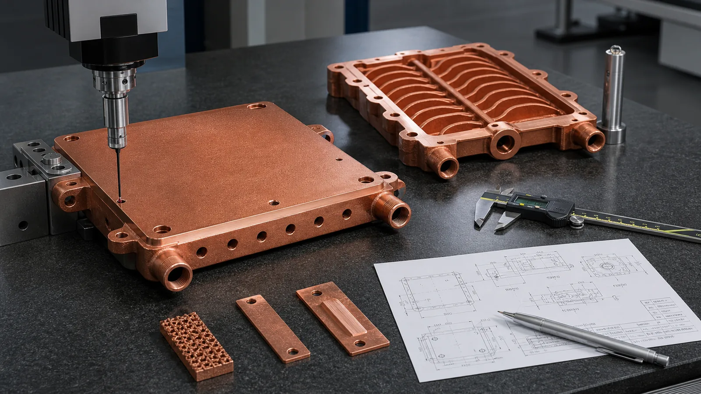
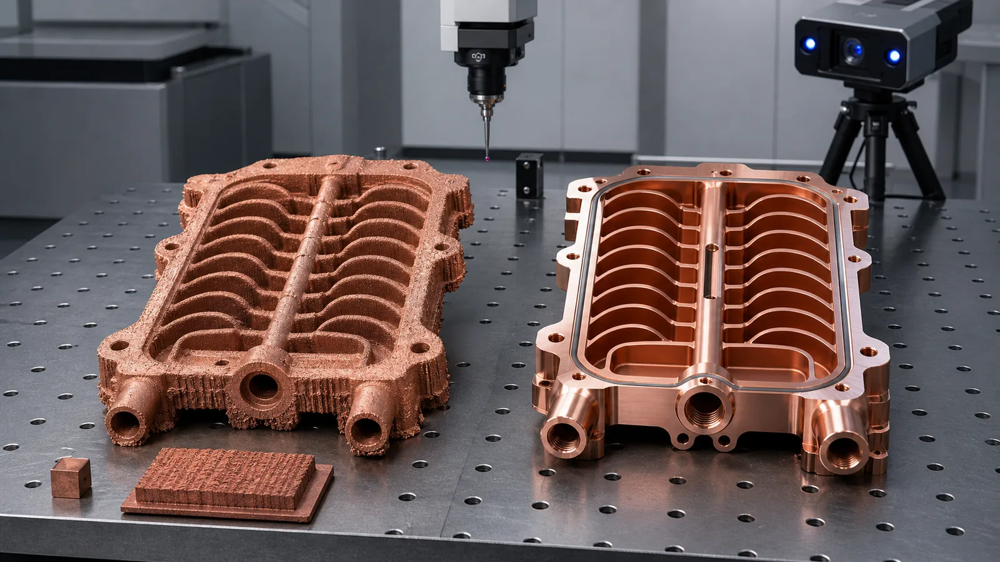
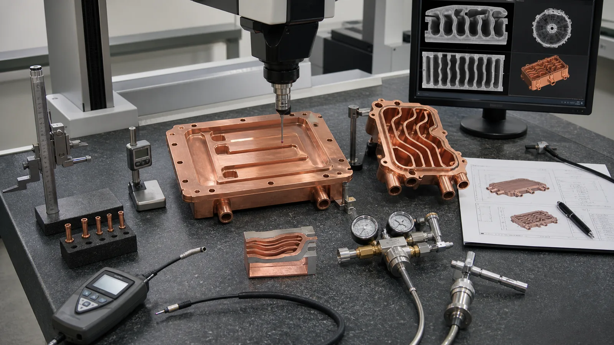

> Tolerances in copper metal 3D printing should be defined by function, not applied as one blanket number across the whole part. As-built LPBF geometry, post-machined datums, flat thermal faces, threaded ports, sealing lands, internal channels, and inspected acceptance dimensions all need different control methods. The right RFQ separates near-net printed geometry from finished critical interfaces.

The most expensive tolerance mistake in copper metal 3D printing is asking the printed part to behave like a CNC-machined block everywhere.

That expectation usually appears in a simple drawing note:

```text
General tolerance: +/-0.05 mm unless otherwise specified.
```

On a small machined copper plate, that note may be normal. On a copper LPBF part with internal channels, threaded ports, a thermal contact face, and thin walls, it can make the quote slower, more expensive, or impossible to interpret. The supplier has to decide which dimensions are cosmetic, which are assembly-critical, which can be machined, and which are buried inside the part where normal CMM access cannot reach.

The tolerance problem matters more in 2026 because copper AM is moving into tighter industrial hardware. AI accelerator racks, power electronics, semiconductor tooling, RF/vacuum parts, and liquid-cooled conductors are not only asking for copper's conductivity. They are asking for sealed interfaces, contact pressure, compact manifolds, repeatable assembly, and inspection evidence. [NVIDIA describes its GB200 NVL72](https://www.nvidia.com/en-us/data-center/gb200-nvl72/) as a rack-scale, liquid-cooled design, which is a useful signal for the direction of high-density thermal hardware. More heat and higher packaging density make dimensional control part of the thermal design, not a late drawing detail.



_Figure 1. Copper AM tolerances should be reviewed as a finished-component route: printed blank, machined datums, critical surfaces, and inspection evidence._

## The First Rule: Do Not Use One Tolerance for the Whole Part

Copper LPBF creates a near-net shape. It does not automatically create final dimensions on every surface.

The useful question is not "what tolerance can copper 3D printing hold?" The useful question is:

> Which dimensions must be controlled as-built, which must be machined after printing, and which must be verified by functional testing?

Those are three different categories.

| Tolerance category | Typical examples | Practical control method |
| --- | --- | --- |
| As-built LPBF geometry | Noncritical walls, fins, outer envelope, support-side surfaces | Build orientation, parameter route, support strategy, allowance |
| Post-machined features | Datum pads, flat thermal faces, O-ring lands, threaded ports, bolt holes, electrical contact pads | CNC finishing, fixturing, stress-relief planning, CMM inspection |
| Functional acceptance | Internal channel performance, leak tightness, pressure boundary, flow path, thermal contact behavior | Flow, pressure, leak, CT, section coupons, roughness, flatness, CMM where accessible |

If the drawing treats all three categories the same, the quote will contain hidden assumptions. A 0.05 mm positional tolerance on a post-machined bolt pattern is different from a 0.05 mm expectation on an unsupported as-built fin field. A leak-tested internal channel is different from a nominal channel dimension that cannot be measured directly.

For the design foundation, start with [Design Rules for Copper Laser Powder Bed Fusion Parts](/posts/EngineeringGuide/design-rules-copper-laser-powder-bed-fusion-parts/) and [How to Prepare CAD Files for Copper Metal 3D Printing](/posts/EngineeringGuide/how-to-prepare-cad-files-for-copper-metal-3d-printing/). Those two pages define the manufacturing route before this page defines the tolerance route.

## Why Copper AM Accuracy Is More Sensitive Than a Generic Metal AM Quote

Copper adds two complications to normal metal powder bed fusion.

First, copper is optically and thermally demanding. [NIST research on copper LPBF](https://www.nist.gov/publications/ultra-high-speed-printing-regime-laser-powder-bed-fusion-highly-reflective-metals) discusses the energy-loss problem in highly reflective metals and the need for parameter optimization. That does not mean copper cannot be printed. It means stable density, surface condition, and dimensional repeatability come from a qualified route, not from a generic laser setting.

Second, copper AM parts are usually chosen for difficult geometry. The value is not a simple rectangular block. It is a cold plate with internal channels, a compact heat exchanger, an RF cavity, a busbar with integrated cooling, or a semiconductor thermal-control part. These features create local heat-flow differences during printing and local distortion risk during heat treatment and machining.

[EOS positions copper AM](https://www.eos.info/metal-solutions/metal-materials/copper) around heat exchangers, electronics, electrical motors, inductors, and conductivity-driven applications. Those are exactly the applications where tolerance must be tied to function. A copper heat exchanger may tolerate an as-built outer wall. It may not tolerate a warped sealing land. A busbar may tolerate a near-net outer contour. It may not tolerate a poor contact pad.

## Practical Tolerance Ranges: Use Them as Review Gates, Not Guarantees

Every supplier, machine, material route, geometry, and post-processing plan is different. Still, early RFQ discussions need a starting language.

Use these ranges as review gates:

| Feature or surface | Early discussion range | What usually controls it |
| --- | --- | --- |
| As-built external envelope | Often discussed around +/-0.10 to +/-0.30 mm | Machine route, geometry, orientation, heat treatment, supports |
| Machined critical face | Often discussed around +/-0.02 to +/-0.05 mm where accessible | CNC setup, datum strategy, stock, fixture, part stiffness |
| High-quality flat thermal face | Tens of microns may be possible, but footprint and clamp plan matter | Stress relief, finish machining, lapping or grinding, inspection method |
| Threaded port or fitting seat | Should usually be machined or tapped after printing | Boss design, wall thickness, tool access, pressure requirement |
| O-ring land or gasket face | Should be machined and inspected | Seal design, flatness, groove geometry, surface finish |
| Internal channel size | Should not be promised like an external machined feature | Build route, powder removal, CT/flow evidence, section coupons |
| Thin fins or pins | Geometry-dependent; global tolerance notes are weak | Build orientation, support strategy, thermal distortion, handling |

The common mistake is using the tightest number everywhere. That punishes the quote without improving the part. A better drawing marks the 5-10 features that truly control assembly or performance, then lets noncritical surfaces remain near-net.

This is also more consistent with [ISO/ASTM 52911-1](https://www.iso.org/standard/72951.html), which treats laser-based powder bed fusion of metals as a process-specific design problem. The standard is not a copper-only tolerance table, but it reinforces the correct behavior: design recommendations must reflect the process, not only the CAD model.

## Separate the Printed Blank From the Finished Copper Component

A copper AM quote should define at least two geometries:

1. The printed blank.
2. The finished component.

The printed blank may include support scars, oversized faces, pilot holes, extra stock on seal areas, and sacrificial regions for fixturing. The finished component is what the buyer installs.

For many copper parts, the finished component needs machining on:

- Thermal interface faces.
- Datum pads.
- O-ring grooves and gasket lands.
- Threaded ports and fitting seats.
- Bolt holes and locating holes.
- Electrical contact pads.
- RF mating flanges or surface paths.
- Tube interfaces and manifold ports.

Machining stock is therefore not wasted material. It is tolerance insurance. On early reviews, 0.4-1.0 mm of stock on functional faces is a common discussion range, but it should be confirmed by part size, build orientation, distortion risk, fixture access, and supplier route.

Without stock, the supplier has only two bad options: accept the as-built surface or machine below the intended surface and risk wall thickness, channel exposure, or seal failure.



_Figure 2. Copper AM dimensional accuracy should separate the near-net printed blank from machined functional datums, seal faces, ports, and contact surfaces._

## Feature-by-Feature Tolerance Strategy

The tolerance plan should follow the feature's job.

| Feature | Do not specify it as | Better RFQ language |
| --- | --- | --- |
| Thermal contact face | "As printed, +/-0.05 mm" | Machine face after stress relief; define flatness, roughness, datum, and inspection method |
| O-ring groove | "Print groove to final size" | Machine groove and land; define gland geometry, surface finish, and leak test |
| Threaded coolant port | "Print thread" | Print robust boss, then drill/tap or machine thread; define fitting type and proof pressure |
| Bolt pattern | "General tolerance applies" | Define hole size, positional tolerance, datum reference, and whether holes are machined |
| Internal channel | "Hold channel +/-0.05 mm" | Define minimum passage, longest path, cleaning access, flow, pressure drop, CT or section evidence |
| Busbar contact pad | "Copper surface" | Machine contact pad; define flatness, surface finish, plating if needed, and conductivity evidence |
| RF flange | "Print to model" | Define critical RF surface, flange tolerance, plating or polishing route, and CMM/RF verification |
| Heat sink fin field | "All fins +/-0.05 mm" | Define minimum fin thickness, damaged-fin acceptance, interface flatness, and thermal test |

This approach keeps tolerance where it earns its cost.

For related application-specific guidance, use [3D Printed Copper Heat Exchangers: Design Benefits and Manufacturing Limits](/posts/EngineeringGuide/3d-printed-copper-heat-exchangers-design-benefits-manufacturing-limits/), [Copper AM Parts for Semiconductor Equipment](/posts/EngineeringGuide/copper-am-semiconductor-equipment-rfq/), [3D Printed Copper RF Waveguide and Vacuum Parts](/posts/EngineeringGuide/3d-printed-copper-rf-waveguide-vacuum-components/), and [Copper Busbars and Induction Coils RFQ Guide](/posts/EngineeringGuide/3d-printed-copper-busbars-induction-coils-rfq/).

## Internal Channels Need Acceptance Evidence, Not CNC-Style Tolerances

Internal channels are where copper AM creates value, but they are also where dimensional language often becomes weak.

A buried channel cannot always be measured with a CMM. CT can help, but CT resolution, copper density, wall thickness, part size, reconstruction settings, and cost all matter. A flow test can prove function without measuring every local wall. A sectioned witness coupon can prove representative geometry without cutting the final part.

For an internal cooling channel, specify:

- Minimum channel width and height.
- Longest enclosed path between openings.
- Minimum wall to outside surface.
- Minimum wall to thread minor diameter.
- Bend radius or abrupt turn limits.
- Cleaning access and flushing direction.
- Working pressure and proof pressure.
- Allowable pressure drop at defined flow rate.
- Leak test or pressure hold requirement.
- CT, borescope, section coupon, or flow evidence when needed.

That is more useful than forcing a hidden channel into the same tolerance note as a machined bolt hole.

For powder and channel risk, use [Copper AM Cleaning and Powder Removal for Internal Channels](/posts/EngineeringGuide/copper-am-cleaning-powder-removal-internal-channels/) and [Copper 3D Printing for Microchannel Cold Plates in Thermal Management](/posts/EngineeringGuide/copper-3d-printing-microchannel-cold-plates-thermal-management/).

## Inspection Method Should Be Chosen Before the Quote

A tolerance without an inspection method is only a wish.

Copper AM projects may use:

- CMM for datums, machined faces, bolt patterns, and accessible ports.
- Height gauge or granite plate checks for flatness screening.
- Surface roughness measurement for contact faces, seal lands, and RF surfaces.
- CT for internal channels, porosity review, or hidden geometry when justified.
- Borescope review for accessible passages.
- Flow testing for channel function.
- Pressure or helium leak testing for sealed copper parts.
- Conductivity and hardness checks for material route verification.
- Witness coupons for density, heat treatment, and process control.

[ISO/ASTM 52902](https://www.iso.org/standard/79683.html) is useful here because it covers test artefacts for geometric capability assessment of AM systems. It does not replace part-specific inspection, but it supports the idea that AM dimensional capability should be assessed with measurable geometry and uncertainty, not guessed from a brochure number.



_Figure 3. Dimensional accuracy for copper AM is accepted through a complete inspection route, not a single global tolerance note._

## Case Pattern: A Tight Drawing That Became a Better Quote

A representative project involved a copper liquid-cooled power electronics plate. The envelope was about 145 mm x 90 mm x 16 mm. The CAD had a curved internal channel network, four ports, twelve mounting holes, and one thermal contact face.

The first drawing applied +/-0.05 mm to almost every dimension. It also asked for the thermal face at final size, with no machining stock. The internal channels were treated as if every local width could be checked like a milled slot.

The revised RFQ separated the part into three zones:

- As-built envelope: near-net copper LPBF, with noncritical exterior surfaces not held to CNC tolerance.
- Machined interfaces: thermal face, port seats, threaded ports, datum pads, and bolt holes controlled after stress relief.
- Functional tests: pressure hold, flow check, leak test, and CMM report for accessible features.

That changed the discussion. Instead of arguing over a single general tolerance note, the supplier could quote a real route: print, stress relief, support removal, channel cleaning, machine critical faces, inspect, pressure test, and document.

The part did not become simpler. The quote became clearer.

This is the same logic used in [When Copper 3D Printing Is Better Than CNC Machining](/posts/EngineeringGuide/when-copper-3d-printing-is-better-than-cnc-machining/) and [Copper AM Process Selection: LPBF vs CNC and Brazing](/posts/EngineeringGuide/copper-am-process-selection-lpbf-cnc-brazing/): use additive manufacturing for geometry, then use machining and inspection where the finished interface demands it.

## RFQ Checklist for Copper AM Tolerances

Before asking for a copper metal 3D printing quote, prepare this tolerance package:

- STEP or native CAD file.
- 2D drawing with datums and critical dimensions.
- Development stage: concept, prototype, first article, pilot, or production.
- Material preference: pure Cu, CuCrZr, CuCr1Zr, or supplier review.
- Surfaces that must be machined.
- Flatness and roughness requirements for contact faces.
- Seal type, gasket or O-ring geometry, and leak requirement.
- Thread type, fitting type, and pressure requirement.
- Internal channel section views and cleaning access.
- Dimensions that are inspection-critical.
- Dimensions that are only reference or near-net.
- Required reports: CMM, roughness, CT, pressure, flow, leak, conductivity, hardness, or coupon data.

For a broader quotation package, use [Engineering Checklist for Copper 3D Printed Part Quotation](/posts/EngineeringGuide/engineering-checklist-copper-3d-printed-part-quotation/). If drawings are not ready, the [RFQ page](/rfq/) explains what to send first.

## FAQ

<details>
<summary>What tolerance can copper metal 3D printing hold?</summary>

There is no single reliable answer. As-built LPBF geometry is often discussed in a broader range than machined copper features, while post-machined datums, holes, seal faces, and contact pads can be controlled much tighter when they are accessible and properly fixtured. A useful RFQ separates as-built, machined, and functionally tested dimensions.

</details>

<details>
<summary>Can 3D printed copper parts hold +/-0.05 mm?</summary>

Sometimes, but usually not as a blanket requirement on every surface. A machined datum pad, bolt hole, or contact face may be reviewable at that level. Thin fins, support-side surfaces, internal channels, and as-built external walls need a different tolerance strategy.

</details>

<details>
<summary>Should threaded ports be printed directly?</summary>

For functional ports, printing the thread directly is usually not the preferred route. A stronger approach is to print a robust boss with enough wall thickness, then drill, tap, or machine the thread after printing. The drawing should define fitting type, thread standard, sealing method, and pressure requirement.

</details>

<details>
<summary>How should internal channel accuracy be specified?</summary>

Define minimum passage size, longest channel path, wall thickness, cleaning access, flow requirement, pressure drop, leak requirement, and inspection route. For hidden channels, CT, flow testing, pressure testing, or witness coupons may be more useful than a tight local dimensional tolerance that cannot be verified economically.

</details>

<details>
<summary>Does tighter tolerance always mean better copper AM performance?</summary>

No. Tighter tolerance improves performance only when it controls a real interface or risk. Over-tight tolerances on noncritical surfaces add cost and review time without improving thermal, electrical, RF, or fluid function. Spend tolerance on datums, contact faces, seals, ports, and assembly features.

</details>

## Bottom Line

Dimensional accuracy in copper metal 3D printing is a route decision.

Use copper AM where geometry creates value: internal channels, integrated manifolds, compact thermal structures, RF/vacuum shapes, high-current conductors, and low-volume functional hardware. Use machining where the part needs a controlled interface. Use inspection where the drawing needs proof.

The best copper AM tolerance package does not ask every feature to be perfect. It tells the supplier what must be printed, what must be finished, what must be measured, and what must be tested.

Send CAD, drawings, quantity, material preference, tolerance requirements, and acceptance scope to [info@szcomo.com](mailto:info@szcomo.com). If the tolerance strategy is uncertain, send the current drawing anyway and mark the critical interfaces. A targeted review is faster than forcing a global tolerance note that hides the real manufacturing work.
