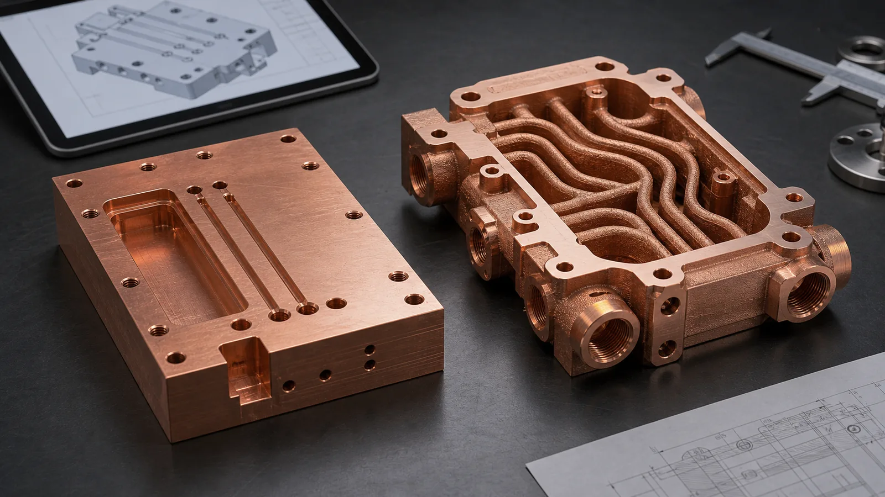
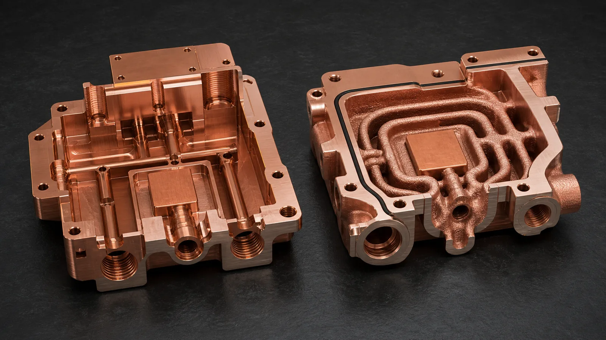
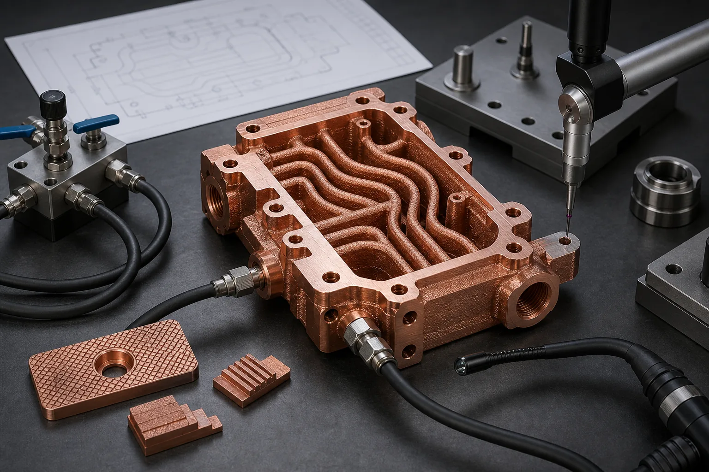

> Copper 3D printing is better than CNC machining when the copper part needs internal geometry, integrated cooling, compact manifolds, reduced joints, or a three-dimensional thermal or electrical path that cutting tools cannot create cleanly. CNC is still better for simple, accessible copper blocks, flat plates, contact pads, and high-volume parts where the geometry does not justify LPBF cost and validation work.

The wrong question is "Can this copper part be 3D printed?"

Most copper parts can be forced into more than one manufacturing route. The better question is sharper: **what does CNC machining force the design to give up?**

Sometimes the answer is nothing. A flat copper heat spreader, simple busbar, plate with drilled holes, or accessible cooling block should usually start with CNC. Copper machines well enough when the geometry is open, the stock is available, and burr control, flatness, surface finish, and contact faces define the value.

But CNC has a geometry tax. Straight tools need access. Deep pockets create chip evacuation problems. Internal channels require drilled intersections, plugs, covers, brazed plates, or multiple pieces. Each joint becomes a possible leak path, resistance point, tolerance stack, or cleaning problem. If the design needs coolant to wrap around a heat source, current to turn through a compact volume, or a manifold to merge with the body, copper additive manufacturing may become the more honest route.

That does not make copper LPBF cheap. It changes what the buyer is paying for.

_Figure 1. CNC machining works best when copper features are tool-accessible. Copper additive manufacturing becomes valuable when integrated channels, ports, manifolds, and sealing faces reduce assembly or performance compromises._

## The First Gate: Is CNC Being Asked to Do 3D Work?

CNC machining is strongest when the part can be made by removing material from the outside. Milling, drilling, boring, turning, tapping, and EDM all have practical strengths. They also have access limits.

For copper parts, CNC should be the default route when:

- The geometry is mostly flat, prismatic, or rotational.
- Internal features can be drilled from clear directions.
- Heat transfer depends more on flatness and surface area than on internal routing.
- Electrical performance depends on simple section area and contact face quality.
- The drawing requires tight machined surfaces such as +/-0.02 mm to +/-0.05 mm on accessible features.
- Quantity is high enough that fixtures, tooling, and stable CNC cycles reduce unit cost.
- Assembly joints, plugs, or brazed covers do not create unacceptable risk.

Copper 3D printing deserves review when CNC would require the designer to split the part into too many pieces or accept a weaker thermal, fluid, RF, or electrical path.

The easiest screening sentence is:

**If CNC needs plugs, caps, cross-drilled compromises, long thin tools, or a brazed cover to create the function, compare it against copper AM before the design is frozen.**

This screening is especially relevant for [copper cold plates](/copper-cold-plates/), compact heat exchangers, cooling manifolds, high-current conductors, RF/vacuum parts, and semiconductor equipment components.

## Where Copper AM Can Beat CNC

Copper additive manufacturing can win when geometry changes the function or reduces the number of risky operations. The value is not the printed shape itself. The value is what the shape prevents.

| Decision driver | CNC machining route | Copper 3D printing route | When AM may be better |
| --- | --- | --- | --- |
| Internal channels | Straight drilled holes, milled pockets, plugs, brazed covers | Curved, branched, or conformal channels inside one body | Coolant path must follow heat source or packaging limits |
| Assembly joints | Multi-piece body, cover plate, brazing, welding, threaded plugs | Monolithic or fewer-piece component | Leak risk, thermal cycling, or alignment stack is expensive |
| Manifold integration | Separate manifold block and fittings | Inlet/outlet manifold printed into the part | Envelope, pressure drop, or tube routing is constrained |
| Heat transfer distance | Tool-accessible channels may sit far from heat source | Channels can be placed closer to critical zones | Thermal path length controls performance |
| Electrical path | Simple machined conductor or bent copper | 3D conductor with integrated cooling or mounting | Current path and thermal path must be solved together |
| RF or vacuum geometry | Split body, multiple operations, difficult internal surfaces | Consolidated cavity, waveguide, or manifold body | Alignment, sealing, and internal geometry dominate |
| Prototype iteration | New fixture or long CNC setup for every design | Geometry changes can be printed without hard tooling | Low-volume design learning matters more than unit cost |

The table does not say copper AM is always superior. It says the decision should be based on the failure mode. If the only benefit is "it looks advanced," CNC will usually be better. If the benefit is a smaller channel network, fewer joints, shorter thermal path, or a cleaner acceptance route, copper AM becomes worth quoting.

For a broader route comparison, see [Copper AM Process Selection: LPBF vs CNC and Brazing](/posts/EngineeringGuide/copper-am-process-selection-lpbf-cnc-brazing/).

## The Hidden CNC Costs That Make AM Competitive

Procurement often compares one CNC unit price against one AM unit price. That can be misleading.

A simple CNC copper block may be cheaper at the part level. The total route can change when the design needs:

- Deep drilling from multiple sides.
- EDM slots or small features that add cycle time.
- Multiple setups to reach hidden faces.
- Brazed covers or welded closures.
- Leak testing after joining.
- Plug sealing and rework.
- Post-braze flatness correction.
- Extra inventory because several parts must be assembled into one device.

In one project pattern, a CNC-and-braze cold plate body looked cheaper until the quote included a machined cover, two brazing operations, leak testing, post-braze flattening, and a first-article flow check. The printed route was still not the lowest-cost blank. It became competitive because it removed several joining steps and made the pressure boundary easier to reason about.

That is the cost ledger. Copper 3D printing competes poorly against a simple machined block. It competes better against an assembly that exists only because CNC tools cannot reach the functional geometry.

## The AM Costs That Must Not Be Ignored

Copper additive manufacturing has its own ledger.

As of 2026, industrial material suppliers such as [EOS](https://www.eos.info/metal-solutions/metal-materials/copper) and [Eplus3D](https://www.eplus3d.com/products/3d-printing-materials-copper/) position copper AM around conductivity-driven applications such as heat exchangers, electronics, induction coils, high-frequency parts, tooling, and compact thermal hardware. That positioning makes sense. Copper's thermal and electrical conductivity are the reason buyers care.

The same properties also make the process demanding. Copper reflects common laser energy and conducts heat away quickly. [NIST research on laser powder bed fusion of highly reflective metals](https://www.nist.gov/publications/ultra-high-speed-printing-regime-laser-powder-bed-fusion-highly-reflective-metals) points to the process challenge around energy coupling and printing conditions. Modern copper LPBF routes, including optimized infrared and green-laser systems, have improved practical capability, but the quote still has to include process risk.

A serious copper AM quote may include:

- Build preparation and support strategy.
- Powder removal planning for internal channels.
- Stress relief or heat treatment.
- Support removal.
- CNC machining of sealing faces, datum pads, threads, contact pads, and ports.
- Surface finishing, polishing, or plating when required.
- Pressure, leak, flow, CMM, conductivity, hardness, roughness, CT, or cleanliness checks.
- First-article learning and possible geometry adjustment.

If none of those steps add value, the buyer should question why the part is being printed.

For design risk details, see [Design Rules for Copper Laser Powder Bed Fusion Parts](/posts/EngineeringGuide/design-rules-copper-laser-powder-bed-fusion-parts/).

_Figure 2. The comparison is not "CNC versus 3D printing" in general. It is tool-access geometry versus integrated geometry, with cleaning, wall thickness, sealing, and inspection still included in the decision._

## A Practical Decision Matrix

Use this matrix before sending the RFQ. It is not a final engineering judgment, but it prevents the most common routing mistake.

| If the part looks like this | Start with CNC | Compare copper AM | Reason |
| --- | --- | --- | --- |
| Flat copper plate, heat spreader, contact pad, or simple busbar | Yes | Usually no | Machining gives strong surface control and simple cost |
| Straight drilled cooling block with accessible ports | Yes | Maybe | AM only helps if channel routing or joining risk matters |
| Cold plate with curved, branching, or close-to-source channels | Maybe | Yes | Internal geometry may control thermal performance |
| Heat exchanger core with many small internal passages | Maybe | Yes | Tool access and assembly become limiting |
| Manifold with intersecting routes and tight package height | Maybe | Yes | Printed integration may reduce fittings and joints |
| RF cavity, waveguide, or vacuum-facing copper component | Maybe | Yes | Alignment, internal geometry, surface finish, and sealing must be reviewed together |
| High-volume simple copper component | Yes | Usually no | CNC, stamping, extrusion, forging, or brazing may scale better |
| Prototype where geometry will change every 1-2 design loops | Maybe | Yes | AM can reduce fixture/tooling friction during development |

The quantity column is important. For one to ten pieces, AM may win when it avoids difficult fixtures or assemblies. For hundreds or thousands of simple parts, conventional routes often become stronger unless AM creates a measurable performance or reliability advantage.

## Case Pattern: The Part Was Not Expensive, the Assembly Was

A representative project involved a compact copper liquid-cooling block for a power electronics test setup. The envelope was roughly 115 mm x 80 mm x 24 mm. The heat source sat off-center, the available tube exit direction was fixed, and the cooling path needed to avoid four mounting bosses.

The first CNC concept used a milled channel plate, a cover, two drilled cross-passages, and several plugs. The blank was straightforward. The assembly was not.

The manufacturing review found four risks:

- The coolant path made two sharp turns only because the drill directions were limited.
- The brazed cover created a large joint directly above the pressure boundary.
- A port thread sat close to a drilled intersection, leaving weak local wall thickness.
- The thermal face still needed post-braze machining to approach about +/-0.05 mm flatness.

The printed concept used a monolithic copper body with a curved internal channel, integrated inlet/outlet manifold, thicker port bosses, and 0.6-0.8 mm machining stock on the thermal face. It still required CNC finishing, pressure testing, and flow verification. It was not a shortcut.

The trade-off was clear. The AM route added build cost and powder-removal review. It reduced plug count, eliminated the cover braze, improved local routing near the heat source, and made the pressure boundary easier to validate. At prototype quantity, the printed route was the better engineering comparison. At high volume, the brazed route would still deserve a second look.

That is how copper AM should win: not by being more fashionable, but by making the finished component less compromised.

## What CNC Still Does Better

An honest article needs the other side of the ledger.

CNC machining is still the better route when:

- The geometry is accessible from the outside.
- Surface finish, flatness, or tight tolerance is the main value.
- The part is a simple copper conductor, spacer, plate, heat spreader, or busbar.
- The internal features are straight and can be drilled or milled without complex closures.
- The production quantity justifies fixtures and stable cycles.
- The part must use wrought copper stock with known material route and documentation.
- The design does not benefit from part consolidation.

For many [copper heat sinks](/copper-heat-sinks/), the decision is not broad AM versus CNC. It depends on the fin field, airflow, base thickness, interface flatness, quantity, and whether the heat sink needs internal liquid paths. For that narrower comparison, see [CNC vs 3D Printed Copper Heat Sinks](/posts/EngineeringGuide/cnc-vs-3d-printed-copper-heat-sinks/).

The most common mistake is using copper AM to replace a good CNC design without changing the functional geometry. That usually raises cost without improving acceptance.

## What to Send When You Want Both Routes Compared

If the manufacturing route is uncertain, do not ask for only one price. Ask for a route review.

Send:

- STEP or native CAD with internal channels included.
- 2D drawing with datums, tolerances, surface finish, threads, ports, and critical surfaces.
- Quantity and development stage.
- Material preference: pure Cu, CuCrZr, CuCr1Zr, or open to review.
- Function: thermal, electrical, RF, vacuum, fluid, tooling, or mixed.
- Working pressure, proof pressure, flow rate, coolant, current, voltage, RF frequency, or heat load where relevant.
- Surfaces that must be machined after printing or joining.
- Acceptance tests: leak, pressure, flow, CMM, CT, conductivity, hardness, roughness, cleanliness, or thermal test.
- Current conventional route, if one already exists.
- The reason CNC is being questioned: tool access, joints, pressure risk, package size, thermal path, or low-volume iteration.

This information lets the reviewer compare finished routes instead of only comparing manufacturing labels.

For a complete RFQ package, use the [Engineering Checklist for Copper 3D Printed Part Quotation](/posts/EngineeringGuide/engineering-checklist-copper-3d-printed-part-quotation/) and the [RFQ guidance page](/rfq/).

_Figure 3. Copper AM only beats CNC when the finished scope is included: print, clean, machine, inspect, pressure or flow test, and document the acceptance route._

## FAQ

Is copper 3D printing always more expensive than CNC machining?

For a simple copper block, plate, busbar, or accessible machined part, copper 3D printing is usually more expensive. It becomes competitive when CNC needs complex assemblies, brazing, plugs, special tools, multiple setups, or geometry compromises that create performance or validation risk.

Can copper AM replace CNC finishing?

No. Copper AM creates the near-net shape and internal geometry, but functional faces often still need CNC machining. Sealing lands, O-ring grooves, threaded ports, thermal faces, electrical contact pads, datum pads, and RF surfaces should be treated as finished features.

When should we ask for CNC and copper AM quotes together?

Ask for both routes when the part has internal channels, pressure boundaries, tight packaging, uncertain quantity, or assembly joints that may create leak, alignment, thermal, or electrical risk. A route comparison is more useful than forcing one process too early.

Does AM make sense for high-volume copper parts?

Sometimes, but high volume raises the bar. AM must create measurable value through performance, consolidation, reliability, or reduced assembly risk. If the geometry is simple, CNC, stamping, extrusion, brazing, forging, or casting may scale better.

What is the most common mistake in this decision?

The most common mistake is comparing only the printed blank against the machined blank. Buyers should compare finished accepted components, including machining, cleaning, heat treatment, leak or pressure tests, inspection, fixtures, and possible assembly rework.

## Verdict: Choose the Route That Removes the Real Constraint

Copper 3D printing is better than CNC machining when the value comes from geometry that CNC cannot reach cleanly: internal channels, compact manifolds, fewer joints, curved thermal paths, integrated current and cooling features, RF/vacuum consolidation, or low-volume design iteration.

CNC is better when the value comes from accessible surfaces, simple geometry, flatness, repeatability, and scalable unit cost.

The decision should not be emotional. Write down what CNC forces the design to add: plugs, covers, brazing, deep tools, multiple setups, longer thermal paths, more fittings, more leak points, or more tolerance stack. Then write down what copper AM adds: build cost, powder removal, heat treatment, finishing, validation, and first-article risk.

If the AM route removes a bigger constraint than it creates, it deserves a quote. If it does not, use CNC.

Related reading: [Copper AM Process Selection: LPBF vs CNC and Brazing](/posts/EngineeringGuide/copper-am-process-selection-lpbf-cnc-brazing/), [Design Rules for Copper Laser Powder Bed Fusion Parts](/posts/EngineeringGuide/design-rules-copper-laser-powder-bed-fusion-parts/), [Copper Alloy Selection for Metal 3D Printing: Pure Cu vs CuCrZr vs CuCr1Zr](/posts/EngineeringGuide/copper-alloy-selection-metal-3d-printing-pure-cu-cucrzr-cucr1zr/), and [Copper AM Cleaning and Powder Removal for Internal Channels](/posts/EngineeringGuide/copper-am-cleaning-powder-removal-internal-channels/).

Send CAD, drawing, quantity, material preference, operating limits, and acceptance requirements to [info@szcomo.com](mailto:info@szcomo.com) when the route is unclear. We can review whether CNC, brazing, copper AM, or a hybrid path is the more practical way to quote the finished component.

> _Disclaimer: All scenarios described are based on real or closely analogous executed projects. If you choose to implement any of the examples described in this article, please conduct a careful evaluation first. This site assumes no responsibility for losses resulting from implementations made without prior evaluation._
