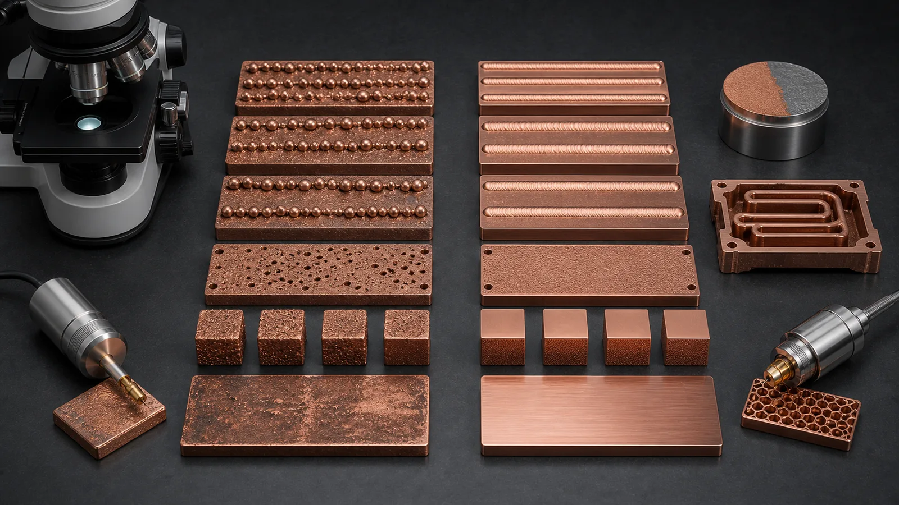
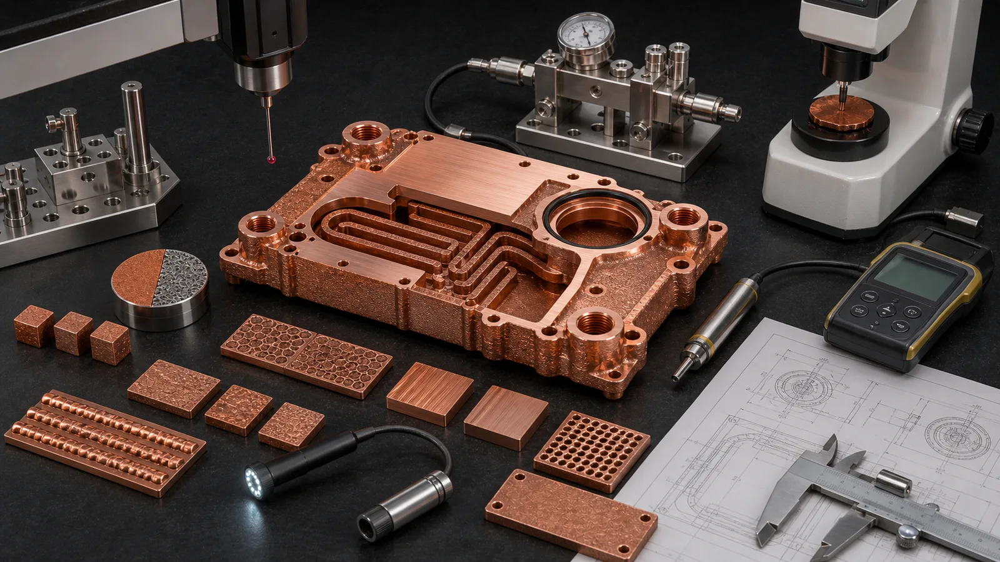

> Copper is difficult to 3D print with standard infrared lasers because it reflects much of the incoming laser energy before melting and conducts absorbed heat away quickly after coupling begins. The result is a narrower laser powder bed fusion process window: too little energy can create lack-of-fusion defects, while aggressive compensation can create spatter, unstable tracks, distortion, or inconsistent properties. The practical answer is not "copper cannot be printed." It is that copper needs a qualified process route, realistic geometry, and acceptance testing.

The myth is that copper 3D printing fails because copper is "too shiny."

That is only the first half of the problem.

In laser powder bed fusion, a common infrared fiber laser sits around the 1 micrometer wavelength class. Copper at room temperature is highly reflective at that wavelength, so the process starts with poor energy coupling. Once the surface heats, oxidizes, roughens, or melts, absorption can change rapidly. At the same time, copper's high thermal conductivity pulls heat away from the melt zone. The system can move from "not enough energy" to "unstable local overheating" over a narrow change in parameters.

That is why copper is more demanding than many steels or nickel alloys in LPBF. The challenge is not only making one track appear. It is building a dense, repeatable, cleanable, machinable, and accepted copper part with functional thermal, electrical, RF, or fluid requirements.

For buyers, the important question is not whether someone can print a copper coupon. The better question is whether the supplier can print the actual part route: material, density, conductivity, heat treatment, channel cleaning, machining, inspection, and testing.

## The Core Physics: Reflectivity Plus Heat Conduction

Copper is valuable because it moves heat and electricity efficiently. Those same properties make infrared laser printing difficult.

With many standard metal LPBF systems, the laser wavelength is in the near-infrared range. Copper reflects strongly in that region before a stable melt pool forms. The first layers and first scan tracks can therefore absorb less energy than expected. If the process adds more power or slows the scan too aggressively, the melt pool can become unstable once absorption increases.

Then thermal conductivity adds a second penalty. Copper pulls heat away from the laser spot quickly. The melt pool can become shallow, discontinuous, or sensitive to nearby geometry. A thin wall, massive base section, and small island feature may not behave the same way even under the same nominal power and speed.

[NIST research on LPBF of highly reflective metals](https://www.nist.gov/publications/ultra-high-speed-printing-regime-laser-powder-bed-fusion-highly-reflective-metals) discusses this energy-coupling problem for reflective metals such as copper and aluminum. In an RFQ context, the lesson is straightforward: copper process development is not a copy-paste exercise from stainless steel or titanium.

The first engineering ledger looks like this:

| Copper behavior | What it does in infrared LPBF | What the RFQ should ask |
| --- | --- | --- |
| High infrared reflectivity | Reduces early energy absorption | Which machine, wavelength, and parameter route are qualified? |
| High thermal conductivity | Pulls heat away from the melt pool | Are geometry, section thickness, and support strategy reviewed? |
| Dynamic absorption during melting | Changes melt-pool behavior mid-process | Are density, coupons, and scan strategy controlled? |
| Functional copper applications | Need conductivity, sealing, pressure, RF, or surface control | What tests prove the finished component? |

That table is the difference between a demo print and a manufacturing quote.

## Why Standard Infrared Lasers Can Produce an Unstable Process Window

When copper receives too little effective energy, several defects become more likely:

- Lack-of-fusion porosity.
- Discontinuous melt tracks.
- Balling or bead-like tracks.
- Weak bonding between layers.
- Poor density in thin or edge features.
- Inconsistent conductivity or thermal performance.

When the process overcompensates, a different set of risks appears:

- Spatter and powder disturbance.
- Excessive local heat accumulation.
- Rougher surfaces.
- Keyhole-type porosity in some parameter windows.
- Distortion or residual stress.
- Support and recoating problems around delicate features.

That is why the process window is narrow. A simple phrase like "use higher power" is not enough. Power, scan speed, hatch spacing, layer thickness, spot size, scan strategy, preheat, shielding gas, oxygen level, powder condition, and part geometry interact.

In early RFQ review, we often separate "can be printed" from "can be accepted." A copper cube or test coupon may print under a tuned route. A cold plate with internal channels, threaded ports, O-ring lands, and 0.05 mm-class flatness expectations carries a much larger validation burden.

For part-level design gates, see [Common Design Mistakes in 3D Printed Copper Parts](/posts/EngineeringGuide/common-design-mistakes-in-3d-printed-copper-parts/) and [Design Rules for Copper Laser Powder Bed Fusion Parts](/posts/EngineeringGuide/design-rules-copper-laser-powder-bed-fusion-parts/).

_Figure 2. Copper LPBF route selection is a process-window problem: insufficient coupling can create discontinuous tracks, while an optimized route must still prove density, conductivity, geometry, and surface condition._

## Powder Behavior Makes the First Layers Less Forgiving

The copper powder bed is not a flat mirror, but it is also not a simple black absorber.

Powder morphology, particle size distribution, oxidation state, packing density, and surface roughness all affect how energy enters the bed. A loose copper powder layer has many reflections between particles. That can help absorption compared with a polished copper plate, but it does not remove the material's infrared challenge.

First-layer and thin-feature behavior can still be difficult:

- Powder absorbs differently from solidified copper.
- Re-melted tracks absorb differently from fresh powder.
- Edges and small islands cool differently from large solid regions.
- Local oxidation may change coupling and final cleanliness expectations.
- Recoating can disturb poorly fused tracks or delicate copper features.

This matters for real parts because copper AM is usually chosen for difficult geometry: microchannels, manifolds, compact heat exchangers, RF cavities, high-current conductors, and thermal structures. Those shapes do not behave like a simple block.

If the project includes small fins, thin walls, internal passages, or many small islands, the RFQ should not only ask for a material. It should ask for the process route and validation plan.

## Why Pure Copper Is Usually Harder Than CuCrZr or CuCr1Zr

Pure copper is attractive when maximum thermal or electrical conductivity is the main requirement. It is also one of the more demanding copper routes for infrared LPBF.

Copper alloys such as CuCrZr or CuCr1Zr may be easier to qualify in some finished components because they add mechanical margin, heat-treatment options, and sometimes a more mature supplier route. That does not mean they are always better. It means the material choice should be tied to the failure mode. If the buyer needs a named CuCr1Zr route rather than a general copper-chromium-zirconium review, use [CuCr1Zr Copper Alloy 3D Printing for Industrial Components](/posts/EngineeringGuide/cucr1zr-copper-alloy-3d-printing-industrial-components/) to define the designation, data sheet, heat-treatment state, and substitution policy.

Industrial material pages point to the same application family. [EOS positions copper materials](https://www.eos.info/metal-solutions/metal-materials/copper) around conductivity-driven uses such as heat exchangers, electronics, power electronics heat sinks, coils, and propulsion-related thermal hardware. [Eplus3D describes copper AM](https://www.eplus3d.com/products/3d-printing-materials-copper/) around heat exchangers, induction coils, high-frequency electronics, molding, tooling, and electronics. Those applications are valuable because copper conducts heat and current. They are demanding because they also require repeatability, post-processing, and proof.

Use this material gate:

| If the part needs | First route to review | Why it matters with infrared LPBF |
| --- | --- | --- |
| Maximum conductivity and modest mechanical load | Pure copper | Best conductivity argument, but process and handling margin must be proven |
| Threads, ports, pressure, thin walls, or clamp load | CuCrZr or CuCr1Zr | Mechanical margin and heat treatment may protect the finished component |
| RF or high-frequency surface performance | Pure Cu or copper alloy route | Surface finish, plating, conductivity, and geometry all need review |
| Supplier data sheet or customer qualification | Named material route | The machine, heat treatment, and coupon plan may be fixed |

For a full comparison, use [Pure Copper 3D Printing: Applications, Benefits, and Manufacturing Challenges](/posts/EngineeringGuide/pure-copper-3d-printing-applications-benefits-manufacturing-challenges/), [Copper Alloy Selection for Metal 3D Printing: Pure Cu vs CuCrZr vs CuCr1Zr](/posts/EngineeringGuide/copper-alloy-selection-metal-3d-printing-pure-cu-cucrzr-cucr1zr/), [CuCr1Zr Copper Alloy 3D Printing for Industrial Components](/posts/EngineeringGuide/cucr1zr-copper-alloy-3d-printing-industrial-components/), and [Pure Copper vs CuCrZr for 3D Printed Heat Transfer Parts](/posts/EngineeringGuide/pure-copper-vs-cucrzr-3d-printed-heat-transfer-parts/).

## Green Lasers, High-Power Infrared Routes, and the Real Trade-Off

Green lasers, often around the 515-532 nm range, can improve copper energy absorption compared with common infrared wavelengths. This is why green-laser copper AM receives serious attention in equipment and research discussions.

But a green laser is not a magic switch. It changes the process route. The quote still needs to prove:

- Density.
- Conductivity.
- Geometry and tolerance.
- Surface finish.
- Powder removal.
- Heat treatment if required.
- Machined surfaces.
- Pressure, leak, flow, RF, or electrical acceptance.

High-power infrared systems and tuned scan strategies can also print copper under the right conditions. The practical decision is not "green good, infrared bad." It is: which qualified route can make the specific part with the required material state and validation?

For procurement, this matters because two quotes may both say "3D printed copper" while representing different routes:

- Standard infrared LPBF with a validated copper parameter set.
- High-power infrared route with tight geometry restrictions.
- Green-laser route optimized for pure copper.
- CuCrZr route with heat treatment and witness coupons.
- Hybrid route using AM for internal geometry and CNC for functional faces.

These should not be compared only by unit price. Compare the finished scope: print, depowder, heat treatment, machining, inspection, testing, and documentation. For cost context, see [Cost Drivers in Copper 3D Printing Projects](/posts/EngineeringGuide/cost-drivers-in-copper-3d-printing-projects/).

## Geometry Can Make Infrared Copper Printing Easier or Harder

The same process route can behave differently across part geometry.

A short, thick copper coupon is not the same as a thin-wall manifold. A flat heat spreader is not the same as an internal-channel cold plate. A high-current conductor with large contact pads is not the same as an RF cavity with critical internal surfaces.

Geometry raises risk when it includes:

- Very thin walls with high heat loss to surrounding mass.
- Dense fins or pins with fragile edges.
- Long internal channels that cannot be depowdered.
- Blind pockets where copper powder can remain.
- Large flat faces that need post-machining.
- Threads or ports near internal passages.
- Mixed heavy and thin sections in one build.
- RF or sealing surfaces that cannot tolerate rough as-built texture.

This is why copper LPBF projects should start with both process review and design-for-manufacturing review. A supplier may recommend larger channel access, thicker bosses, sacrificial support regions, machining stock, a different build orientation, or a different alloy.

That is not a lack of capability. It is how copper AM becomes reliable enough for industrial hardware.

For internal-channel risk, see [Copper AM Cleaning and Powder Removal for Internal Channels](/posts/EngineeringGuide/copper-am-cleaning-powder-removal-internal-channels/) and [3D Printed Copper Heat Exchangers: Design Benefits and Manufacturing Limits](/posts/EngineeringGuide/3d-printed-copper-heat-exchangers-design-benefits-manufacturing-limits/).

## The Hidden Cost: Validation, Not Just Printing

The printing challenge does not end when the part comes off the build plate.

Because copper LPBF has a sensitive process window, validation carries more weight. A serious copper AM quote may include witness coupons, density checks, conductivity checks, hardness checks, heat-treatment records, CMM inspection, CT inspection, pressure testing, flow testing, surface roughness measurement, or thermal testing.

For design communication and acceptance planning, [ISO/ASTM 52911-1](https://www.iso.org/standard/72951.html) is a useful reference point because it treats metal additive manufacturing as a design-and-qualification workflow, not just a file-to-printer operation. Copper projects need that mindset because the material route, geometry, post-processing, and test evidence are tightly connected.

The exact tests should match the part function:

| Part type | Infrared copper LPBF risk | Useful validation |
| --- | --- | --- |
| Cold plate | Porosity, trapped powder, weak ports, flatness drift | Leak, pressure, flow, CMM, channel review |
| Heat sink | Rough fins, distortion, interface resistance | Flatness, roughness, thermal test, visual fin criteria |
| Busbar or conductor | Conductivity variation, contact surface quality | Conductivity, contact pad machining, CMM |
| RF component | Surface roughness, dimensional drift, plating need | CMM, surface finish, plating route, RF-critical geometry |
| Vacuum or semiconductor part | Cleanliness, leak path, surface condition | Leak test, cleaning record, CMM, packaging |

A low quote that only covers the printed body may be useful for a rough prototype. It is not equivalent to a quote for a finished accepted copper component.

_Figure 3. Copper LPBF route selection should end in validation: density, conductivity, hardness, dimensions, channel access, surface condition, and pressure or flow checks should match the part function._

## Case Pattern: The Infrared Route Was Possible, but Not for the First CAD

A representative RFQ involved a compact pure copper cold plate for a power electronics test fixture. The first design had a 100 mm x 72 mm x 18 mm envelope, two threaded side ports, a serpentine internal channel, and a flat thermal face under the heat source.

The buyer asked whether it could be printed on a standard infrared LPBF route. The honest answer was conditional.

The first model had four problems:

- The minimum channel was close to 0.8 mm and had poor flushing access.
- The side-port threads sat too close to the nearest channel wall.
- The thermal face had no machining stock, but the drawing implied about +/-0.05 mm flatness after finishing.
- The material note said pure copper only, even though proof pressure and repeated fitting assembly were expected.

The process concern and the design concern were connected. A difficult infrared route became more difficult because the geometry gave little room for density variation, powder removal, machining, and pressure validation.

The revised approach opened the minimum passage, added cleaning access, thickened the port bosses, added 0.7 mm machining stock on the thermal face, and allowed material review between pure Cu and CuCrZr. The supplier could then quote a more realistic route: copper LPBF, support removal, channel cleaning, machining, pressure hold, flow check, and CMM inspection.

The trade-off was visible. The revised design gave up some theoretical surface area and added finishing cost. It also changed the project from "maybe printable" to "reviewable as a finished component."

That is the correct way to handle standard infrared copper LPBF. Do not ask the process to rescue a fragile design. Give the process a design it can validate.

## When Standard Infrared Laser Copper AM Can Still Make Sense

Standard infrared laser copper AM should not be dismissed automatically.

It can be worth reviewing when:

- The supplier has a qualified copper route on the specific platform.
- Geometry is robust enough for the process window.
- Internal channels are accessible for powder removal.
- Critical surfaces can be machined after printing.
- Material route is open to pure Cu, CuCrZr, or CuCr1Zr review.
- The part quantity and development stage justify first-article learning.
- The acceptance tests are clear.

It becomes weaker when:

- The design demands pure copper, tiny channels, thin walls, tight tolerances, and no design changes at the same time.
- The RFQ only sends an STL or screenshot.
- No density, conductivity, leak, flow, or inspection expectations are stated.
- The buyer compares only the printed blank price against a finished CNC or brazed assembly.
- The part is a simple copper block, plate, heat spreader, or busbar that CNC can make cleanly.

For route selection, use [When Copper 3D Printing Is Better Than CNC Machining](/posts/EngineeringGuide/when-copper-3d-printing-is-better-than-cnc-machining/) and [Copper AM Process Selection: LPBF vs CNC and Brazing](/posts/EngineeringGuide/when-copper-3d-printing-is-better-than-cnc-machining/).

## What to Ask Before Sending an RFQ

If your project may use copper LPBF, include these questions in the first review:

- Is the route standard infrared, high-power infrared, green laser, or another qualified copper process?
- Is the material pure Cu, CuCrZr, CuCr1Zr, or open to supplier review?
- What density, conductivity, hardness, or coupon evidence is required?
- Are internal channels cleanable and inspectable?
- Which surfaces must be CNC machined after printing?
- Are working pressure, proof pressure, leak rate, flow rate, heat load, current, RF band, or service temperature defined?
- Are supports allowed on any functional surfaces?
- What is the development stage: concept, prototype, first article, pilot, or production?

For file preparation, see [How to Prepare CAD Files for Copper Metal 3D Printing](/posts/EngineeringGuide/how-to-prepare-cad-files-for-copper-metal-3d-printing/). For quotation inputs, use [Engineering Checklist for Copper 3D Printed Part Quotation](/posts/EngineeringGuide/engineering-checklist-copper-3d-printed-part-quotation/) or the [RFQ guidance page](/rfq/).

Send CAD, drawings, quantity, material preference, operating limits, and acceptance requirements to [info@szcomo.com](mailto:info@szcomo.com). If the process route is uncertain, say so. A conditional process review is better than forcing the wrong copper route too early.

## FAQ

Can copper be 3D printed with a standard infrared laser?

Yes, in some qualified routes and geometries. The risk is that copper reflects infrared energy strongly before stable melting and conducts heat away quickly. Standard infrared copper LPBF should be reviewed with machine route, material, geometry, density, conductivity, post-processing, and acceptance tests.

Why are green lasers often discussed for copper AM?

Green wavelengths can improve copper energy absorption compared with common infrared wavelengths. That can widen the processing route for copper, especially pure copper. It does not remove the need for density, conductivity, geometry, cleaning, machining, and validation checks.

Is pure copper harder to print than CuCrZr?

Often, pure copper is more demanding because maximum conductivity also comes with strong reflectivity and heat conduction. CuCrZr or CuCr1Zr may provide more mechanical margin and a different qualified route. The best choice depends on the finished part, not only the material name.

What defects should engineers watch for in infrared copper LPBF?

Common risks include lack-of-fusion porosity, discontinuous melt tracks, balling, spatter, rough surfaces, distortion, conductivity variation, and geometry-dependent density issues. The acceptance plan should match the part function.

What should we send for a copper LPBF feasibility review?

Send STEP or native CAD, 2D drawing, material preference, internal channel sections, quantity, development stage, critical surfaces, operating pressure or current, heat load, surface finish needs, and inspection requirements. If green-laser or infrared route selection is open, state that explicitly.

## Verdict: Copper Needs a Qualified Route, Not a Generic Laser Setting

Copper is difficult to 3D print with standard infrared lasers because the process must overcome two linked properties: high reflectivity at common infrared wavelengths and rapid heat conduction away from the melt zone. That combination narrows the usable process window and makes geometry, material route, support strategy, powder removal, and validation more important than in many common LPBF alloys.

The practical answer is not to avoid copper AM. It is to quote it honestly.

Use copper LPBF when copper's real value matters: compact thermal paths, internal cooling channels, high-current conductors, RF or vacuum geometry, reduced assemblies, and low-volume design iteration. Do not treat the process as a generic replacement for CNC machining, and do not treat one successful coupon as proof that every copper part is production-ready.

The correct RFQ asks for a route: infrared or green laser where appropriate, pure Cu or copper alloy, print parameters under supplier control, machining stock, cleaning access, heat treatment, inspection, and acceptance tests. That is how copper moves from a difficult reflective material to a usable industrial component.

Related reading: [Pure Copper 3D Printing: Applications, Benefits, and Manufacturing Challenges](/posts/EngineeringGuide/pure-copper-3d-printing-applications-benefits-manufacturing-challenges/), [Common Design Mistakes in 3D Printed Copper Parts](/posts/EngineeringGuide/common-design-mistakes-in-3d-printed-copper-parts/), [Design Rules for Copper Laser Powder Bed Fusion Parts](/posts/EngineeringGuide/design-rules-copper-laser-powder-bed-fusion-parts/), [Copper Alloy Selection for Metal 3D Printing](/posts/EngineeringGuide/copper-alloy-selection-metal-3d-printing-pure-cu-cucrzr-cucr1zr/), [CuCr1Zr Copper Alloy 3D Printing for Industrial Components](/posts/EngineeringGuide/cucr1zr-copper-alloy-3d-printing-industrial-components/), and [Cost Drivers in Copper 3D Printing Projects](/posts/EngineeringGuide/cost-drivers-in-copper-3d-printing-projects/).
